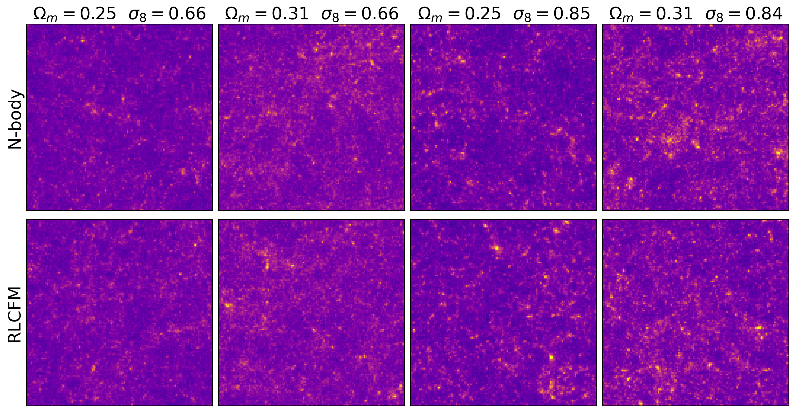
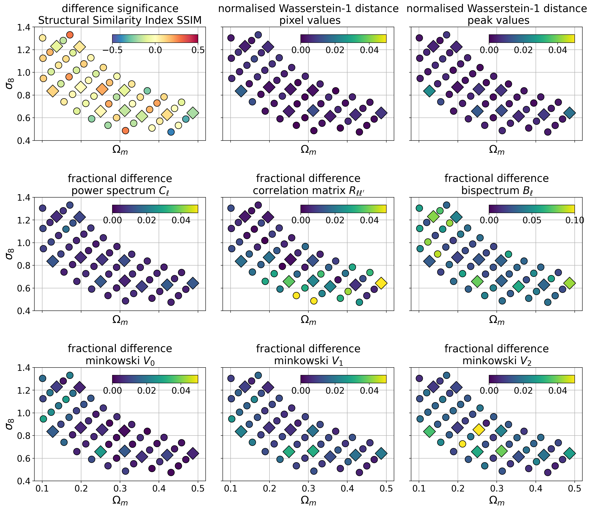
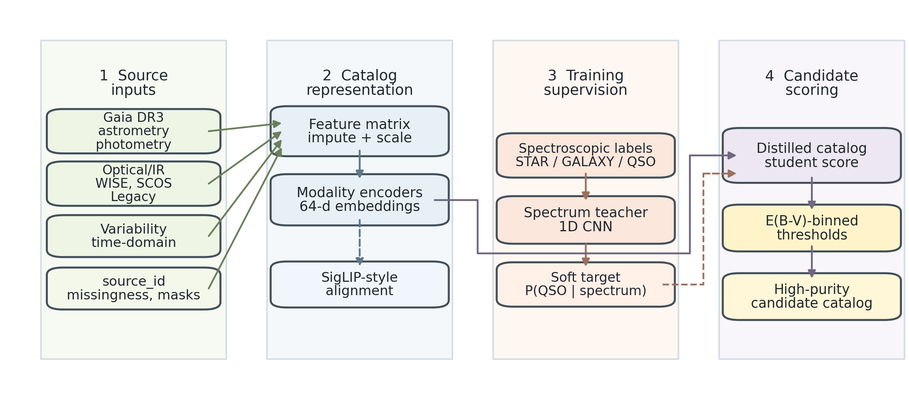

# arXiv Daily Digest — 2026-05-25

**Interest file:** interests/2026.05.md  
**Papers scanned:** 308 (across astro-ph.CO, astro-ph.EP, astro-ph.GA, astro-ph.HE, astro-ph.IM, astro-ph.SR, cs.LG, stat.ML, hep-ph)  
**After first filter:** 12  
**Final selected:** 7  

**Note:** No Tier 1 papers today. The announcement contained no direct Lyman-α forest, IGM opacity, or high-z reionization measurements. The digest is entirely Tier 2–3 and reflects a genuinely quiet day for the core focus. Quality over quota: 7 honest picks.

---

## Tier 2 — Adjacent / useful context

### [A No-Go Theorem for the Mass-Radius Relation of Solitons](http://arxiv.org/abs/2605.22901v1)

Mohammad Hossein Namjoo  
**Primary category:** astro-ph.CO

Using non-relativistic effective field theory (NREFT), this paper proves that the mass-radius index Γ ≡ d ln M / d ln R of any typical non-topological, non-relativistic soliton (from a real scalar field) cannot lie in the range [0, d], where d is the number of spatial dimensions. The theorem is model-independent in self-interaction potential and density profile, and extends to barotropic self-gravitating fluids with arbitrary equations of state. The cosmological punchline is pointed: observations favor dark matter halo cores with Γ ≈ 1.7, which lies squarely in the excluded range [0, 3] for d = 3. Ultra-light / fuzzy DM and fluid-like DM models are therefore ruled out as *natural* (non-fine-tuned) explanations for the halo core, unless baryonic feedback or other astrophysical effects generate apparent but not intrinsic soliton cores.

**Why Tier 2:** Directly constrains the ultra-light/fuzzy dark matter picture that you probe via the Lyman-α forest on small scales. This is a theoretical closure on part of the ultralight DM parameter space that complements the observational limits from the forest power spectrum.

---

### [Increasing the Precision of Surrogate Models for Weak Lensing Mass Maps with Flow Matching](http://arxiv.org/abs/2605.23114v1)

Guangjian Li, Tomasz Kacprzak  
**Primary category:** astro-ph.CO

The authors replace a GAN-based map-level emulator for weak-lensing convergence fields with a residual label-conditional flow matching network. The model is conditioned explicitly on (Ω_m, σ_8) and learns a continuous probability flow in residual space. For low-order statistics (pixel histograms, power spectrum) agreement is better than 1%; for higher-order statistics (bispectrum, Minkowski functionals) it is below 5%. The residual-space formulation and label-specific noise priors substantially improve parameter-boundary fidelity and cut training time relative to GAN training.

**Why Tier 2:** Flow matching / continuous normalizing flows applied to cosmological field emulation is directly transferable methodology. The residual-space conditioning trick is new and likely generalizable; the same architecture can be applied to Lyman-α flux field emulators or power-spectrum covariance emulators.

---

### [Pointwise Metrics Mislead: An Evaluation Protocol for Multimodal Inverse Problems](http://arxiv.org/abs/2605.22891v1)

Mads H. Baattrup, Jörn Bach, Laurids Jeppe et al.  
**Primary category:** cs.LG

This paper makes a rigorous case that RMSE/MAE evaluation of reconstruction networks is structurally broken for inverse problems with multimodal posteriors. By the law of total variance, any point estimator minimizing MSE produces a marginal spectrum narrower than the truth—a bias independent of architecture, training, or dataset size. The authors propose a three-part protocol: (1) per-event distributional accuracy via CRPS, (2) population-level marginal spectrum fidelity, and (3) coverage-based calibration. On both a synthetic benchmark with analytic posteriors and a realistic particle-physics reconstruction task, model rankings *reverse* between pointwise and distributional metrics.

**Why Tier 2:** Any cosmological inference pipeline using neural posterior estimators (including SBI for the Lyman-α P1D or field-level inference) implicitly faces this evaluation trap. The three-step protocol should be adopted as a standard check before reporting reconstruction accuracy for the power spectrum or derived cosmological parameters.

---

### [Cosmological constraints from neighbor-density-weighted marked correlation functions](http://arxiv.org/abs/2605.23367v1)

Xu Xiao, Xiao-Dong Li, Yiqi Huang et al.  
**Primary category:** astro-ph.CO

Using 129 w₀w_aCDM + Σm_ν N-body simulations (the Kun suite), the authors build Gaussian Process emulators for two marked correlation function (MCF) statistics and perform MCMC inference. Three-mark combinations improve the Figure of Merit in the Ω_m–σ_8 plane by 1.7–2.5× over the standard 2PCF; combining density-weighted and gradient-weighted marks provides additional complementarity at ~43% FoM gain. Importantly, MCF constraints are stable under changes in halo mass thresholds, suggesting robustness to galaxy–halo uncertainty.

**Why Tier 2:** The combination of GP emulators + MCMC directly mirrors the inference methodology used for forest P1D analyses. MCFs as beyond-2PCF summaries for DESI-era galaxy catalogs are an active direction; knowing which mark combinations are near-redundant vs. complementary informs how to compress statistical information, the same design problem faced in Lyman-α inference.

---

### [The τ of Neutral Hydrogen: Increased CMB Optical Depth at Long Wavelengths](http://arxiv.org/abs/2605.22934v1)

Gilbert Holder, Adrian Liu, Tzu-Ching Chang et al.  
**Primary category:** astro-ph.CO

At radio wavelengths longer than 21 cm, CMB photons are absorbed by neutral hydrogen at high redshift. This produces a frequency-dependent suppression of the observed CMB power that is sensitive to x_HI / T_s as a function of redshift. The amplitude peaks at ~few percent around 100 MHz. The authors show that cross-correlating radio-band CMB measurements with existing mm-wave CMB maps can detect this effect, and that for dark-ages experiments the detection SNR for this cross-correlation may exceed that of the intrinsic 21cm fluctuations.

**Why Tier 2:** A new observational handle on the neutral fraction evolution. For the reionization branch of your program (end of reionization, mean free path, high-z opacity), this cross-correlation technique provides a complementary probe of x_HI(z) at redshifts overlapping with and above the forest-accessible range.

---

### [A Gaia-linked High-purity QSO Candidate Catalog in Selected Fields with Extinction-binned Calibration and Spectrum-informed Training](http://arxiv.org/abs/2605.23136v1)

Zi-Huang Cao, Zhao-Xiang Qi, Juan-Juan Ren et al.  
**Primary category:** astro-ph.IM

The authors build a high-purity (validated purity 0.981, completeness 0.887) quasar candidate catalog using Gaia astrometry/photometry plus optical/IR features, with extinction-binned threshold calibration. A "spectrum-teacher" model uses spectroscopic labels only during training. The released catalog targets fiber-spectroscopic follow-up across selected fields, with COSMOS treated as a deep stress-test. Compared to Gaia's official QSO probability at the same threshold, spectroscopic-label completeness improves from 0.45 to 0.89.

**Why Tier 2:** QSO targeting quality directly sets the sample size and purity of Lyman-α forest measurements. A catalog with calibrated selection functions is the right input for forest-based cosmological analyses; the extinction-binned approach addresses the systematic that matters most at low Galactic latitude and high-z quasar fields.

---

## Tier 3 — Outside my area but notable

### [A Precise Measurement of the Fermi-LAT Galactic Center Excess Morphology and Spectrum](http://arxiv.org/abs/2605.22913v1)

Mattia Di Mauro  
**Primary category:** astro-ph.HE

A new Fermi-LAT analysis of the Galactic Center Excess (GCE) with reduced systematic uncertainties from interstellar emission and source modeling. Using an iterative source-finding pipeline the fractional residuals are reduced to ≲10% over 40°×40°. The reconstructed surface brightness follows a generalized NFW profile with inner slope γ ≈ 1.15. Bulge-tracing templates (nuclear + boxy bulge) fail to reproduce the morphology at θ ~ 1–2° and θ ≳ 8°; the DM-motivated component fits well across the full angular range and remains highly significant across all IEMs tested. An updated 0.5–1000 GeV spectrum is also presented.

**Why Tier 3:** Not astronomy you work in, but a notably precise measurement with a clear dark matter interpretation that survives careful systematic checks. The GCE has been debated for a decade; a DM component that is this morphologically well-characterized is a significant result for the particle-astrophysics community.

