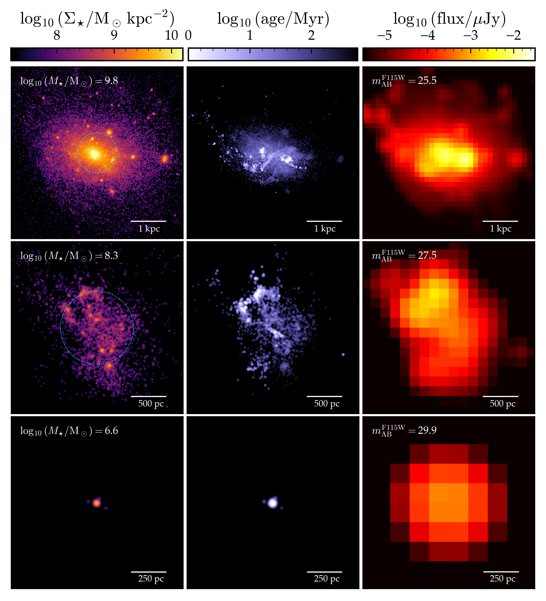

# arXiv Daily Digest — 2026-05-26

**Interest file used:** interests/2026.05.md (current month, no fallback needed)

**Counts:**
- Papers scanned: 564 (from 9 RSS feeds: astro-ph.CO/EP/GA/HE/IM/SR + cs.LG + stat.ML + hep-ph)
- After first-pass filter: 24 candidates reviewed
- Final selected: 7 papers (4 Tier 2, 3 Tier 3)

**Note on today's haul:** This is a light day for the core Lyman-α forest / IGM program. There are zero Lyman-α forest, IGM opacity, DESI-forest, or Lyman-α power spectrum papers in today's announcement across all categories. The 9 astro-ph.CO new submissions are dominated by dark energy phenomenology, gravitational wave backgrounds, and inflationary models. Tier 1 is empty today. The digest reflects what was actually announced; no padding.

---

## Tier 2 — Adjacent / useful context

### [Detecting Gravitational-Wave Anisotropies with Simulation-Based Inference](https://arxiv.org/abs/2605.24082)
Lemke, Mitridate, Konstandin, Pieroni, Alvey | **astro-ph.CO**

Pulsar timing arrays (PTAs) have detected a gravitational-wave background (GWB); the next frontier is measuring its anisotropy to identify the source (supermassive binary black holes vs. primordial). Existing frequentist searches assume correlation estimators are Gaussian-distributed — an assumption the authors show is unjustified and which cripples detection sensitivity. They replace the analytic Gaussian likelihood with a neural network classifier trained on synthetic PTA data, implementing SBI end-to-end on this correlated time-series problem. The result is a ~90% increase in 3σ detection probability for single-hotspot GWB anisotropies and ~200% for double-hotspot configurations, relative to the standard frequentist approach.

**Why Tier 2:** The method is exactly the one in the user's toolkit: SBI replacing an inadequate analytic likelihood with a learned one. The problem structure (correlated data, non-Gaussian likelihood, sensitivity to rare signal configurations) maps directly onto the Lyman-α inference setting. The headline improvement numbers are a concrete proof-of-concept for how much SBI can buy over standard frequentist methods in astrophysical inference.

---

### [The Lumina Project: The Demographics of Active Galactic Nuclei from Quasars to Little Red Dots at z≥3](https://arxiv.org/abs/2605.24112)
Shen, Zier, Smith, Liu, Kannan | **astro-ph.GA**

Lumina is a cosmological radiation-hydrodynamic simulation covering a (500 cMpc)³ volume at 2×6000³ resolution elements, self-consistently following hydrogen and helium reionization from the epoch of first galaxies through to z~3. The paper uses it to study AGN demographics across five decades of X-ray luminosity at high redshift, including the recently-observed population of JWST "Little Red Dots" (LRDs). The simulation predicts AGN luminosity functions, spectral energy distributions, and the covering fractions of gas around AGN hosts — all shaped by, and in turn shaping, the evolving IGM.

**Why Tier 2:** This is a full reionization-era simulation with explicit IGM physics and a direct connection to how AGN/quasar populations drive the ionizing background. Understanding AGN contributions to UV photons during and after reionization is essential context for interpreting the Lyman-α forest at z~3–6, particularly for the UV background and optical depth evolution the user follows.

---

### [Resolving galaxy formation in the early Universe with BonFIRE and CampFIRE](https://arxiv.org/abs/2605.24104)
Samuel, Boylan-Kolchin, Feldmann, Hopkins, Sun | **astro-ph.GA**

BonFIRE (40 cMpc volume, 5×10⁴ M☉ baryon mass resolution) and CampFIRE (5 cMpc, down to 800 M☉ resolution) are new FIRE-3 cosmological hydrodynamic simulations targeting galaxy formation at z≳6 during the epoch of reionization. The paper presents UV luminosity functions, stellar mass–halo mass relations, star formation efficiencies, and galaxy morphologies at z=6–12, showing that FIRE-3 physics can broadly reproduce JWST observations without extreme assumptions. A novel resampling procedure combines the statistical power of BonFIRE with CampFIRE's resolution to robustly span a wide dynamic range.

**Why Tier 2:** First-galaxy simulations calibrated to JWST directly constrain the ionizing UV emissivity that drives reionization — the same process whose endpoint is probed by high-z Lyman-α opacity and mean free path measurements. The FIRE-3 simulation suite is also a reference for the kind of feedback physics that shapes the IGM thermal state.

---

### [Exploring biases in derived stellar parameters and the ionizing photon production efficiency](https://arxiv.org/abs/2605.25130)
Jaiswar, Gupta, da Cunha, Trott, Battisti | **astro-ph.GA**

Constraining the ionizing photon production efficiency (ξ_ion) of high-z galaxies is critical for estimating the reionization budget — how many ionizing photons actually escaped into the IGM. This paper compares three SED fitting codes (each with multiple star formation history, stellar population synthesis, dust, and photoionization prescriptions) applied to z~3 extreme emission line galaxies (EoR analogs). Default configurations across codes produce significantly discrepant ξ_ion values; star formation history assumptions and dust prescriptions are the dominant sources of bias. The authors quantify which combinations are most reliable.

**Why Tier 2:** The ionizing photon budget is a direct input to models of reionization timing and topology that underpin IGM optical depth and mean free path predictions — both core interests. This paper puts systematic handles on a quantity (ξ_ion) that currently limits how precisely JWST can constrain the EoR end epoch.

---

## Tier 3 — Outside my area but notable

### [Evidence for mass-dependent spin subpopulations in GWTC-4](https://arxiv.org/abs/2605.24281)
Hussain, Isi, Zimmerman | **astro-ph.HE**

Using 153 binary black hole (BBH) mergers from the LIGO-Virgo-KAGRA GWTC-4 catalog, this paper finds strong Bayesian evidence (log₁₀ Bayes factor ~4+) for two distinct spin subpopulations with mass-dependent mixing fractions. Low-mass systems (m₁ ≲ 20 M☉) are dominated by slowly spinning BHs (χ ≲ 0.2), while high-mass systems contain a significant fraction of rapidly spinning BHs. This mass-dependent spin structure points to multiple formation channels — isolated binary evolution for the slow-spin population and dynamical/hierarchical assembly for the fast-spin population.

**Why Tier 3:** A notable GW population result using Bayesian hierarchical inference, a methodology closely related to the SBI/population inference tools the user cares about. The statistical approach (mass-dependent mixing fractions via hyperparameter inference) is directly analogous to what one would do in a two-population Lyman-α forest analysis.

---

### [Exploring the Dark Sector: Interacting Radiation in Light of Modern Cosmological Probes](https://arxiv.org/abs/2605.24089)
Mescia, Gil-Marín | **astro-ph.CO**

A model-independent dark radiation (DR) framework is constrained using Planck CMB, DESI DR2 BAO, Pantheon+ SNe, and DES Y5 supernovae. The dark radiation consists of free-streaming and fluid-like relativistic components beyond the Standard Model. Key results: N_fld < 0.66 (95% C.L.) from CMB alone; the full combination tightens this to N_fld < 0.21. The DESI DR2 BAO inclusion significantly improves constraints on the radiation sector and impacts estimates of the Hubble tension severity.

**Why Tier 3:** The paper is a direct demonstration of DESI DR2 BAO data constraining new physics — the same data product that's core to the user's LSS/BAO interests. Hector Gil-Marín is a co-author, relevant to the DESI collaboration context. The dark radiation phenomenology itself is peripheral, but the DESI DR2 BAO analysis and its tension-reduction implications are worth tracking.

---

### [Compact dusty starbursts at cosmic noon linked to high-energy neutrinos](https://arxiv.org/abs/2605.25412)
Urata, Huang, Hatsukade, Kasliwal et al. | **astro-ph.HE**

A quadruply gravitationally lensed dusty star-forming galaxy at z=2.988, JCMT0402-0424, is found within the 90% containment region of IceCube event IC 210922A. ALMA high-resolution imaging resolves a compact, gas-rich starburst core. The chance coincidence probability is <1% for a source of this extreme submillimeter flux, and no better counterpart candidate exists in the field. In the population context, compact-core DSFGs at cosmic noon can contribute non-negligibly to the diffuse astrophysical neutrino background even though individual source yields are modest.

**Why Tier 3:** This is a genuinely novel observational result — the first plausible DSFG/IceCube counterpart — that connects the peak epoch of cosmic star formation (z~2-3, overlapping with the Lyman-α forest regime) to multi-messenger astrophysics. The ALMA imaging of a compact starburst at z~3 is interesting as a probe of galaxy physics at the same redshifts where the forest is measured.

