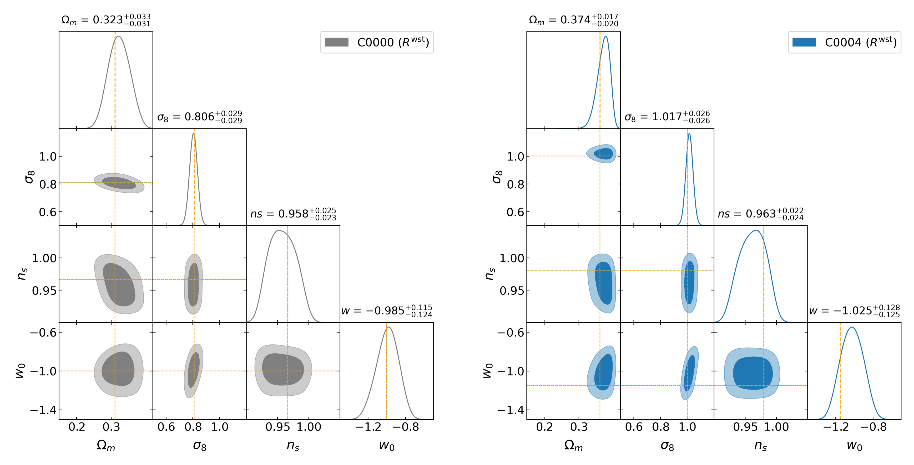
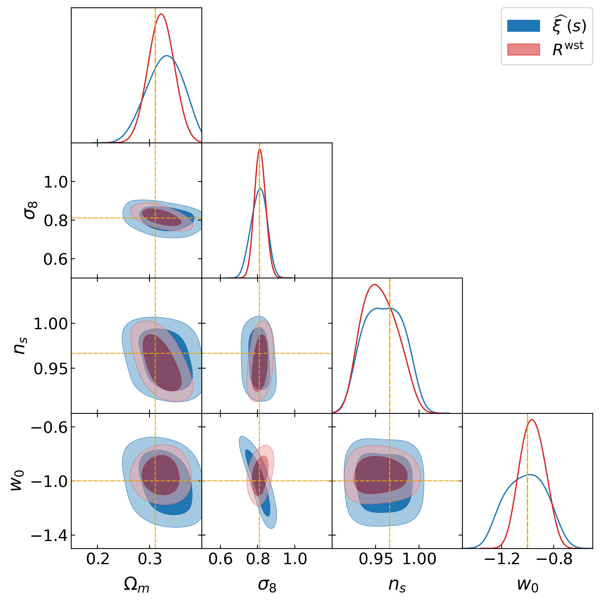
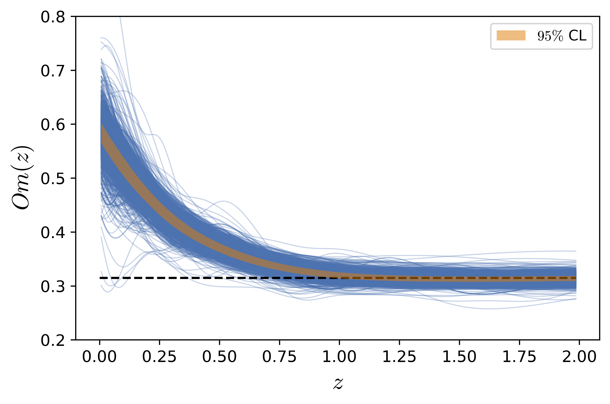
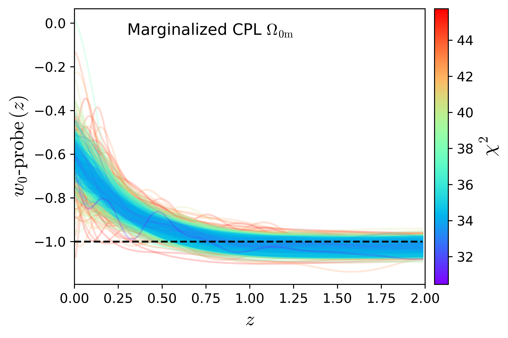
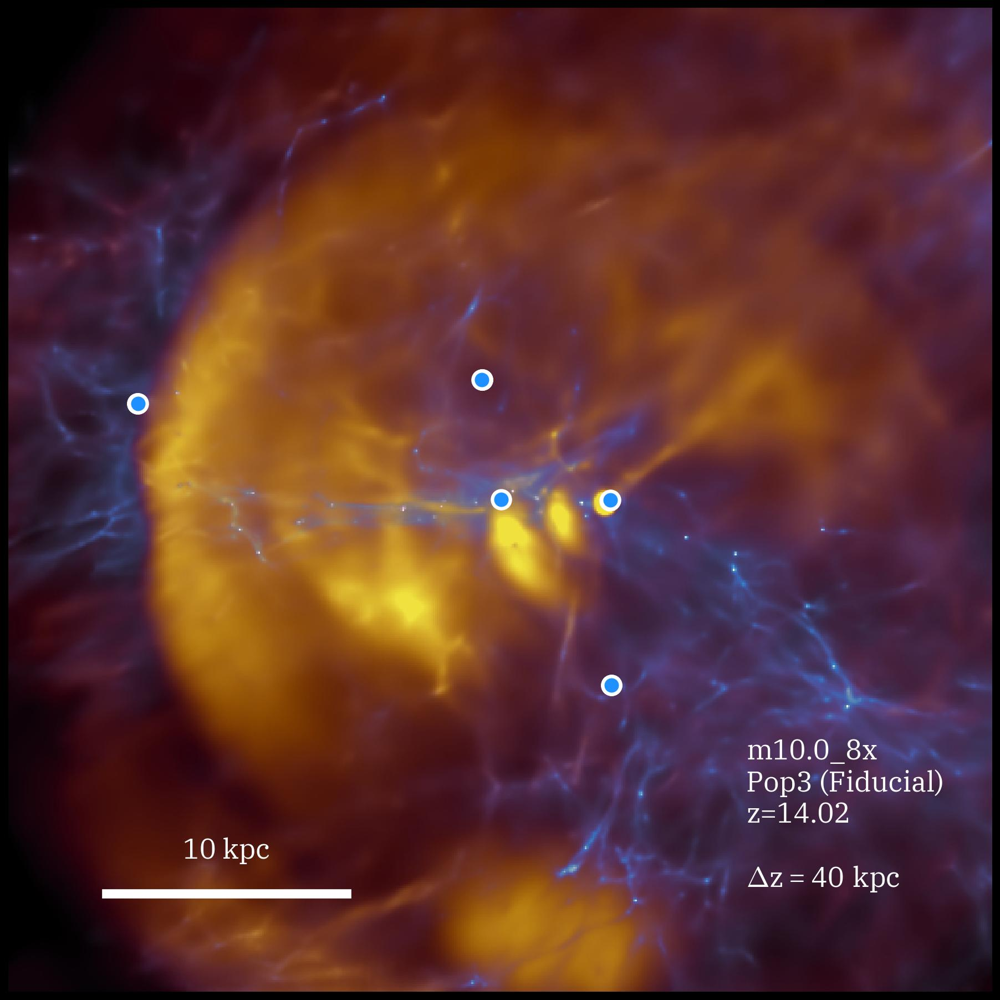
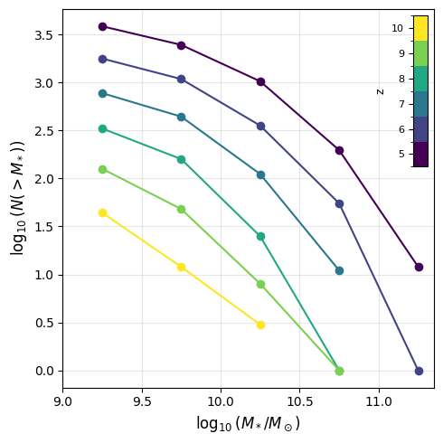
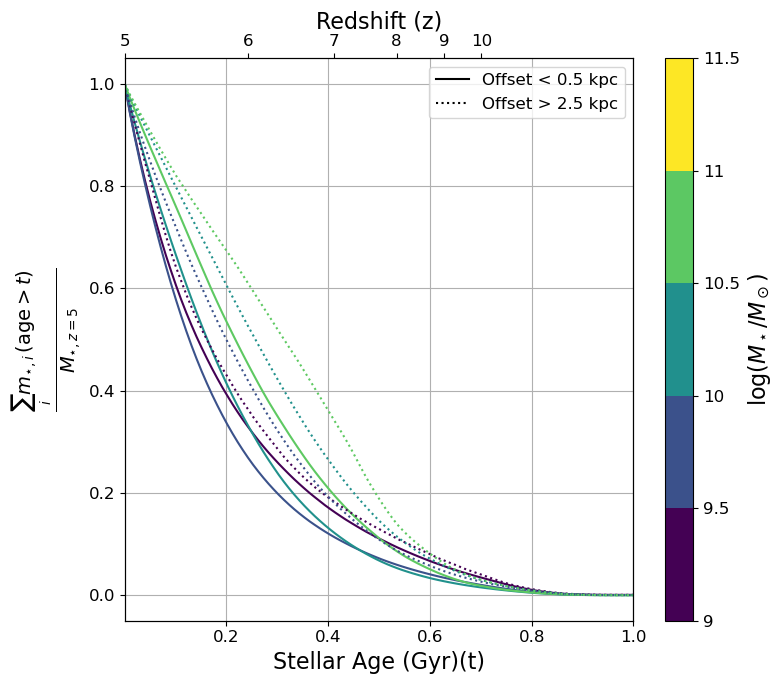

# arXiv Daily Digest — 2026-05-27

**Interest file:** `interests/2026.05.md` (current month, no fallback)

**Counts:**
- Papers scanned: 326 (astro-ph.CO/EP/GA/HE/IM/SR + cs.LG + stat.ML + hep-ph)
- After first-pass filter: 12 candidates sent to full-text review
- Final selected: 11 papers

---

## Tier 1 — Highly relevant

### [Unveiling the dark matter nature with reionization relics](http://arxiv.org/abs/2605.26518v1)
Yao Zhang, Paulo Montero-Camacho, Catalina Morales-Gutiérrez et al.
`astro-ph.CO`

WDM suppresses structure formation below the free-streaming scale, and current constraints on the WDM particle mass rely heavily on the Lyman-α forest and Milky Way satellite/stream observations — both small-scale probes. This paper proposes a new large-scale complementary probe: the "memory of reionization." Because WDM reduces the number of ionizing sources in low-mass haloes, it shifts the local reionization redshift $z_\mathrm{re}$ to later times. Post-reionization gas retains this memory for Gyr, imprinting spatially coherent, WDM-dependent fluctuations in the Ly-α forest opacity and in the 21 cm HI distribution at $z \sim 2$–5. The spatial modulations of $z_\mathrm{re}$ operate on scales of several to tens of comoving Mpc — precisely where the forest power spectrum can be measured precisely by DESI — giving large-scale sensitivity to WDM physics that is largely orthogonal to existing constraints.

**Why Tier 1:** Directly advances the WDM-via-Lyman-α research programme while simultaneously connecting to the 21 cm + late reionization interests. Proposes a novel probe for your exact three primary topics (forest, reionization, WDM dark matter) in one paper.

---

### [Field-level multi-tracers simulation-based inference of cosmological parameters from 3D maps](http://arxiv.org/abs/2605.26210v1)
Giulio Scelfo, Satvik Mishra, Mauro Rigo et al.
`astro-ph.CO`

Proof-of-concept SBI pipeline for constraining $\Omega_m$ and $\sigma_8$ from galaxy number-count fields and HI intensity mapping, individually and jointly. Neural emulators trained on CAMELS hydrodynamical simulations generate galaxy and HI maps from fast dark-matter simulations; neural posterior estimation then handles inference. The key result: moving from the power spectrum to full-3D field-level inference gains a factor of ~3 in Figure-of-Merit on cosmological parameters, robust even when marginalising over astrophysical parameters. Combining galaxy + HI tracers further multiplies the FoM by 2–7 depending on configuration. The pipeline architecture (dark-matter sims → emulator → SBI) is directly applicable to DESI-era datasets.

**Why Tier 1:** A direct implementation of the SBI + neural emulator + field-level inference programme that sits at the core of your ML-for-cosmology interest. The CAMELS/Quijote simulation infrastructure and multi-tracer angle connect it naturally to your ongoing work.

---

## Tier 2 — Adjacent / useful context

### [Cosmological Constraints from Bias-Robust Wavelet Scattering Statistics for Stage-IV Galaxy Surveys](http://arxiv.org/abs/2605.27087v1)
Zhujun Jiang, Xu Xiao, Fenfen Yin et al.
`astro-ph.CO`

Introduces $R^\mathrm{wst}$, a summary statistic built from $m$-mode ratios of the wavelet scattering transform (WST) that is substantially insensitive to tracer bias while retaining non-Gaussian cosmological information. An SBI pipeline with Gaussian-process emulator trained on the Kun simulation suite validates the approach. Compared to the 2PCF, $R^\mathrm{wst}$ tightens $\Omega_m$ and $\sigma_8$ constraints while remaining robust across a range of bias prescriptions — a key systematic for upcoming Stage-IV surveys like DESI.

**Why Tier 2:** A methods paper combining non-Gaussian statistics + SBI + GP emulation in exactly the flavour your library targets. The bias-robustness angle is practically important for any field-level or compressed-statistic analysis you'd do with DESI galaxy data.

---

### [Constraints on Dynamical Dark Energy from Multiple Probes in the Full Dark Energy Survey](http://arxiv.org/abs/2605.27221v1)
DES Collaboration, T. M. C. Abbott, M. Adamow et al.
`astro-ph.CO`

Full DES 6-year result combining SNe Ia, BAO, and 3×2pt (weak lensing + galaxy clustering). DES alone yields $w_0 = -0.84^{+0.10}_{-0.10}$, $w_a = -0.44^{+0.60}_{-0.55}$, the tightest single-survey dark-energy constraint ever, with 2.2σ deviation from a cosmological constant. Adding DESI DR2 BAO gives $w_0 = -0.84^{+0.06}_{-0.07}$, $w_a = -0.53^{+0.33}_{-0.28}$ and 2.3σ — the most stringent low-redshift-only test of dynamical dark energy to date. The DES FoM of 48, doubling previous DES results, makes this a landmark paper in the dark-energy programme.

**Why Tier 2:** The DES-alone result is a major milestone and the DESI DR2 BAO combination makes this directly relevant to the DESI context. The 2.3σ deviation from ΛCDM, consistent with the DESI DR2 BAO standalone signal, strengthens the case for dynamical dark energy and will inform how you interpret Lyman-α BAO constraints.

---

### [$w_0$-probe: A new diagnostic of dark energy based on $Om$](http://arxiv.org/abs/2605.27230v1)
Satadru Bag, Ryan E. Keeley, Varun Sahni et al.
`astro-ph.CO`

Traditional reconstruction of the dark energy equation of state $w(z)$ requires differentiating the inferred expansion history $h(z)$, which amplifies noise. This paper constructs a new diagnostic, the $w_0$-probe, from the $Om(z)$ statistic in a way that yields a direct, noise-stable estimate of $w_0$ without differentiation. Applied to DESI BAO + CMB data, the diagnostic is shown to be model-independent and robust to phantom-crossing phenomenology that may be artefacts of the CPL parameterisation. It retains the familiar ΛCDM null-test of $Om(z)$ while adding sensitivity to the current EoS.

**Why Tier 2:** A practical diagnostic tool for DESI dark-energy analyses. The Om(z) approach is model-independent in a way directly relevant to interpreting what DESI DR2 BAO results actually imply versus what the CPL parametrisation forces, which is a live methodological debate.

---

### [A framework for modelling Population III stars in cosmological simulations](http://arxiv.org/abs/2605.26206v1)
Bipradeep Saha, Rahul Kannan, Giovanni M. Mirouh
`astro-ph.GA`

Presents a comprehensive Pop III module for cosmological simulations (implemented in Thesan-Zoom): (1) an enhanced thermochemical network tracking $\mathrm{H_2^+}$ and $\mathrm{H^-}$ equilibrium abundances critical for primordial gas cooling; (2) detailed Pop III stellar spectra from MESA evolutionary tracks + TLUSTY atmosphere models; (3) core-collapse and pair-instability supernova feedback with metal yields. The framework models the photon emissivity and mechanical feedback of the first stars and their influence on the surrounding UV field and gas ionization during Cosmic Dawn.

**Why Tier 2:** Pop III stars are the main uncertainty in the early ionizing photon budget that drives reionization. Having a simulation framework that resolves their thermochemistry and spectral output is directly relevant to interpreting late-reionization opacity and mean-free-path measurements, and to calibrating any reionization-based WDM probe (cf. Tier 1 paper above).

---

### [Future Detections of the Warm-Hot Intergalactic Medium using Bright Power Law Sources with NewAthena](http://arxiv.org/abs/2605.26907v1)
Joseph Fisher, Antonio Martin-Carrillo, Thomas Dauser et al.
`astro-ph.IM` (cross-listed astro-ph.CO)

ΛCDM predicts ~40% of baryons at low redshift reside in warm-hot ($10^5$–$10^7$ K) filamentary structures — the WHIM — detectable via O VII He-α X-ray absorption. This study forecasts the detection significance of single O VII lines as a function of redshift, source flux, Galactic absorption, and spectral index using the NewAthena X-IFU. For a bright power-law source at $F_{0.3-10\,\mathrm{keV}} = 5 \times 10^{-11}$, a 50 ks exposure achieves >3σ detection over $z \approx 0.02$–0.35. NewAthena's high spectral resolution makes it the first instrument capable of routine WHIM detection.

**Why Tier 2:** Probing the warm-hot IGM is the low-redshift counterpart of the high-redshift IGM work central to your research. Understanding the baryon budget across cosmic time — from the WHIM at $z \lesssim 0.5$ to the Lyman-limit systems and forest at $z \sim 2$–6 — is the observational context for your reionization and IGM work.

---

### [NISER-IUCAA New Simulations of JWST Galaxies and Quasars (NINJA): Properties of galaxies at $5 \leq z \leq 10$](http://arxiv.org/abs/2605.26211v1)
Ranit Behera, Raghunathan Srianand, Nishikanta Khandai et al.
`astro-ph.GA`

Introduces NINJA, a suite of cosmological hydrodynamical simulations designed to match JWST observations of galaxies at $z = 5$–10. The fiducial run reproduces observed UV luminosity functions across this redshift range with suitably chosen spectral synthesis and dust attenuation parameters. Key finding: the dust-to-metal ratio evolves with redshift, with a factor of ~7 variation in normalisation depending on the dust–metallicity prescription. NINJA provides B-band and Hα luminosity functions at high redshift and extends to $z \approx 12.5$.

**Why Tier 2:** A publicly released high-z simulation calibrated to JWST is directly useful for the reionization and galaxy-evolution adjacent interests. The UV LF + dust model calibrations are necessary ingredients for interpreting reionization-epoch opacity and ionizing photon budget — the same quantities that feed into forest IGM modelling.

---

### [How galaxies acquire their stellar mass at high redshift: High star formation efficiencies and the relative roles of dust and initial mass function](http://arxiv.org/abs/2605.26209v1)
Hao Fu, Francesco Shankar, Fabio Fontanot et al.
`astro-ph.GA`

Applies a data-driven semi-empirical model that takes JWST UV luminosity functions as input (bypassing uncertain cooling/feedback models) to infer SFRs and SFEs of galaxies at $z = 5$–12 via abundance matching to halo accretion rates. The result is that high SFEs — not anomalous IMFs — account for the observed galaxy abundances at $z \gtrsim 6$, and that standard ΛCDM halo assembly can accommodate JWST counts once baryonic efficiencies are allowed to be high. The cosmic SFH from this forward model is self-consistent with the observed UV LFs.

**Why Tier 2:** The star-formation efficiency at high redshift is the key ingredient in any model of reionization — high SFE translates directly into more ionizing photons per halo mass and earlier reionization. This paper directly constrains the baryonic efficiency that your reionization models need as input.

---

### [First Light and Reionization Epoch Simulations (FLARES) XXII: UV-dust spatial offsets at the Epoch of Reionisation](http://arxiv.org/abs/2605.27370v1)
Paurush Punyasheel, Aswin P. Vijayan, William J. Roper et al.
`astro-ph.GA`

Uses the FLARES simulation suite (post-processed with SKIRT radiative transfer) to study spatial offsets between UV and FIR emission in 6890 massive ($M_\star \gtrsim 10^9 M_\odot$) galaxies at $z = 5$–10. About 16% show significant UV–FIR offsets. The offsets correlate with star-formation history: galaxies experiencing recent major mergers or inside-out star formation show the largest offsets. Observational factors (ALMA/JWST resolution, SNR) play a secondary role.

**Why Tier 2:** UV-FIR spatial offsets matter for interpreting JWST + ALMA joint observations of reionization-epoch galaxies. Understanding when dust is geometrically decoupled from UV emission affects how you infer the escape fraction of ionizing photons and the effective UV attenuation — both of which feed into reionization constraints.

---

### [Survival of very small carbonaceous dust grains in the inner-CGM of NGC 891 from JWST/MIRI MRS](http://arxiv.org/abs/2605.26864v1)
Jérémy Chastenet, Ilse De Looze, Karl D. Gordon et al.
`astro-ph.GA`

First JWST/MIRI-MRS spectroscopic observations of the inner CGM of NGC 891, a nearby edge-on spiral, at four positions spanning galactocentric radii $r \sim 1.5$–4.7 kpc and heights $h \sim 0.5$–1 kpc from the mid-plane. Fitting with the PAHFIT dust emission model reveals that very small carbonaceous grains (VSGs) survive in the inner CGM up to $h \sim 1$ kpc, though PAH ratios show clear radial and vertical gradients. VSGs are more prominent near the bulge, consistent with hard-radiation-field or grain-processing variations in the CGM.

**Why Tier 2:** A direct JWST CGM observation constraining dust grain populations in the inner halo — relevant to your CGM interest (adjacent ~5%). The JWST/MIRI-MRS capability demonstrated here will be important for future CGM absorption-line studies of the same type your O VI / CGM library covers, now extended into the mid-IR regime.

---

*No Tier 3 or Tier 4 papers today — nothing off-topic reached the "genuinely groundbreaking" bar, and no meta-research papers appeared in the pull.*
