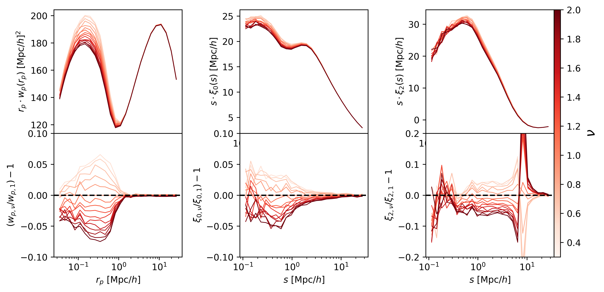
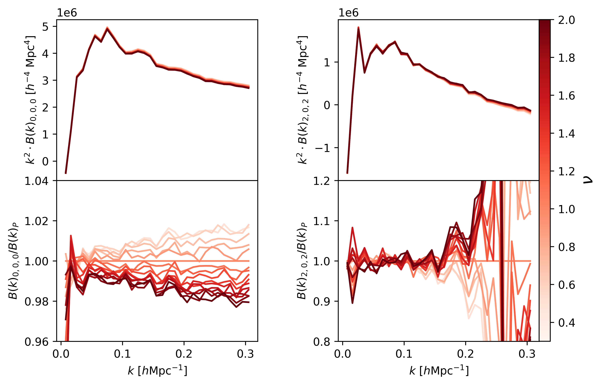
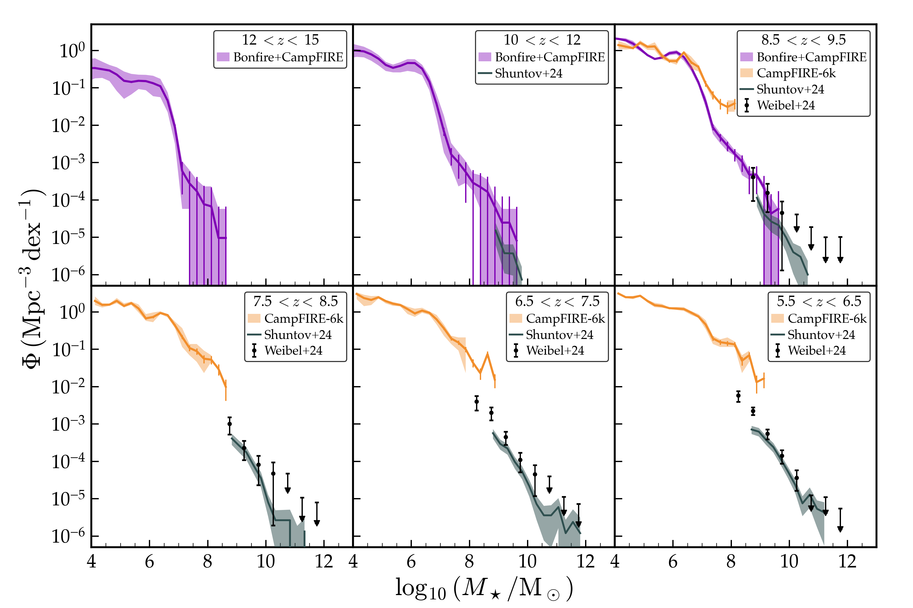
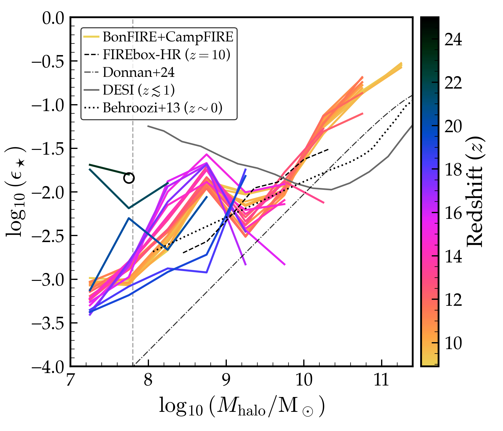

# arXiv Daily Digest — 2026-05-28

**Interest file:** interests/2026.05.md  
**Papers scanned:** 331 (merged from per-category pulls: astro-ph.CO/EP/GA/HE/IM/SR + cs.LG + stat.ML + hep-ph)  
**After first filter:** 18 candidates for full-text review  
**Final selected:** 12 papers  

No Lyman-α forest or IGM opacity papers appeared in today's announcement. The digest leads with precision-cosmology infrastructure (emulators, covariance methods) and ML inference methods, which are the closest relevant work today.

---

## Tier 2 — Adjacent / useful context

### [Fewer simulations, sharper covariances: Reducing mock covariance noise with Zeldovich approximation control variates](http://arxiv.org/abs/2605.28817v1)

Boryana Hadzhiyska, Martin White  
`astro-ph.CO`

Pairs each mock simulation with a cheap Zeldovich-approximation realization sharing the same initial conditions, and derives analytic expressions for the optimal control-variate coefficient and variance reduction factor under a Gaussian disconnected approximation. Applied to DESI-like LRG mocks, the method reduces covariance matrix variance by roughly an order of magnitude on large scales (k ≲ 0.05 h/Mpc) and by a factor of 2–3 at smaller scales. The practical implication is that ~10³ paired simulations achieve the same statistical precision as ~10⁴ independent realizations, cutting the cost of covariance estimation for DESI and Euclid by roughly 10×. The method is analytic, parallelisable, and directly applicable to current spectroscopic survey pipelines.

Directly relevant methodology for DESI-era power spectrum analysis; covariance estimation is one of the main bottlenecks in extracting cosmological information from large-scale structure surveys.

---

### [Dark Quest II: A Wide-Coverage Neural Network Emulator of the Nonlinear Matter Power Spectrum Across Extended Cosmologies](http://arxiv.org/abs/2605.28596v1)

Satoshi Tanaka, Takahiro Nishimichi, Yosuke Kobayashi  
`astro-ph.CO`

DarkEmulator2 is a neural network emulator of the nonlinear matter power spectrum covering a nine-dimensional w₀wₐνo-CDM parameter space (w₀, wₐ, neutrino mass, curvature, plus standard ΛCDM parameters), trained on the Dark Quest II (DQ2) N-body simulation suite. Three design innovations distinguish it from prior emulators: the sampled linear power spectrum is passed as an explicit input feature (so scale-dependent information beyond the parameter vector reaches the regressor), all resolutions are trained jointly as a single multi-fidelity model, and a summary of the initial Gaussian random field enables cosmic-variance-aware predictions at evaluation time. Cross-comparison with public emulators and fitting formulas shows DarkEmulator2 achieves ~1% accuracy across its calibrated domain. The extended cosmological coverage is demonstrated using posterior-mean cosmologies from DESI DR2 extended-ΛCDM fits, illustrating that geometrically degenerate models are distinguishable by their clustering signals.

An emulator spanning w₀wₐ + massive neutrinos + curvature is exactly the infrastructure needed for DESI full-shape and BAO analyses in extended cosmologies; the multi-fidelity design is a transferable technique for expensive forward models.

---

### [GINKAKU: Scalable Cosmological Structure Formation Simulation Code and Post-processing Pipeline](http://arxiv.org/abs/2605.28581v1)

Takahiro Nishimichi, Satoshi Tanaka, Kohji Yoshikawa  
`astro-ph.CO`

GINKAKU is the N-body code underlying the DQ2 simulation campaign, coupling a TreePM gravity solver to a linear-response treatment of massive neutrinos, general-relativistic corrections in the N-body gauge, radiation perturbations at early times, and clustering dark energy with non-unit effective sound speed. Code-to-code comparisons against GADGET, PKDGRAV3, and RAMSES demonstrate <1% agreement in the nonlinear power spectrum at the production-grade fiducial settings. The post-processing pipeline (halo identification across mass definitions, power spectrum measurement, halo shape extension for intrinsic-alignment statistics) is documented alongside eight DQ2 production runs at up to 3000³ particles in 4 h⁻¹ Gpc boxes.

Companion paper to DarkEmulator2 above; understanding the simulation infrastructure that powers next-generation LSS emulators is useful context for evaluating emulator systematics and future extensions.

---

### [GenSBI: Generative Methods for Simulation-Based Inference in JAX](http://arxiv.org/abs/2605.27499v1)

Aurelio Amerio  
`cs.LG` (cross-listed astro-ph.CO, astro-ph.IM)

Introduces GenSBI, an open-source library implementing flow matching, score matching, and denoising diffusion entirely in JAX for simulation-based inference. The library provides three interchangeable transformer-based architectures (SimFormer, Flux1, and the new Flux1Joint for joint density estimation) through a unified interface that decouples generative method, backbone, and inference mode (NPE/NLE/NJE). Benchmarking on SBIBM tasks yields mean C2ST scores of 0.50–0.56 (ideal is 0.50) with minimal per-task tuning. Built-in calibration diagnostics (SBC, TARP, LC2ST) and support for custom embedding networks for domain-specific data complete the package.

JAX has become the dominant framework for cosmological forward models and pipelines; a native SBI library in JAX eliminates the friction of mixing frameworks, and the flow-matching/diffusion approach is the current state of the art for amortised posterior estimation.

---

### [Conservative neural posterior estimation via distributionally robust training](http://arxiv.org/abs/2605.28516v1)

William Laplante, Yuga Hikida, Charita Dellaporta et al.  
`stat.ML` (cross-listed cs.LG)

Proposes DRO-NPE, which replaces the standard NPE training objective with a worst-case loss over a Wasserstein ambiguity set — a distributionally robust optimization approach that controls posterior overconfidence under limited simulation budgets. The method introduces KL-based metrics for miscoverage and miscalibration and proves that the DRO objective upper-bounds both the population NPE loss and these UQ metrics. On the CAMELS cosmological dataset (900 hydrodynamic simulations → inference of Ω_m and σ_8), DRO-NPE achieves the closest coverage to the nominal level while outperforming competing conservative methods on negative log predictive density and calibration error.

The "trust crisis" of overconfident SBI posteriors is a real issue in cosmological analyses where simulation budgets are limited; a principled, theoretically grounded solution with demonstrated cosmology results is directly useful.

---

### [Non-conservation and time non-locality of biased tracers](http://arxiv.org/abs/2605.05203v1)

Lawrence Dam  
`astro-ph.CO`

Develops a Lagrangian bias model that explicitly accounts for ongoing galaxy formation and merger, relaxing the standard assumption that biased tracers are number-conserved. The model is nonlocal in time (reflecting the gradual assembly of tracers from the underlying matter field), and the merger-induced sink term is proportional to the local number density. The derived formula for linear bias shows non-conserved tracers debias more rapidly than conserved ones, producing a progressive large-scale power suppression consistent with simulation observations. Implications for standard perturbative bias expansions and effective-field-theory treatments of tracers are discussed.

Galaxy-halo connection theory underpins DESI galaxy clustering analyses; a correction to the number-conservation assumption has systematic implications for bias modelling at the percent-level precision demanded by current surveys.

---

### [Exploring non-Poisson satellite occupation in HOD models and its impact on 2- and 3-point galaxy clustering](http://arxiv.org/abs/2605.28644v1)

Antoine Rocher  
`astro-ph.CO`

Introduces the Conway–Maxwell–Poisson (CMP) distribution as a one-parameter extension of the standard Poisson satellite HOD, enabling exploration of sub- and super-Poisson satellite counts at fixed halo mass. Using the HODDIES package, deviations from Poisson statistics produce ~10% effects in projected clustering and the multipoles, ~30% effects in counts-in-cylinders, and significant signals in the tree-level galaxy bispectrum. Analytic approximations for the CMP parameters are derived and validated. The results identify non-Poisson occupation as a potentially important systematic for analyses that combine 2- and 3-point statistics.

HOD-based galaxy clustering is a key analysis tool for DESI; systematic biases in the satellite occupation statistics propagate into cosmological parameter inference, particularly for analyses using higher-order statistics or combining summary statistics.

---

### [Transient axion streams from disrupted miniclusters](http://arxiv.org/abs/2605.28005v1)

Luca Visinelli, Momchil Naydenov  
`astro-ph.GA` (cross-listed astro-ph.CO)

Tracks the phase-space evolution of axion streams generated by tidal disruption of axion miniclusters (AMCs) through stellar encounters in the Milky Way halo, using a Monte Carlo treatment of repeated stellar flybys followed by tracer reconstruction. The key finding is that stripped debris is typically unbound (kinetic energy exceeds self-gravitational binding energy at formation), so streams undergo anisotropic free expansion and phase mixing, with density decreasing by factors up to ~10⁹ over Galactic timescales. As a result, observable streams near the Solar circle are dominated by rare, recent, nearby disruption events rather than a persistent overdense population. The streams remain dynamically cold (linewidths 10⁻⁷–10¹ Hz) but are far too diffuse for sustained haloscope signals from the persistent background.

Relevant to the secondary interest in small-scale structure and axion dark matter; this result significantly tightens the observational expectations for axion stream detection and constrains interpretations of local DM halo structure.

---

### [Resolving galaxy formation in the early Universe with BonFIRE and CampFIRE](http://arxiv.org/abs/2605.24104v1)

Jenna Samuel, Michael Boylan-Kolchin, Robert Feldmann et al.  
`astro-ph.GA` (cross-listed astro-ph.CO)

Presents first results from BonFIRE (~40 cMpc box, 5×10⁴ M☉ baryon mass) and CampFIRE (~5 cMpc, down to 800 M☉ baryon mass), a FIRE-3 cosmological hydrodynamic simulation suite focused on early galaxy formation at z ≳ 6. A resampling procedure combines BonFIRE statistics with CampFIRE resolution to predict galaxy properties over a wide dynamic range (M★ ~ 10⁴–10¹⁰ M☉). Star formation is clustered and bursty, with halo-scale efficiencies of 10–30% in high-mass halos; a subset of low-mass halos hosts ultra-compact galaxies with narrow age spreads. Predicted UV luminosity functions are compared against current JWST observations.

The JWST galaxy abundance tension at z > 10 is connected to the ionizing photon budget at the end of reionization; understanding the high-z galaxy population matters for interpreting the IGM opacity measurements that are central to the primary research focus.

---

### [Double Dots: Compact Pairs Mark Little Red Dots and High-Redshift Broad-line AGNs](http://arxiv.org/abs/2605.27903v1)

A. J. Barger, L. L. Cowie  
`astro-ph.GA`

Uses JWST imaging of the lensing cluster field A2744 to search for compact source pairs with separations < 0.25''. Of the 31 identified pairs, at least 67% of previously catalogued Little Red Dots (LRDs) in this field are actually such close pairs (median separation 0.15''), as are both previously identified high-z broad-line AGNs. The presence of a companion can significantly contaminate the measured SED, potentially masking the characteristic V-shape that defines LRDs. Statistical comparison against a uniform background confirms the pairs are predominantly physical.

Directly relevant to the interpretation of the high-z galaxy and AGN population that JWST has revealed, which feeds into understanding early ionizing sources; also relevant as a cautionary result for photometric/spectroscopic classification of high-z objects.

---

## Tier 3 — Outside my area but notable

### [Entropic backreaction from cosmic structure formation: a thermodynamic approach to the late-time cosmological tensions](http://arxiv.org/abs/2605.28797v1)

Biswajit Pandey  
`astro-ph.CO`

Proposes a thermodynamic framework in which entropy generated during nonlinear cosmic structure formation provides a backreaction term that simultaneously enhances the late-time expansion rate (addressing the H0 tension) and introduces a dissipative correction to the growth of perturbations (addressing the S8 tension), without modifying early-universe physics or the CMB sound horizon. The configuration entropy of the matter distribution decreases as gravitational instability progresses, and the authors convert this entropy decrease into an effective energy density and dissipative viscosity. The framework is developed analytically and compared to observational constraints on H0 and S8.

A self-consistent thermodynamic framework connecting two of the most debated observational tensions in ΛCDM is notable as a conceptually distinct approach, even though it is speculative and the proposed mechanism remains to be tested against full N-body simulations.

---

## Tier 4 — Meta-research about the field

### [Astronomy Open Science Competence Centre in Europe](http://arxiv.org/abs/2605.27481v1)

Marco Molinaro, Mark Allen, Joachim Wambsganns et al.  
`astro-ph.IM`

Describes the Astro-CC (Astronomy Open Science Competence Centre) pilot, an ESCAPE-project initiative to expand Virtual Observatory (VO) standards across European astronomy research infrastructures and accelerate adoption of FAIR principles (Findable, Accessible, Interoperable, Reusable) in astronomical data and pipelines. The project plans community events, tooling, and interoperability support for ESFRIs and other data-producing astronomy projects. Focus areas include VO standard adoption, training, and community engagement.

The move toward standardised, interoperable, FAIR-compliant data and analysis pipelines is directly relevant to how DESI data products and Lyman-α forest analyses will be published, reproduced, and extended by the community.

---

## Summary

| Stage | Count |
|-------|-------|
| Papers fetched (pass 1) | 331 unique |
| Candidates (pass 2) | 18 |
| Final selected | 12 |
| Tier 2 | 10 |
| Tier 3 | 1 |
| Tier 4 | 1 |

**Interest file used:** interests/2026.05.md (current month, no fallback needed)

**Notable:** No Lyman-α forest, IGM opacity, or reionization papers appeared today. The digest is dominated by precision-cosmology infrastructure (DarkEmulator2 + GINKAKU companion papers, covariance control variates) and SBI methodology (GenSBI, DRO-NPE), which are the closest-adjacent work.
