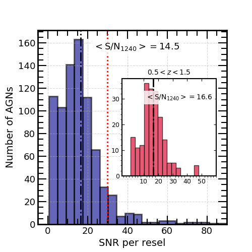
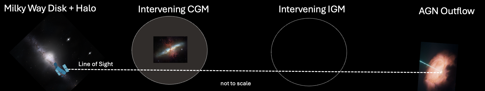
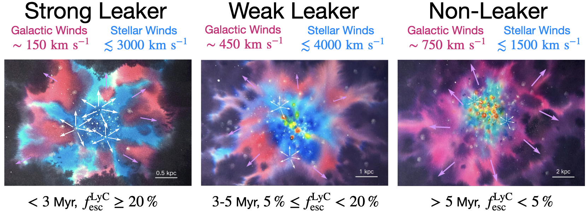
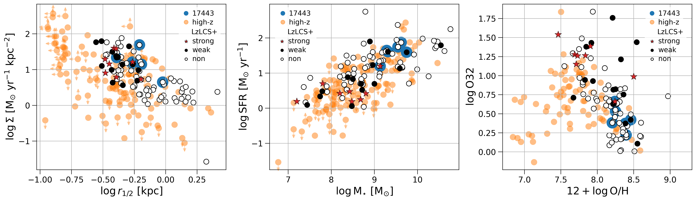
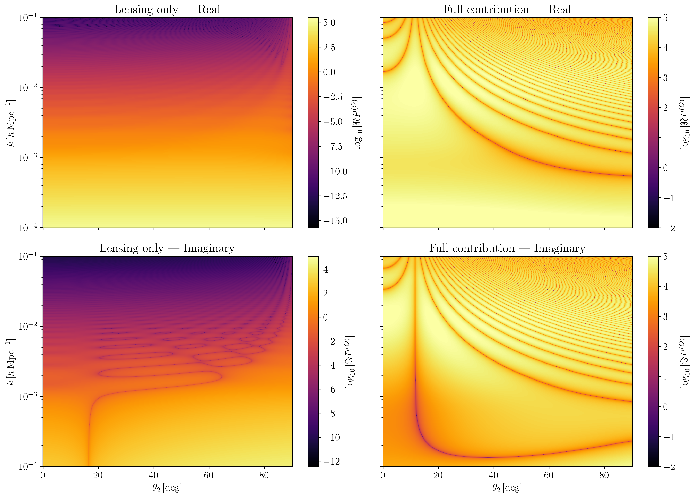
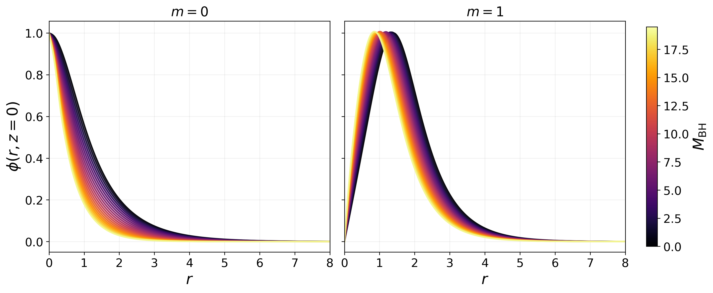
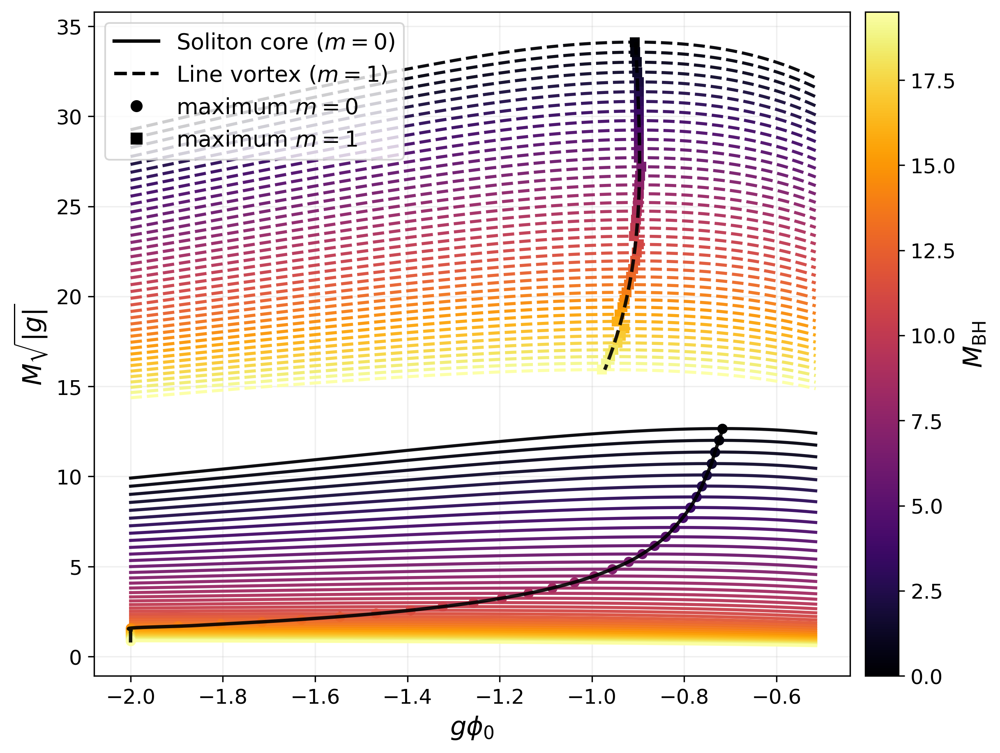

# arXiv Daily Digest — 2026-05-29

**Interest file used:** interests/2026.05.md  
**Papers scanned:** 404 (latest announcement, 1-day pull; --days not applicable, script uses RSS feed)  
**After first filter (title + abstract):** 25 candidates  
**Final selected:** 15  
**Categories pulled:** astro-ph.CO, astro-ph.EP, astro-ph.GA, astro-ph.HE, astro-ph.IM, astro-ph.SR, cs.LG, stat.ML, hep-ph  

---

## Tier 1 — Highly relevant

Today's announcement has no new Lyman-α forest P1D/P3D measurement or DESI Lyα analysis papers. The three papers below are white papers addressing quasar UV spectroscopy and reionization ionizing photons — the IGM-side complement of the Lyα forest program — submitted as part of a community effort on future HST capabilities. They are direct hits on the core interests.

---

### [Closing the UV Gap: Rest-frame EUV science from high-redshift QSOs as a legacy-defining capability](http://arxiv.org/abs/2605.28948v1)

Rongmon Bordoloi, J. Michael Shull  
**Primary category:** astro-ph.GA

HST/COS is the only high-resolution UV spectrograph until HWO (~2040s), and its COS detector sensitivity is declining. This white paper makes the case for an observational program targeting intermediate-redshift QSOs ($z=1$–$2$) to access their rest-frame extreme-UV (EUV; 1–4 Ryd, 228–912 Å) via the HST/COS far-UV bandpass. The EUV window is uniquely capable of measuring IGM and CGM absorption from highly ionized species that constrain the ionization state and thermal structure of the warm-hot intergalactic medium. The science is "doubly perishable": detector sensitivity is falling just as new QSO samples are being identified.

Direct hit on IGM/CGM absorption-line science using quasar spectra — the observational infrastructure underlying Lyα forest work.

---

### [High-S/N Quasar Observations with HST/COS: Deep Fields for Spectroscopy](http://arxiv.org/abs/2605.29949v1)

Andrew J. Fox, Jerry Kriss, Philipp Richter et al.  
**Primary category:** astro-ph.GA

White paper proposing a deep (S/N > 30) UV spectroscopic survey with HST/COS of ~20 QSOs at $0.5 < z < 1.5$ at 20 km/s resolution. High-S/N QSO sightlines for absorption-line work are largely absent from the MAST archives; this program would create a legacy dataset for IGM tomography, CGM metallicity mapping, and Lyα forest analysis at these redshifts. The survey would also pioneer the data quality path for future UV missions and complement existing grids of lower-S/N spectra from HSLA.

The proposed data would be the kind of anchor dataset used for continuum normalization, DLA identification, and IGM opacity studies — directly feeding the quasar absorption-spectroscopy side of the interest profile.

---

### [Extending Hubble into the 2030s to Resolve the Physics of LyC Escape](http://arxiv.org/abs/2605.30035v1)

Cody Carr, Stephan McCandliss, Michelle Berg et al.  
**Primary category:** astro-ph.IM

JWST shows star-forming galaxies at $z > 6$ likely dominate reionization, but LyC escape fractions ($f_\mathrm{esc}$) cannot be measured directly at those redshifts due to IGM absorption. This white paper argues that continued HST/COS observations of low-$z$ LyC-leaker analogs are the only way to calibrate the indirect diagnostics (e.g., O32 ratio, UV compactness, Lyα equivalent width) used to infer $f_\mathrm{esc}$ at reionization redshifts. A summary figure shows the diagnostic parameter space and comparisons between high-$z$ sources and local analogs.

Directly relevant to the reionization ionizing-source question that motivates the IGM opacity / mean free path research interest.

---

## Tier 2 — Adjacent / useful context

---

### [Three-dimensional Conditional Diffusion Models for Cosmological 21 cm Lightcone Emulation](http://arxiv.org/abs/2605.29016v1)

Bin Xia, John H. Wise  
**Primary category:** astro-ph.IM  
**Also in:** astro-ph.CO, cs.LG

Builds conditional diffusion models (score-based generative models) that emulate 3D 21 cm lightcone cubes ($64\times64\times1024$ voxels). The 3D extension is harder than 2D because memory constraints force tiny micro-batches while the 21 cm brightness temperature distribution is heavy-tailed. The paper benchmarks preprocessing strategies (log-transform, dynamic-range compression) and architecture depth, achieving reasonable reconstruction of the global signal and power spectrum. The approach opens the door to fast posterior sampling over EoR astrophysical parameters.

Squarely in the intersection of ML-for-cosmology and 21 cm reionization — two adjacent interests. The diffusion emulator framework is directly transferable to Lyman-α forest lightcone emulation.

---

### [Exploring the High-Redshift 21-cm Signal via Self-Consistent Simulations using Artificial Neural Network Emulation](http://arxiv.org/abs/2605.29876v1)

Colton R. Feathers, Eli Visbal, Steven Murray et al.  
**Primary category:** astro-ph.CO  
**Also in:** astro-ph.GA

Presents a semi-numerical Cosmic Dawn simulation where small-scale star formation rates are calibrated to the AEOS and Renaissance hydrodynamic simulations via neural network emulation, rather than simple analytic prescriptions. The ANN handles Pop III and Pop II star formation in halos while accounting for large-scale density fluctuations and radiative feedback. The resulting 21 cm brightness temperature and power spectrum predictions are more physically grounded than standard parameterized models, and the paper demonstrates sensitivity to X-ray heating efficiency and star formation efficiency.

Relevant as a case study in replacing expensive hydro simulations with calibrated ANN emulators for EoR observables — the same methodology the interest profile flags for Lyα forest inference.

---

### [Augmented Correlation Functions for Spectroscopic Galaxy Surveys](http://arxiv.org/abs/2605.30305v1)

Davide Bianchi  
**Primary category:** astro-ph.CO

Introduces "augmented correlation functions" — an extension of the standard 2-point correlation function in which a secondary scalar (or vector) field derived from the galaxy positions (e.g., line-of-sight velocity, density estimates) defines additional dimensions that are then cross-correlated with the galaxy field. This produces a richer set of summary statistics beyond the standard multipoles without requiring compressed estimators. The method is tested on Quijote simulations and captures additional information from redshift-space distortions and velocity fields.

Directly relevant to the LSS methods interest: a new class of summary statistics for extracting cosmological information from spectroscopic surveys like DESI, with potential for application to Lyα forest cross-correlations.

---

### [Dominated-Convergence Failure in Cosmological Perturbation Theory and a Numerical Foundation for BBGKY+ZA](http://arxiv.org/abs/2605.28943v1)

Svetlin V. Tassev  
**Primary category:** astro-ph.CO

Identifies a root cause of convergence failure in standard cosmological perturbation theories (EPT and LPT): the perturbative expansion of the overdensity $\delta$ in the Lagrangian displacement $s$ involves an exchange of limits that fails (dominated-convergence theorem violation) as structure grows nonlinear. The paper then lays the numerical groundwork for an alternative approach — BBGKY hierarchy truncated at the Zel'dovich approximation — that avoids this manipulation. Demonstrates the pathology and the alternative on concrete examples.

Relevant to the interest in EFT/theory of the Lyman-α forest and LSS: understanding why standard PT diverges and what replaces it is foundational for the EFT-of-LSS program applied to the forest.

---

### [ODIN: Rest-frame Optical Morphologies and Star Formation Activity of Lyα Emitters at z=2.4, 3.1, and 4.5](http://arxiv.org/abs/2605.29344v1)

Sang Hyeok Im, Ho Seong Hwang, Jeong Hwan Lee et al.  
**Primary category:** astro-ph.GA

Uses JWST/NIRCam images from the COSMOS-Web survey to measure the rest-frame optical morphologies (sizes, Sérsic indices) and star-formation properties of 200+ Lyα emitters (LAEs) at $z = 2.4$, 3.1, and 4.5 from the ODIN survey. LAEs are found to be smaller and more compact than typical star-forming galaxies at the same mass and redshift, and their Lyα equivalent width correlates with UV compactness — consistent with geometrical models in which compact morphology facilitates Lyα escape. The size–mass relation for LAEs lies below that of the general SFG population.

Relevant as a morphological characterization of the galaxy populations responsible for cosmic reionization; connects to the LyC escape/reionization interest and the Lyα emission physics underlying the CGM/forest interface.

---

### [Too many protoclusters? Reconciling the overabundance of cluster progenitors within the first billion years of the Universe](http://arxiv.org/abs/2605.28930v1)

Callum Witten, Jake S. Bennett, Pascal A. Oesch et al.  
**Primary category:** astro-ph.GA  
**Also in:** astro-ph.CO

JWST has identified an apparent overabundance of "Coma-like" cluster progenitors at $z > 5$: up to $4\sigma$ above ΛCDM predictions. This paper shows that much of the tension stems from an observational systematics issue — observers sum stellar mass over apertures much larger than the virial radius, so multiple distinct progenitor halos are counted as a single massive structure. Correcting for this using TNG-Cluster and TNG300 simulations brings most but not all of the tension within acceptable range, with a residual $\sim 2\sigma$ excess suggesting true ΛCDM tension or additional assembly bias.

Important for the JWST/early-universe context: if true, this could imply significantly enhanced power on scales sampled by the Lyα forest at $z > 5$, or failures of the small-scale power spectrum normalization.

---

### [Modeling Solitonic Cores, Stabilization of Bar, and Suppression of Bar Dissolution in DDO 168 via GPP Formalism](http://arxiv.org/abs/2605.29314v1)

Saroj Khanal, Sanjay Kumar Sah, Kiran Khanal et al.  
**Primary category:** astro-ph.GA  
*(PDF only — no LaTeX source available)*

Models the dark-matter-dominated dwarf irregular galaxy DDO 168 within the Bose–Einstein condensate / fuzzy dark matter (FDM) framework. The Gross–Pitaevskii–Poisson equations produce a solitonic core that replaces the NFW cusp, resolving the cusp-core problem. The paper additionally finds that the FDM soliton stabilizes and prevents dissolution of the galactic bar observed in DDO 168, providing a morphological test of the FDM paradigm beyond density profiles alone.

Directly relevant to the dark matter from small-scale structure interest: FDM modeling of dwarf galaxies provides constraints on the axion mass that are complementary to Lyα forest power spectrum bounds.

---

### [The observer power spectrum for lightcone statistics, integrated relativistic observables and wide angle effects](http://arxiv.org/abs/2605.29806v1)

Chris Clarkson, Pritha Paul  
**Primary category:** astro-ph.CO

Defines a new "observer power spectrum" for LSS by Fourier transforming fields over observer positions at fixed lightcone coordinates rather than over source positions on a single lightcone. This preserves translational invariance and makes the power spectrum diagonal, absorbing all relativistic effects (lensing, Sachs–Wolfe, Doppler) and wide-angle geometry naturally. Numerical examples show that lensing contributes a significant off-diagonal contribution to the standard source-position power spectrum that the observer power spectrum avoids.

Relevant for precision power spectrum inference with DESI: relativistic and wide-angle effects become important at the signal-to-noise level of DESI and must be correctly accounted for in Lyα forest BAO analyses.

---

### [Equilibrium Core and Vortex Solutions of Bose Einstein Condensate Dark Matter around a Black Hole](http://arxiv.org/abs/2605.29069v1)

Ivan Alvarez-Rios, Francisco S. Guzman  
**Primary category:** astro-ph.GA  
**Also in:** astro-ph.CO, gr-qc

Constructs families of stationary BECDM (fuzzy DM) solutions around a point-mass black hole using imaginary-time evolution of the Gross–Pitaevskii–Poisson equations. Both ground-state solitonic cores and line-vortex configurations with nonzero winding number are explored across a wide range of self-interaction strengths and black hole masses. The paper maps out the parameter space where the soliton remains bound versus disrupted by the BH potential, with implications for galactic centers.

Relevant to the fuzzy/ultralight dark matter interest: the interaction of the quantum pressure with central BHs is a key theoretical ingredient in FDM models of galactic nuclei, and these solutions constrain the axion mass from BH environment effects.

---

## Tier 3 — Outside my area but notable

---

### [Problems of cosmology on small scales of the Universe](http://arxiv.org/abs/2605.29899v1)

I. D. Karachentsev  
**Primary category:** gr-qc  
**Also in:** astro-ph.CO

Concise review of six persistent tensions between ΛCDM predictions and observations of galaxies and groups in the Local Volume (~12 Mpc): missing satellites, too-big-to-fail, void statistics, galaxy angular momentum, the local Hubble flow, and the baryon fraction in groups. Presents observational data from the Local Volume catalog and discusses which tensions are fading versus persisting. Notes that the tensions collectively imply the standard parameters of ΛCDM may need revision at ~Mpc scales.

A useful field-level summary of small-scale structure tensions relevant as context for dark matter and reionization research; may motivate forest-based DM constraints at small $k$.

---

### [Signals from the early Universe: a comprehensive search for primordial features in Planck CMB datasets](http://arxiv.org/abs/2605.30236v1)

Antonio Raffaelli, Mario Ballardini, Nicola Barbieri  
**Primary category:** astro-ph.CO

Systematic search for primordial oscillatory features (linear, logarithmic, resonance, and PSC templates) in Planck CMB data using unbinned likelihoods for both PR3 and PR4 (NPIPE) releases. Several previously reported oscillatory hints persist across both data releases, but the Bayesian evidence remains insufficient to claim detection over a smooth primordial power spectrum. The PR4 likelihood modestly shifts the preferred feature frequencies.

Notable for methodological reasons: the unbinned likelihood approach is the same machinery needed for Lyα P1D feature searches; the null result also constrains primordial features that would show up in the matter power spectrum at forest scales.

---

## Tier 4 — Meta-research about the field

---

### [First head-to-head comparison of agentic AI applied to the analysis of simulated data of the Einstein Telescope](http://arxiv.org/abs/2605.28916v1)

Gianluca Inguglia  
**Primary category:** astro-ph.IM  
**Also in:** cs.AI, cs.HC

Benchmarks Claude Code (Anthropic) and Codex (OpenAI) on an end-to-end gravitational wave data analysis pipeline: PSD estimation from raw Einstein Telescope simulated noise, template bank generation, matched-filter recovery of 100 binary-black-hole injections, automated results generation, and LLM-assisted manuscript writing. Both systems complete the pipeline autonomously without human intervention on shared computing infrastructure. Claude Code and Codex achieve comparable scientific results; the paper quantifies wall-clock time, success rates, and error modes, finding that agentic AI can already automate routine GW analysis tasks.

This is directly about the practice of AI-assisted astronomy. The pipeline structure (automated data analysis → results → manuscript) is a prototype for what agentic AI will do for spectroscopic survey pipelines including DESI.

---

## Summary

| Tier | Count |
|------|-------|
| Tier 1 — Highly relevant | 3 |
| Tier 2 — Adjacent / useful context | 9 |
| Tier 3 — Outside area but notable | 2 |
| Tier 4 — Meta-research | 1 |
| **Total** | **15** |

No Lyα forest P1D/P3D or DESI Lyα analysis papers in today's announcement. The three Tier 1 papers are white papers from the HST future capabilities community process, all directly relevant to quasar absorption spectroscopy and reionization ionizing photons. The Tier 2 selection emphasizes 21 cm emulation (two papers using ML for EoR/CD simulation), new LSS statistics methods, perturbation theory foundations, and small-scale dark matter (two FDM papers). The single Tier 4 paper is an empirical benchmark of agentic AI (including Claude Code) running a complete GW analysis pipeline autonomously.
