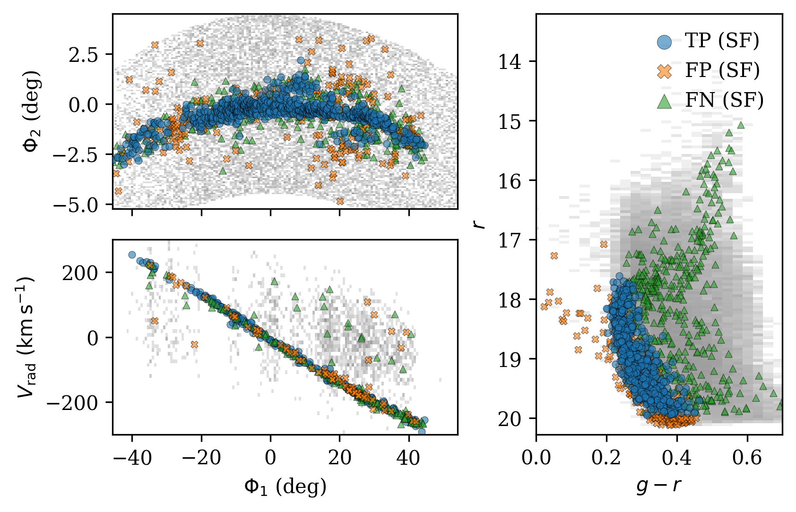

# arXiv Digest — 2026-06-09

**Interest file used:** interests/2026.05.md (fallback — no 2026.06.md exists yet)
**Categories pulled:** astro-ph.CO, astro-ph.EP, astro-ph.GA, astro-ph.HE, astro-ph.IM, astro-ph.SR, cs.LG, stat.ML, hep-ph
**Papers scanned:** 474 (116 astro-ph new/cross + 358 cs.LG/stat.ML/hep-ph)
**After first filter:** 12 candidates reviewed with full text
**Final selected:** 10 papers across 4 tiers

*Note: the combined cs.LG/stat.ML/hep-ph announcement held 502 papers; the cs.LG feed was capped at 250 (all 116 astro-ph, 60 hep-ph, and 48 stat.ML were fully reviewed). The cs.LG/stat.ML pool was generic ML (continual learning, KV-cache, PINNs) with no cosmology/inference angle, and hep-ph was particle/nuclear physics with no forest or SBI hook, so nothing from the extras survived. Two full-text candidates were dropped in the final filter: an AGN photometric reverberation-mapping meta-learning paper (too far from focus) and a δ-CDM DESI-BAO dark-energy reconstruction (overlapped the stronger axion/DESI entry and was itself not favored over ΛCDM).*

---

## Tier 1 — Highly relevant

### [Reconciling large-scale Lyman-α correlations with the SCRIPT Semi-numerical Model](https://arxiv.org/abs/2606.08368)

Saptarshi Sarkar, Tirthankar Roy Choudhury
**Primary category:** astro-ph.CO

A recent measurement (Spina et al. 2026) found transmitted-flux correlations in the z≈6 Lyman-α forest extending beyond 200 cMpc — far larger than current large-volume reionization simulations can reproduce. Using mock spectra drawn from the extended 14-parameter SCRIPT semi-numerical reionization model and the same 67 XQR-30 sightlines (Bosman et al. 2022), the authors run an MCMC inference on the correlation amplitude/length and show that, while the fiducial ensemble systematically predicts shorter correlation lengths, a small fraction of individual realizations naturally reproduce the observed signal. A delete-2 jackknife reveals the large observed correlation length is disproportionately driven by a rare pair of highly transmissive sightlines; injecting two such sightlines raises the fraction of consistent mocks from 17.5% to 74.1%. Spatial fluctuations in the ionizing mean free path remain an essential ingredient.

This is a direct hit on the interest file's primary Lyman-α-forest + IGM/late-reionization program: it touches XQR-30 high-z forest opacity, mean-free-path fluctuations, and the cosmic-variance interpretation of a headline anomaly, using exactly the semi-numerical machinery (SCRIPT, Choudhury) the library tracks.

---

### [Beyond Point Estimates: Benchmarking Uncertainty Quantification Methods on the AION-1 Astronomical Foundation Model](https://arxiv.org/abs/2606.07771)

Karla Tame-Narvaez, Aleksandra Ćiprijanović, Shubhendu Trivedi
**Primary category:** astro-ph.IM | also: astro-ph.GA

Seven uncertainty-quantification (UQ) methods are benchmarked on galaxy-property regression (redshift, stellar mass, stellar-population age, gas metallicity, sSFR) using frozen embeddings from the AION-1 astronomical foundation model, with Legacy Survey imaging/photometry and DESI spectra and PROVABGS labels. Distribution-free conformal methods hold marginal coverage within ~1pp of the nominal 90%, while non-conformal baselines (Deep Ensembles, MC Dropout) fail to calibrate — DE undercovers badly, MC Dropout over-widens. Only the Locally Valid and Discriminative (LVD) framework, operating directly on the R^768 AION embeddings, delivers finite-sample local validity, producing intervals that adapt to each galaxy's prediction difficulty rather than relying on marginal guarantees. Tests use the 300M-parameter AION-B; scaling to AION-L/XL is left to follow-up.

This lands squarely in the interest file's rising-primary ML branch: AION-1 is flagged as the single newest item in the library, and Bayesian-deep-learning/UQ on foundation-model embeddings over DESI spectra is exactly the inference-on-survey-data toolkit being assembled. The takeaway — conformal/LVD over ensembles or dropout — transfers directly to any downstream cosmology regression on learned representations.

*No figures extracted for 2606.07771 (the result is a coverage/efficiency table across methods and targets; no single plot captures it better than the prose).*

---

## Tier 2 — Adjacent / useful context

### [Measurements of the Angular Homogeneity Scale from DESI DR1](https://arxiv.org/abs/2606.07854)

Mariana Lopes-Dias, Carlos A. P. Bengaly, Xiaoyun Shao et al.
**Primary category:** astro-ph.CO | also: gr-qc

A test of the Cosmological Principle via the angular homogeneity scale θ_H, measured from DESI DR1 Luminous Red Galaxies (0.4 < z < 1.1) using a purely 2D, narrow-redshift-bin approach to minimize a-priori model dependence. A homogeneity scale is identified in every redshift interval, in both the North and South Galactic Caps, consistent with ΛCDM mock simulations and in agreement with earlier SDSS-IV eBOSS DR16 measurements. The spatial scale R_H peaks around 260 h⁻¹Mpc, supporting statistical isotropy/homogeneity as the survey enters the Stage-IV era.

Relevant as a DESI DR1 large-scale-structure consistency check on the foundational assumption underlying every BAO/full-shape and forest analysis in the library; useful context for how robustly the Cosmological Principle holds in the same dataset the forest P1D/BAO work draws on.

*No figures extracted for 2606.07854 (the result is a null/consistency confirmation across redshift bins; the per-bin θ_H table is the substance and doesn't compress to a single illustrative panel).*

---

### [Bayesian Reconstruction of the Local Universe from 2MRS: Testing the Gravitational Flow with Cosmicflows-4](https://arxiv.org/abs/2606.08593)

Adi Nusser
**Primary category:** astro-ph.CO

A constrained, field-level reconstruction of the local density and velocity fields from the 2MASS Redshift Survey, built on a Zel'dovich forward model with an explicit unbinned redshift-space Poisson point-process likelihood, a distance-dependent bias prescription, and Hamiltonian Monte Carlo for posterior sampling and constrained realizations. The reconstructed velocity field is validated object-by-object against independent Cosmicflows-4 peculiar velocities, plus density–velocity-correlation and reflex-dipole tests, without smoothing the CF4 data. Constrained initial conditions are then evolved with Gadget-4, recovering large-scale Zel'dovich structure plus nonlinear small-scale growth and Fingers-of-God.

The interest is methodological: this is a clean, working example of field-level / differentiable-style forward modeling with an HMC-sampled forward model and explicit likelihood — the same inference paradigm the library tracks for forest/LSS (cf. field-level inference, Alsing/Wandelt-style). The 2MRS forward model and Poisson likelihood are directly transferable patterns.

*No figures extracted for 2606.08593 (the central result is a velocity–velocity validation scatter best appreciated with the full methodology; the text summary conveys the contribution).*

---

### [A differentiable forward model for weakly perturbed stellar streams: substructure forecasts from density and kinematics spectra](https://arxiv.org/abs/2606.09629)

Noemi Anau Montel, Fabian Schmidt
**Primary category:** astro-ph.GA | also: astro-ph.CO

A fast, JAX-differentiable forward model for stellar streams in the diffusion regime, where the stream is heated by many small velocity kicks rather than a few strong encounters. The substructure population enters only through its power spectrum P(q), making cost independent of the number of perturbers and letting alternative dark-matter models be explored by swapping a single input. Forecasting a GD-1-like stream, the authors show that adding full kinematics (both proper motions and radial velocity) to the density tightens constraints by ~3–5×, sharpening the dark-matter free-streaming cutoff (half-mode mass M_hm = 10⁶ M_⊙) from ~1.2 dex to ~0.25 dex for a 5 Gyr stream (~0.1 dex at 7 Gyr) — competitive with strong-lensing and satellite-count limits.

Two interest-file threads converge here: small-scale dark matter via the free-streaming cutoff (cf. the library's WDM/free-streaming work) and differentiable forward modeling as the inference engine. The power-spectrum-only parameterization mirrors how the forest encodes small-scale power, and the JAX/Fisher machinery is the same toolkit being applied to forest/LSS.

---

### [Characterizing Stellar Streams with Error-Aware Machine Learning](https://arxiv.org/abs/2606.09576)

Alexandros Pratsos, Biprateep Dey, Ting S. Li
**Primary category:** astro-ph.GA | also: astro-ph.IM

SCREAM is a weakly-supervised ML framework that identifies stream member stars as localized feature-space over-densities, adapting the CATHODE anomaly-detection method from particle physics and avoiding rigid physical priors (assumed potentials, strict isochrone cuts). It is the first such framework in this domain to fold observational uncertainties directly into the neural-network training objective. On GD-1 (Gaia DR3 + DESI Legacy imaging) it reaches an F1 of 0.745 against spectroscopic labels, outperforming SKYCURTAINS by 12pp precision / 28pp recall, and uniquely recovers the diffuse "cocoon" and faint main-sequence members that STREAMFINDER misses.

Complements the differentiable-stream forecast above on the detection side: it is a borrowable error-aware, weakly-supervised inference pattern (anomaly detection as over-density finding, uncertainties in the loss) directly applicable to the noisy spectroscopic catalogs central to the library, and it leans on DESI imaging.

---

### [Modifying ΛCDM dynamics via out-of-equilibrium axions: reconciling SH0ES and DESI H₀ values](https://arxiv.org/abs/2606.09427)

Giovanni Montani, Luis A. Escamilla, Nakia Carlevaro et al.
**Primary category:** astro-ph.CO | also: astro-ph.HE, gr-qc

A late-Universe model in which dark matter is axionic and a small fraction is driven out of thermodynamic equilibrium (motivated physically by cosmic-string/topological-defect axion production), yielding a modified dark-matter energy-density evolution from both kinetic-theory and classical-field derivations. The departure from ΛCDM is confined to z ≲ 1. Against SNe Ia, BAO, and cosmic chronometers the model is statistically comparable to ΛCDM without SH0ES, but with the SH0ES calibration it is favored (Bayes factor ~5 units lower) and yields H₀ ≈ 73 km/s/Mpc while remaining consistent with DESI BAO.

Relevant on two library axes: DESI BAO as a constraining dataset and axion dark matter as a physics target (cf. the fuzzy/ultralight-axion forest work). A useful data point on Hubble-tension model-building in the DESI DR2 era, framed through a DM-sector modification rather than early-time physics.

*No figures extracted for 2606.09427 (the key result is the H₀ posterior / Bayes-factor comparison; adequately conveyed in text).*

---

### [Spectral distortion anisotropies from photon to dark photon conversions](https://arxiv.org/abs/2606.09491)

Sara Evangelista, Jens Chluba, Bryce Cyr
**Primary category:** astro-ph.CO | also: gr-qc, hep-ph

Extends CMB spectral-distortion studies of resonant photon→dark-photon conversion from the monopole to anisotropic distortions, using the newly developed Frequency Hierarchy framework in CosmoTherm. The dark-photon mass controls the multipole shape of the distortion power spectra while the kinetic-mixing parameter sets the amplitude; cross-power spectra are computed across the parameter space. A simple likelihood analysis on Planck μT/μE data places limits only marginally weaker than COBE/FIRAS monopole bounds — without needing absolute calibration — and conversions at z ≳ 2×10⁶ may seed iso-curvature-type perturbations.

Adjacent cosmology / new-physics methodology: dark-sector constraints (a sibling of the library's dark-matter interest) via a novel anisotropic-distortion probe that sidesteps absolute calibration. The Frequency Hierarchy / line-of-sight machinery is a methodological pointer for anyone using CMB secondaries as complementary DM probes.

*No figures extracted for 2606.09491 (the results are technical transfer-function and cross-power panels; the constraint takeaway is captured in the summary).*

---

## Tier 3 — Outside my area but notable

### [Pantheon+ supernovae corrected for progenitor age indicate the universe is decelerating](https://arxiv.org/abs/2606.09650)

Animesh Sah, Mohamed Rameez, Subir Sarkar
**Primary category:** astro-ph.CO | also: gr-qc, hep-ph

Applying redshift-dependent corrections for SN Ia progenitor-age luminosity evolution to the Pantheon+ catalogue, the authors find that the local dipole in the deceleration parameter q₀ (aligned with the bulk flow) is unchanged, while the monopole component shifts to positive values — i.e., deceleration. They argue this leaves no evidence for isotropic accelerated expansion attributable to a cosmological constant or dark energy, and contest the use of CMB-frame peculiar-velocity corrections as circular within an assumed FLRW background.

A deliberately provocative claim from a group long skeptical of cosmic acceleration; the progenitor-age systematic is still contested. Worth knowing as a scientist because, if the age-evolution bias survives scrutiny, it would directly undercut the SN-Ia leg of the dark-energy case — context for how robust the acceleration evidence underpinning ΛCDM-based forest analyses actually is.

*No figures extracted for 2606.09650 (a short Letter whose monopole/dipole q₀ result is fully conveyed in text).*

---

## Tier 4 — Meta-research about the field

### [Do Vision-Language Models See Dwarf Galaxies the Way We Do?](https://arxiv.org/abs/2606.07779)

Dimitrios Tanoglidis, Chin Yi Tan, Kate Overdeck et al.
**Primary category:** astro-ph.IM | also: astro-ph.GA

Evaluates general-purpose vision-language models (VLMs) on identifying ultra-faint dwarf-galaxy candidates from multi-panel survey diagnostic images, benchmarking against human annotations from a large citizen-science campaign. Zero-shot VLMs closely reproduce aggregate human calibration and do well on unambiguous cases, suggesting a viable scalable first-pass filter. However, both self-reported confidence and repeated-inference fail to yield reliable per-example uncertainty, limiting direct use for candidate prioritization and follow-up.

A grounded data point on how off-the-shelf AI is (and isn't) ready to assist astronomical discovery — relevant to the field-practice question of where general-purpose foundation/VLM tools fit into survey pipelines, and a cautionary complement to the AION-1 UQ paper above: calibrated uncertainty, not raw classification, is the bottleneck for deployment.

*No figures extracted for 2606.07779 (a benchmarking/perspective study; its figures are calibration scatter plots that add little beyond the stated conclusion).*
