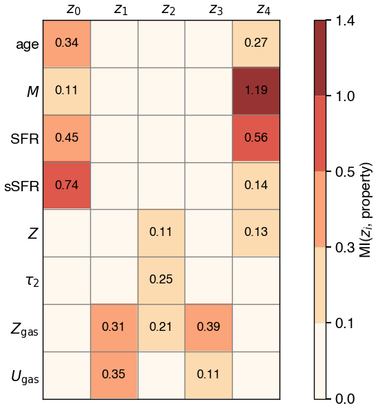

# arXiv Digest — 2026-06-11

**Interest file used:** interests/2026.05.md (fallback — no 2026.06.md exists yet)
**Categories pulled:** astro-ph.CO, astro-ph.EP, astro-ph.GA, astro-ph.HE, astro-ph.IM, astro-ph.SR, cs.LG, stat.ML, hep-ph
**Papers scanned:** 324 (88 astro-ph primary + 236 cs.LG/stat.ML/hep-ph & cross-listed)
**After first filter:** 13 candidates reviewed with full text
**Final selected:** 10 papers across 3 tiers

*Note: the arXiv metadata API (export.arxiv.org) repeatedly failed on the bulk by-id fetch, so metadata and full abstracts were drawn directly from the RSS announcement feeds at rss.arxiv.org (same title/abstract/author/category content); full text for the 13 survivors was fetched normally. No Lyman-α forest, IGM/reionization, or DESI papers appeared in today's feed, so Tier 1 is populated by the ML-inference-for-cosmology thread (a rising primary focus in the interest file). Tier 4 is omitted — nothing met the bar for meta-research about the field.*

---

## Tier 1 — Highly relevant

### [Dark Energy Survey Year 3 results: optimized $w$CDM simulation-based inference with weak lensing map-level hybrid statistics](https://arxiv.org/abs/2606.11309)

J. Williamson, T. L. Makinen, N. Porqueres et al. (B. Wandelt among co-authors)
**Primary category:** astro-ph.CO

This is a full simulation-based inference (SBI) analysis of DES Y3 weak lensing built on the Gower Street forward simulations, with an information-theory-based compression of the lensing maps down to just seven highly informative summaries. The "hybrid" scheme deliberately optimizes neural (CNN) summaries to be *complementary* to the angular power spectrum rather than treating map-level and two-point information as independent, while forward-modelling masks, photo-$z$ errors, intrinsic alignments, shear bias, source clustering, and non-Gaussian shape noise. Assuming $w$CDM they obtain $S_8 = 0.808 \pm 0.017$, $\Omega_m = 0.325 \pm 0.024$, and $w < -0.766$, improving the $(\Omega_m, S_8, w)$ figure of merit by ~60% over the previous map-level state of the art and nearly 3× over two-point analyses — the most precise weak-lensing-only joint constraints to date. The pipeline is validated with TARP-style coverage tests and shown robust to baryon-feedback misspecification.

Direct hit on the interest file's rising-primary ML-inference focus: this is exactly the SBI + information-theoretic compression + principled forward-modelling toolkit flagged for "doing inference on expensive simulations and large datasets," and Benjamin Wandelt (an interest-file high-value author for field-level/SBI work) is a co-author.

---

### [Towards Practical Field-Level Inference for Weak Lensing](https://arxiv.org/abs/2606.12255)

Yuuki Omori, Justine Zeghal, Chihway Chang et al. (F. Lanusse, L. Perreault-Levasseur among co-authors)
**Primary category:** astro-ph.CO

A careful head-to-head comparison of power-spectrum inference, *implicit* field-level inference (FLI), and *explicit* (sampled) FLI using one shared weak-lensing forward-modelling pipeline, with 8-million-parameter Lagrangian-perturbation-theory and particle-mesh (PM) $N$-body forward models. Implicit and explicit FLI yield consistent $(\Omega_m, S_8^{\rm lin})$ posteriors, and TARP coverage tests confirm the implicit posteriors are calibrated, lending credibility to the recovered field-level constraints. Relative to matched power-spectrum analyses, implicit FLI improves constraints by 77–96% (LPT, $\ell_{\rm max}=400/1000$) and 116–123% (PM) — a conservative floor since the implicit branch uses a compressed map. A block-structured inverse mass matrix that isolates the low-dimensional cosmology-coupled subspace is what makes explicit sampling over the ~$10^7$-dim latent field tractable, though $\Omega_m$ mixing remains slow.

Squarely on the interest file's field-level / simulation-based inference thread, with several of the high-value ML-for-cosmology names (Lanusse, Perreault-Levasseur). The clean implicit-vs-explicit cross-check and the honest accounting of what still blocks real-data PM-based FLI is exactly the methods grounding the profile prioritizes.

---

### [Interpretable Neural Marked Statistics for Cosmological Inference](https://arxiv.org/abs/2606.11295)

Federico Semenzato, Benjamin D. Wandelt, Michele Liguori et al.
**Primary category:** astro-ph.CO | also: cs.LG

Proposes a *learned, interpretable* marked statistic for the matter density field: spherical-harmonic ($\ell\le2$) filters produce density-, gradient-, and quadrupole-like rotation invariants that are combined by small per-channel MLPs into a translation-equivariant mark, trained on Quijote with a contrastive (InfoNCE, Mahalanobis-metric) objective that explicitly orthogonalizes the marked summary against the plain $P_{\delta\delta}$ embedding. Because the mark is an additive sum of per-channel responses, the contribution of each morphological channel is exactly decomposable rather than a saliency proxy. At $k_{\max}=0.2\,h\,\mathrm{Mpc}^{-1}$ the learned mark tightens $\sigma_8$ by $2.9\times$ and $\Omega_m$ by $1.8\times$ over the best classical mark and rotates the $\Omega_m$–$\sigma_8$ contour to break the canonical degeneracy at the Fisher level, also lowering parameter MSE by $1.45\times$ on held-out simulations.

Direct hit on the ML-inference-for-cosmology focus, specifically the "sufficiency/complementarity of summary statistics" sub-thread in the interest file. Benjamin Wandelt — an interest-file high-value author — is second author, and the interpretable-mark idea is a borrowable design for any field-level summary problem.

---

## Tier 2 — Adjacent / useful context

### [A Unified Halo Mass Function Across Dark Matter Models from High-Resolution Multi-Scale Simulations](https://arxiv.org/abs/2606.12137)

Andrew J. Benson, Ethan O. Nadler, Xiaolong Du et al.
**Primary category:** astro-ph.CO | also: astro-ph.GA

Calibrates flexible fitting functions for the (backsplash-removed) halo mass function and the associated window function from MultiDark Planck boxes plus Group/Milky-Way/LMC zoom-ins spanning CDM and non-CDM initial conditions, jointly modelling systematics like finite-box effects, isolation criteria, detection efficiency, and artificial-halo contamination. The model holds to ~12% precision over ten orders of magnitude in halo mass ($10^6$–$10^{16}\,M_\odot$) and many redshifts, reproducing small-scale cut-offs, oscillations, and enhancements (with 40–50% deviations only in specific intervals), and extends to environmental dependence. Crucially it spans thermal-relic, axion, and dark-sector-interaction paradigms down to $10^7\,M_\odot$.

Relevant to the interest file's small-scale-structure dark-matter program (§5), which is fused with the Lyman-α forest WDM/axion work. A model-independent halo mass function that natively covers WDM and axion small-scale cut-offs is a direct ingredient for translating future substructure/forest data into dark-matter constraints.

---

### [pop-cosmos: Disentangling galaxy properties from observables using data-driven approaches](https://arxiv.org/abs/2606.11308)

Benedict Van den Bussche, Sinan Deger, Hiranya V. Peiris et al.
**Primary category:** astro-ph.GA | also: astro-ph.IM

Uses the generative pop-cosmos galaxy-population model together with a $\beta$-variational autoencoder to compress a 16-parameter stellar-population-synthesis description into a disentangled latent space, interpreted via mutual information. Five independent latent dimensions suffice, mapping to stellar mass, recent star formation, dust, and — notably — only two (rather than the assumed three or four) degrees of freedom in the gas ionization state. Stellar metallicity and age are not primary drivers; their spectral imprints are distributed across the other dimensions. Tying each latent dimension to specific spectral features breaks the SFR–dust–metallicity degeneracy and recovers gas conditions more cleanly than standard line-ratio diagnostics.

Adjacent on two counts the interest file cares about: it's a concrete application of generative/representation-learning machinery (VAEs, disentanglement, mutual-information diagnostics) to spectroscopic data, and Hiranya Peiris — an interest-file high-value author — is a co-author. The disentanglement-via-MI approach is a transferable tool for any SED/spectral inference pipeline.

---

### [KiDS-Legacy: Joint analysis of second- and third-order cosmic shear](https://arxiv.org/abs/2606.12389)

L. Linke, L. Porth, P. Burger et al.
**Primary category:** astro-ph.CO

Combines second-order COSEBIs (2′–300′) with third-order aperture-mass moments (4′–32′) in the final KiDS-Legacy data, adding a mass- and redshift-dependent intrinsic-alignment model, a simulation-validated baryon correction, and reduced-shear/source-clustering corrections. The third-order signal breaks the $\Omega_m$–$S_8$ degeneracy that limits two-point analyses, yielding $\Omega_m = 0.297^{+0.056}_{-0.040}$ and $S_8 = 0.806^{+0.025}_{-0.023}$ — more than doubling the figure of merit in the $\Omega_m$–$S_8$ plane over two-point alone. The third-order measurements pass internal consistency tests and agree with the KiDS two-point, other lensing results, and Planck within $1\sigma$, showing no $S_8$ tension.

Useful context for the LSS / weak-lensing secondary focus: it's a mature demonstration that higher-order statistics (here analytic, not ML) deliver real constraining power and degeneracy-breaking — a non-ML counterpoint to the field-level/SBI papers in Tier 1, and a clean recent data point on the $S_8$-tension question.

---

### [Bounding the Effect of HOD Assumptions on Small-Scale Clustering Constraints](https://arxiv.org/abs/2606.12405)

Nick Magnelli, Zachery Brown, Lado Samushia
**Primary category:** astro-ph.CO

Quantifies how much of the cosmological constraining power in small-scale galaxy clustering survives uncertainty in the galaxy–halo connection, using LRG-like mocks from 81 AbacusSummit cosmologies and 2PCF multipoles on 5–80 Mpc/$h$. They bracket the standard five-parameter HOD between a "floor" (only broad HOD priors, profiling over HOD with a custom global optimizer, HODmin) and a "ceiling" (HOD known exactly). Against the same Planck $\Lambda$CDM mock, the floor excludes 25% of test cosmologies at $3\sigma$ while the ceiling excludes ~81% — many cosmologies that fit well under the floor are ruled out by orders of magnitude in $\chi^2$ under the ceiling. The wide bracket shows informative galaxy–halo priors are essential to extract strong small-scale clustering constraints.

Relevant to the LSS / spectroscopic-survey secondary focus and to anyone weighing how far down in scale clustering analyses can be trusted: it cleanly isolates the systematic floor that HOD freedom imposes, which is the analog, for clustering, of the nuisance-modelling concerns that dominate forest and full-shape analyses.

*No figures extracted for 2606.12405 (the arXiv source contains no figure files; the floor/ceiling exclusion percentages in the text are the result).*

---

### [Equilibrium Halo Solutions of the Gross-Pitaevskii-Poisson System: The Role of the Particle Number](https://arxiv.org/abs/2606.11545)

Francisco A. Guzmán, Elías Castellanos, Jorge Mastache
**Primary category:** astro-ph.CO

Maps stationary self-gravitating Bose-Einstein-condensate (repulsively self-interacting) dark-matter halos by solving the Gross-Pitaevskii-Poisson system with the boson mass $m_\phi$, scattering length $a_s$, and total particle number $N$ all kept explicit, classifying ground-state, excited, and unbound branches and deriving empirical scaling relations for the halo radius $R_{99}$. Ground-state solitons can reproduce representative dwarf-galaxy rotation curves from the solitonic component alone, recovering the Schrödinger-Poisson mass-radius relation in the weakly interacting limit. However, when current Lyman-α forest bounds are imposed, larger $a_s$ shifts the allowed equilibria toward larger boson masses that no longer reproduce the observed dwarf kinematics — a direct tension.

Touches the spine of the interest library: it uses Lyman-α forest constraints as the decisive test of a (fuzzy/self-interacting) dark-matter model, connecting the forest's small-scale power directly to galaxy-scale structure — exactly the "forest as a diagnostic of the nature of dark matter" framing in §5.

*No figures extracted for 2606.11545 (key result is the text-level incompatibility between Lyα-allowed boson masses and dwarf rotation curves; the figures are individual soliton/rotation-curve profiles).*

---

### [Fuzzy dark matter soliton core hosting a supermassive black hole as a dense low-mass perturber in strong gravitational lensing](https://arxiv.org/abs/2601.15718)

Masamune Oguri, Naoi Kubo
**Primary category:** astro-ph.CO | also: hep-ph

Proposes that a fuzzy-dark-matter (FDM) soliton core whose central density is boosted by a hosted supermassive black hole can act as a dense, compact perturber in strong lensing — the higher central density makes it resistant to tidal stripping and thus more lensing-effective. They show that the puzzling ~$10^6\,M_\odot$ perturber in JVAS B1938+666, which matches no known astronomical object, is well explained by an FDM soliton with boson mass $4\times10^{-21}$ eV hosting a $4\times10^5\,M_\odot$ SMBH, with the heavy seed plausibly from direct-collapse or primordial-black-hole channels.

Adjacent dark-matter-via-substructure work that complements the forest WDM/axion program: it offers an FDM interpretation of the same kind of dense low-mass lensing perturbers that recent JWST substructure analyses (cf. the 2026-06-05 digest) constrain, and it pins a specific ultralight boson mass — the regime the interest file tracks via Rogers & Peiris-style forest axion bounds.

*No figures extracted for 2601.15718 (the central claim is a single parameter match — $m=4\times10^{-21}$ eV soliton + $4\times10^5\,M_\odot$ SMBH — adequately conveyed in text).*

---

## Tier 3 — Outside my area but notable

### [A magnetar formation in binary neutron star merger](https://arxiv.org/abs/2606.11299)

Kenta Kiuchi, Alexis Reboul-Salze, Yuichiro Sekiguchi et al.
**Primary category:** astro-ph.HE | also: gr-qc

A global general-relativistic neutrino-radiation-MHD simulation of a $1.35$–$1.35\,M_\odot$ binary neutron star merger at an unprecedented 6.25 m spatial resolution on Fugaku, consuming ~530 million core-hours. Starting from a realistic $3\times10^{12}$ G field, the Kelvin-Helmholtz instability at the moment of contact amplifies the magnetic field to a saturation energy of $\sim10^{50}$ erg within 3 ms, with the magnetic and kinetic power spectra reproducing the expected Kazantsev and Kolmogorov forms and a stellar-scale field amplification of at least $\times316$. The result is that a magnetar can form, at least temporarily, within a few milliseconds of the merger.

Outside the cosmology focus but a genuine computational milestone — among the highest-resolution GRMHD merger simulations to date — that resolves the long-debated small-scale dynamo amplification in mergers. Worth knowing for the methodology (extreme-resolution turbulence in MHD and the recovered Kazantsev/Kolmogorov spectra) even though the science is high-energy astrophysics.

