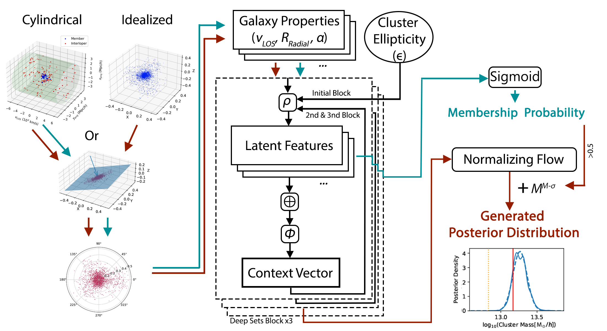
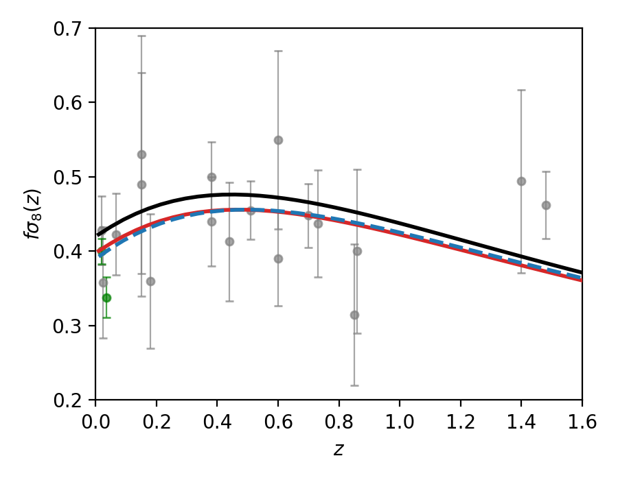
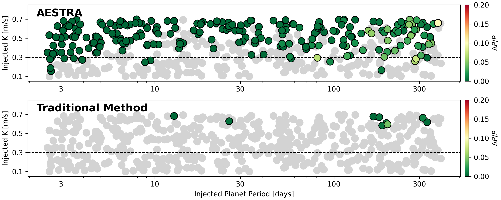

# arXiv Digest — 2026-06-12

- **Interest file used:** interests/2026.05.md (fallback — no 2026.06.md exists yet)
- **Categories pulled:** astro-ph.CO, astro-ph.EP, astro-ph.GA, astro-ph.HE, astro-ph.IM, astro-ph.SR, cs.LG, stat.ML, hep-ph
- **Papers scanned:** 347 (87 astro-ph new/cross + 260 cs.LG/stat.ML/hep-ph; 336 unique after de-duplicating cross-lists)
- **After first filter:** 20 candidates reviewed with full text
- **Final selected:** 16 papers across 4 tiers

---

## Tier 1 — Highly relevant

### [Cluster Mass Inference from Galaxy Kinematics](https://arxiv.org/abs/2606.12938)

Bonny Y. Wang, Leander Thiele, Matthew Ho (M. Ho, interest-file high-value ML-for-cosmology author)
**Primary category:** astro-ph.CO

A simulation-based inference pipeline infers galaxy-cluster masses from full projected phase-space (line-of-sight velocity, projected radius, angular position) of member and interloper galaxies, combining a permutation-invariant Deep Sets encoder with neural posterior estimation via normalizing flows. The network is trained to predict residual corrections to the classical $M$–$\sigma$ relation on Uchuu-UniverseMachine mocks, isolating information beyond velocity dispersion. In the idealized (interloper-free) case scatter drops to $\sim0.1$ dex — a twofold improvement over $M$–$\sigma$ — and robustness holds at the high-mass end under realistic cylindrical (interloper-contaminated) projections, with the model claimed to saturate the kinematic information content.

---

### [Machine Learning Does It and Does It Better: Unearthing Primordial Dark-Matter Velocities from the Matter Power Spectrum](https://arxiv.org/abs/2606.13527)

Keith R. Dienes, Jessica N. Howard, Fei Huang et al.
**Primary category:** astro-ph.CO

The primordial dark-matter phase-space (velocity) distribution leaves imprints in the matter power spectrum; an earlier heuristic analytic formula recovered most of its features even for non-thermal or multi-modal distributions. Here a one-dimensional convolutional neural network is trained to invert the power spectrum to the phase-space distribution, outperforming the analytic reconstruction in accuracy and extending validity to a broader range of input spectra (including bimodal and complex cases). The comparison plots show the CNN tracking "true" distributions where the analytic envelope-fit breaks down.

---

### [Complex yet Hermitian: Gaussian covariance of cross-correlation and multi-tracer power spectra](https://arxiv.org/abs/2606.12551)

Federico Montano, Stefano Camera, Emiliano Sefusatti et al.
**Primary category:** astro-ph.CO

This paper generalizes the analytic Gaussian covariance of multi-tracer power-spectrum measurements to a unified expression covering both real (even-parity) and complex (even- and odd-parity) spectra, starting from a generic weighted estimator. The formalism is specialized to Legendre multipoles and the 2D power spectrum, recovering known limits, and is validated against Gaussian Monte Carlo simulations including the Hermitian structure of the covariance's imaginary part. The motivation is explicitly the multi-tracer (cosmic-variance-mitigating) and parity-odd (relativistic projection) analyses that DESI-era surveys are pushing toward.

---

## Tier 2 — Adjacent / useful context

### [Dark Matter with a Drag at Low Redshift](https://arxiv.org/abs/2606.12521)

Martin Schmaltz, Eashwar N. Sivarajan
**Primary category:** astro-ph.CO

Motivated by hints that the linear growth rate at $z\lesssim1$ ($f\sigma_8$, weak lensing) sits below $\Lambda$CDM, the authors build interacting Decaying Cold Dark Matter (iDCDM): dark matter drags against dark radiation that is itself produced at late times by DM decay, so the interaction grows (rather than fades) with expansion. The model adds two parameters, leaves the background, BBN, and primary CMB intact, and predicts a distinctive step-shaped suppression of the linear growth rate $f(k,z)$. Current data show a modest preference over $\Lambda$CDM ($\Delta\chi^2$ between $-2.7$ and $-7.6$), driven by $f\sigma_8$ and peculiar-velocity surveys.

---

### [Galaxy formation in modified gravity — II. galaxy halo connection and assembly bias](https://arxiv.org/abs/2606.12565)

Michael Collier, Sownak Bose, Baojiu Li
**Primary category:** astro-ph.CO | also: astro-ph.GA

Using mock ELG and LRG catalogues built from state-of-the-art $f(R)$ modified-gravity hydrodynamical simulations matched to Stage-IV (DESI/Euclid) specs, the authors quantify how chameleon screening complicates the galaxy–halo connection and assembly bias. A mass-only HOD underestimates $\Lambda$CDM clustering by 10–20% at $z\lesssim1$ when assembly bias is neglected, and modified gravity adds further complexity — but augmenting the HOD with an environment-density secondary variable suppresses the assembly-bias effect to 2–3% across all models at $z\lesssim0.5$.

---

### [A local Universe catalogue of structures and voids dynamically identified using Cosmic-Flows4++ZOA peculiar velocities](https://arxiv.org/abs/2606.13538)

A. M. Hollinger, H. M. Courtois
**Primary category:** astro-ph.CO

Applying the dynamically motivated V-web algorithm to the updated CosmicFlows-4++ Zone-of-Avoidance peculiar-velocity reconstruction (to $z=0.1$), the authors produce a catalogue of 37 voids and 42 knot regions, with robustness assessed across an ensemble of Hamiltonian Monte Carlo realizations. Voids span effective radii 13–38 $h^{-1}$Mpc and knots span volumes $10^4$–$3.3\times10^5\,h^{-3}\mathrm{Mpc}^3$, all trimmed to the reliably reconstructed survey volume.

---

### [3DSTokesFlow: simulation-based inference for 3D Stokes profiles using flow matching](https://arxiv.org/abs/2606.13004)

A. Asensio Ramos, K. E. Yang, M. J. Martinez Gonzalez et al.
**Primary category:** astro-ph.SR | also: astro-ph.IM

Spectropolarimetric (Stokes-profile) inversion of the solar atmosphere is ill-posed and degenerate; this work replaces pixel-by-pixel inversion with a conditional flow-matching generative model that ingests multi-scale spatial features over a 2D field of view and samples the joint posterior of height-dependent atmospheric parameters, exploiting inter-pixel correlations. Trained on realistic 3D MHD simulations, it recovers the true stratification with calibrated posteriors and, applied to Hinode/SP data, yields physically sensible localized currents and emerging magnetic loops.

---

### [Artifact-Conditioned Interval Diagnostics for Flow-Matching Neural Posterior Estimation in a Controlled Gravitational-Wave Benchmark](https://arxiv.org/abs/2606.12496)

Zhi Luo, Qi-Qin Jing
**Primary category:** astro-ph.IM

This paper stress-tests the calibration of flow-matching neural posterior estimators when the data contain quality artifacts (synthetic glitches, frequency masks, PSD mismatch) in a controlled binary-black-hole benchmark. It compares raw credible intervals against global, oracle-stratified, hard-label, and soft learned artifact-aware rescaling (LAIR), finding that a single global scale transfers poorly to frequency-mask cases (MA90CE = 0.12) while soft LAIR roughly halves the error — but is not uniformly better than raw intervals. The conclusion: marginal coverage must be read jointly with posterior width, geometry, and likelihood-based diagnostics, not trusted alone.

---

### [AESTRA II: Generative Spectral Modeling of the Sun as a Star for Precise Radial Velocities](https://arxiv.org/abs/2606.13574)

Yan Liang, Joshua N. Winn, Peter Melchior et al.
**Primary category:** astro-ph.EP | also: astro-ph.IM, astro-ph.SR

AESTRA is a generative spectrum-modeling framework that empirically decomposes spectra into stellar line-shape variability, micro-telluric absorption, and continuum variability without external atmospheric or stellar templates, then learns a low-dimensional representation to separate activity-driven apparent RVs from genuine Doppler signals. Applied to NEID Sun-as-a-star data with 500 single-planet injection–recovery tests calibrated to zero spurious detections, it recovers 238 of 500 injected planets (including 13 with $K<0.3\,\mathrm{m\,s^{-1}}$), versus 9 (none below $K=0.5\,\mathrm{m\,s^{-1}}$) for traditional CCF activity-indicator detrending.

---

### [Reliability of Probabilistic Emulation of Physical Systems](https://arxiv.org/abs/2606.12997)

Sam F. Greenbury, Radka Jersakova, Paolo Conti et al.
**Primary category:** cs.LG | also: stat.ML

A systematic comparison, under matched model size and compute, of two probabilistic-emulation paradigms for 2D spatiotemporal physical systems: generative models (diffusion / flow matching) versus deterministic ensembles trained with the continuous ranked probability score (CRPS). Evaluating empirical coverage of predictive intervals, the authors find CRPS-trained ensembles generally give more reliable uncertainties and much faster inference than latent-space generative models; ambient-space generative models match the ensembles' coverage but at large inference cost. They release the AutoCast/AutoSim frameworks.

---

### [SIDM and CDM interpretations of the million-solar-mass lensing perturber JVAS B1938+666-$\mathcal{V}$](https://arxiv.org/abs/2606.12909)

Xingyu Zhang, Hai-Bo Yu
**Primary category:** astro-ph.GA | also: hep-ph

A recently inferred $10^6\,M_\odot$ strong-lensing perturber has an unusually dense inner region within an extended envelope, far exceeding CDM expectations. Gravothermal fluid simulations show that deep core-collapse in self-interacting dark matter (SIDM) naturally produces such a secondary dense central core inside an extended profile, closely matching the inferred structure. A CDM explanation is possible only with an intermediate-mass black hole plus five orders of magnitude of tidal mass loss — a contrived scenario whose cosmological realizability is left open.

---

### [Chemical signatures from the first stars embedded in metal-poor gas in galaxies at cosmic dawn](https://arxiv.org/abs/2606.13078)

Clara L. Pollock, Kasper E. Heintz, Elka Rusta et al.
**Primary category:** astro-ph.GA

Using JWST-SPURS medium-resolution NIR spectroscopy of three UV-bright galaxies at $z=7.8$, $8.6$, and $9.3$ (520–650 Myr after the Big Bang), the authors detect metal lines in absorption that trace extremely metal-poor gas — substantially lower metallicity than the emission lines tracing the central star-forming regions. All three show super-solar [C/O], a pattern also seen in a stacked spectrum of similar-redshift galaxies, interpreted as the chemical fingerprint of the first Population III supernovae.

---

### [Geometric obstruction to resolving the Hubble tension: orthogonality of scale and shape in distance measurements](https://arxiv.org/abs/2606.12822)

Zhihuan Zhou, Zhuang Miao, Sheng Bi et al.
**Primary category:** astro-ph.CO

The authors identify a geometric obstruction to the popular "lower the sound horizon early + smooth dark energy late" strategy: within $\Lambda$CDM the BAO–SN matter-density gap $\Delta\Omega_m=0.037$ is exactly invariant under sound-horizon rescaling, and reconciling BAO with SN would require anti-aligned $w(z)$ deformations (phantom for BAO, quintessence for SN; $\cos\theta=-0.97$). A full MCMC of DESI DR2 BAO + Planck + Pantheon+ confirms the best-fit $0.8\%$ $r_s$ reduction yields $H_0=70.3\pm0.3$, still $3.2\sigma$ below SH0ES — the residual deficit lives in the absolute distance scale that $w(z)$ reshapes but cannot rescale.

---

## Tier 3 — Outside my area but notable

### [Black Hole Polarimetry III: Universal Polarization of Synchrotron Radiation at the Horizon](https://arxiv.org/abs/2606.12518)

Andrew Chael, Alexandru Lupsasca, George N. Wong et al.
**Primary category:** astro-ph.HE | also: gr-qc

For synchrotron emission from the base of horizon-threading field lines in a degenerate Kerr magnetosphere, the authors show the observed linear-polarization pattern is universal — completely fixed by black-hole spin and observer inclination, and independent of the magnetic-field geometry — and derive a simple closed-form analytic formula for it. The predicted pattern is approached in time-averaged GRMHD images, and future microarcsecond VLBI of M87* could detect the trend toward this horizon value, offering a new spin measurement and direct evidence that field lines thread the horizon and extract spin energy via Blandford–Znajek.

*Figure removed (figure-file cleanup): threepanel_a0.94_i0.35.pdf*

---

### [Search for High-Frequency Gravitational Waves via Geomagnetic Conversion with Radio Telescopes](https://arxiv.org/abs/2606.13642)

Hongliang Tian, Lei Wu, Xiaolong Yang et al.
**Primary category:** gr-qc | also: astro-ph.IM, hep-ph

The first search for high-frequency gravitational waves (above 10 kHz) via their inverse-Gertsenshtein conversion to radio photons in Earth's magnetic field, repurposing VLA and ALMA data. No significant signal is found, setting new characteristic-strain upper limits across 1 GHz–1 THz, with the most stringent reaching $h_c\lesssim10^{-18}$ — up to three orders of magnitude better than existing bounds, and a path toward SKA-era searches.

---

## Tier 4 — Meta-research about the field

### [What I Wish I had Known When I Began Building Astronomical Instruments](https://arxiv.org/abs/2606.12653)

Daniel Fabricant
**Primary category:** astro-ph.IM

A single-author reflection distilling lessons from a long career building major and minor astronomical instruments, aimed at colleagues entering the field. The premise is that the "obvious" approaches to instrument projects are in fact learned slowly — by watching others, receiving advice, and making mistakes — and the paper tries to help newcomers avoid repeating them.
