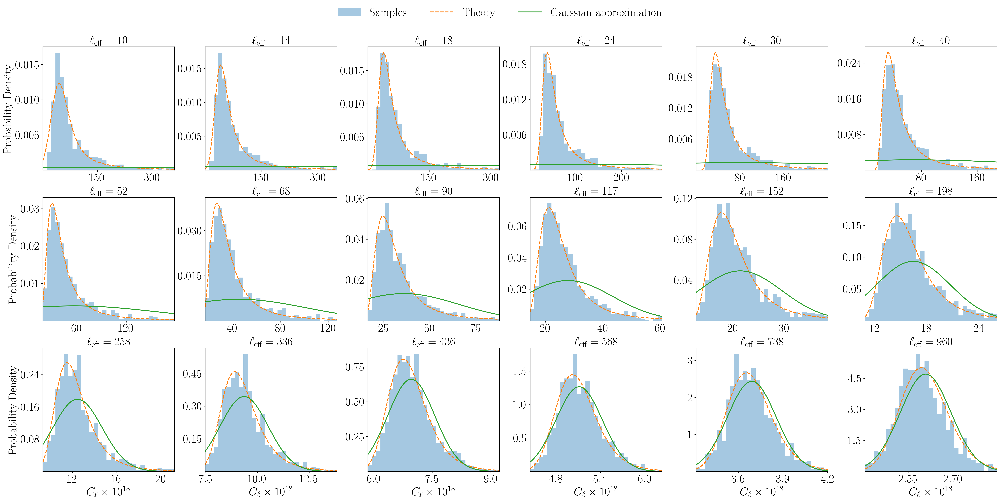

# arXiv Digest — 2026-06-15

- **Interest file used:** interests/2026.05.md (fallback — no 2026.06.md exists yet)
- **Categories pulled:** astro-ph.CO, astro-ph.EP, astro-ph.GA, astro-ph.HE, astro-ph.IM, astro-ph.SR, cs.LG, stat.ML, hep-ph
- **Papers scanned:** 270 (64 astro-ph new/cross + 206 cs.LG/stat.ML/hep-ph and other cross-listed)
- **After first filter:** 15 candidates reviewed with full text
- **Final selected:** 11 papers across 4 tiers

---

## Tier 1 — Highly relevant

### [The baryonic Tully-Fisher relation as an independent direct probe of cosmology and of the nature of dark matter](http://arxiv.org/abs/2606.13936v1)

Francesco Sinigaglia (acknowledges discussions with M. Viel and the DREAMS team)
**Primary category:** astro-ph.CO

This paper shows for the first time that the baryonic Tully-Fisher relation (BTFR) — usually treated as a galaxy scaling law or distance indicator — is simultaneously sensitive to $\Omega_m$, $\sigma_8$, the warm dark matter particle mass $M_{\rm wdm}$, and supernova/AGN feedback amplitudes. The author applies simulation-based inference (neural posterior estimation with Masked Autoregressive normalizing flows, via the `sbi`/`LtU-ILI` stack) to the BTFR extracted from 1,024 DREAMS cosmological hydro simulations across $z=0$–1.05. $\Omega_m$ and $\sigma_8$ are recovered with sub-percent accuracy and $\sim$2.6%/3.9% median precision, $M_{\rm wdm}$ to $\sim$30–35%, and an interesting $\sigma_8$–$M_{\rm wdm}$ anti-correlation emerges (warmer DM suppresses low-mass haloes, requiring higher $\sigma_8$ to restore them). It is framed as a low-redshift probe for the SKA, explicitly complementary to Lyman-$\alpha$ forest WDM constraints.

---

### [Impact of non-Gaussian likelihood on cosmological constraints from the thermal Sunyaev--Zel'dovich power spectrum: a simulation-based inference analysis](http://arxiv.org/abs/2606.14622v1)

Licong Xu, Íñigo Zubeldia, James Alvey et al.
**Primary category:** astro-ph.CO | also: astro-ph.IM

The tSZ power spectrum has a strongly non-Gaussian sampling distribution at low multipoles because rare, massive, low-redshift clusters dominate the signal, so the standard Gaussian-likelihood assumption is suspect. The authors build a halo-based forward model that paints Compton-$y$ maps and train both neural posterior and neural likelihood estimators (MAF-based) to perform the first SBI analysis of the tSZ power spectrum. Their headline result is reassuring: for a *Planck*-like survey the Gaussian likelihood yields unbiased cosmological constraints, with only a mild broadening of foreground-amplitude posteriors and a $\sim$0.5$\sigma$ shift in the infrared Poisson amplitude that they trace (via ablation studies) to genuine likelihood non-Gaussianity rather than inference systematics. They caution that the conclusion need not hold for higher-resolution, smaller-sky ACT/SPT analyses, where SBI's ability to absorb pressure-profile and small-scale modeling uncertainty becomes a real advantage.

---

### [From THESAN-ZOOM to JWST: Predicting ionizing photon escape and the rise of UV-bright reionization sources](http://arxiv.org/abs/2606.14671v1)

Zebedee Summerfield, William McClymont, Sandro Tacchella et al.
**Primary category:** astro-ph.GA

Using >35,000 galaxy realizations from the THESAN-ZOOM radiation-hydrodynamic simulations ($3<z<16$), the authors train random-forest regressors to predict the LyC escape fraction $f_{\rm esc}$ and the escaping ionizing photon rate $\dot{N}_{\rm ion,esc}$ from galaxy observables. They find $f_{\rm esc}$ is governed by bursty star formation (the $\mathrm{SFR}_{10}/\mathrm{SFR}_{100}$ ratio and gas-to-stellar-mass ratio are the top predictors), while $\dot{N}_{\rm ion,esc}$ is dominated by $M_{\rm UV}$. Combining a JWST-applicable model with observed UV luminosity functions, they reconstruct reionization histories that complete at $z\simeq5.5$–5.6, consistent with observations and crucially *avoiding* the recently reported "ionizing photon budget crisis," with the bulk of reionization driven rapidly after $z\sim8$ by UV-bright galaxies.

---

## Tier 2 — Adjacent / useful context

### [Impact of 21-cm foreground mitigation strategies on reionization power spectrum constraints](http://arxiv.org/abs/2606.14682v1)

Sambit K. Giri, Florent Mertens
**Primary category:** astro-ph.CO | also: astro-ph.GA

This letter quantifies how the two dominant 21-cm foreground strategies — foreground avoidance (restrict to the EoR window) versus foreground removal (Gaussian-process regression to reclaim contaminated modes) — bias astrophysical parameters inferred from the reionization power spectrum. Both introduce systematic biases up to $\sim$1$\sigma$, most severely in the minimum star-forming halo mass and escape fraction, while the global neutral fraction $x_{\rm HI}$ is recovered within the 95% CI except at the latest reionization epoch. They show multi-redshift inference is vulnerable to poorly-mitigated bins and recommend identifying them via cross-correlations and incorporating foreground models into the inference forward model.

---

### [Constraints on Stable Scalar-Tensor Dark Energy from DESI Data and Solar System Tests](http://arxiv.org/abs/2606.14014v1)

Husam Adam, Mark P. Hertzberg, Daniel Jiménez-Aguilar
**Primary category:** astro-ph.CO | also: hep-ph

The authors test quintessence/scalar-tensor dark-energy models with a quartic polynomial non-minimal coupling to gravity (designed to keep the field stabilized in the early universe) plus a linear potential. They systematically scan the coupling and potential-slope parameter space and confront the predicted dark-energy equation of state against the latest DESI constraints together with local gravity tests (solar-system bounds and limits on a time-varying Newton's constant). The viable region satisfying both cosmological and local constraints is found to be very narrow.

---

### [The host halo masses of AGNs and quasars at $z \sim 3-7$ with TNG-Cluster, FLAMINGO and other cosmological galaxy simulations](http://arxiv.org/abs/2606.13784v1)

Akanksha Kapahtia, Annalisa Pillepich, Joey Braspenning et al.
**Primary category:** astro-ph.GA | also: astro-ph.CO

Using gigaparsec-scale hydrodynamical simulations (TNG300, TNG-Cluster, FLAMINGO, plus smaller suites), the authors quantify the AGN-luminosity–host-halo-mass relation before Cosmic Noon. They find the median relation is highly non-linear with large scatter, flattening or turning over above $M_{200c}\gtrsim10^{12}\,M_\odot$ at $z<5$–6, so luminous quasars typically reside in $10^{12\text{–}12.5}\,M_\odot$ haloes — broadly matching clustering-based observational estimates. Critically, scatter in AGN luminosity at fixed halo mass is far larger (up to 3 dex) than scatter in halo mass at fixed luminosity, implying weak coupling between halo growth and instantaneous accretion.

---

### [Turbulence in the multi-phase circumgalactic medium: bridging TNG50 and idealized kpc-scale simulations](http://arxiv.org/abs/2606.13777v1)

Jonas Biba, Dylan Nelson
**Primary category:** astro-ph.GA

The authors characterize CGM turbulence in Milky-Way-like haloes from the TNG50 cosmological simulation using a multi-scale filtering technique, finding predominantly subsonic flows (Mach $\sim$0.1–0.7) roughly balanced between compressive and solenoidal modes. They then use these physically motivated parameters to set up idealized $\sim$1 kpc$^3$ turbulent-box AREPO simulations (with a new smoothly time-varying driving algorithm and metal-line cooling) reaching resolutions beyond cosmological volumes. With these they study how turbulence seeds density fluctuations that trigger thermal instability and govern the abundance of cold $\sim$10$^4$ K gas depending on the cooling-to-mixing timescale ratio.

---

### [Conformal calibration and look-elsewhere effect in anomaly detection for new-physics searches](http://arxiv.org/abs/2606.13780v1)

Jack Y. Araz, Michael Spannowsky
**Primary category:** hep-ph | also: cs.LG, stat.ML

This paper builds a conformal-prediction calibration layer that converts any machine-learned anomaly score into a statistically defensible significance with distribution-free, finite-sample guarantees, including weighted/Mondrian variants to repair sideband-to-signal-region exchangeability failures and a Gross-Vitells step for a look-elsewhere-aware global significance. On LHC Olympics data it shows that an uncalibrated pipeline can manufacture a spurious $\sim$46$\sigma$ excess purely from background sculpting, which the conformal correction removes, restoring an honest null; a blind bump-hunt similarly fabricates $\gtrsim$10$\sigma$ false excesses that the layer suppresses.

---

### [Machine-learned particle flow as a foundation model for collider physics](http://arxiv.org/abs/2606.14373v1)

Farouk Mokhtar, Joosep Pata, Michael Kagan et al.
**Primary category:** hep-ex | also: cs.LG, hep-ph

The authors repurpose a model trained for particle-flow reconstruction (MLPF) as a foundation model: by appending its per-particle learned latent representations as extra features, they substantially improve three downstream analysis tasks (jet flavor ID, jet energy regression, missing-momentum regression) over kinematic-only baselines. A single linear layer on the latent representations matches state-of-the-art architectures and, for missing-momentum regression, beats the baseline with $\sim$35× fewer parameters. The result argues that representations learned during reconstruction encode the physics needed downstream, establishing a reconstruction-as-foundation-model paradigm toward an end-to-end detector-to-analysis pipeline.

---

## Tier 3 — Outside my area but notable

### [Transitions in the Mass-ratio and Spin Properties of Binary Black Holes in GWTC-5](http://arxiv.org/abs/2606.14472v1)

Elizabeth Flanagan, Fabio Antonini, Thomas Callister et al.
**Primary category:** astro-ph.HE

Applying hierarchical Bayesian inference with flexible Gaussian-process population models to the latest gravitational-wave catalog GWTC-5, the authors identify four distinct primary-mass regions separated by sharp transitions in both mass-ratio and effective-spin distributions. Below $\sim$15 $M_\odot$ the population favors equal-mass binaries with narrow positive $\chi_{\rm eff}$; from 18–30 $M_\odot$ the mass-ratio distribution flattens and $\chi_{\rm eff}$ broadens and centers on zero; near $\simeq$35 $M_\odot$ it returns to narrow and symmetric; and above $\simeq$45 $M_\odot$ both distributions broaden into the range expected for hierarchical mergers of previous BH remnants. The close correspondence between the mass-ratio and spin transitions suggests different primary-mass ranges trace distinct formation channels, from isolated binary/triple evolution at low mass to dynamical assembly at high mass.

---

## Tier 4 — Meta-research about the field

### [AI can help scientists publish less](http://arxiv.org/abs/2606.13829v1)

Gianfranco Bertone
**Primary category:** physics.soc-ph | also: astro-ph.IM

This short perspective argues that, beyond defending science from a flood of AI-assisted papers, AI offers an opportunity to correct distortions in the publication system — helping scientists publish fewer and better papers and reclaim time for their best work. It reframes the "AI and the literature" debate from a defensive posture toward an active reform of incentives and publication patterns.
