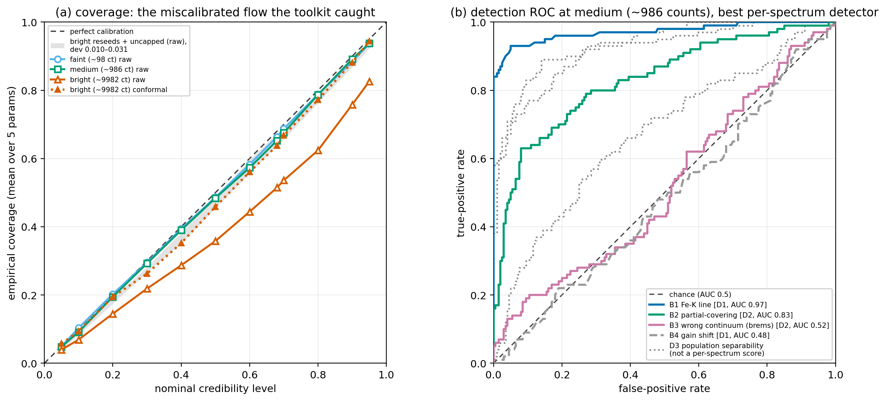

# arXiv Digest — 2026-06-17

**Interest file used:** interests/2026.05.md (fallback — no 2026.06.md exists yet)
**Categories pulled:** astro-ph.CO, astro-ph.EP, astro-ph.GA, astro-ph.HE, astro-ph.IM, astro-ph.SR, cs.LG, stat.ML, hep-ph
**Papers scanned:** 286 (89 astro-ph new/cross + 197 cs.LG/stat.ML/hep-ph and cross-lists)
**After first filter:** 12 candidates reviewed with full text
**Final selected:** 12 papers across 4 tiers

*Note: No interest file exists for 2026.06 yet, so this run used the most recent prior file, interests/2026.05.md.*

---

## Tier 1 — Highly relevant

### [Tracing Ultra Light Axions in Post-reionization, Lyman-α and CMB Missions](http://arxiv.org/abs/2606.17176v1)

Debarun Paul, Sourav Pal, Amit Dutta Banik et al.
**Primary category:** astro-ph.CO | also: hep-ph

The authors forecast how well ultra-light axion (ULA) dark matter can be constrained by combining the post-reionization Lyman-α forest (DESI-like) with 21-cm intensity mapping (SKA1-MID and PUMA), exploiting the scale-dependent suppression ULAs imprint on the matter power spectrum via their quantum pressure. Using a Fisher analysis of the Lyα auto-spectrum, the 21-cm auto-spectrum, and their cross-spectrum across $10^{-30}\,\mathrm{eV}\le m_a\le10^{-20}\,\mathrm{eV}$, they find peak sensitivity to the ULA fraction near $m_a\sim10^{-25}$ eV, where the cross-correlation helps suppress instrument-specific systematics. A joint DESI-like + PUMA + CMB-S4-like analysis projects an error on the ULA fraction of $\mathcal{O}(10^{-4})$ for $m_a\lesssim10^{-28}$ eV — orders of magnitude better than standalone LSS or CMB. The cross-spectrum approach is the headline methodological gain.

This is a direct multi-hit on the profile: the Lyman-α forest as a cosmological probe, small-scale dark matter via the forest, DESI, and the Lyα × 21-cm cross-correlation flagged as an emerging topic — essentially the "forest × DESI × dark matter × inference" convergence in one forecast.

---

### [Field-level vs summaries: convergence of information in non-Gaussian density fields](http://arxiv.org/abs/2606.18227v1)

Ivana Nikolac, Fabian Schmidt, Beatriz Tucci (Schmidt: a leading voice in EFT-based field-level/forward-modelling inference, central to the profile's ML-for-cosmology branch)
**Primary category:** astro-ph.CO

In a deliberately minimal forward model — a linear density field with a single local quadratic coupling $\lambda$ plus Gaussian noise — the authors quantify exactly where field-level inference (FLI) beats summary statistics. They compare FLI (MCMC over initial conditions, bias, and noise) against the power spectrum + bispectrum (P+B) and a family of composite-operator correlators, with summary posteriors obtained via simulation-based inference (SBI/NPE) and Fisher estimates. In the Gaussian limit all three agree, as perturbation theory predicts; as $\lambda$ grows, summary-based uncertainties inflate faster than FLI's, and the information loss is only largely (not fully) recovered by adding operator correlators up to the 6-point function. The loss is more pronounced at lower noise, where even 6-point information falls short of the field.

This sits squarely in the profile's rising-primary methods focus (field-level inference, SBI, sufficiency/complementarity of summary statistics) and gives a controlled, analytically tractable account of the FLI-vs-summaries trade-off directly relevant to forest and LSS inference.

---

### [Constraints on the Sum of Neutrino Masses from ACT DR6 and DESI DR2 Considering Isocurvature Initial Conditions](http://arxiv.org/abs/2606.17994v1)

Hongsheng Hou, Sai Wang, Zhi-Chao Zhao et al.
**Primary category:** astro-ph.CO | also: gr-qc, hep-ph

The authors test the robustness of cosmological neutrino-mass bounds when the standard purely-adiabatic assumption is relaxed by allowing a neutrino density isocurvature (NDI) mode, using CMB-SPA (Planck 2018 + ACT DR6 + SPT-3G), DESI DR2 BAO, and DES Y5 supernovae. The 95% upper limit on $\sum m_\nu$ weakens only marginally with NDI (from $<0.052$ to $<0.057$ eV in $\Lambda$CDM; $<0.111$ to $<0.115$ eV in CPL), and the isocurvature amplitude is consistent with zero. Crucially, they show the tight adiabatic $\Lambda$CDM bound lies below the normal-hierarchy minimum (0.0588 eV), i.e. it is an artifact of a prior extending to zero; a hierarchy-informed prior raises it to $<0.092$ eV. The bounds are robust to isocurvature but highly sensitive to the dark-energy equation of state and the lower prior bound.

Directly relevant to fundamental-physics constraints via DESI-era LSS — neutrino mass from cosmology and DESI DR2 BAO are both explicit profile interests, and the prior-dependence point is exactly the kind of systematic caveat that affects interpretation of these limits.

*No figures extracted for 2606.17994 (key results are the quoted $\sum m_\nu$ limits; the posterior triangles add little beyond the numbers).*

---

## Tier 2 — Adjacent / useful context

### [The Incidence of Large Ionized Bubbles at Redshift 13](http://arxiv.org/abs/2606.17571v1)

Peter Ziwei Hu, Massimo Stiavelli, Colin Norman
**Primary category:** astro-ph.GA | also: astro-ph.CO

Motivated by the JWST Lyα emitter reported by Witstok et al. (2025) deep in the neutral era, the authors model how often galaxy populations at $z\approx13$ produce large ionized environments. Using JWST UV luminosity functions and treating bubbles as independent spheres, they compute the sky surface density of regions with comoving radius $R\ge2.5$ cMpc, finding $\Sigma_{\ge2.5}\simeq1.33\times10^{-2}\,\mathrm{arcmin}^{-2}$ per $\Delta z=1$ for fiducial escape and ionizing-efficiency assumptions. They conclude Witstok-sized bubbles are plausible in UVLF-calibrated galaxy-driven models, though the specific source may still need unusual ionizing efficiency or burstiness.

Reionization and IGM topology are a primary focus in the profile; this is the early-bubble/Lyα-visibility end of that story rather than the late-reionization opacity work, but it connects ionizing-photon escape, IGM topology, and 21-cm structure in a way that bears on how the forest's high-z boundary is set.

*No figures extracted for 2606.17571 (the result is a population-level incidence number; the ionization-slice maps are illustrative rather than central).*

---

### [What an Amortized X-ray Posterior Cannot See: Gain Shifts, Silent Miscalibration, and Where Nested Sampling Still Earns Its Cost](http://arxiv.org/abs/2606.17098v1)

Karan Akbari
**Primary category:** astro-ph.HE | also: astro-ph.IM

This is the first systematic benchmark of SBI trust diagnostics on real X-ray spectral fitting: a 5-parameter absorbed continuum on an actual XMM-Newton EPIC-pn response across three count regimes, four misspecification families, with nested sampling on the exact Poisson likelihood as ground truth. A posterior-predictive check reliably catches an unmodeled 6.4 keV line (ROC AUC 0.97 above ~1000 counts), but a 3% detector gain shift stays at chance for all per-spectrum scores while biasing the continuum — only nested sampling's evidence flags it ($\Delta\log Z\sim-7.8$). Separately, a flow that passed every recovery check was still miscalibrated (coverage deviation 0.113), traced to single-flow undertraining and repaired by split-conformal recalibration (to 0.026).

A methods-transfer read for the profile's SBI/amortized-inference interest (and a direct echo of the library's "Trust Crisis in SBI"): recovery metrics do not certify calibration, some misspecifications are invisible to amortized posteriors, and an evidence-based check still earns its cost — lessons that carry straight over to forest/LSS inference.

---

### [Nested Sampling: A Critical and Comprehensive Theoretical Guide](http://arxiv.org/abs/2606.17916v1)

Luca Martino, Fernando Llorente
**Primary category:** stat.CO | also: astro-ph.CO, astro-ph.IM, stat.ML

A thorough theoretical treatment of nested sampling — the algorithm behind tools like MultiNest and dynesty — covering its derivation as an evidence estimator, the statistics of the shrinkage process, error sources, stopping criteria, and the practical differences between static and dynamic variants. The authors situate nested sampling among competing evidence-estimation and sampling schemes and clarify common misconceptions about its convergence and uncertainty quantification.

The profile's ML/inference toolkit explicitly includes dynesty and Bayesian evidence computation; this is a reference-grade guide for anyone running nested sampling for cosmological model comparison (e.g. the dark-energy and neutrino-mass analyses elsewhere in this digest).

*No figures extracted for 2606.17916 (pedagogical review; figures are schematic illustrations of the algorithm).*

---

### [Joint reconstruction of $H(z)$ and $f\sigma_8(z)$ with physics informed neural networks](http://arxiv.org/abs/2606.17614v1)

Konstantinos F. Dialektopoulos
**Primary category:** astro-ph.CO | also: gr-qc

A proof-of-concept that reconstructs the expansion history $H(z)$ and the growth rate $f\sigma_8(z)$ jointly with a physics-informed neural network, coupling them through the GR linear growth equation as an extra training loss (evaluated at collocation points via automatic differentiation) rather than fitting separately and checking consistency afterward. Training an ensemble of 100 networks on 50 $H(z)$ and 63 $f\sigma_8(z)$ measurements and anchoring $H_0$ to local distance-ladder values, the reconstructed $f\sigma_8(z)$ sits systematically below the $\Lambda$CDM prediction (consistent with the $\sigma_8$ tension) and the $\mathrm{Om}(z)$ null test departs from flat $\Lambda$CDM at low redshift.

A concrete instance of the profile's ML-for-cosmology methods branch — physics-constrained neural reconstruction of LSS observables, with a borrowable trick (encoding a known dynamical equation as a differentiable loss) for data-driven inference on expansion and growth.

*No figures extracted for 2606.17614 (proof-of-concept reconstructions; the message is the systematic offset from $\Lambda$CDM, conveyed in text).*

---

### [Data-Driven Discovery of a Simple Phantom-Crossing Dark Energy Parametrization](http://arxiv.org/abs/2606.17951v1)

Giulia Borghetto, Ameek Malhotra, Simran Arora et al.
**Primary category:** astro-ph.CO

Within VCDM (a minimally modified gravity framework that can evolve perturbations across the phantom divide), the authors first do a Bayesian spline reconstruction of $w(a)$ from CMB+BAO+SNIa, finding a preference for smooth, low-complexity, phantom-crossing trajectories. They then apply Exhaustive Symbolic Regression to search analytic forms of fixed complexity, recovering the one-parameter expression $w(a)=w_0/\sqrt{a}$, which fits the data comparably to the two-parameter CPL form and naturally crosses the phantom divide without a future big rip. Bayesian model comparison gives mild-to-moderate support over CPL and stronger support over $\Lambda$CDM.

Connects two profile threads: symbolic regression for physics discovery (cf. AI Feynman in the library) and DESI-era dark-energy/LSS analysis, illustrating a principled "reconstruct then compress to an interpretable law" model-discovery workflow.

*No figures extracted for 2606.17951 (the contribution is the symbolic form and its Bayesian comparison, both stated in text).*

---

### [Hawai`i Supernova Flows: Bulk Flow Measurements using SNe Ia in the Optical and NIR](http://arxiv.org/abs/2606.17142v1)

Aaron Do, Kaisey S. Mandel, Benjamin J. Shappee et al.
**Primary category:** astro-ph.CO

Using redshifts and optical/NIR distances to Type Ia supernovae from the Hawai`i Supernova Flows dataset, the authors infer the bulk flow — the average peculiar velocity within a volume — at $z\lesssim0.1$. Inferred speeds range from ~100 to 400 km/s and are all consistent with $\Lambda$CDM predictions, which tie the bulk-flow variance to $H_0$, the growth rate, and the matter power spectrum. A secondary focus quantifies the systematic spread introduced by the choice of bulk-flow estimator, SN Ia distance estimator, and wavelength regime.

Adjacent LSS context: bulk flows are a peculiar-velocity probe of the same matter power spectrum and growth rate that the forest and DESI constrain, and the paper is a clean reminder of how much the result depends on estimator/methodology choices.

*No figures extracted for 2606.17142 (the headline is $\Lambda$CDM-consistency of the measured speeds; figures are estimator-comparison diagnostics).*

---

## Tier 3 — Outside my area but notable

### [Galaxy-cluster-stacked Fermi-LAT, part IV: $\sim70$ GeV WIMP annihilation lines](http://arxiv.org/abs/2606.17044v1)

Uri Keshet
**Primary category:** astro-ph.HE | also: astro-ph.CO, hep-ph

The author reports that three independent analyses — cross-correlating Fermi-LAT $\gamma$-rays with eROSITA maps, and stacking over MCXC/eROSITA/DESI cluster catalogs — show a recurring triad of emission lines near 70, 40, and 13 GeV emerging from otherwise featureless spectra once boosted to the cluster frame. These are interpreted as the $\chi\chi\to\gamma\gamma$, $\gamma Z$, $\gamma h$ channels of a ~70 GeV WIMP, with trial-corrected global significance reaching $5.6\sigma$ in cross-correlation (and a weaker $2.3\sigma$ in stacking), and high-resolution spectra are read as six lines plus a broad feature consistent with two cross-annihilating WIMPs at 67.3 and 71.4 GeV.

A genuinely extraordinary claim — a $>5\sigma$ indirect detection of WIMP dark matter would be field-defining — and worth tracking even though it is a different dark-matter probe than the forest, precisely because the bar for such claims is so high and independent scrutiny will follow.

*No figures extracted for 2606.17044 (the relevant figures are dense multi-panel .eps line-scan and mock-injection plots that do not summarize cleanly at a glance).*

---

## Tier 4 — Meta-research about the field

### [Querying an astronomical database using large language models: the ALeRCE text-to-SQL system](http://arxiv.org/abs/2606.18108v1)

P. A. Estevez, J. Espejo-Moreira, S. Sanfeliu-Alvarez et al.
**Primary category:** astro-ph.IM | also: cs.AI

The authors build an LLM-based natural-language-to-SQL system for the ALeRCE broker database (ZTF and Rubin/LSST), using in-context learning and a four-module pipeline (schema linking, query classification, prompt decomposition, self-correction). On a curated set of 110 NL/SQL pairs, the step-by-step framework beats direct inference and the self-correction module cuts execution errors; perfect-match rates fall from ~0.97 on simple queries to ~0.44-0.59 on hard ones. Among 13 models tested, the strongest were Claude Opus 4.6, Gemini 2.5 Pro/3 Flash, and GPT-5.2-Codex.

A concrete data point on how LLMs are entering everyday astronomy practice — lowering the barrier to querying survey databases — and a sober quantification of where current models still fail (complex queries), relevant as Rubin-scale data access becomes routine.

*No figures extracted for 2606.18108 (the substance is the pipeline design and per-difficulty match rates; figures are workflow schematics).*

---

### [Variability in Cosmological Hydrodynamical Simulations: how Stochastic Processes, Numerical Effects, and Reproducibility Limits impact Predictability](http://arxiv.org/abs/2606.18082v1)

Chaitra, Antonio Ragagnin, Milena Valentini et al.
**Primary category:** astro-ph.GA

Running four identical zoom-in galaxy-cluster simulations under tightly controlled compiler, library, and hardware settings, the authors quantify the irreducible run-to-run variability of cosmological hydrodynamical simulations. They find ~10-25% variations in matched-galaxy dark-matter and stellar masses, separating run-to-run variation from within-run noise with a mixed linear model, and show the scatter is amplified when black-hole physics is included but regulated (reduced) by feedback. The system is "noise-dominated yet statistically reproducible," and they propose a statistical framework for future reproducibility studies.

A methodology/reproducibility critique that matters directly to anyone training emulators or running simulation-based inference on hydro simulations: it sets a floor on how precisely simulation predictions can be trusted, which propagates into the systematic budget of any SBI/emulator pipeline built on them.

*No figures extracted for 2606.18082 (the contribution is the quantified variability budget and statistical framework, summarized numerically).*
