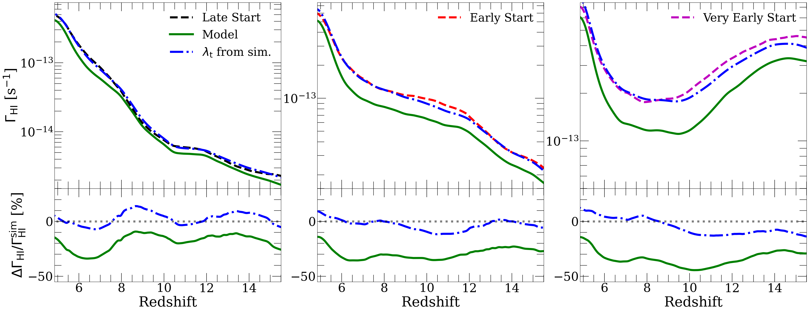

# arXiv Digest — 2026-06-19

**Interest file used:** interests/2026.05.md (fallback — no 2026.06.md exists yet)
**Categories pulled:** astro-ph.CO, astro-ph.EP, astro-ph.GA, astro-ph.HE, astro-ph.IM, astro-ph.SR, cs.LG, stat.ML, hep-ph
**Papers scanned:** 335 (104 astro-ph new/cross + 231 cs.LG/stat.ML/hep-ph)
**After first filter:** 13 candidates reviewed with full text
**Final selected:** 9 papers across 3 tiers

*Note: The combined nine-category pull tripped a 400 error on arXiv's batch metadata-by-id endpoint (the ~390-id URL is too long), so the first pass was run one category at a time and merged/deduped — all categories are fully covered. Today's announcement contained no Lyman-α forest P1D/P3D, BAO, or small-scale-DM-via-forest papers, so the digest leans toward the LSS / IGM-reionization / ML-inference faces of the profile rather than the forest spine. Tier 3 is omitted (nothing off-area cleared the bar).*

---

## Tier 1 — Highly relevant

### [A self-consistent analytical model for both the photoionization rate and reionization history](http://arxiv.org/abs/2606.19449v1)

Christopher Cain, Kevin S. Croker, Anson D'Aloisio et al.
**Primary category:** astro-ph.CO | also: astro-ph.GA

The authors derive a new analytical formalism, based on the cosmological radiative transfer equation, that for the first time predicts the ionized fraction $x_i(z)$ and the IGM-averaged hydrogen photoionization rate $\Gamma_{\rm HI}(z)$ self-consistently, taking the ionized-bubble size distribution as input. Tested against radiative transfer simulations, the model reproduces the reionization history to ~1% and $\Gamma_{\rm HI}$ to 20–30% near the end of reionization — comparable to or better than current measurement errors. They show $\Gamma_{\rm HI}$ at $5\lesssim z\lesssim6$ is highly sensitive to both the ionizing emissivity and the reionization endpoint, with 10–20% shifts in $\dot n_{\rm ion}$ mapping to changes larger than present uncertainties. The residual 20–40% $\Gamma_{\rm HI}$ disagreement is traced to spatial correlation between mean-free-path fluctuations and bubble structure, a stated assumption violation.

This is a direct hit on the IGM/reionization spine of the profile: it turns the Lyman-α forest mean-transmission constraint on $\Gamma_{\rm HI}$ into a fast, analytic likelihood ingredient suitable for the kind of many-parameter Bayesian inference the interest file emphasizes, and explicitly anticipates extensions to 21 cm and patchy-kSZ observables.

---

### [Fireworks at Cosmic Dawn: relieving BAO-CMB tensions with the Pop III.1 Flash](http://arxiv.org/abs/2606.19459v1)

Yash Aggarwal, Christopher Cain, Garett Lopez et al.
**Primary category:** astro-ph.CO | also: astro-ph.GA

A high CMB optical depth $\tau\sim0.09$ has been proposed to reconcile the sub-minimal neutrino-mass preference of combined CMB+DESI data, but it must coexist with a late ($z<6$) end to reionization from the Lyα forest and a short reionization duration from the patchy kSZ effect. Using a modified AMBER semi-numerical code, the authors show that an early "flash" ionization phase from weakly clustered supermassive Pop III.1 stars (with feedback-imposed minimum source separation) at $z\approx20$ can deliver $\tau=0.087$ while staying under the most conservative SPT-3G pkSZ limits and ending reionization at $z<6$. The feedback-driven suppression of large-scale ionization fluctuations is the key — any model with minimal high-$z$ ionization fluctuations could resolve the tension similarly. Standard Pop II-only reionization is in mild tension with the tighter ACT/free-form-template pkSZ limits.

This sits squarely at the intersection of the profile's reionization, Lyα-forest, DESI-BAO, and neutrino-mass interests — it shows how the late-reionization forest constraint and the DESI neutrino-mass tension can be jointly satisfied, exactly the kind of cross-probe argument the library is built around.

---

## Tier 2 — Adjacent / useful context

### [Increasing the sensitivity of full-shape galaxy clustering measurements in configuration-space with three-point statistics](http://arxiv.org/abs/2606.19518v1)

Zachery Brown, Lado Samushia
**Primary category:** astro-ph.CO

The authors build a compressed, line-of-sight-dependent three-point correlation function (3PCF) estimator (with a fast triangle-counting code, TriCo) and forecast its constraining power on small scales (<80 Mpc/h) for Roman-like ELG and DESI-like LRG samples using AbacusSummit mocks. With the galaxy–halo connection (HOD) marginalized over, adding the LOS-dependent 3PCF to the 2PCF monopole+quadrupole tightens $\sigma_8$ by a factor of ~5, with the LOS dependence itself worth an extra 2–3×. The gain accumulates across many triangle configurations rather than from one feature, and persists after HOD marginalization, indicating it genuinely breaks cosmology–bias degeneracies. The authors are careful that these are relative, fixed-volume forecasts, not absolute survey predictions.

Relevant as a DESI-era LSS methods paper from the profile's secondary-focus shelf: simulation-based, HOD-marginalized higher-order clustering is directly adjacent to the full-shape/BAO and emulator interests, and the TriCo + SBI-forecast machinery is the kind of tooling that transfers to forest P3D/cross-correlation analyses.

*No figures extracted for 2606.19518v1 (forecast tables and Fisher contours; the headline ×5 σ8 gain is fully conveyed in text).*

---

### [Validation of the Hybrid Bias Expansion model for the galaxy bispectrum](http://arxiv.org/abs/2606.19452v1)

Marcos Pellejero Ibáñez, Raul E. Angulo, Laila Linke et al.
**Primary category:** astro-ph.CO

This is the first systematic real-space validation of the Hybrid Bias Expansion (HEFT) — perturbative bias on top of the N-body nonlinear displacement field — at the bispectrum level, using DESI-like LRG and ELG mocks. The model stays self-consistent (scale-independent recovered bias parameters) up to $k_{\rm max}^B\simeq0.25\,h\,{\rm Mpc}^{-1}$, nearly double the $\sim0.13$ reach of standard tree-level EFT. Adding matter cross-statistics ($P_{gm}$, $B_{ggm}$) sharpens the bias parameters by breaking degeneracies, while a minimal $\delta^3$ cubic term does not extend the validity range. A strong hierarchy among bispectrum basis terms by operator order suggests emulators can prioritize the dominant sectors.

Relevant to the profile's LSS / emulation interests: the hybrid (simulation-anchored + perturbative) modeling philosophy and the operator-order-prioritized emulation strategy are the same ideas underlying forest emulators like ForestFlow, and the validity-via-bias-stability criterion is a transferable diagnostic.

*No figures extracted for 2606.19452v1 (the result is a validity-scale statement best given numerically).*

---

### [Evolving Dark Energy Is Vacuum Energy After All](http://arxiv.org/abs/2606.20036v1)

Dong Ha Lee, Carsten van de Bruck, Eleonora Di Valentino et al.
**Primary category:** astro-ph.CO | also: hep-ph

The authors develop the first cosmological implementation of a QCD-vacuum-induced dark energy (QCD-DE) model — where the dark-energy density emerges as a global response of the non-perturbative QCD vacuum to expanding spacetime, with no new fields — and confront it with Planck+ACT+SPT-3G CMB, DESI DR2 BAO, and Pantheon+/DES-Dovekie supernovae. QCD-DE fits as well as the CPL $w_0w_a$CDM parametrization and is favored by information criteria and Bayesian evidence ($\ln\mathcal{B}\simeq2.7$ for the strongest dataset combination vs. 1.0 for CPL). It naturally produces effective phantom-crossing without instabilities, and the late-time activation is tied to the QCD scale, addressing the coincidence problem.

Relevant as DESI DR2 dark-energy context: the DESI dynamical-dark-energy signal is a flagged recent addition to the library, and this is a physically-motivated alternative to CPL evaluated with the same Bayesian model-selection machinery (evidence, AIC/DIC) the profile cares about.

*No figures extracted for 2606.20036v1 (key content is model-comparison statistics in tables).*

---

### [Reimagining SED Fitting with Cosmological Galaxy Simulations and Machine Learning](http://arxiv.org/abs/2606.19447v1)

Dhruv T. Zimmerman, Desika Narayanan
**Primary category:** astro-ph.GA | also: astro-ph.IM

Phot-Gal is a simulation-based SED-modeling package that solves the inverse problem of recovering galaxy properties (stellar mass, dust mass, SFR, redshift) by training ML models on 3D radiative-transfer photometry from the CAMELS simulation suite, with a KNN imputation strategy to accept arbitrary input photometry and quoted output uncertainties. It outperforms traditional SED fitting (e.g. Prospector) on every metric on the test set and produces better-calibrated confidence intervals — except when only sparse photometry is available, where uncertainties under-grow relative to the accuracy loss. Cross-simulation tests (train on SIMBA, test on IllustrisTNG/SIMBA-C) expose generalization failures, especially for stellar mass, that the authors flag honestly.

Relevant to the profile's rising ML-for-inference focus: this is SBI/amortized inference trained on the CAMELS suite (explicitly in the library), and the candid cross-simulation generalization tests are a useful cautionary data point for anyone training emulators or SBI on one simulation suite and applying them to another.

*No figures extracted for 2606.19447v1 (results are metric comparisons and SHAP attributions; the contribution is clear from text).*

---

### [Neural network surrogates with uncertainty quantification for inverse problems in partial differential equations](http://arxiv.org/abs/2606.20417v1)

Christian Jimenez-Beltran, Aretha L. Teckentrup, Antonio Vergari et al.
**Primary category:** cs.LG

The authors introduce DeepGaLA, a neural-network surrogate for expensive PDE forward solvers that yields uncertainty-aware predictions, reducing overconfident inference when training data are limited. They propose using a short run of delayed-acceptance MCMC as a practical diagnostic for whether the surrogate-induced posterior is faithful, and show DeepGaLA matches Gaussian-process surrogate accuracy while scaling better with parameter dimension and accommodating PDE constraints. The framework targets scalable, reliable Bayesian inference for inverse problems in complex forward models.

Relevant as a borrow-able methods paper for the profile's emulator + SBI toolkit: the delayed-acceptance-MCMC check on a surrogate-induced posterior is directly applicable to validating neural emulators used in Lyα/LSS inference, where overconfident emulator posteriors are a known failure mode.

*No figures extracted for 2606.20417v1 (generic ML methods paper; benchmark plots add little beyond the text claims).*

---

### [The Hubble tension: A decade review](http://arxiv.org/abs/2606.20434v1)

Rong-Gen Cai, Shao-Jiang Wang
**Primary category:** astro-ph.CO

A comprehensive decade-scale review of the Hubble tension, organizing proposed resolutions by where they intervene: early-Universe modifications that shrink the sound horizon (altering early expansion or recombination), late-Universe changes to the supernova absolute magnitude (now strongly constrained by inverse distance ladders and the distance-duality relation), and local-Universe options (Hubble bubble / void, argued long ruled out). The authors emphasize that early-time fixes generically require simultaneous primordial and late-time modifications, and devote attention to interacting dark-energy resolutions spanning the inhomogeneity-to-homogeneity transition.

Relevant as broad precision-cosmology context: the tension framing and the constraints from inverse distance ladders bear directly on how the interest-file owner interprets DESI BAO and dark-energy results, making this a useful reference-level synthesis even though it is outside the forest focus.

*No figures extracted for 2606.20434v1 (review article; no single figure is central to its argument).*

---

## Tier 4 — Meta-research about the field

### [Physics-guided discovery of dynamical dark-energy equations of state through iterative AI reasoning](http://arxiv.org/abs/2606.19427v1)

Clecio R. Bom, Bernardo M. Fraga, Miguel A. Sabogal et al.
**Primary category:** astro-ph.CO

The authors recast phenomenological model building as an iterative AI loop: a large language model proposes dark-energy equation-of-state forms together with cosmological rationales, grounded by retrieval from the dark-energy literature, with each candidate embedded in a cosmological model, optimized against data, and scored by an independent LLM "critic" on physical motivation, novelty, stability, and validity. Applied to Pantheon+ supernovae, DESI DR2 BAO, and the full Planck 2018 likelihoods, the framework surfaces two previously unexplored parameterizations competitive with established forms, with the best AI-selected model attaining Bayesian evidence more than one unit above traditional parameterizations.

This is meta-research on how AI is changing the practice of cosmology: it is not just an ML inference tool but an attempt to automate the hypothesis-generation step of theory building itself, which is directly worth watching as a scientist whose field increasingly couples LLM/agentic methods to DESI-era data analysis.

*No figures extracted for 2606.19427v1 (the contribution is the methodology/workflow; the schematic adds little to the text description).*
