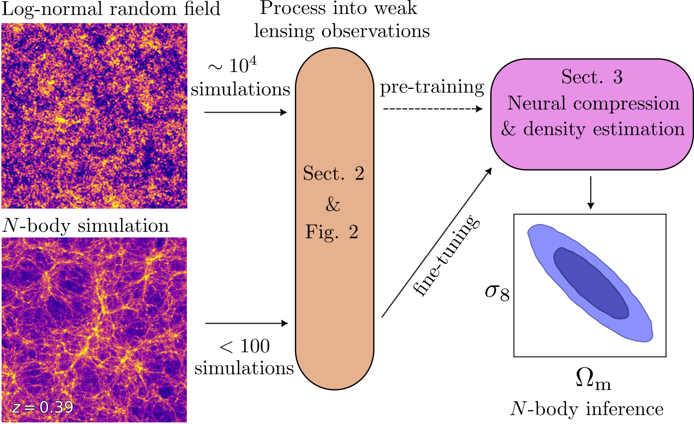

# arXiv Digest — 2026-06-23

**Interest file used:** interests/2026.05.md (fallback — no 2026.06.md exists yet)
**Categories pulled:** astro-ph.CO, astro-ph.EP, astro-ph.GA, astro-ph.HE, astro-ph.IM, astro-ph.SR, cs.LG, stat.ML, hep-ph
**Papers scanned:** 406 unique (250 astro-ph new/cross + 248 cs.LG/stat.ML/hep-ph; 498 raw before cross-category dedup)
**After first filter:** 18 candidates reviewed with full text
**Final selected:** 16 papers across 4 tiers

*Note: No 2026.06 interest file exists, so the most recent prior file (2026.05.md) was used. The fetcher's by-id step 400s when a single request carries all announced IDs, so each category was pulled separately and merged; cs.LG hit its 120-paper cap (more exist) but is filtered hard for inference/generative relevance, so the cap is not a concern. No DESI Lyman-α / IGM-opacity papers appeared today, so Tier 1 is thin — only one direct methodological hit met the bar.*

---

## Tier 1 — Highly relevant

### [Field-level weak lensing cosmology with <100 simulations using multifidelity simulation-based inference](http://arxiv.org/abs/2606.23346v1)

Alex A. Saoulis, Kiyam Lin, Niall Jeffrey et al.
**Primary category:** astro-ph.CO | also: cs.AI

The authors perform a realistic KiDS-Legacy mock analysis with field-level neural compression and simulation-based inference, and show that the usual bottleneck — needing thousands of expensive high-fidelity simulations to train the compressor and density estimator — can be largely sidestepped with multifidelity transfer learning. They pre-train on many cheap log-normal GLASS mocks and fine-tune on a small set of high-fidelity N-body (Gower Street) boxes, then track mutual information, posterior calibration error, and figure of merit as a function of the number of high-fidelity sims. Only ~60–100 high-fidelity simulations are needed to obtain informative, well-calibrated 9-parameter posteriors — an order-of-magnitude reduction in simulation cost for field-level inference.

This is a direct hit on the rising-primary "ML / statistical inference for cosmology" axis of the profile: field-level SBI, neural compression, and the very practical question of how few expensive simulations you can get away with. The multifidelity pre-train/fine-tune recipe transfers cleanly to forest/LSS inference, where high-fidelity hydro sims are the dominant cost.

---

## Tier 2 — Adjacent / useful context

### [Optimization of Tessellation-based Statistics: Void Statistics](http://arxiv.org/abs/2606.21864v1)

Yu Liu, Cheng Zhao, Yu Yu et al.
**Primary category:** astro-ph.CO | also: astro-ph.GA

Tessellation-based LSS statistics (Delaunay/Voronoi) are highly sensitive to small perturbations in tracer densities and positions, which trigger large rearrangements of the tessellation and inject substantial extra statistical error. The authors propose a simple subsampling-and-averaging scheme to stabilize the tessellation and apply it to void size function, void two-point correlation, and void power spectrum for both Delaunay- and Voronoi-defined voids. The method shows that much of the scatter in void statistics is an artifact of tessellation instability and, once removed, dramatically boosts the SNR of void BAO and the parameter-constraining power.

Void cosmology is a developed secondary probe in the profile (VIDE/ZOBOV/DIVE), and this is a clean, broadly applicable estimator-stabilization trick for galaxy-survey LSS analyses — directly relevant to extracting more from DESI/eBOSS void catalogs.

*No figures extracted for 2606.21864 (the central content is the SNR/constraint improvement, which the text conveys without a plot).*

---

### [OASIS: Observation-Aware Simulation-Based Inference via Distributional Matching](http://arxiv.org/abs/2606.22572v1)

Arya Farahi, Conghao Zhou, Ritwik Vashistha
**Primary category:** stat.ME | also: astro-ph.IM

OASIS is an SBI framework for the common scientific case where simulators emit clean latent quantities but data are observed only after measurement error, selection, and survey-specific transformations. Rather than handcrafting summaries or training neural surrogates, it embeds the observation model into the simulator and builds a pseudo-posterior by reweighting prior samples with a maximum-mean-discrepancy loss between empirical distributions of observed and forward-simulated data. The paper provides Monte Carlo consistency and posterior-concentration guarantees and demonstrates robust recovery under heteroscedastic, non-Gaussian noise, including a galaxy-cluster multiwavelength scaling-relation application.

This is a methods paper squarely in the SBI toolkit the profile tracks, with the distinctive angle of folding the observational pipeline (selection, errors-in-variables) directly into inference — a recurring pain point for forest/LSS analyses where the forward model includes complex instrumental and selection effects.

*No figures extracted for 2606.22572 (methodological framework; the controlled-experiment plots add little beyond the text).*

---

### [Raising the reionization optical depth with inflationary CMB features](http://arxiv.org/abs/2606.20795v1)

Tanisha Jhaveri, Wayne Hu, Vivian Miranda
**Primary category:** astro-ph.CO

There is a mild tension in the reionization optical depth τ: Planck's large-angle polarization caps it at τ_max ≈ 0.070, while CMB-minus-low-ℓ-polarization combined with BAO prefers τ_min ≈ 0.074. The authors show that if the long-standing low-power feature in the temperature spectrum is interpreted as a genuine inflationary feature rather than a fluctuation, marginalizing over generalized-slow-roll templates raises the allowed τ to ~0.075 (Planck) and ~0.082 (with CMB+BAO), relieving the tension. They are explicit that this does not establish the feature's significance, only its consequence for τ.

Reionization and its optical depth sit in the profile's primary IGM/reionization branch; τ is the headline integral constraint on reionization history, so how inflationary-feature assumptions shift it directly affects the priors one brings to forest-based reionization-end measurements.

*No figures extracted for 2606.20795 (a quantitative τ-shift argument well summarized numerically).*

---

### [Shape-Preserving Evolution of the Global Ultraviolet Quasar Luminosity Function to z≃7.5](http://arxiv.org/abs/2606.22415v1)

Wenjie Wang, Zunli Yuan, Yu Luo et al.
**Primary category:** astro-ph.CO

Using ~71,000 Type-1 quasars from a homogenized compilation, the authors fit the rest-UV quasar luminosity function over 0.1 ≤ z ≤ 7.5 with an unbinned likelihood, testing a "shape-preserving" luminosity-and-density-evolution (LADE) framework in which the local LF shape is held fixed and evolution is split into density and luminosity factors. Across an 81-model grid, the shape-preserving LADE models beat flexible double-power-law references on AIC/BIC, and the result is robust to the assumed local LF form. The luminosity-evolution term rises to z≈2–3 then flattens, while the density normalization declines toward high z.

The quasar UV LF sets the ionizing-photon budget from AGN and underpins UV-background and reionization-source modeling — both in the profile's IGM branch — and quasars are also the backlights for any forest survey, so their demographics out to z≈7.5 are directly useful context.

*No figures extracted for 2606.22415 (empirical model-comparison result conveyed adequately in text).*

---

### [Are Cosmological Data Excluding Sterile Neutrinos or Only the Fully Thermalized Limit?](http://arxiv.org/abs/2606.21518v1)

Artur Ladeira, Rafael C. Nunes, Eleonora Di Valentino et al.
**Primary category:** astro-ph.CO | also: hep-ph

The authors reassess light sterile-neutrino cosmology, distinguishing a fully thermalized species from temperature-suppressed and Dodelson-Widrow-like realizations, using Planck CMB, DESI DR2 BAO, and PantheonPlus/Union3 supernovae within both ΛCDM and CPL dark energy. The fully thermalized case is strongly disfavored, but partially populated scenarios remain viable: the data mainly demand a strongly suppressed effective abundance, giving tight bounds on m_eff^sterile while leaving the physical sterile mass far less constrained. The conclusion is that cosmology constrains production history and phase space, not sterile neutrinos as a class.

This touches two profile branches at once — neutrino-mass cosmology and DESI-DR2 BAO LSS — and is a useful reminder that "cosmology excludes X" claims hinge on the assumed thermal/phase-space history, the same subtlety that matters when the forest constrains warm/sterile dark matter.

*No figures extracted for 2606.21518 (constraint-table-driven result; figures are standard posterior contours).*

---

### [Dark Energy in the DESI Era: A Brief Review of Evidence, Beyond-ΛCDM Interpretations, and Tensions](http://arxiv.org/abs/2606.21826v1)

Tian-Nuo Li, Guo-Hong Du, Hao Wang et al.
**Primary category:** astro-ph.CO | also: astro-ph.GA

This invited review synthesizes the DESI-BAO-driven case for dynamical dark energy: combined with CMB and SNe Ia, the data show an apparent departure from ΛCDM with an equation of state crossing the phantom divide (quintom behavior). It stresses how strongly the preference depends on parametrization and dataset combination, and how the same effective w(z) departure can arise from physically distinct mechanisms — interacting dark energy, non-minimally coupled gravity, non-standard dark matter — each with different implications for the H0, S8, and Σm_ν tensions.

A compact, current map of where DESI's late-time-expansion results stand and how systematics versus new physics are being disentangled — useful background for anyone whose own DESI Lyman-α/BAO work feeds into these same parameter inferences.

*No figures extracted for 2606.21826 (review/perspective; no single plot is central).*

---

### [Wedge-avoidance Fisher Forecasts for Primordial Non-Gaussianity from Dark-Ages 21-cm Power Spectrum and Bispectrum](http://arxiv.org/abs/2606.23314v1)

Chen Zhang, Furen Deng, Yidong Xu et al.
**Primary category:** astro-ph.CO

The authors build a wedge-aware Fisher framework that propagates foreground-wedge mode loss directly into the variances of the cylindrical 21-cm power spectrum and reduced bispectrum, then forecast primordial-non-Gaussianity constraints for a lunar far-side interferometer in two featured-inflation models (resonant and step). Because the oscillatory features imprint on both the power spectrum and bispectrum, both observables are wedge-corrected and compared. Wedge avoidance removes a large fraction of Fourier modes and substantially weakens PNG constraints, especially at high redshift.

21-cm cosmology / cosmic dawn is a flagged adjacent interest, and the broader contribution — honest propagation of wedge-induced mode loss into power-spectrum and bispectrum forecasts — is a transferable forecasting lesson for any interferometric or line-intensity probe with foreground-contaminated modes.

*No figures extracted for 2606.23314 (forecast study; the message is the constraint degradation, stated numerically).*

---

### [Euclid Quick Data Release (Q1): The geometry of dark matter halos from extragalactic streams](http://arxiv.org/abs/2606.21774v1)

Euclid Collaboration, N. Starkman, J. Nibauer et al.
**Primary category:** astro-ph.GA | also: astro-ph.CO

Using Euclid Q1 imaging with visual stream detection and segmentation, the authors model projected stellar-stream morphologies to constrain the shape and center-of-mass of host-galaxy potentials, jointly probing baryonic and dark matter on sub-virial scales as a complement to weak lensing. They introduce a method to turn segmentation maps into smooth, curvature-preserving tracks for fast, statistically rigorous dynamical inference that can be stacked across streams and hosts. From 13 galaxies they find halos consistent with spherical, with a mild preference for flattening (q ≈ 0.95), in early agreement with ΛCDM.

Stellar streams as a small-scale-structure / dark-matter probe sit at the edge of the profile (the DM branch notes streams appear "minimally"), but the inference machinery — population-level constraints on halo geometry from morphology, scaling to thousands of streams — is the kind of forward-modeling approach worth tracking as Euclid matures.

*No figures extracted for 2606.21774 (the q≈0.95 halo-shape result is a single number well captured in text).*

---

### [Quality Assessment of Spectroscopic Data Reduction Pipelines Using Artificial Intelligence: Scrutinizing Data Release 2 from the DESI Survey](http://arxiv.org/abs/2606.21035v1)

V. Torres-Gomez, J. Suarez-Perez, J. E. Forero-Romero et al.
**Primary category:** astro-ph.IM

The authors present an unsupervised, label-free quality-assessment pipeline — UMAP dimensionality reduction plus Friends-of-Friends clustering — and run it on all 58.3 million spectra across 14,199 tiles of DESI DR2, producing a tile-level outlier catalog of ~1.1 million candidates (mean outlier fraction ~2%). Visual inspection of 391 candidates shows 66.8% have identifiable anomalies consistent with reduction/calibration effects, whereas only 4.1% carry a non-zero standard pipeline flag — i.e., it surfaces problematic spectra the standard diagnostics miss. They estimate ~218,000 candidates may be genuinely atypical rather than artifacts.

A scalable, release-to-release QA monitor for DESI spectra is immediately practical infrastructure for anyone working with DESI data products, including forest sightlines where reduction/continuum artifacts directly contaminate P1D measurements.

*No figures extracted for 2606.21035 (the value is the catalog and outlier fractions, not a single plot).*

---

## Tier 3 — Outside my area but notable

### [Fermi bubbles detected in ∼100 TeV neutrinos](http://arxiv.org/abs/2606.22387v1)

Uri Keshet, Ilya Gurwich
**Primary category:** astro-ph.HE

Correlating 12-year IceCube high-energy starting events with the Fermi-LAT sky outside the Galactic plane, the authors find a >3σ correlation overall and detect both Fermi bubbles at high latitude (>4σ), with a >5σ local excess in the X-ray-bright eastern shells localized using eROSITA. The neutrino flux matches the expected secondaries of relativistic ions carrying ~10^54.5 erg per bubble, shock-accelerated above PeV energies, implying a ~10% ion-acceleration efficiency, with preliminary evidence for the larger eROSITA bubbles too.

Outside the profile's cosmology focus, but a genuinely groundbreaking multimessenger result — the first neutrino detection of the Fermi bubbles — confirming strong, PeV-capable shocks at the Galactic center and a hadronic origin for a major Galactic structure.

---

### [When the black holes align: a subpopulation of aligned massive binary black holes observed via gravitational waves](http://arxiv.org/abs/2606.23305v1)

Stefano Rinaldi, Charmaine Wong, M. Paola Vaccaro et al.
**Primary category:** astro-ph.HE

Applying non-parametric, assumption-light density estimation to the joint primary-mass / effective-spin distribution of the newly released GWTC-5.0 catalog, the authors find evidence for at least two distinct binary-black-hole sub-populations with different effective-spin distributions. One sub-population prefers positive χ_eff, pointing toward formation in non-spherically-symmetric dynamical environments. The result is obtained without committing to specific formation-channel models.

Off the profile's main axis, but a notable population-level GW result, and the methodological angle — flexible non-parametric inference of structure in a multidimensional astrophysical population — echoes the kind of model-agnostic inference the profile values.

*No figures extracted for 2606.23305 (the claim is a sub-population split summarized clearly in text).*

---

### [Leggett-Garg Inequality Violation in Muon g−2 Experiments](http://arxiv.org/abs/2606.20788v1)

Brian Batell, Morgan Cassidy, Kun Cheng
**Primary category:** hep-ph

The authors reconstruct temporal correlators of longitudinal muon polarization from time-dependent decay spectra and apply a Leggett-Garg test to public Fermilab Muon g−2 data (~10 billion decays). With a simplified detector model they find the Leggett-Garg inequality violated at 5.5σ in a single bin, rising further when neighboring bins are combined, though systematics from detector modeling currently dominate. A dedicated analysis could push these toward the statistical floor, potentially yielding one of the most precise tests of temporal quantum correlations.

Far from astronomy, but a surprising, high-significance demonstration that macroscopic-scale quantum-foundations tests can be repurposed from precision particle-physics data — the kind of cross-disciplinary "you can measure that?" result worth filing away.

*No figures extracted for 2606.20788 (single-number significance result; figures are detector-model schematics).*

---

## Tier 4 — Meta-research about the field

### [AI Scientists as Engines of Discovery: A Case for Development within Reformed Institutions](http://arxiv.org/abs/2606.22859v1)

Raul Jimenez, Boris Bolliet, Francisco Villaescusa-Navarro et al. (incl. Villaescusa-Navarro, a high-value ML-for-cosmology author from the interest file)
**Primary category:** cs.AI | also: astro-ph.IM

The authors argue that agentic multi-agent AI systems are crossing a qualitative threshold from passive tools toward "AI scientists" that can expand the hypothesis-generation and verification capacity of science, illustrated by their prototype framework Denario. They contend such systems must be developed inside institutions redesigned for verification, accountability, interpretability, and dual-use safety, and they examine the consequences for authorship, peer review, and the role of human scientists.

A direct meta-research take on how AI is poised to change the practice of astronomy/physics, from people central to the ML-for-cosmology community — relevant both as a trajectory signal and because tools like Denario may end up in the actual analysis loop.

*No figures extracted for 2606.22859 (position/perspective paper with no central data figure).*

---

### [Distributed Peer Review at ALMA: An Empirical Comparison with Panel-Based Review](http://arxiv.org/abs/2606.22160v1)

John M. Carpenter, Andrea Corvillón
**Primary category:** astro-ph.IM

Analyzing over 20,000 proposals and 160,000 reviews across 13 ALMA cycles, the authors compare distributed peer review (DPR), where each PI designates a reviewer, with traditional panels. DPR largely reproduces panel-level ranking trends across PI demographics, technical characteristics, and science areas, with similar scientific diversity among top-ranked proposals. Individual proposal ranks show substantial dispersion under both systems — reflecting intrinsic reviewer-judgment variance, only partly reduced by discussion — and ~10% of DPR comments were rated low quality.

A data-rich look at how the field actually allocates a scarce resource (telescope time), directly in the profile's Tier-4 wheelhouse of publication/sociology-of-science studies, with practical implications as DPR spreads to other oversubscribed facilities.

*No figures extracted for 2606.22160 (empirical sociology-of-review study; many small plots, none individually essential).*

---

### [Towards LLM-Powered Automation of a Dark Matter Constraint Repository](http://arxiv.org/abs/2606.21658v1)

Lanqing Yuan, Karthik Ramanathan
**Primary category:** hep-ex | also: astro-ph.IM

The authors build an LLM pipeline that monitors arXiv, extracts dark-matter limit curves from papers, integrates them as code, and opens pull requests for human review of a community constraint repository. On a 346-paper benchmark it classifies coupling type correctly 90.5% of the time and reaches a median coupling residual of 0.33 dex, driven by consensus voting over noisy extractions plus a physics-convention canonicalization layer. It is deployed and has generated proposals — none yet merged — and the authors flag governance of AI-generated scientific data as an unsolved problem.

A concrete case study in AI automating the maintenance of shared scientific infrastructure, with an honest accounting of where it fails (rare conventions) and the open governance question — meta-research on how AI is reshaping the data plumbing of physics.

*No figures extracted for 2606.21658 (the contribution is the pipeline and benchmark numbers, conveyed in text).*
