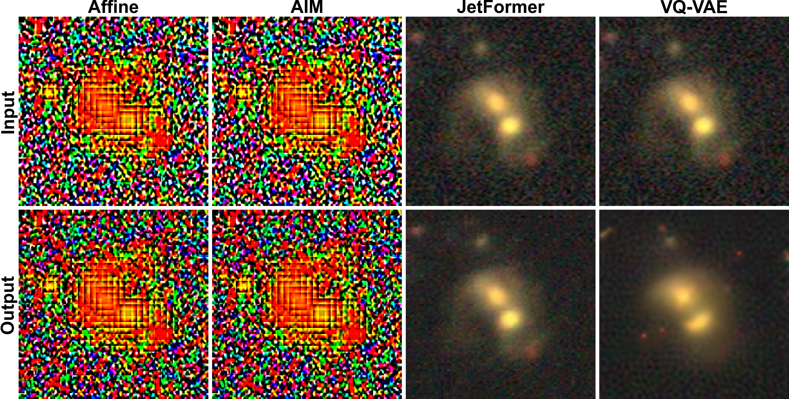
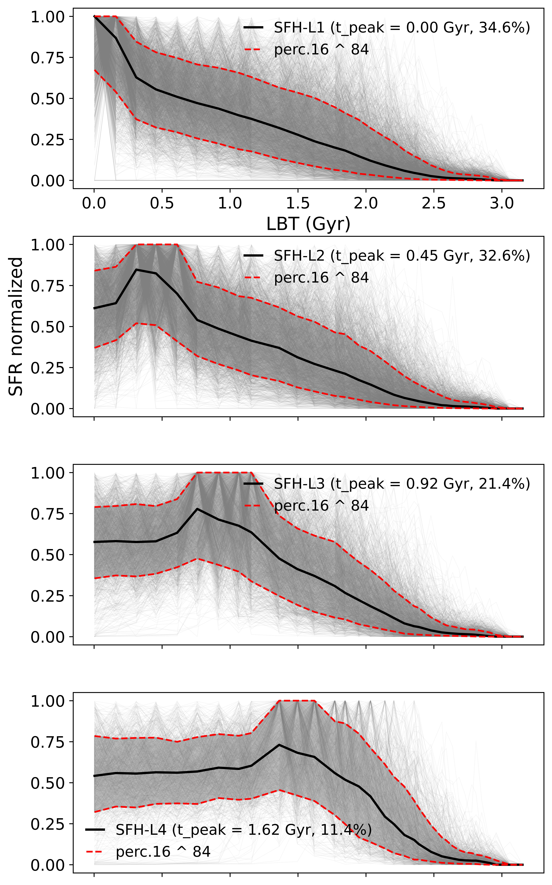
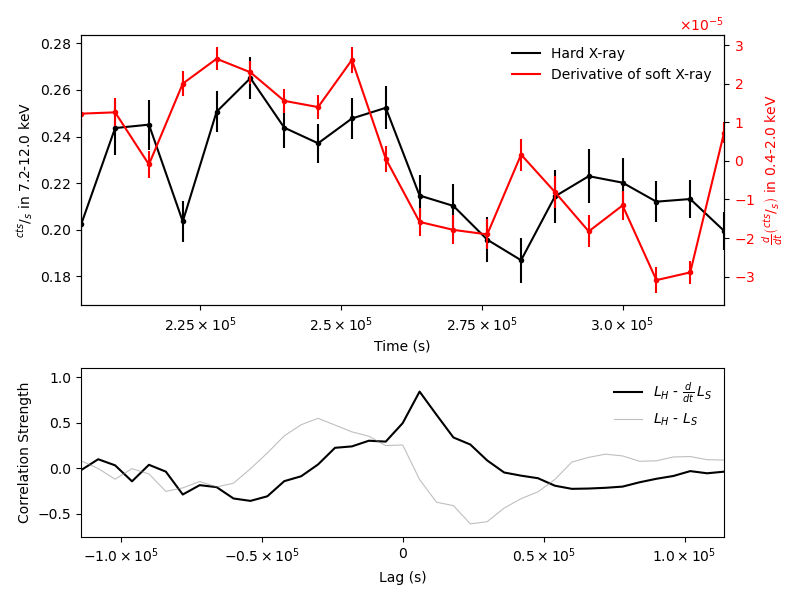

# arXiv Digest — 2026-06-25

**Interest file used:** interests/2026.05.md (fallback — no 2026.06.md exists yet)
**Categories pulled:** astro-ph.CO, astro-ph.EP, astro-ph.GA, astro-ph.HE, astro-ph.IM, astro-ph.SR, cs.LG, stat.ML, hep-ph
**Papers scanned:** 353 (140 astro-ph new/cross + 213 cs.LG/stat.ML/hep-ph)
**After first filter:** 15 candidates reviewed with full text
**Final selected:** 14 papers across 3 tiers

*Note: the combined-category pull tripped a 400 error from export.arxiv.org when fetching full metadata for the whole announcement in one id_list request, so categories were pulled one at a time and merged (no papers lost). Four full-text tarballs truncated through the proxy and were re-fetched via curl. No Tier 4 (meta-research) papers surfaced today. One reviewed candidate, 2606.26026 (detectability of extrasolar giant impacts), was dropped — it is a feasibility forecast rather than a result and did not clear the Tier 3 bar.*

---

## Tier 1 — Highly relevant

### [Probing Confining Dark Sectors with Cosmological Perturbations](http://arxiv.org/abs/2606.25014v1)

Daven Wei Ren Ho, Ameen Ismail, Yuhsin Tsai
**Primary category:** hep-ph | also: astro-ph.CO

The authors study a dark sector that confines through a strongly first-order, supercooled phase transition at the keV–MeV scale, producing composite warm dark matter whose relic abundance is fixed by the transition parameters with no required non-gravitational coupling to the Standard Model. They identify two competing imprints on structure: the stochastic bubble-nucleation completion time sources a curvature power spectrum with an enhanced IR tail (P_ζ ∝ k, a 1/k² boost over the usual causal k³ behaviour), while the composite DM is born warm and free-streams, suppressing small-scale power; both are computed in CLASS (phase-transition spectrum via `external_Pk`, warm DM via the `ncdm` module). The key result is that the phase-transition enhancement partially compensates the warm-DM suppression right at the Lyman-α pivot scale, weakening the conventional bound: ignoring the enhancement the forest requires T_PT ≳ 7 keV, but including it relaxes the limit to ≳ 6 keV (DM-only) and ≳ 5 keV in the DM+dark-radiation case. The Lyman-α constraint is applied through a compressed two-parameter likelihood on the linear matter power spectrum at k_p ≈ 1.03 h/Mpc, z=3 (Δ²_lin = 0.267 ± 0.022, n_lin = −2.288 ± 0.024), derived from PRIYA-calibrated eBOSS/SDSS-DR14 data.

This is a direct hit on two of the core interests at once — small-scale dark-matter constraints from the Lyman-α forest, and the forest's compressed (Δ²_lin, n_lin) likelihood that sits at the heart of the DESI-era P1D program — with the added twist that a primordial-perturbation source can partly hide a warm-DM signature in exactly the band the forest measures.

### [The Degeneracy Distillery](http://arxiv.org/abs/2606.23838v1)

T. Lucas Makinen, Deaglan J. Bartlett, Niall Jeffrey et al. (Makinen & Jeffrey: field-level / SBI-for-cosmology group flagged in the interest file)
**Primary category:** cs.LG | also: astro-ph.IM, stat.ML

This paper introduces an automated three-stage pipeline that detects and removes parameter degeneracies — the flat, low-curvature directions of the Fisher information — directly from parameter–simulation pairs, to make simulation-based inference cheaper and better-calibrated. Stage 1 learns the global Fisher geometry with an ensemble of "Fishnet" networks; stage 2 trains a "flattener" whose Jacobian maps that metric to the identity everywhere (a global transform, unlike single-point posterior whitening); stage 3 uses symbolic regression to distil the map into short, invertible, interpretable coordinate changes. They validate on Rosenbrock and analytic Gaussian cases and on four science problems including gravitational-wave inspirals and a weak-lensing cosmology example where they recover an S8-like Ωm·σ8 combination. The headline result: running neural posterior estimation in the distilled coordinates matches validation calibration while needing up to ~10× fewer simulations and yielding rounder, better-calibrated posteriors.

Squarely in the rising-primary "ML inference for cosmology" interest — this is reusable SBI infrastructure for exactly the expensive-simulation, strongly-degenerate setting (e.g. forest/LSS parameters) the profile targets, and it comes from the field-level-inference community named as high-value.

### [The Galaxy's Guide to the Tokenizer: A Benchmark for Scientific Foundation Models](http://arxiv.org/abs/2606.25610v1)

Sogol Sanjaripour, Michael J. Smith, Manuel Pérez-Carrasco et al.
**Primary category:** astro-ph.IM | also: astro-ph.GA

The authors benchmark four tokenization strategies — Affine (linear), AIM (MLP), JetFormer (normalizing-flow), and VQ-VAE (discrete codebook) — inside a single shared autoregressive AstroPT transformer backbone, to ask how tokenization shapes the representations a scientific foundation model learns. They train on 640,000 DESI Legacy Survey galaxy images (256×256, g/r/z) and evaluate both reconstruction fidelity (SSIM, PSNR) and the linear/MLP recoverability of independently measured physical properties (magnitudes, colours, redshift, sSFR, stellar mass, morphology). The central finding is that reconstruction quality and representation quality are decoupled: the flow-based JetFormer reconstructs best (~31 dB PSNR) but scrambles physical information, whereas VQ-VAE reconstructs worse (~24 dB) yet yields the most linearly accessible embeddings for property regression. They conclude no tokenizer is universally best and that physically labelled astronomical data is a clean, interpretable benchmark for foundation-model design.

Directly relevant to the astronomical-foundation-model thread the interest file calls out as the newest, fastest-growing direction (AION-1, AstroCLIP, SpecPT) — the tokenizer/representation trade-off it isolates is the practical question for anyone building or fine-tuning such models for spectroscopic-survey pipelines.

---

## Tier 2 — Adjacent / useful context

### [Amortized Simulation-Based Inference of Relativistic Mean-Field Couplings for Neutron-Star Equations of State](http://arxiv.org/abs/2606.25446v1)

Prashant Thakur, Tuhin Malik
**Primary category:** astro-ph.HE | also: nucl-th

The authors apply amortized neural posterior estimation — a conditional neural-spline normalizing flow via the `sbi` package — to infer the microscopic relativistic-mean-field coupling parameters of two equation-of-state families directly from data. Rather than conditioning on raw observations, they condition the flow on a compact vector of nuclear-physics constraints (saturation properties, chiral-EFT neutron-matter pressures, the maximum-mass bound) and pass the measurement-uncertainty scale as an extra input, so one trained network is amortized across observational precisions. They validate one-to-one against a PyMultiNest nested-sampling benchmark, passing the TARP coverage diagnostic with no significant bias, and generate 3×10⁴ posterior samples in ~2.5 s on a CPU.

The physics target (dense matter) is off-focus, but the recipe is exactly the borrowable methodology in the profile: amortized NPE with a normalizing flow, conditioned on summary constraints with the noise level as an input, and validated against nested sampling with TARP — a clean template for the same move on forest/LSS parameters.

*No figures extracted for 2606.25446 (method is fully conveyed by the text; the key plot is a standard posterior-band overlay).*

### [WaveDM.jl: An Adaptable Simulation Framework for Dynamics of Baryonic and Wave Dark Matter on Galaxy Scales](http://arxiv.org/abs/2606.25026v1)

Runyu Meng, Xiaobo Dong
**Primary category:** astro-ph.GA

WaveDM.jl is an open-source, modular Julia framework for galaxy-scale simulations of wave (fuzzy) dark matter, configured through short user scripts rather than source edits. It solves the time-dependent Schrödinger–Poisson equation with a pseudo-spectral split-step Fourier method coupled to N-body solvers for simultaneous wave-DM-plus-baryon evolution, and unifies multi-threaded, distributed, and GPU (CUDA.jl) execution in one framework. The demonstration science case is the Milky Way satellite Crater II (m_22 = 50), including an LMC-perturbed orbit, tidal-force calculation, and density/velocity-dispersion diagnostics; runs to 6 Gyr reproduce the observed gNFW profile and show the Galactic tide stripping granular substructure and distorting the central soliton.

Useful tooling for the small-scale-dark-matter interest: fuzzy/ultralight-axion DM is precisely the regime the forest constrains at the smallest scales, and a maintained, GPU-capable Schrödinger–Poisson code is the kind of forward model needed to connect that physics to observables.

*No figures extracted for 2606.25026 (a software/framework paper; the contribution is the code, not a single result plot).*

### [Slay the Shear: A Unified Statistical Framework for Weak Gravitational Lensing Shear Estimation](http://arxiv.org/abs/2606.25596v1)

Shurui Lin, Xiangchong Li, Xin Liu
**Primary category:** astro-ph.CO | also: astro-ph.IM

This paper recasts weak-lensing shear estimation in terms of the score function — the gradient of the image log-likelihood with respect to shear — and shows that the ensemble shear response equals the inner product of the estimator with the score, that the score is the minimum-variance unbiased estimator, and that shape noise is geometrically the misalignment between estimator and score. From this they prove the response-weighted inverse-variance weight is a general shape-noise-minimizing weight independent of the intrinsic shape distribution, and propose Response-weighted Denoising Score Matching (RDSM) to learn the score from simulations. On LSST 10-year-depth mocks, RDSM cuts shape noise by ~17.5% over the FPFS baseline while keeping multiplicative bias below 2×10⁻³.

The estimator-optimality machinery here — score functions, minimum-variance weighting, denoising score matching — is method the profile would borrow: the same score/Fisher framing underpins optimal power-spectrum estimators and the score-based generative models flagged in the ML-inference interest.

*No figures extracted for 2606.25596 (the headline 17.5% noise reduction is stated plainly; the result plot adds little beyond the number).*

### [The new era of Lyman alpha emitters (LAEs): Typical star formation histories of LAEs in the ILLUSTRIS simulation](http://arxiv.org/abs/2606.25126v1)

I. Laferte-Urrutia, P. Troncoso-Iribarren, Alex Vera-Casanova et al.
**Primary category:** astro-ph.GA

The authors study the star-formation histories of 6,051 Lyman-α emitters selected at z=2 in IllustrisTNG-100, reconstructing each galaxy's SFH along its main-progenitor branch and classifying the normalized profiles with unsupervised KMeans clustering. The optimal grouping is four classes (Silhouette score 0.65) comprising 35%, 33%, 21%, and 11% of the sample, with star-formation peaks at roughly 0, 0.5, 0.9, and 1.6 Gyr before observation and similar median stellar masses. The classic LAE picture — a low-mass galaxy with a single recent burst — is the single most common class but accounts for only 35%; the other 65% have later or more extended bursts, and all classes lie above the empirical star-forming main sequence.

Adjacent on two axes the profile cares about: Lyman-α-emitter physics (the emission side of the same Lyman-α universe as the forest) and an unsupervised-ML classification of simulation outputs, a light but concrete example of the ML-on-simulations workflow.

### [Lyα halos and UV continuum morphologies of Tadpole Galaxies at z > 3](http://arxiv.org/abs/2606.25723v1)

Manish Kataria, Kanak Saha
**Primary category:** astro-ph.GA

This work measures the Lyman-α and rest-UV morphologies of 12 "tadpole"/chain star-forming galaxies at z ≈ 3–5.5, combining deep VLT/MUSE spectroscopy with HST and JWST/JADES imaging. Using PSF-matched surface-brightness profiles and 2D Sérsic fits via MCMC, they decompose the Lyα emission into a compact UV-tracing core plus an extended halo. Extended Lyα halos are detected in 10 of 12 galaxies, the hypothesis that the UV profile reproduces the Lyα profile is rejected for 10 sources, and ~40% show double-peaked Lyα profiles; despite highly elongated stellar bodies, the Lyα emission is more symmetric and follows log R_eff(Lyα) = 0.41 log R_eff(UV) + 0.65.

Relevant to the IGM/CGM side of the interest: extended Lyα halos and double-peaked profiles are radiative-transfer signatures of the circumgalactic and intergalactic gas around emitters, the same gas the forest probes in absorption.

### [Empirical-Bayes Unfolding of γ-ray Spectra](http://arxiv.org/abs/2606.24971v1)

A. H. Mjøs, E. Lima, A. Kvellestad et al.
**Primary category:** astro-ph.IM | also: physics.data-an

The authors tackle spectral unfolding — an ill-conditioned, non-negative Poisson inverse problem where detector response and finite resolution blur distinct emitted spectra — with a hierarchical empirical-Bayes method that preserves Poisson structure, enforces non-negativity, and handles background via a joint ON/OFF likelihood. The prior is centred on an automatically selected, semi-converged Richardson–Lucy reference with adaptive width, and posterior inference uses the No-U-Turn Sampler in PyMC, reporting global rank-envelope uncertainty bands. Validated on synthetic data with known truth, the posterior recovers the spectrum within its bands in both high- and low-statistics regimes, and a deliberate response mismatch produces the dominant deviations; a head-to-head comparison with the frequentist regularized maximum-likelihood method gives consistent unfolded spectra.

A transferable inference recipe: deconvolving a noisy, resolution-limited observable into an underlying spectrum with calibrated uncertainties is the same problem shape as recovering a power spectrum or emissivity from forest/IGM data, and the empirical-Bayes-plus-NUTS treatment with honest coverage bands is the borrowable part.

*No figures extracted for 2606.24971 (the Bayesian-vs-frequentist agreement is clear from the text; the figure is a technical spectrum overlay).*

### [A hybrid method for reconstruction of the equation of state of dark energy and its application to Pantheon+SH0ES data](http://arxiv.org/abs/2606.25315v1)

Gawain Simpson, Krzysztof Bolejko, Stephen Walters
**Primary category:** astro-ph.CO | also: gr-qc

This paper introduces a semi-parametric reconstruction of the dark-energy equation of state w(z) that avoids a fixed parametric form (e.g. CPL) by fitting smooth analytic functions and Gaussian Processes to the dimensionless comoving distance D(z) and evaluating w from its first and second derivatives, after an MCMC stage anchors Ω_M and H₀. They validate on simulated supernovae — finding ~10,000 SNe sufficient and quartic/rational fits most accurate, while highly variable w cannot be recovered — then apply it to 1,594 Pantheon+SH0ES supernovae at z<0.8. All methods recover w ≈ −1 out to z ~ 0.4 with no statistically significant deviation from a cosmological constant, diverging with growing uncertainty at higher z.

Adjacent LSS/cosmology methodology: data-driven, derivative-based reconstruction with Gaussian Processes is the kind of model-agnostic estimator the profile values, and the framing connects to the DESI dynamical-dark-energy results in the recent-additions list.

*No figures extracted for 2606.25315 (the key w(z) reconstruction figure is supplied only as EPS, and the "consistent with w = −1" conclusion is fully stated in text).*

### [Single-dish HI Intensity Mapping with the SKAO: Precursor Progress with MeerKAT's Large Area Synoptic Survey (MeerKLASS)](http://arxiv.org/abs/2606.25955v1)

Steven Cunnington, Jingying Wang, Mario G. Santos et al.
**Primary category:** astro-ph.CO

This chapter reviews MeerKLASS — MeerKAT's single-dish HI intensity-mapping survey — as the demonstrator for SKA-Mid cosmology, detailing its calibration and blind multiscale-PCA foreground-cleaning pipelines. It collects the concrete detections to date: three cross-correlation power-spectrum detections of cosmological HI with overlapping galaxy surveys at z ≈ 0.43, and a stacked HI-emission detection onto GAMA galaxies at 8.66σ (angular) / 7.45σ (spectral). The 2021 deep-field maps reach ~1.2× the thermal-noise floor, while the HI auto-power spectrum remains an upper limit; forecasts project BAO detectability (combined SNR up to ~8) once the full 2,500-hour, 10,000-deg² UHF survey is complete.

Adjacent 21cm cosmology, an interest the profile lists explicitly: the foreground-mitigation and auto-vs-cross-power systematics MeerKLASS is solving are close cousins of the contamination and estimator problems in forest power-spectrum analysis, and intensity mapping is a complementary LSS tracer for cross-correlations.

---

## Tier 3 — Outside my area but notable

### [Observation of a Solar-Like Magnetic Reconnection Event in an AGN Corona with XRISM](http://arxiv.org/abs/2606.25636v1)

Gal Vardi, Ehud Behar, Liyi Gu et al.
**Primary category:** astro-ph.HE | also: astro-ph.SR

The authors report the first direct observational evidence for magnetic reconnection in an active-galactic-nucleus corona, via the solar "Neupert effect" — hard X-ray luminosity tracking the time-derivative of the soft X-ray luminosity — in an X-ray flare from NGC 3783 during a 2024 XRISM campaign, cross-checked with XMM-Newton. In one flare the hard X-rays lead the soft by ~30 ks with a strong cross-correlation (r = 0.84, p = 0.002), and an accompanying ultra-fast outflow (~0.2c) plays the role of a solar coronal mass ejection. From the timing they bound the flaring loop height to ~30 gravitational radii and estimate the annihilated magnetic field at hundreds to >10⁴ G depending on the energetics argument.

A genuinely first-of-its-kind result — importing a well-understood solar diagnostic to show that the same reconnection physics heats AGN coronae and launches their outflows is the kind of surprising cross-scale connection worth knowing as a scientist.

### [A Potential Signature of HD 7977's Passage Among Observed Long-Period Comet Orbits](http://arxiv.org/abs/2606.25069v1)

Nathan A. Kaib, Sean N. Raymond
**Primary category:** astro-ph.EP | also: astro-ph.GA

Kaib & Raymond simulate Oort-cloud comet production with N-body integrations and compare the observed orientation distribution of long-period comets (encoded in sin 2ω) against a Galactic-tide-only baseline and against a close passage of the Sun-like star HD 7977. Dynamically new comets are far more isotropic than a tide-dominated cloud predicts (~3σ tension), while younger returning comets match the tide model — a combination reproduced only by an HD 7977 flyby at ~6,000–10,000 au about 2.5 Myr ago. The headline consequence is that the Solar System is in the late stages of a comet shower, with the present long-period-comet flux elevated ~2–2.5× over the long-term rate, implying Oort-cloud population estimates should be revised downward by roughly a factor of two.

Surprising and falsifiable: a specific recent stellar encounter reshaping the present-day comet population — and halving a textbook number — with a concrete prediction the next Gaia release can test.

### [Causality alone bounds the maximum radius difference between different-mass neutron stars](http://arxiv.org/abs/2606.25186v1)

Aleksi Kurkela, Tuhin Malik
**Primary category:** astro-ph.HE

The authors show that causality alone — assuming only a common, subluminal (c_s² ≤ 1) equation of state anchored to chiral effective field theory near saturation — places a closed-form upper bound on the neutron-star radius difference: R(2.0 M⊙) ≤ 1.16·R(1.4 M⊙) − 1.1 km. They derive it both numerically, with a maximally agnostic EoS ensemble, and analytically, identifying the saturating equations of state as a one-parameter family. Applied to independent NICER posteriors, the bound retains only 7.5% of the joint posterior volume and removes the unphysical large-radius tail of J0740 without any EoS prior or reanalysis of raw data.

Notable as a clean inference idea: a prior-free, physically-motivated constraint that sharpens multiple independent posteriors at once is a transferable trick for anyone combining heterogeneous datasets under physical priors.

