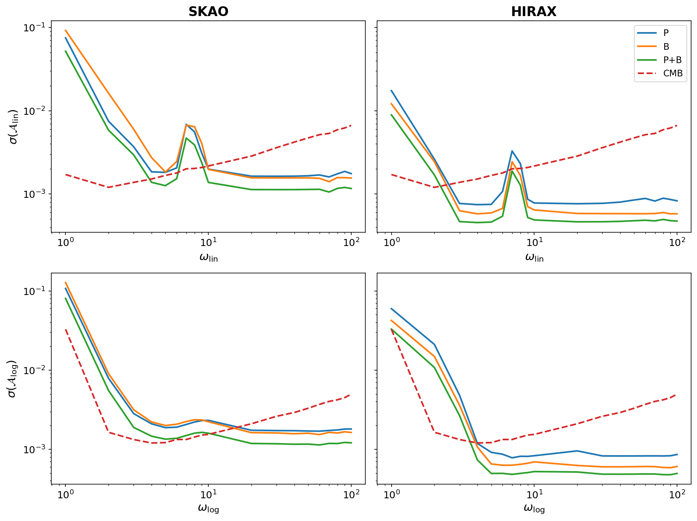
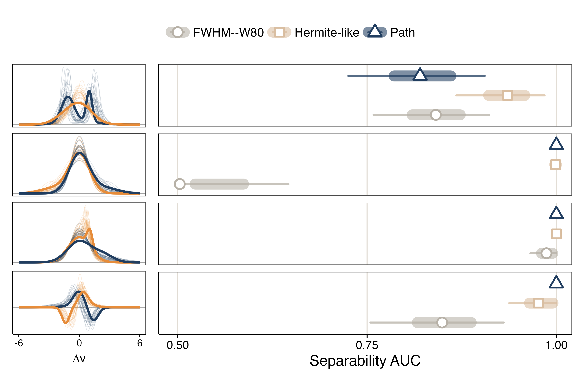

# arXiv Digest — 2026-06-29

**Interest file used:** interests/2026.05.md (fallback — no 2026.06.md exists yet)
**Categories pulled:** astro-ph.CO, astro-ph.EP, astro-ph.GA, astro-ph.HE, astro-ph.IM, astro-ph.SR, cs.LG, stat.ML, hep-ph
**Papers scanned:** 277 (91 astro-ph new/cross + 186 cs.LG/stat.ML/hep-ph and other cross-lists)
**After first filter:** 21 candidates reviewed with full text
**Final selected:** 16 papers across 4 tiers

*Note: Interest file is a fallback from last month (no 2026.06.md yet). Today's astro-ph.HE/GA feed was dominated by SKA science-case white-paper/review chapters (FRBs, jets, cosmic magnetism, cosmic rays); these were largely excluded as off-profile. Five candidate source tarballs were truncated by the proxy and re-fetched via a direct curl fallback — no papers were dropped for unreadable source.*

---

## Tier 1 — Highly relevant

### [A hidden reionization prior biases cosmological inference](http://arxiv.org/abs/2606.27903v1)

Zihan Wang, Huanyuan Shan
**Primary category:** astro-ph.CO | also: astro-ph.GA

The authors argue that the standard single-stage tanh reionization model baked into CAMB/CLASS is structurally incompatible with current data: the Planck optical depth (τₑ = 0.054), SPT+ACT patchy-kSZ limits, and the Lyα-forest endpoint (z ≈ 5.5) cannot be reproduced by any monotonic ionization history (pkSZ caps τₑ ≲ 0.034, ~2.5σ below Planck). Adding an early ionization floor at z > 12 (x_early = 0.093 ± 0.027, ~42% of τₑ; Δχ² = 8.2, ln B = 4.09) resolves the tension, corroborated by a non-parametric PCHIP reconstruction and a Planck-alone CLASS reanalysis. Marginalizing over this two-stage shape shifts σ₈ from 0.812 to 0.824 and relaxes the neutrino bound from Σmν < 0.24 eV to < 0.39 eV, easing the DESI DR2 and S8 tensions. They frame reionization shape as an unflagged implicit prior that LiteBIRD/HERA/CMB-S4 can test directly.

This is squarely in your core IGM/reionization + neutrino-mass + LSS-inference territory, using exactly the multi-probe toolkit you work with (τₑ, mean free path, Lyα-forest endpoint, kSZ, neutral fraction). Read critically: the pkSZ scaling is somewhat heuristic and the physical floor extends to very high z, requiring exotic sourcing.

### [Dark energy perturbations and the robustness of cosmological neutrino-mass constraints](http://arxiv.org/abs/2606.28074v1)

Yu-Hang Yang, Emmanuel N. Saridakis, Yi-Fu Cai et al.
**Primary category:** astro-ph.CO

Tests whether the widely reported relaxation of cosmological neutrino-mass bounds in w₀wₐCDM survives once dark-energy perturbations (clustering) are included, using hi_class + MontePython on Planck+ACT/lensing, DES-Dovekie SNe, and BOSS/eBOSS BAO+RSD. ΛCDM gives Σmν < 0.063 eV (negative effective mass preferred); smooth dark energy (cₛ² = 1) relaxes this to < 0.170 eV, but allowing clustering (cₛ² = 10⁻⁵) tightens it back to < 0.113 eV and pulls toward more-negative effective masses. The effect is traced to a perturbation-level degeneracy between neutrino free-streaming and DE clustering in the growth sector (fσ8), with background Ωm and H₀ held fixed; an EFT-of-DE analysis shows even ΛCDM+EFT relaxes the bound to < 0.161 eV.

Hits neutrino mass, DESI/BAO/RSD full-shape, growth, and EFT-of-dark-energy all at once, and delivers a concrete caution that "dynamical DE rescues Σmν" is not robust to perturbation modeling — directly relevant to interpreting DESI neutrino-mass results.

### [Searching for primordial features with radio surveys: synergy between the power spectrum and bispectrum](http://arxiv.org/abs/2606.28172v1)

Dionysios Karagiannis, Mario Ballardini, Roy Maartens
**Primary category:** astro-ph.CO

Forecasts the detectability of primordial oscillatory features (linear, logarithmic, and a sharp/step GSR model) from next-generation HI intensity-mapping surveys — single-dish SKAO and interferometric HIRAX — using a joint redshift-space power-spectrum + bispectrum Fisher analysis with scale-dependent bias, RSD, IR resummation, and non-Gaussian covariance, complemented by SO+LiteBIRD CMB. Adding the LSS bispectrum tightens marginalized feature-amplitude constraints by 30–40% over P alone and breaks degeneracies, with much of the gain from the late-time gravitational bispectrum that inherits the primordial oscillation. Interferometric P+B can beat CMB amplitude constraints by up to ~75% in the linear regime; non-Gaussian covariance degrades bispectrum-only constraints by 55–90%, yet HI+CMB still reaches percent-level precision on feature frequency. HIRAX systematically outperforms SKAO by accessing many small-scale triangle configurations.

Core territory — P3D/bispectrum estimators, Fisher forecasting, RSD/bias modeling, and 21cm-adjacent surveys probing small-scale primordial physics, exactly the LSS + spectroscopic-survey + inference intersection you work in.

---

## Tier 2 — Adjacent / useful context

### [HIcosmo: a differentiable JAX-based framework for cosmology inference](http://arxiv.org/abs/2606.28175v1)

Jing-Zhao Qi, Jing-Fei Zhang, Xin Zhang
**Primary category:** astro-ph.CO | also: hep-ph

An open-source JAX-native framework for background-cosmology inference in which the forward model, distance integrals, likelihoods, NUTS sampling (via NumPyro), and Fisher forecasts are all built from JAX primitives, so gradients/Hessians come from automatic differentiation rather than finite differences. It implements ΛCDM/wCDM/w₀wₐCDM/interacting-DE with likelihoods for Pantheon+/DES-SN5YR/Union3, DESI DR1/DR2 + SDSS BAO, Planck distance priors, SH0ES, and H0LiCOW. Validation against Cobaya gives χ² agreement of 10⁻⁶–10⁻² and posterior shifts < 0.2σ, with ~8.7× higher sampling throughput on CPU and up to ~20× GPU speedup at survey scale; applications include AD-based Fisher forecasts for six 21cm intensity-mapping surveys.

The differentiable/JAX/NUTS/AD-Fisher machinery and explicit DESI BAO + 21cm forecasting are squarely in your methods wheelhouse — borrowable infrastructure, though it is background-only (no Lyα/perturbation content).

*No figures extracted for 2606.28175v1 (central figure is a generic architecture block diagram; quantitative results are spread across many corner plots).*

### [Simulation-Based Inference for Cluster Cosmology with Set-Based Neural Network Architectures](http://arxiv.org/abs/2606.27439v1)

S. Zelmer, E. Bulbul, K. Lehman et al.
**Primary category:** astro-ph.CO

Builds an SBI framework for eROSITA (eRASS1) X-ray cluster cosmology that ingests variable-length cluster catalogs without binning: a Deep-Sets-style permutation-invariant network with a cross-feature correlation aggregator compresses each catalog into a fixed summary vector, which a masked autoregressive flow turns into the posterior via neural posterior estimation. They forward-model the HMF, X-ray and weak-lensing scaling relations with correlated scatter, the eRASS1 selection function, and DES-like shear, training on 200,000 mocks over 11 parameters. On mocks matching the data (~3,259 clusters) they obtain 11.5% on Ωm and 4.4% on σ₈ — comparable to MCMC on a larger sample — and pass SBC/TARP calibration; application to real data is deferred.

The set-based embedding → MAF → NPE + SBC/TARP calibration stack is directly transferable to your SBI/normalizing-flow work and to handling variable-size, catalog-like data, even though the science target (clusters) is outside the forest core.

*No figures extracted for 2606.27439v1 (corner/comparison plots and architecture schematic are informative but none is a single load-bearing result).*

### [Constraining primordial oscillations and inflationary particle production with Planck, ACT DR6, and DESI DR2](http://arxiv.org/abs/2606.28310v1)

Simran K. Nerval, Renee Hlozek, Hidde T. Jense et al.
**Primary category:** astro-ph.CO

Constrains oscillatory primordial-power-spectrum templates (linear, logarithmic, log with running frequency) and inflationary multi-burst particle production using Planck 2018, ACT DR6, and DESI DR2 BAO. To handle the multimodal posteriors they integrate the normalizing-flow-based preconditioned SMC sampler pocoMC into Cobaya, and modify CAMB for oscillatory spectra. Headline 95% CL bounds: A_lin < 0.021, A_log < 0.022, A_logrf < 0.023 (oscillatory power < ~2% of Aₛ), with a MAP coupling g = 0.034 for particle production. Despite Δχ² improvements, Bayesian evidence moderately prefers ΛCDM, and the particle-production case is inconclusive — the added complexity is not yet statistically justified.

Relevant on the inference-method axis (flow-based SMC sampler integrated into Cobaya, multimodal posteriors, Bayesian model selection) and uses DESI DR2 BAO, even though the science target — inflationary features — is adjacent rather than core.

*No figures extracted for 2606.28310v1 (the result is a set of amplitude upper limits; no single panel is load-bearing).*

### [Probing the neutrino chemical potential with cosmological observations](http://arxiv.org/abs/2606.28135v1)

Pietro Ghedini, Riccardo Impavido, Stefano Gariazzo et al.
**Primary category:** hep-ph | also: astro-ph.CO

Derives up-to-date bounds on the neutrino degeneracy parameters ξ_νe and ξ_νx (chemical potential μ/T), treated either as constant or as redshift-dependent via a four-node PCHIP reconstruction, in both 3-degenerate and (1+2)-neutrino configurations. Using Planck+SPT-3G+ACT DR6 + DESI DR2 BAO, with BBN (D/H plus EMPRESS or LBT Yₕₑ) added by importance sampling, they show BBN is the dominant constraining epoch and mostly constrains ξ_νe — pushed to a non-zero positive value at 95% CL in the non-degenerate constant case (e.g. 0.09⁺⁰·¹²₋₀.₁₁) — while ξ_νx remains largely free. A positive ξ_ν raises Neff and allows higher H₀ (tails to ~69–70 km/s/Mpc), mildly easing the H₀ tension; Bayesian evidence shows no strong preference over ΛCDM.

Touches your neutrino/early-universe interests and showcases a clean PCHIP model-independent reconstruction (the same tool used in the reionization-prior paper above), but the specific observable — lepton asymmetry driven by BBN — sits one step outside the P1D/forest/LSS core.

*No figures extracted for 2606.28135v1 (results are spread across many corner plots; the most informative reconstruction figure is secondary to the numerically-stated ξ_νe bound).*

### [The effect of dark energy on the void-halo perpendicular alignments](http://arxiv.org/abs/2606.28151v1)

Geonwoo Kang, Jounghun Lee
**Primary category:** astro-ph.CO | also: gr-qc

Using AbacusSummit dark-matter-only simulations across 10 cosmologies (1 ΛCDM, 4 wCDM, 5 w₀wₐCDM) sharing identical initial conditions except the dark-energy equation of state, the authors measure perpendicular alignments between void-surface halo shape axes and directions to void centers at z = 0.1, fitting the cosine distribution to a single-parameter analytic formula (parameter d_t). More rapidly accelerating cosmologies (more negative w) produce stronger alignments; after controlling for halo mass and sphericity distributions to isolate the net DE effect, they propose a bilinear relation Δd_t = α(1+w₀) + β wₐ with universal coefficients. They argue this is a promising independent non-linear DE probe requiring no high-z data.

Sits in your voids/LSS dark-energy thread as a novel non-linear DE diagnostic, though it remains a simulation-only proof of concept using halo (not forest) statistics, with observational application deferred.

### [Self-interacting dark matter promotes bar formation in disk galaxies](http://arxiv.org/abs/2606.27480v1)

Shashank Dattathri, Frank C. van den Bosch, HanYuan Zhang et al.
**Primary category:** astro-ph.GA

High-resolution N-body simulations (plus kinetic-theory analytics) of stellar-bar formation in disk galaxies embedded in SIDM halos. Relative to collisionless CDM, SIDM makes bars form earlier and grow stronger even for modest cross sections (σ/m = 0.1–10 cm²/g); disks that are bar-stable in CDM (kinematically hot or DM-dominated) go bar-unstable in SIDM. Control runs show this is not driven by central core formation but by self-interactions broadening the bar-halo resonances (a Lorentzian replaces the LBK delta function), enhancing disk→halo angular-momentum transfer; late-time gravothermal core collapse later weakens the bar. They propose barred-galaxy statistics — including JWST high-z bars — as a new probe of the DM self-interaction cross section.

Touches your small-scale dark-matter interest (SIDM cross-section constraints) and offers an observational route, though the methodology (galaxy bar dynamics) is outside the Lyα/LSS core.

*No figures extracted for 2606.27480v1 (bar-amplitude and resonance phase-space plots are domain-specific and not load-bearing for this digest).*

### [Sampling the Schwinger Model with Gauge-Equivariant Diffusion](http://arxiv.org/abs/2606.27481v1)

Octavio Vega, Aida X. El-Khadra
**Primary category:** hep-lat | also: cs.LG

First application of diffusion-based sampling to a lattice gauge theory with fermions (the Nf=2 Schwinger model, 2D QED). They train a U(1)-equivariant, score-based (variance-expanding SDE) generative model on HMC-generated configurations, feeding gauge-invariant plaquettes and Wilson loops to enforce equivariance; the deterministic probability-flow ODE yields tractable likelihoods (Skilling-Hutchinson trace estimator), enabling unbiased reweighted observable estimates. Plaquette, topological susceptibility, and chiral condensate match HMC within errors, with more frequent topological-sector tunneling (reduced freezing) — though effective sample size is low (0.29 at L=8, 0.08 at L=16). It is explicitly a preliminary study.

The recipe — symmetry-equivariant score-based diffusion + probability-flow ODE for exact likelihoods + reweighting for unbiased estimates, plus mode-freezing mitigation — is exactly the generative-sampling machinery you track for SBI/field-level inference; the low ESS at larger volumes is the honest caveat for borrowability.

*No figures extracted for 2606.27481v1 (the single figure is a method-specific topological-charge trace, not essential here).*

### [The Hidden Geometry of Astrophysical Spectra: Path-Signatures of Line Profiles](http://arxiv.org/abs/2606.27432v1)

Rafael S. de Souza, Severin Bunk
**Primary category:** astro-ph.IM | also: stat.AP

Introduces path-signature (rough-path / iterated-integral) descriptors for spectral-line profiles, treating a continuum-subtracted line as a directed curve in velocity–flux space traced blue-to-red. From the low-order log-signature they define a compact, named, interpretable, reparameterization-invariant coefficient set (signed area, blue–red imbalance localization, higher-order shoulder/double-peak structure, emission–absorption ordering via a Lévy area). On synthetic profiles these descriptors separate morphologies that are degenerate under FWHM, W80, and Gauss–Hermite h3/h4 (quantified by bootstrap AUC); applied spaxel-by-spaxel to Hα in five MaNGA galaxies and clustered with no velocity input, the path-defined regions recover coherent large-scale velocity fields consistent with the MaNGA DAP. They release the MIT-licensed `spectropath` package.

Not Lyα/IGM itself, but path signatures are a general, interpretable feature map for any ordered 1D signal — directly applicable to absorption-line/forest profiles, light curves, or as interpretable ML features in inference pipelines; the explicit contrast with PCA is relevant for a data-driven cosmologist.

### [Large-scale structures of the Universe: physics, phenomenology, statistics](http://arxiv.org/abs/2606.27927v1)

Cora Uhlemann
**Primary category:** astro-ph.CO

Les Houches lecture notes covering the theory and phenomenology of cosmic large-scale structure in three stages: (1) dark-matter dynamics from Vlasov-Poisson phase space through the fluid limit, perturbation theory, spherical collapse, and the halo model; (2) clustering statistics — Gaussian initial fields, two-point correlation/power spectrum, skewness and the one-point density PDF, three-point/bispectrum; (3) connecting dark matter to observables via tracer bias and stochasticity, redshift-space distortions, photometric clustering, and weak lensing. All illustrations use the public Quijote N-body suite with Pylians, comparing theory to simulation. It is a synthesis/teaching reference, not new results.

Directly covers your LSS, cosmic-web, and non-Gaussian-statistics interests (one-point PDF, bispectrum, halo model, bias), and the Quijote+Pylians worked examples are immediately usable for emulator/inference training pipelines.

*No figures extracted for 2606.27927v1 (review notes; figures are standard textbook illustrations).*

---

## Tier 3 — Outside my area but notable

### [The Dust Mineralogy of Interstellar Comet 3I/ATLAS from JWST/MIRI Observations](http://arxiv.org/abs/2606.27535v1)

Matthew Belyakov, Ian Wong, Carey M. Lisse et al.
**Primary category:** astro-ph.EP | also: astro-ph.GA

The first spectroscopic mineralogical analysis of dust from an interstellar object, using JWST/MIRI MRS spectra of 3I/ATLAS. The dust shows a strong, rounded 10-micron amorphous-silicate emissivity feature with a very low crystalline fraction (best-fit 0.4%, 3σ upper limit ~3%), in stark contrast to Solar System comets (typically 20–30% crystalline). The spectrum instead resembles ISM silicates and late-stage transition disks, implying 3I either formed far out from ISM-like material without inner-disk mixing, or was amorphized over its Gyr-long journey (the authors disfavor the latter). A 6.9-micron feature (carbonates / ammonium salts / aliphatics) is also reported.

Outside your science, but a genuine "first" on only the third interstellar object ever found — a high-profile result worth general awareness, and a clean illustration of how the chemistry of other planetary systems differs from our own.

*No figures extracted for 2606.27535v1 (the amorphous-vs-crystalline headline requires spectral-feature expertise to read; no single figure conveys it to a non-specialist).*

### [A hidden ultra-relativistic spine in the jet of a neutrino-associated blazar](http://arxiv.org/abs/2606.27430v1)

Y. Y. Kovalev, F. Eppel, D. C. Homan et al.
**Primary category:** astro-ph.HE | also: astro-ph.GA

Long-term VLBA 15 GHz monitoring of TXS 0506+056 — the first blazar linked to an IceCube neutrino — reveals a coherent emission wave propagating at apparent speed 21 ± 1c, hidden by slower radio-bright components that dominated earlier kinematic analyses. The authors interpret this as a stratified spine-sheath jet: an ultra-relativistic spine (Γ > 20) inside a slower sheath, resolving the long-standing "Doppler factor crisis" (VLBI had shown only ~2c while neutrino models required Doppler factors of 10–20). Transverse spreading of the disturbance into the sheath naturally explains the multi-year neutrino-to-radio delay, and the pattern recurs after a second neutrino event, implying a repeatable multimessenger engine.

Outside your area, but a notable multimessenger result that resolves a known tension for the archetypal neutrino blazar — and a methodological caution that VLBI pattern speeds can badly underrepresent the true bulk flow.

*No figures extracted for 2606.27430v1 (the result rests on VLBI kinematics; the schematic is illustrative but not self-explanatory for a non-specialist).*

---

## Tier 4 — Meta-research about the field

### [A&A community survey on the future of scientific publishing: Credibility over speed, fairness over profit, human judgment over automation](http://arxiv.org/abs/2606.27447v1)

João Alves, Arūnas Kučinskas, Charlotte Van Rooyen et al.
**Primary category:** cs.DL | also: astro-ph.IM

Astronomy & Astrophysics reports its May 2025 "Survey on Trends and Challenges in Scientific Publishing," sent to 28,787 authors with 2,944 responses from 69 countries plus ~3,000 free-text comments. Journal quality/reputation dominates publishing choice (cost second; speed and impact factor minor); the top peer-review concern is reviewer expertise and fairness, not speed; citation metrics still matter but respondents want broader qualitative impact measures; author-pays APC open access is widely seen as inequitable, with preference for public/institutional funding. Views on AI are polarized — broad acceptance of language/admin/analysis assistance but firm opposition to AI as a decision-maker or autonomous content generator, with strong demands for disclosure and human accountability.

Directly relevant as field-practice awareness: where your own community lands on open-access funding, AI-in-review norms, and research evaluation — the policies that will shape how and where you publish.

*No figures extracted for 2606.27447v1 (survey paper; all figures are diverging-bar opinion charts with no scientific content).*

### [Towards Automating Scientific Review with Google's Paper Assistant Tool](http://arxiv.org/abs/2606.28277v1)

Rajesh Jayaram, Drew Tyler, David Woodruff et al.
**Primary category:** cs.LG | also: cs.AI, cs.CL

Argues that AI-accelerated scientific output is outpacing human peer-review capacity (documenting the submission explosion at major ML venues) and proposes a four-level taxonomy of AI-human collaboration in scientific evaluation. It introduces the Paper Assistant Tool (PAT), an agentic framework that ingests full manuscripts and produces deep reviews — checking theorems, validating experiments, suggesting improvements, and flagging flaws — using inference-scaling (multiple/structured model calls) rather than a single zero-shot pass. The headline result is a 34% improvement over zero-shot recall for mathematical-error detection on the SPOT benchmark; PAT was piloted as a voluntary pre-submission tool at STOC and ICML.

Meta-research on how AI is reshaping the practice of peer review and verification — useful as awareness of where automated-review tooling is heading, with the inference-scaling-for-verification idea conceptually (if not directly) adjacent to scientific inference pipelines.

*No figures extracted for 2606.28277v1 (perspective/tooling paper; only quantitative exhibits are a submission-counts table and a system diagram).*
