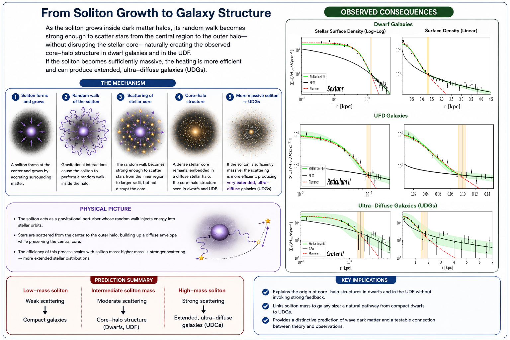

# arXiv Digest — 2026-06-30

**Interest file used:** interests/2026.05.md (fallback — no 2026.06.md exists yet)
**Categories pulled:** astro-ph.CO, astro-ph.EP, astro-ph.GA, astro-ph.HE, astro-ph.IM, astro-ph.SR, cs.LG, stat.ML, hep-ph
**Papers scanned:** 421 unique after dedup (128 astro-ph-primary + 293 cs.LG/stat.ML/hep-ph-primary)
**After first filter:** 15 candidates reviewed with full text
**Final selected:** 9 papers across 4 tiers

*Note: A combined 9-category id_list overran the arXiv API (HTTP 400), so categories were pulled separately; cs.LG was capped at 200 of 348 announced (filtered hard for inference/generative relevance per the interest file). None of the cs.LG/stat.ML/hep-ph extras cleared the bar — they were generic ML (tabular/vision foundation models) or particle-physics dark-matter constructs unconnected to structure/forest inference — so today's picks are astronomy-sourced. Source tarballs needed a redirect-following fetch fallback due to proxy truncation; all selected papers were read in full.*

---

## Tier 1 — Highly relevant

### [Strongest constraints on dark acoustic oscillations from the Lyman-alpha forest](http://arxiv.org/abs/2606.28482v1)

Zhihan Yuan, Caleb Gemmell, Keir K. Rogers et al. (Rogers — flagged high-value forest/dark-matter author in the interest file)
**Primary category:** astro-ph.CO | also: hep-ph

The authors set the first constraints on a small-scale dark acoustic oscillation (DAO) in the linear matter power spectrum — the imprint of dark-sector interactions analogous to the baryon-photon acoustic feature — using a full forward model of the Lyman-α forest 1D flux power spectrum. Because the DAO signal is degenerate with cosmology and IGM nuisance parameters, they train a deep kernel learning (Gaussian-process) emulator of hydrodynamical simulations and Bayesian-optimize it to resolve the oscillation imprint. The result: no more than ~24% of dark matter can form DAOs peaking at wavenumbers below 50 h/Mpc (95% c.l.), with bounds k_peak > 5.1 h/Mpc, amplitude A < 1.38, and fraction f < 0.243. This probes scales roughly 25× smaller than the CMB.

This is a direct, four-way bullseye on the interest profile: the Lyman-α P1D as the observable, non-cold dark matter from small-scale structure as the physics, and a simulation-based emulator pipeline as the method — exactly the Lyman-α × dark-matter × ML-inference convergence the library is built around, with Keir Rogers among the authors.

---

## Tier 2 — Adjacent / useful context

### [Cosmological inference from the eBOSS QSO full-shape analysis with optimal redshift weights](http://arxiv.org/abs/2606.28790v1)

Xiaoyong Mu, Zhuo-Heng Li, Wentao Luo et al.
**Primary category:** astro-ph.CO

A full-shape power-spectrum analysis of the eBOSS DR16 quasar sample (343,708 QSOs over 0.8 < z < 2.2) using Karhunen–Loève "optimal redshift weights" to recover light-cone evolution that a single effective redshift washes out. Spectra are measured with a cross-correlation estimator that stays well-defined for sign-changing weights and convolved with measured Fourier-space window kernels, with covariance and validation from 1000 EZ mocks. In ΛCDM the weighted and standard analyses agree; in the CPL model the weighting cuts marginalized uncertainties on H0, σ8, and w0 by 43%, 20%, and 21% and turns the one-sided w_a bound into a bounded posterior.

The redshift-weighting machinery is the borrowable piece here: a wide-redshift spectroscopic tracer (QSOs, and by extension Lyman-α forest sightlines) carries tomographic information that this method extracts while keeping the data vector compact — directly relevant to DESI-era forest/QSO full-shape work.

*No figures extracted for 2606.28790 (methodology is fully conveyed in text; the key plots are busy data/window panels that add little at a glance).*

### [Universal distance modes from DESI BAO and Type Ia supernovae: what do cosmological rulers actually measure?](http://arxiv.org/abs/2606.30527v1)

Matias Zaldarriaga
**Primary category:** astro-ph.CO

An SVD decomposition of the low-redshift DESI DR2 BAO and three SN Ia compilations isolates the leading linear directions the data actually constrain and localizes where they sit relative to CMB-anchored ΛCDM. The leading direction is, to high accuracy, a measurement of Ωm h² — BAO pins it tighter than the CMB itself, while the SN compilations do not — and most of the tension with the CMB lives in that single direction. In the w0–wa extension a second direction becomes measurable and shows no significant tension; spatial curvature is the only other extension that opens a (marginal) new measurable direction.

For someone interpreting DESI dark-energy results, this reframes the headline tension: it is essentially a one-number (Ωm h²) disagreement, and the "dynamical dark energy" preference is what happens when a model is forced to absorb that offset. Useful context for reading the DESI DR2 BAO papers already in the library.

### [Neural posterior estimation of Galactic Binary signals for the LISA mission](http://arxiv.org/abs/2606.29039v1)

Tanguy Delmond, Natalia Korsakova, Thomas Oberlin et al.
**Primary category:** astro-ph.IM | also: gr-qc

A simulation-based inference pipeline for LISA galactic-binary parameter estimation, using a conditional normalizing flow as a neural posterior estimator trained entirely likelihood-free on simulated waveforms. Once trained it draws thousands of posterior samples per second without any likelihood evaluation, sidestepping the MCMC convergence problems caused by the high-dimensional, multimodal likelihood and heavily overlapping signals. Calibration is validated with probability–probability plots and KS tests, and the method is pushed to wider frequency bands and overlapping-source cases as a proof of concept.

The gravitational-wave application is incidental; the value is a clean, well-calibrated NPE/normalizing-flow template for a hard overlapping-signal inference problem — the same SBI-and-flows toolkit the interest profile flags for forest and LSS inference, with a calibration discipline worth copying.

### [Strong Stellar Diffusion from Wave DM Cosmological Simulation and Potential Unified Origin for dSphs, UFGs, and UDGs](http://arxiv.org/abs/2606.30078v1)

A. Pozo, T. Broadhurst, J. Zhang et al.
**Primary category:** astro-ph.GA | also: astro-ph.CO

Cosmological ψDM (wave / fuzzy dark matter) simulations show that stars random-walk outward over a Hubble time, driven by the wave interference perturbations of the central soliton, with the half-light radius growing as R ∝ (ħ/m_ψ)^0.5 √t. The resulting locally Gaussian (Sérsic n = 0.5) profiles match observed core–halo dwarf spheroidals, and the diffusion strength scales with halo mass. The authors argue this gives a single mechanism producing the continuity from ultra-faint dwarfs through compact dwarf spheroidals to ultra-diffuse galaxies, read as an age sequence rather than distinct formation channels.

This is the small-scale-structure dark-matter question approached from galaxy morphology instead of the forest: the same non-CDM physics (fuzzy/wave DM free-streaming and granularity) the user constrains via Lyman-α, here leaving a distinct, falsifiable imprint on stellar structure.

### [Domain-Informed Multi-View Self-Distillation for Astronomical Light-Curve Representation Learning with JEPA](http://arxiv.org/abs/2606.28446v1)

Yicheng Rui
**Primary category:** astro-ph.IM | also: cs.AI

A self-supervised representation-learning framework for irregular astronomical time series built on a Joint-Embedding Predictive Architecture (JEPA), combining semantics-preserving views, uncertainty-aware tokenization, and multi-view self-distillation with LeJEPA regularization. Trained on the LEAVES light-curve dataset and evaluated on the StarEmbed benchmark, it beats hand-crafted features on 15 of 16 classification metrics and improves few-shot linear probing, while the learned embedding also supports similarity search, parameter estimation, and zero-point drift detection. The paper's own finding is that domain-specific inductive biases matter more than a universal architecture for irregular astronomical data.

This sits in the astronomical-foundation-model thread the profile tracks (AION-1, SpecPT, spectroscopic transformers): the uneven-sampling, uncertainty-aware tokenization lessons transfer directly to self-supervised models for spectra and forest sightlines.

*No figures extracted for 2606.28446 (the contribution is the training recipe and benchmark numbers; the architecture schematic is a generic JEPA diagram that adds little).*

---

## Tier 3 — Outside my area but notable

### [Deuterated water and the formation of the satellites of Uranus](http://arxiv.org/abs/2606.29674v1)

Michael E. Brown, Matthew Belyakov, Swaroop Chandra et al.
**Primary category:** astro-ph.EP

Using JWST, the authors measured the deuterium-to-hydrogen (D/H) ratio in the water ice of all five regular Uranian satellites, finding an average of 2.1 ± 0.2 × 10⁻⁴ — nearly five times higher than Uranus itself and comparable to cometary values. This enrichment is inconsistent with any formation scenario that incorporates substantial Uranian material, ruling out impact-derived vapor-disk models. The data instead favor accretion from material that stayed largely separate from Uranus (debris from a disrupted pre-existing satellite system or a tidally captured outer-solar-system body), with Miranda's marginally elevated D/H hinting at a distinct origin.

Well outside the user's area, but a clean, decisive isotopic measurement that overturns a class of giant-planet moon-formation models in one stroke — the kind of surprising, high-signal JWST result worth knowing as a scientist.

---

## Tier 4 — Meta-research about the field

### [The Role of Artificial Intelligence in the SKA Era](http://arxiv.org/abs/2606.28493v1)

Philipp Denzel, Frank-Peter Schilling, Elena Gavagnin
**Primary category:** astro-ph.IM

A forward-looking review mapping the SKA Observatory's core challenges — petabyte datasets and terabit-per-second streams — onto modern AI methods: deep learning for source detection, RFI mitigation, anomaly detection, and parameter inference; generative models for sky simulation, calibration, and imaging; reinforcement learning for scheduling; and federated learning for distributed data. It stresses that explainability, uncertainty quantification, and physics-informed inductive biases are prerequisites for scientific integrity, not optional extras.

This is a clear snapshot of how AI/ML is being institutionalized across the practice of (radio) astronomy — the same methodological shift the user's own move toward simulation-based inference and foundation models is part of.

*No figures extracted for 2606.28493 (perspective review; its two figures are schematic and add nothing to the summary).*

### [What Naturalness Measures: Fine-Tuning and Informational Invariants in Cosmology and Dark Matter](http://arxiv.org/abs/2606.29660v1)

Stefano Profumo
**Primary category:** physics.hist-ph | also: astro-ph.CO

The paper argues that naturalness and fine-tuning verdicts are representation-dependent — they hinge on the choice of fundamental parameters, the prior, and the measure convention — and so do not by themselves fix any feature of the world. What is objective and invariant, it claims, is structural: the "universality class" of the map from parameters to observables, an informational invariant independent of any prior. A uniform analysis across gravitational and particle dark-matter candidates shows that fine-tuning tracks the analytic structure of the abundance map rather than the nature of the candidate, situating modern naturalness as a borrowed authority from a parsimony-as-truth tradition (Ockham, Dirac, Weinberg).

A methodology/philosophy critique aimed squarely at the cosmology and dark-matter sectors, where naturalness reasoning is sharpest — relevant to how the user weighs theoretical priors when interpreting their own structure-formation and dark-matter constraints.

*No figures extracted for 2606.29660 (conceptual/methodological paper with no figures).*
