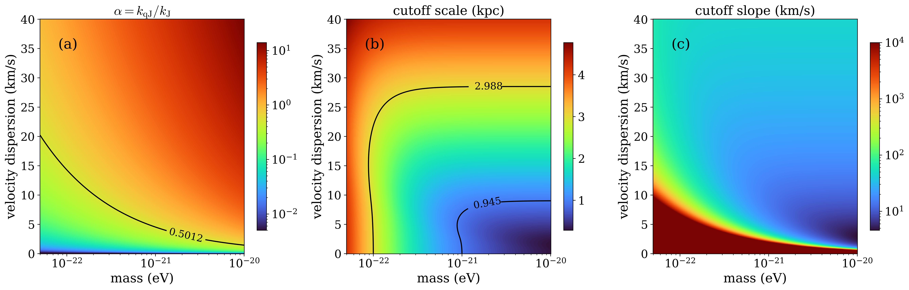

# arXiv Digest — 2026-07-07

- **Interest file used:** interests/2026.05.md (fallback — no 2026.07.md exists yet)
- **Categories pulled:** astro-ph.CO, astro-ph.EP, astro-ph.GA, astro-ph.HE, astro-ph.IM, astro-ph.SR, cs.LG, stat.ML, hep-ph
- **Papers scanned:** 700 (185 astro-ph primary + 515 cross-listed/other, incl. 234 cs.LG, 49 hep-ph, 23 stat.ML)
- **After first filter:** 18 candidates reviewed with full text
- **Final selected:** 13 papers across 4 tiers

---

## Tier 1 — Highly relevant

### [Collisionless damping of the gravitational instability in fuzzy dark matter: spectral shape and quantum-to-thermal crossover](https://arxiv.org/abs/2607.04893)

Yosuke Matsumoto, Kohji Yoshikawa, Naoki Yoshida
**Primary category:** astro-ph.CO | also: physics.plasm-ph

Starting from the Wigner transport equation, the authors build a fully quantum-kinetic linear theory of the gravitational instability for fuzzy dark matter, applying Landau's method to the Wigner–Poisson system and deriving a kinetic dispersion relation via the plasma dispersion function. The growth rate is governed by a single dimensionless quantum-to-thermal ratio $\alpha=k_{\rm qJ}/k_{\rm J}$: the cutoff wavenumber stays near the quantum Jeans scale for $\alpha\lesssim0.76$, but the *spectral slope* at the cutoff changes sharply across $\alpha\sim0.5$, marking a crossover from a thermally dominated (Landau-damped, phase-mixing) regime to a quantum-pressure-dominated one. They map these cutoff scales and slopes onto FDM particle mass and initial velocity dispersion, arguing both can be simultaneously constrained from the small-scale matter power spectrum.

---

### [Lyman-alpha haloes in the aftermath of reionisation](https://arxiv.org/abs/2607.05087)

Daniil Smirnov, Lutz Wisotzki, Tanya Urrutia et al.
**Primary category:** astro-ph.GA

Using MUSE at the VLT, the authors compare Lyα haloes (LAHs) around low-luminosity Lyα emitters at $z\geq6$ against a $z\sim3$ reference sample matched in *intrinsic* surface-brightness sensitivity (accounting for cosmological dimming) — an apples-to-apples control that previous studies lacked. They detect extended Lyα emission around 6 of 18 high-$z$ LAEs (more than doubling the known $z\geq6$ sample) and find the $z\geq6$ scale lengths are ~3× smaller than at $z\sim3$, with a KS test rejecting a common parent population ($p=0.0008$); the difference is not driven by stellar mass, Lyα luminosity, or SFR. They interpret the shrinkage as a reionisation-driven effect: a higher neutral fraction in the surrounding IGM/CGM scatters escaping Lyα away, leaving detectable only the emission from near the star-forming core.

---

### [Disentangling modified gravity and galaxy bias with field-level inference](https://arxiv.org/abs/2607.03514)

Sophie Hoyland, Daniela Saadeh, Kazuya Koyama, Harry Desmond
**Primary category:** astro-ph.CO | also: gr-qc

The authors run a Bayesian field-level analysis directly on the 3D galaxy number-count field, jointly constraining $f(R)$ modified gravity ($f_{R0}$) and a non-linear galaxy bias parameter $\beta$, with structure formation modelled by COLA and a non-linear bias mapping to mock catalogues. Because the full field retains non-Gaussian *and* Fourier-phase information that the power spectrum discards, it breaks the MG–bias degeneracy that cripples two-point analyses and tightens both parameters. A cosmic-web decomposition shows that under-dense regions (voids and walls) are the primary drivers distinguishing gravity models at the field level, and the pipeline is shown robust to initial conditions, Poisson noise, and field thresholding.

---

## Tier 2 — Adjacent / useful context

### [The heating rate of the Intergalactic Medium by Lyman-α photon scattering](https://arxiv.org/abs/2607.03400)

Avery Meiksin
**Primary category:** astro-ph.CO

Meiksin computes the efficiency of intergalactic-gas heating by the recoil of scattered Lyα photons using an exact numerical solution of the radiative-transfer equation for a high-redshift point source in an expanding medium, rather than the usual diffusion approximation. The key result is that the exact Lyα recoil heating rate is a factor of several *smaller* than the diffusion-approximation estimate commonly built into Cosmic Dawn simulations, because the approximations differ within the line core where the heat-exchanging scatters occur. This directly affects the predicted IGM kinetic temperature and hence the strength of the 21-cm absorption signal against the CMB.

*Figure removed (figure-file cleanup): efficiency.eps*

---

### [Inverse-k Primordial Oscillations from a Symbolic Regression Search](https://arxiv.org/abs/2607.04925)

Ze-Yu Peng, Qing-Yu Lan, Yun-Song Piao
**Primary category:** astro-ph.CO | also: gr-qc, hep-th

Instead of testing fixed oscillation templates, the authors run a template-free symbolic-regression search (PySR) for features in the primordial power spectrum, scanning a Pareto front of expression complexity against CMB likelihood. Both Planck and the combined Planck+ACT+SPT-3G datasets independently select a low-complexity inverse-$k$ oscillation, $\cos(B/k)$ with $B\simeq4\,\mathrm{Mpc}^{-1}$, as the leading feature, which fits the data better than the standard linear and logarithmic templates and shows a weak preference for a non-zero amplitude.

*Figure removed (figure-file cleanup): pysr_pareto_front.pdf*

---

### [Alleviating the Hubble Tension with Smooth Sign-Switching Dark Energy: Full CMB Constraints with DESI and PantheonPlus](https://arxiv.org/abs/2607.05044)

Mariam Bouhmadi-López, Hsu-Wen Chiang, Beñat Ibarra-Uriondo
**Primary category:** astro-ph.CO

The authors study ECDM, a smooth realisation of sign-switching dark energy in which the dark-energy density transitions gradually from negative to positive, and — crucially — develop perturbation equations that stay well-behaved even when the equation-of-state parameter diverges during the transition. Confronting the model against Planck 2018 + ACT DR6 + SPT-3G, DESI DR2 BAO, Pantheon+ SNe, and SH0ES, they find it is fully compatible with current precision data while alleviating the Hubble tension, and they assess the impact on structure growth and CMB anisotropies through the perturbations.

---

### [KiDS-Legacy: The consistency test of the large-scale structure with Bernardeau-Nishimichi-Taruya transform](https://arxiv.org/abs/2607.04384)

Shiming Gu, Ziang Yan, Ludovic van Waerbeke, Francis Bernardeau, Hendrik Hildebrandt et al.
**Primary category:** astro-ph.CO

The authors perform the first $k$-cut cosmic-shear analysis of KiDS-Legacy, using the Bernardeau–Nishimichi–Taruya (BNT) transform to build weak-lensing kernels localised enough to remove selected physical scales while retaining constraining power. Cutting $k\geq0.33\,\mathrm{Mpc}^{-1}$ with a theory-based Gaussian covariance gives $S_8=0.798\pm0.045$, consistent with the fiducial result and showing no significant bias from non-linear baryonic feedback; but computing the Gaussian covariance from the *observed* data vector instead drives $S_8$ down to $0.717$, and $k$-cut tests reveal a mild scale-dependent trend (up to $1.8\sigma$ low-vs-high-$k$ deviation) traced to the interplay of covariance prescription and data vector.

---

### [Machine Learning and the SKA for Cosmic Dawn and the Epoch of Reionization](https://arxiv.org/abs/2607.03606)

Anshuman Acharya, Michele Bianco, Daniela Breitman et al.
**Primary category:** astro-ph.IM | also: astro-ph.CO

This SKA science-book chapter surveys machine-learning methods proposed for 21-cm tomography of Cosmic Dawn and the Epoch of Reionization with the SKA, spanning instrument modelling, data analysis, simulation, and inference. It frames how data-driven algorithms (emulators, inference networks, foundation-model-style approaches) will be needed to handle the SKA's data volume and to extract high-redshift-universe physics from the 21-cm signal.

---

### [Euclid: Discovery of 31 new quasars at 6.6 < z < 7.8](https://arxiv.org/abs/2607.03432)

D. Yang, J. F. Hennawi, F. Guarneri et al.
**Primary category:** astro-ph.GA

From ~3000 deg² of the first 1.5 years of the Euclid Wide Survey, the authors report 31 new $6.6<z<7.8$ quasars, selected with machine-learning and probabilistic techniques on Euclid $I_E Y_E J_E H_E$ imaging and confirmed with Keck/Magellan/LBT spectroscopy. Twelve lie at $z\geq7$ (more than doubling the known $z\geq7$ census), they extend to the faint end of the quasar luminosity function ($-25.5<M_{1450}<-23.6$), and the highest-$z$ object at $z\approx7.77$ sets a new record for the most distant quasar reported.

---

### [FUSE: FK-Steered Multi-Modal Flow Matching for Efficient Simulation-Based Posterior Estimation](https://arxiv.org/abs/2607.05252)

Weichen Qin, Yufan Xie, Peihao Wang et al.
**Primary category:** cs.LG

FUSE is a simulation-based-inference method that estimates posteriors with a Feynman–Kac-steered, multi-modal flow-matching model. Its dual-track architecture preserves the structural disparity between parameters and observations rather than using brute-force fusion, which the authors argue improves estimation fidelity over prior SBI generative approaches on multimodal problems.

---

## Tier 3 — Outside my area but notable

### [High-Energy Neutrino Tomography of the Earth's Interior with IceCube](https://arxiv.org/abs/2607.02644)

The IceCube Collaboration
**Primary category:** astro-ph.HE | also: astro-ph.EP, hep-ex, physics.geo-ph

Using 10.7 years of 500 GeV–100 TeV muon-neutrino data, IceCube measures the Earth's radial density profile from the zenith- and energy-dependent attenuation of neutrinos traversing the planet, fitting a five-shell uniform-density model with full treatment of fluxes, cross sections, detector response, and ice systematics. From the density posteriors they derive the Earth's mass and polar moment of inertia — the most precise weak-interaction determinations to date — consistent with the seismological Preliminary Reference Earth Model and with gravitational measurements.

*Figure removed (figure-file cleanup): 5B_GOF_ws.pdf*

---

### [Planetary-Mass Exosatellite Detected Around the Substellar Companion of a Star](https://arxiv.org/abs/2607.05193)

Kevin Hoy, Alice Zurlo, Pablo A. Peña R. et al.
**Primary category:** astro-ph.EP | also: astro-ph.SR

Applying radial-velocity analysis to VLT/CRIRES+ spectra of the directly-imaged brown dwarf CD-35 2722 B, the authors report strong evidence for at least one orbiting satellite — the first time the RV technique has yielded evidence of an exosatellite. The primary candidate has a minimum mass of 0.743 $M_{\rm J}$ and a 169-day period, with a tentative second, closer satellite (0.277 $M_{\rm J}$, 87 days); the pair sits near a 2:1 mean-motion resonance reminiscent of the Galilean moons.

*Figure removed (figure-file cleanup): final_orbit_old.pdf*

---

## Tier 4 — Meta-research about the field

### [A Model Context Protocol Server for Astrophysical RAG: Unified Access to HI, Dwarf, Globular Cluster, IntZ, and ALPINE Kinematic Corpora with FAISS Semantic Search](https://arxiv.org/abs/2607.03946)

David C. Flynn
**Primary category:** astro-ph.GA | also: astro-ph.IM

This paper presents an Astro-RAG Model Context Protocol (MCP) server that exposes five astrophysical corpora (~2,064 objects, from local HI rotation curves and Milky Way globular clusters to $z\sim5.7$ ALPINE kinematics) through a browser interface, a REST API, and an LLM-native MCP endpoint, with FAISS-accelerated natural-language similarity search over pre-built vector indices. It is publicly deployed and reproducible, and demonstrates retrieval, metadata filtering, and semantic queries across epochs without fine-tuning or API keys.
