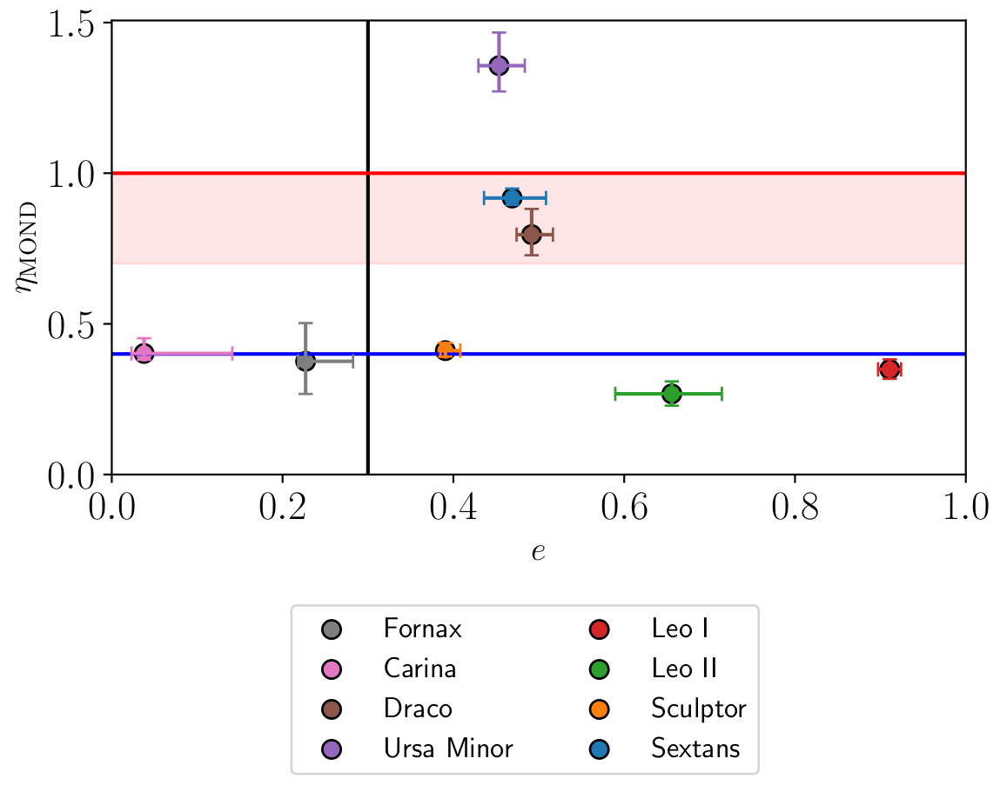

# arXiv Digest — 2026-07-08

**Interest file used:** interests/2026.05.md (fallback — no 2026.07.md exists yet)
**Categories pulled:** astro-ph.CO, astro-ph.EP, astro-ph.GA, astro-ph.HE, astro-ph.IM, astro-ph.SR, cs.LG, stat.ML, hep-ph
**Papers scanned:** 234 (81 astro-ph new/cross + 153 cs.LG/stat.ML/hep-ph)
**After first filter:** 11 candidates reviewed with full text
**Final selected:** 10 papers across 4 tiers

*Note: a light day for the core Lyman-α / DESI program — only 9 astro-ph.CO announcements, with most of the astro-ph feed being stellar, high-energy, and planetary work. The one direct forest hit anchors Tier 1; the rest of the digest is adjacent structure-formation, inference-methods, and dark-matter context.*

---

## Tier 1 — Highly relevant

### [Uncertainty-Aware Deep Learning for the Lyα Forest: CNN-Based Absorber Detection and Characterization](http://arxiv.org/abs/2607.05494v1)

Paryag Sharma, Vikram Khaire, Ting-Yun Cheng et al.
**Primary category:** astro-ph.GA

The authors train a 1D convolutional neural network to identify H I Lyα absorbers directly from quasar spectra and simultaneously regress column density ($N_{\rm HI}$), Doppler parameter ($b_{\rm HI}$), and line centroid, replacing computationally expensive Voigt-profile fitting. The network is trained on synthetic spectra drawn from IllustrisTNG and labelled with the VIPER fitting code, and uses a multi-task architecture with four output heads plus Monte-Carlo-dropout uncertainty quantification. On simulated spectra it reaches an F1 of ~0.8 with MAEs of ~0.18 dex in $\log N_{\rm HI}$ and ~0.10 in $\log b_{\rm HI}$, accurately reproducing the column density distribution function and the $b$–$N$ relation; on real high-resolution UVES spectra performance drops (F1 ~0.5) due to a clearly diagnosed simulated-to-observed domain shift, though the recovered CDDF and $b$–$N$ distributions remain consistent with VIPER.

This is the day's direct hit on the interest file's core Lyman-α forest × IGM × machine-learning axis: a scalable, uncertainty-aware alternative to Voigt fitting aimed squarely at upcoming spectroscopic surveys, and the honest treatment of the sim-to-real domain gap (via latent-space analysis) is exactly the kind of caveat that matters for deploying ML on DESI-scale forest data.

---

## Tier 2 — Adjacent / useful context

### [Optimal and exact wide-angle power spectrum estimation](http://arxiv.org/abs/2607.05513v1)

Noah Sailer, Kendrick Smith, Yurii Kvasiuk et al. (A. Laguë among co-authors)
**Primary category:** astro-ph.CO

The authors derive the optimal power spectrum estimator on ultra-large scales where the plane-parallel approximation breaks down, showing it is equivalent to a previously proposed two-$\ell$ generalization of the Yamamoto estimator. Their second result rewrites the exact two-$\ell$ window function as a finite number of FFT-evaluable terms, replacing the slowly converging infinite-series truncation used in conventional analyses. For linear-theory redshift-space distortions they validate the finite window representation numerically and demonstrate order-unity signal-to-noise gains on the largest scales, with the framework also applying to kSZ radial-velocity reconstruction.

Directly relevant to the interest file's standing focus on optimal/quadratic power-spectrum estimators and their window functions — the same estimator-methodology thread that runs through the DESI P1D FFT-vs-optimal-estimator work, here generalized to the wide-angle regime. Alex Laguë (co-author of library-relevant ULA/emulator work) is on the author list.

*No figures extracted for 2607.05513 (a compact analytic methods paper; its numerical-validation plots add little beyond the text summary).*

---

### [One with HI: Modelling HI Intensity Mapping one-point statistics including systematics](http://arxiv.org/abs/2607.06526v1)

Bernhard Vos-Gines, Cora Uhlemann
**Primary category:** astro-ph.CO

This paper builds a theoretical model for the one-point PDF of neutral-hydrogen intensity maps in spherical cells, using large-deviation statistics and spherical collapse together with a nonlinear tracer bias and stochasticity prescription. Crucially, it folds in the two dominant observational systematics for SKAO-era intensity mapping — foreground removal and the telescope beam — and validates the model against high-resolution simulations. The headline result is that even after these systematics degrade the signal, the HI PDF still captures non-Gaussian information beyond the power spectrum and tightens cosmological constraints by breaking the degeneracy between linear bias and clustering amplitude.

Adjacent on two fronts the interest file cares about: 21cm/HI as the post-reionization complement to the Lyα forest ($z<6$), and beyond-two-point / one-point statistics as an information-extraction technique — the large-deviation-PDF machinery here is directly transferable to field-level and non-Gaussian analyses of forest and LSS data.

---

### [The dark matter halo mass function in the ΛCDM cosmology at all times and over all scales — from planetary to galaxy cluster masses](http://arxiv.org/abs/2607.05505v1)

Haonan Zheng, Sownak Bose, Carlos S. Frenk et al.
**Primary category:** astro-ph.CO | also: astro-ph.GA

Combining the Voids-within-Voids-within-Voids (VVV) zoom simulations with large lower-resolution boxes via a subsampling scheme that reconstructs the global mass function from biased underdense regions, the authors measure the ΛCDM halo mass function across an enormous dynamic range — from a planetary-mass cutoff ($10^{-6}\,M_\odot$, set by a 100 GeV WIMP free-streaming scale) to rich clusters ($10^{15.5}\,M_\odot$), and from $z=30$ to today. They provide a recalibrated Reed-et-al.-style fitting formula accurate to ~2–3% at $z<2$ and ~7% at $z\gtrsim5$, with public code, and show it extends to other mass definitions and mildly non-fiducial cosmologies.

Useful structure-formation infrastructure for the small-scale-power / warm-dark-matter side of the interest file: the low-mass, high-redshift end of the mass function — where the CDM free-streaming cutoff lives — is precisely the regime probed by forest-based WDM/fuzzy-DM constraints, and a percent-level all-scales fit is a handy forward-model ingredient.

---

### [Constraints on the population-level distribution of nearby Dark Matter halo shapes with extragalactic streams](http://arxiv.org/abs/2607.05510v1)

David Chemaly, Elisabeth Sola, Sergey Koposov et al. (V. Belokurov, D. Erkal among co-authors)
**Primary category:** astro-ph.GA

Applying a previously developed hierarchical Bayesian pipeline to 32 stellar streams from the STRRINGS deep-imaging catalogue, the authors forward-model each stream's projected track under an axisymmetric halo to constrain the flattening parameter $q$, then combine posteriors via importance sampling to infer the population distribution. A variance-inflation term flags a high-quality "gold" subsample of 17 streams; for that sample they infer an oblate halo population with mean $\mu_q\approx0.72$ and intrinsic scatter $\sigma_q\approx0.34$, broadly consistent with cosmological hydrodynamical simulations. The framework is explicitly designed to scale to the much larger stream samples coming from Euclid and Rubin/LSST.

Relevant both as a dark-matter-substructure probe (a sibling to forest-based small-scale-structure constraints) and, methodologically, as a clean example of the hierarchical-Bayesian / importance-sampling population-inference workflow the interest file lists among its rising inference tools.

*No figures extracted for 2607.05510 (population-inference corner/posterior plots require substantial context to read; the text summary conveys the headline $\mu_q$, $\sigma_q$ result).*

---

### [A Novel Implementation of Self-Interacting Dark Matter in AREPO](http://arxiv.org/abs/2607.05504v1)

Oliver Zier, Xuejian Shen, Vinh Tran et al. (M. Vogelsberger among co-authors)
**Primary category:** astro-ph.CO | also: hep-ph

The authors present a new Monte-Carlo self-interacting-dark-matter (SIDM) scattering solver for the moving-mesh code AREPO-2, built around a dedicated DM-only neighbour-search tree that decouples scattering from gravity while preserving hierarchical time integration. A pairwise MPI communication scheme conserves momentum and energy across multiple scattering events per timestep, and the implementation natively supports velocity-dependent cross-sections and inelastic interactions. Validated on idealized and cosmological tests, it runs with only modest overhead over CDM (except during late gravothermal core collapse) and is substantially faster than the previous AREPO-1 SIDM module.

Adjacent to the small-scale-structure dark-matter thread: SIDM core-collapse produces the dense low-mass haloes and substructure probed by stellar streams and strong lensing — the same non-cold-dark-matter phenomenology the forest constrains from the opposite (free-streaming/suppression) direction — so a fast, extensible SIDM simulation tool is worth tracking as the modelling backend for those comparisons.

*No figures extracted for 2607.05504 (a code/methods paper; the validation and scaling plots are implementation-specific and not illuminating in isolation).*

---

### [Imprint of swampland-inspired coupled early dark energy](http://arxiv.org/abs/2607.06147v1)

Hao Wang, Yun-Song Piao
**Primary category:** astro-ph.CO

Motivated by the Swampland Distance Conjecture, the authors study a fractional coupling between dark matter and early dark energy (EDE) against DESI DR2 BAO, using a conditional normalizing-flow network to sample the high-dimensional posterior in a joint fit with Planck CMB, Pantheon+ SNe, and SH0ES. They find the EDE–DM coupling does not appreciably ease the $S_8$ tension, but that the detailed EDE potential matters: an axion-like EDE mildly favours evolving dark energy, whereas AdS-EDE suppresses it and shows a $\gtrsim1\sigma$ preference for a non-zero coupling — indicating that the potential's construction, not just the presence of EDE, shifts late-time dark-energy inferences.

Two interest-file threads intersect here: the DESI DR2 BAO / dynamical-dark-energy story that dominates the recent LSS additions, and the use of normalizing flows as the inference engine — a concrete example of flow-based posterior sampling applied to a real DESI cosmology fit.

*No figures extracted for 2607.06147 (the constraint contours require the full model context to interpret; the coupling/DE conclusions are captured in the text).*

---

## Tier 3 — Outside my area but notable

### [The tidal features of the classical Milky Way satellites: Expected in MOND but inconsistent with cold dark matter models](http://arxiv.org/abs/2607.05502v1)

Elena Asencio, Indranil Banik, Pavel Kroupa
**Primary category:** astro-ph.GA

The authors estimate the tidal susceptibility of the classical Milky Way satellites by comparing each dwarf's half-mass radius to its theoretical tidal radius at pericentre, in both ΛCDM and Milgromian dynamics (MOND). They argue that in ΛCDM the dwarfs' dark-matter haloes should make them tidally resilient, so their observed tidal tails, distortions, and substructures are unexpected, whereas in MOND most classical satellites are predicted to be tidally perturbed — matching the observed tidal features and even the anomalously high velocity dispersions reported for a few (Ursa Minor, possibly Draco and Sextans).

A pointed, if partisan (Kroupa/Banik), challenge to the standard model on small scales; worth knowing as a scientist because dwarf-galaxy tidal susceptibility is a recurring pressure point for ΛCDM, adjacent to the small-scale-structure dark-matter questions the forest also bears on — read alongside the CDM-consistent halo-shape and mass-function results elsewhere in this digest.

---

## Tier 4 — Meta-research about the field

### [Executable verification through formalized expert reasoning in astronomical spectroscopy](http://arxiv.org/abs/2607.06128v1)

Haosong Wang, Ting Tan, Ji Yao et al. (C. Yeche, J.-P. Kneib among co-authors)
**Primary category:** astro-ph.CO | also: astro-ph.IM

FORMA (Formalized Observational Reasoning with Auditable Decisions) is an executable verification protocol that reconstructs expert reasoning into an auditable workflow — extracting spectral evidence, generating hypotheses under physical constraints, testing alternatives, and producing a consistency-checked credibility score — as a counterweight to the "prediction is automated but verification is still a human bottleneck" problem. Applied to the DESI visual-inspection catalogue, a medium-or-higher credibility threshold yields 331 definite predictions with 95.5% binary agreement with expert-adjudicated classes, and higher credibility tracks improved redshift consistency. The emphasis is on recording and testing the evidential path to a decision rather than post-hoc interpretability.

A useful data point on how AI is changing the *verification* half of survey astronomy — directly on DESI spectra, with DESI-collaboration authorship (Christophe Yeche, an interest-file high-value name) — and a template for auditable, physics-constrained automation of the visual-inspection step that gates forest and redshift catalogues.

*No figures extracted for 2607.06128 (a workflow/protocol paper; its figures are schematic and score-distribution plots that add little to the summary).*

---

### [Articulating Assumptions in AI-Generated Scientific Analyses through Task Decomposition](http://arxiv.org/abs/2607.05762v1)

Ahmed Hammad, Mihoko Nojiri
**Primary category:** cs.SE

The authors introduce "quantity-grounded semantic differencing," a multi-agent framework that decomposes LLM-generated scientific analysis code into separate code-generation, execution, tracing, and validation agents so it can reconstruct how key output quantities are produced and surface where the implementation diverges from the intended analysis. A front-end module inspects ambiguities in the natural-language instruction and proposes rewrites before code generation. Validated on representative collider-physics analyses, the modular decomposition improves transparency and reliability over a single-prompt baseline and lets substantially smaller models complete the full workflow.

Meta-research on a problem the whole field is walking into: as LLM-generated analysis code proliferates, reproducibility and assumption-tracking become first-class concerns — relevant to anyone (this library included) increasingly running AI-assisted inference and analysis pipelines, and a concrete proposal for making those pipelines auditable.

*No figures extracted for 2607.05762 (a conceptual framework paper; the only figures are pipeline schematics).*
