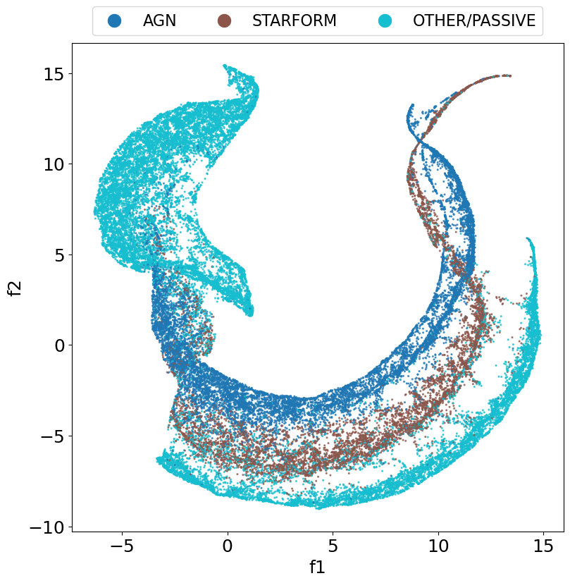
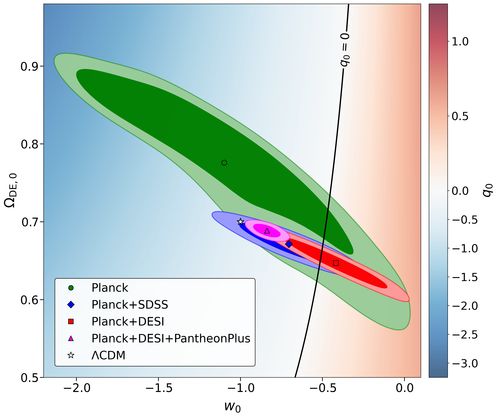
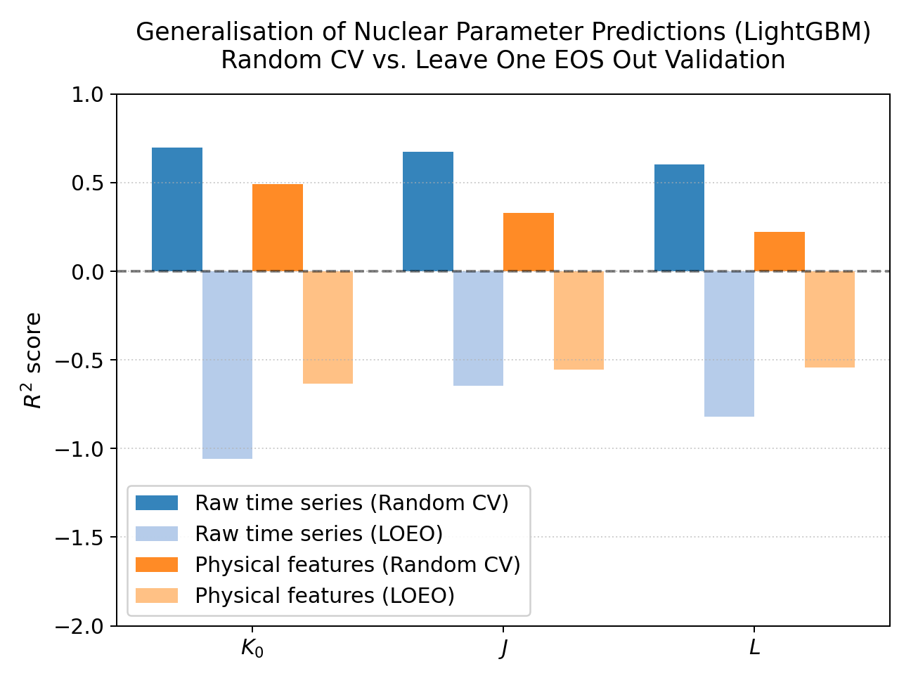
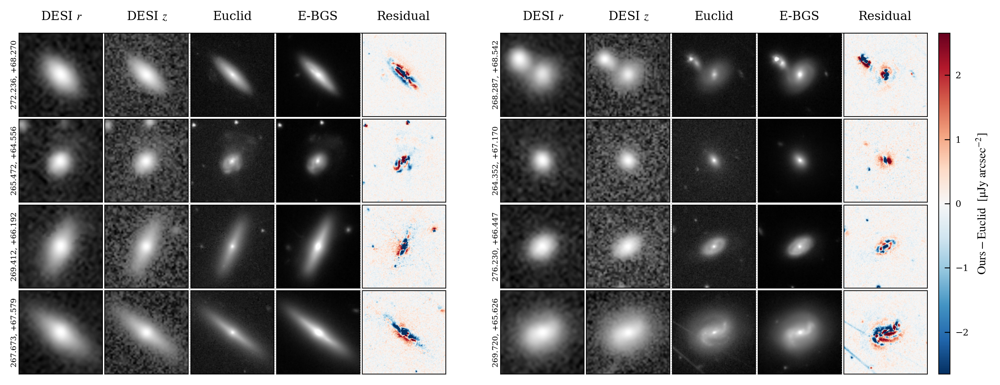

# arXiv Digest — 2026-07-09

- **Interest file used:** interests/2026.05.md (fallback — no 2026.07.md exists yet)
- **Categories pulled:** astro-ph.CO, astro-ph.EP, astro-ph.GA, astro-ph.HE, astro-ph.IM, astro-ph.SR, cs.LG, stat.ML, hep-ph
- **Papers scanned:** 300 (~77 astro-ph new/cross + ~223 cs.LG/hep-ph/stat.ML and other cross-listed)
- **After first filter:** 9 candidates reviewed with full text
- **Final selected:** 9 papers across 2 tiers

---

## Tier 1 — Highly relevant

### [Beyond traditional emission-line diagnostics: using autoencoders to uncover active galactic nuclei in DESI spectra](http://arxiv.org/abs/2607.07329v1)

J. A. Alcolea, M. Siudek, M. Eriksen et al.
**Primary category:** astro-ph.GA

The authors apply the SPENDER spectroscopic autoencoder to compress 50,222 DESI DR1 (Guadalupe) galaxy spectra at z ≤ 0.5 into a 10-dimensional latent space, then classify sources with a k-d tree majority vote over the 10 nearest labelled neighbours — a semi-supervised scheme where the representation is learned label-free and class assignments propagate from FastSpecFit emission-line reference labels. They reach 0.952 accuracy for AGN and 0.965 for broad-line AGN (AUC ≈ 0.97), recovering AGN in low-S/N spectra that standard BPT diagnostics miss; 93.5% of "disagreeing" AGN predictions are confirmed by at least one independent value-added-catalogue diagnostic, so the quoted metrics are lower bounds. The learned latent space also correlates with stellar mass, SFR, NUV−r colour, and redshift, indicating it captures physically meaningful structure rather than label artefacts.

---

## Tier 2 — Adjacent / useful context

### [Present Day Cosmic Acceleration from SDSS and DESI BAO: A Call for Finer Tomography of the DESI Bright Galaxy Survey](http://arxiv.org/abs/2607.07348v1)

Anna Chiara Ferri, Ruchika, Alessandro Melchiorri
**Primary category:** astro-ph.CO

Within the CPL (w₀wₐCDM) framework the authors compare present-day quantities from Planck+SDSS DR16 versus Planck+DESI DR2 BAO. Planck+DESI prefers a less-negative w₀ = −0.41⁺⁰·²¹₋₀.₂₂ and a median deceleration parameter q₀ = +0.10 (on the non-accelerating side), while Planck+SDSS gives w₀ = −0.71 and q₀ = −0.22 (accelerating) — an offset of only ~1.1σ. Because q₀ is anchored by the lowest effective redshift probed, SDSS (MGS, z_eff ≈ 0.15) constrains it data-drivenly whereas DESI's lowest bin (BGS, z_eff ≈ 0.295) must extrapolate; adding Pantheon+ restores q₀ = −0.37. They argue the apparent DESI "non-accelerating present" reflects redshift sampling rather than new physics and recommend finer tomographic binning of the DESI BGS.

### [Gamma-ray bursts reveal the history and faint contributors of cosmic reionization](http://arxiv.org/abs/2607.07610v1)

Jing-Meng Hao, Paolo Cassata, Zhen-Ya Zheng et al.
**Primary category:** astro-ph.CO | also: astro-ph.HE

Using 486 Swift/BAT long GRBs (76 at z ≥ 3.5) as unbiased tracers of total star formation, calibrated against well-measured SFRD at z = 3.5–4.5, the authors infer the cosmic star-formation-rate density across 4 < z < 10 from the LGRB redshift distribution, sidestepping detailed luminosity-function modelling via redshift-dependent luminosity cuts. The resulting SFRD declines only gradually (slope k = −0.15 ± 0.02) and sits systematically above UV-galaxy estimates at z ≳ 6. Fed into a standard reionization calculation with fiducial ξ_ion = 10²⁵·³ Hz erg⁻¹ and a moderate f_esc = 0.1, this SFRD reproduces the reionization timeline (x_HI → 0 by z ~ 6, complete by z ~ 5.3), the ionizing emissivity, and Planck τ_e = 0.0544 without extreme escape fractions. Matching the excess to integrated UV luminosity functions requires progressively fainter limits (M_lim ~ −14 at z ~ 6 to ~ −10 at z ~ 10), implying faint galaxies supply >50% of star formation at z > 8.

*Figure removed (figure-file cleanup): sfrd_vs_redshift.pdf*

### [Fast Graph-based Higher-Order Clustering Statistics on the GPU](http://arxiv.org/abs/2607.06604v1)

Cristiano G. Sabiu
**Primary category:** astro-ph.IM | also: astro-ph.CO

This Version-2 update to GRAMSCI, a graph/kd-tree code for N-point spatial correlation functions of discrete point sets, adds five capabilities: an O(m) "merge-walk" replacing the O(m log m) binary-search inner loop; a parity-decomposed 4-point correlation function (even/odd channels via signed tetrahedron volume) for direct tests of parity violation in the galaxy distribution; an internal disconnected-term subtraction to return the connected 4pCF; a NumPy interface; and, principally, a full OpenACC GPU port with out-of-core tiling. Measured GPU speedups run 2.6× (3pCF) to 9× (4pCF) over a 64-thread node (41× cumulative over v1), and a 9×10⁹-edge BAO-scale 3pCF runs on a single 24 GB card with ~20% tiling overhead. It is validated against the CPU reference, analytic injection tests, and applied to the DESI DR1 LRG sample versus the EZmock ensemble.

### [Impact and measurability of linear relativistic effects in galaxy surveys](http://arxiv.org/abs/2607.06697v1)

Robin Y. Wen, Henry S. Grasshorn Gebhardt, Olivier Doré
**Primary category:** astro-ph.CO

The authors forecast how well DESI, Euclid, and SPHEREx can measure local primordial non-Gaussianity (f_NL) and linear general-relativistic clustering effects using the spherical Fourier-Bessel (SFB) power spectrum. Methodologically they introduce a Chebyshev-decomposition scheme that reduces full-GR multi-tracer SFB evaluation to ~O(1 s), enabling the first Bayesian inference in 3D clustering with the complete set of linear relativistic terms plus an exact SFB treatment of redshift errors and Fingers-of-God. Neglecting GR biases f_NL at the 1–3σ level for Euclid and SPHEREx (e.g. Δf_NL = +1.8 for SPHEREx 5T), and the GR–PNG degeneracy degrades σ(f_NL) by a few percent up to nearly a factor of two depending on tracer. Multi-tracer analyses detect the Doppler term at ~3σ (DESI LRG+ELG+QSO) to ~6σ (SPHEREx), and relativistic clustering partially breaks the exact b_φ·f_NL degeneracy.

### [Primordial Physics in the Nonlinear Universe: Towards particle constraints using the Weak lensing, Thermal SZ, and X-ray fields](http://arxiv.org/abs/2607.06692v1)

Dhayaa Anbajagane
**Primary category:** astro-ph.CO

This paper forecasts how well primordial non-Gaussianity (f_NL) can be constrained from the *nonlinear* universe by jointly analysing three massive-halo-dominated fields — weak lensing, thermal SZ, and X-ray — instead of weak lensing alone. Using the N-body-based Ulagam suite (2000+ full-sky maps) with six inflationary bispectrum templates, a semi-analytic baryon model, and correlated foreground modelling, the author runs simulation-based Fisher forecasts on the second and third moments for LSST Y10 + SO-like tSZ + eROSITA. The joint WL+tSZ+X-ray analysis yields a factor-of-two improvement in f_NL over WL alone and, crucially, self-calibrates nuisance/baryon parameters through cross-correlations, so the fully marginalized multi-probe result rivals a nuisance-fixed WL-only analysis. The public multi-wavelength map-maker (Vaanam) is released alongside.

### [The Generalization Gap in Machine Learning EoS Inference from Core-Collapse Supernova Gravitational Waves](http://arxiv.org/abs/2607.06736v1)

Ayan Mitra
**Primary category:** astro-ph.HE | also: nucl-th

This is a generalization audit of ML pipelines that infer the dense-matter equation of state from core-collapse supernova gravitational waves. Using the public Richers catalogue (1,764 waveforms, 11 unique (K₀,J,L) triplets), the author shows that standard random 5-fold cross-validation makes a LightGBM regressor look successful (R² ≈ 0.6–0.7), but under Leave-One-EoS-Out validation the same model collapses to *negative* pooled R² — worse than a mean predictor — and the failure persists across Ridge, random forests, MLPs, and gradient boosting, and across PCA versus hand-crafted physical features. The gap is attributed to template leakage plus physical degeneracy, not merely catalogue sparsity. A contrasting case study finds progenitor-mass classification does generalize to unseen rotation rates, while continuous regression again compresses predictions toward the training-grid interior.

### [From DESI to Euclid: A Generative Bridge to Unbiased Galaxy Structures](http://arxiv.org/abs/2607.06891v1)

Renhao Ye, Shiyin Shen
**Primary category:** astro-ph.GA | also: astro-ph.IM

The authors train an Image-to-Image Schrödinger Bridge (I²SB) diffusion model that translates ground-based DESI r/z-band imaging of Bright Galaxy Survey targets into Euclid VIS-resolution images. A Fourier Ring Correlation analysis shows the recovered structure is phase-coherent (data-constrained, not prior-hallucinated) down to 0.37″ versus 1.41″ for DESI r-band — a ~3.8× resolution gain, though short of Euclid's native 0.16″. This de-biases structural parameters: the Petrosian-radius bias improves from −0.870″ to +0.075″, Sérsic R_e from −0.322″ to −0.018″, and Sérsic index from +0.262 to +0.093, removing the size-dependence of the bias (though not reducing scatter). Predictions over the Euclid DR1 footprint are released as "E-BGS."

### [Natural Phantom Dark Energy from a $\mathbb{Z}_N$-Axion](http://arxiv.org/abs/2607.06774v1)

Cédric Delaunay, Admir Greljo
**Primary category:** hep-ph | also: astro-ph.CO

The authors build a technically natural microscopic model of apparent phantom dark energy from an axion coupled to N copies of two-flavour dark QCD related by a Z_N exchange symmetry. The Z_N symmetry cancels the leading harmonics and exponentially suppresses the axion vacuum potential, naturally yielding the meV dark-energy scale without a tuned quark-mass hierarchy; reheating populates a single copy, softly breaking Z_N and providing dark-pion dark matter whose finite density initially traps the axion near φ = πf. As that density redshifts away the axion is released and rolls toward φ = 0, and the φ-dependent pion mass transfers energy from dark matter to dark energy, producing an effective w_DE < −1 that reproduces the DESI ~3σ preference for evolving/phantom-crossing dark energy.

*Figure removed (figure-file cleanup): wDE_vs_desi.pdf*
