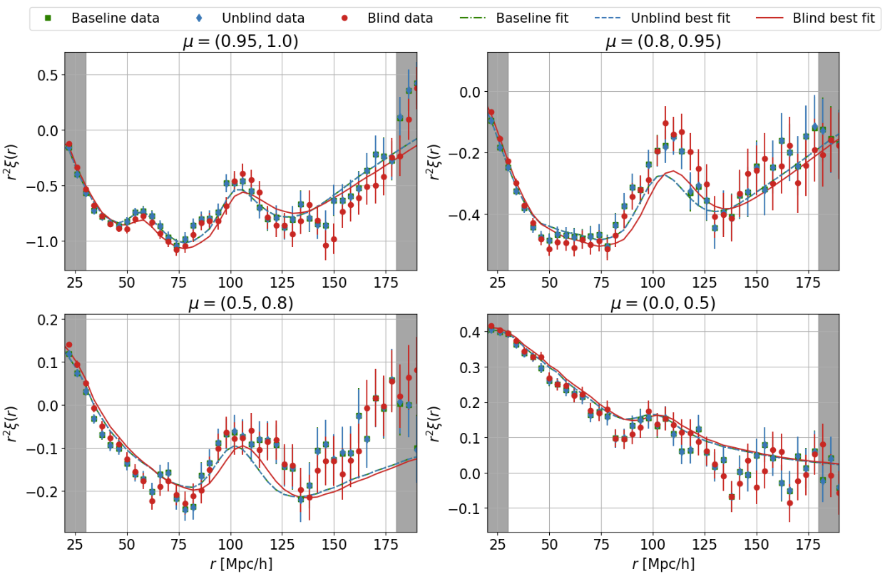

# arXiv Digest — 2026-07-10

- **Interest file used:** interests/2026.05.md (fallback — no 2026.07.md exists yet)
- **Categories pulled:** astro-ph.CO, astro-ph.EP, astro-ph.GA, astro-ph.HE, astro-ph.IM, astro-ph.SR, cs.LG, stat.ML, hep-ph
- **Papers scanned:** 259 unique (90 astro-ph new/cross + 169 cs.LG/stat.ML/hep-ph and their cross-lists)
- **After first filter:** 21 candidates reviewed with full text
- **Final selected:** 11 papers across 3 tiers

---

## Tier 1 — Highly relevant

### [Alcock-Paczynski Blinding Scheme for the Ly-$α$ Forest Analysis](http://arxiv.org/abs/2607.07875v1)

G. Perez-Sanchez, S. F. Beltran, G. Niz et al. (DESI collaboration; incl. S. Brieden)
**Primary category:** astro-ph.CO

The authors build a catalog-level blinding scheme for the DESI Lyman-α forest BAO analysis by adapting the Alcock-Paczynski test: after continuum fitting and extraction of the δ-flux field, each quasar forest is geometrically shifted in wavelength (with consistent shifts to QSO redshifts) to mimic an alternative expansion history and hide the true cosmology from the analysts. They validate on a ladder of datasets — low-noise mocks with and without metals, realistic DESI Y1 synthetic catalogs, and finally the real DESI DR1 sample of >420,000 quasars at z>2.1 — using both the Lyα×Lyα auto- and Lyα×QSO cross-correlations. The method robustly moves the BAO peak to the value expected for a ~5% shift in matter content while leaving posterior shapes essentially intact (only a small contour tilt), and the *unblinded* DR1 result reproduces the published DESI DR1 Lyα BAO baseline. The main residual limitation is in the 1D correlation function, where metal and Lyβ contamination mix into the forest.

---

### [Subaru meets JWST: A Direct Measurement of Ly$α$ Escape Fraction at $z\simeq6.2$ with Dual Narrow-Band Imaging](http://arxiv.org/abs/2607.08264v1)

Shunta Shimizu, Nobunari Kashikawa, Ryo Emori et al.
**Primary category:** astro-ph.GA

Combining JWST/NIRCam F470N (Hα) with Subaru/HSC NB872 (Lyα) narrow-band imaging in the CEERS field, the authors make a direct, simultaneous measurement of the Lyα escape fraction (f_esc^Lyα) for Hα emitters at z≃6.2, inside the epoch of reionization. From 84 Hα emitters (56 with reliable NB872, 19 Lyα-detected), the completeness-weighted stack gives a median f_esc^Lyα = 0.106 (+0.066/−0.044), consistent with other z~6 measurements and showing no dependence on Hα luminosity. Per-galaxy, f_esc^Lyα correlates positively with Lyα equivalent width and negatively with UV slope β and rest-UV size, but not with SED dust or optical size — pointing to compact, low-attenuation star-forming components rather than global dust as the driver. If Lyα escape traces Lyman-continuum leakage, relatively luminous emitters (not only the faintest galaxies) may contribute significantly to the reionization ionizing-photon budget.

---

## Tier 2 — Adjacent / useful context

### [HETDEX [OII] galaxies at $z \le 0.48$: Volume-limited samples and their power spectra](http://arxiv.org/abs/2607.08453v1)

Jeongin Moon, Eiichiro Komatsu, Robin Ciardullo et al.
**Primary category:** astro-ph.CO

From the HETDEX PDR1 catalog of half a million [OII] emission-line galaxies over 540 deg² at $z\le0.48$, the authors construct volume-limited samples in three luminosity bins across two fields, with number densities $\bar n\simeq(2$–$5)\times10^{-3}\,h^3$Mpc$^{-3}$ — five to ten times denser than typical ELG cosmological surveys. Monopole and quadrupole power spectra agree with Uchuu-simulation Planck-ΛCDM mocks across $0.01<k<0.7\,h$Mpc$^{-1}$. The clustering amplitude implies host halo masses $\log(M_0/h^{-1}M_\odot)\simeq11.9$–12.3 with a weak [OII]-luminosity dependence ($M_0\propto L^{0.37\pm0.10}$) and ~13% subhalo occupation.

---

### [DegenDetector: Symbolic Recovery of Parameter Degeneracies in Bayesian Posteriors](http://arxiv.org/abs/2607.08755v1)

Chaipat Tirapongprasert, Matthew Ho
**Primary category:** astro-ph.IM

DegenDetector automatically identifies parameter degeneracies in posterior distributions and expresses them as closed-form symbolic equations, combining mutual-information screening to find correlated parameter groups with alternating symbolic regression to fit their functional relationship. Unlike corner plots, which only reveal that a correlation exists, it recovers the underlying analytic form, and it scales to high-order (multi-parameter) degeneracies without domain-specific input. The result is interpretable structure that can be read directly off a fitted posterior.

---

### [Robust Heteroskedastic Matrix Factorization: A Generalization of PCA that Flags Outliers and Handles Missing Data](http://arxiv.org/abs/2607.08081v1)

Thomas Hilder, David W. Hogg, Andrew R. Casey, Hans-Walter Rix
**Primary category:** astro-ph.IM | also: astro-ph.SR

RHMF generalizes PCA to be robust to outliers, to respect per-feature uncertainties and missing data, and to automatically flag per-feature and per-object anomalies, via an iterative reweighting scheme that implicitly maximizes a Student-t likelihood (equivalently, a hierarchical model with per-datapoint latent variances). The authors provide a fast JAX implementation (Robusta-HMF) and show hyperparameters can be set reliably by cross-validation. Applied to Gaia DR3 RVS spectra, it isolates anomalous main-sequence stars — a known Be-star binary, M dwarfs with subtle Ca II emission — that would be missed by eye.

---

### [Force convergence in Monte Carlo Lyman-alpha radiative transfer](http://arxiv.org/abs/2607.08726v1)

Joshua Kasiri, Aaron Smith, Kevin Lorinc et al.
**Primary category:** astro-ph.GA

The authors study convergence of momentum-transfer (radiative-acceleration and force-multiplier) estimators in Monte Carlo Lyman-α radiative transfer through optically thick static spherical clouds, where photons scatter many times before escaping. They establish diffusion-limit benchmarks and develop a moment-based framework that separates three distinct questions — whether an estimator converges to the correct mean, how large its finite-sampling uncertainty is, and whether that uncertainty estimate is itself stable — and apply this hierarchy to three estimators (direct event-based, gradient-of-energy-density, divergence-of-radiation-pressure). They show why statistical precision, computational cost, and physical accuracy must be assessed separately, and quantify how core-skipping, geometry, and resolution enter each level.

---

### [Can Distance Duality Violation Save Late-time Solutions to the Hubble Tension?](http://arxiv.org/abs/2607.08654v1)

Yashi Tiwari, Ujjwal Upadhyay, Shao-Jiang Wang, Vivian Poulin
**Primary category:** astro-ph.CO

Recasting the Hubble tension in the $r_d$–$M_B$ plane, the authors show that distance duality plus BAO and uncalibrated supernovae, at fixed sound-horizon calibration, pins $H_0$ independently of the late-time expansion history — so any purely late-time fix requires violating the cosmic distance-duality relation (CDDR). They then test that escape hatch by separately constraining reciprocity violation and photon non-conservation, deriving a new bound on reciprocity-violating angular-diameter-distance distortions from BAO and cosmic chronometers. Combined with existing photon-conservation limits, the level of CDDR violation needed to resolve the tension is strongly disfavoured. The conclusion: with fixed sound-horizon and SN calibrations, no late-time-only modification — even one breaking distance duality — can resolve the tension, pointing to early-Universe physics or local systematics.

Core cosmology context: uses DESI-style BAO and directly constrains the space of solutions to the H0 tension, a first-order concern for anyone doing DESI expansion-history cosmology (§4).

---

### [Alleviating the Hubble Tension with Smooth Sign-Switching Dark Energy: Full CMB Constraints with DESI and PantheonPlus](http://arxiv.org/abs/2607.05044v1)

Mariam Bouhmadi-López, Hsu-Wen Chiang, Beñat Ibarra-Uriondo
**Primary category:** astro-ph.CO | also: hep-ph

The authors study ECDM, a smooth realization of sign-switching dark energy in which the dark-energy density transitions gradually from negative to positive, and develop perturbation equations that stay well-behaved even when the equation-of-state parameter diverges through the transition — enabling a full test against CMB anisotropies and structure growth rather than background-only fits. Confronting the model with Planck 2018, ACT DR6, SPT-3G, DESI DR2 BAO, Pantheon+, and SH0ES, they find it remains compatible with current precision data while alleviating the Hubble tension. Including perturbations makes this a more complete test of the sign-switching class than earlier background-level work.

---

### [Multipolar structure of the local expansion rate from incomplete sky data](http://arxiv.org/abs/2607.07821v1)

João G. Vicente, Thiago S. Pereira, Ricardo G. Rodrigues et al.
**Primary category:** astro-ph.CO

Using Cosmicflows-4, the authors reconstruct the low-order multipoles (ℓ=1,2,3) of the local expansion rate, using a symmetric-trace-free-tensor basis that resolves each multipole into an amplitude plus ℓ direction vectors, with a pixel-based mask and two independent full-sky reconstructions (pseudo-inverse and maximum-likelihood) validated on simulations. The quadrupole and octupole amplitudes are consistent with ΛCDM expectations from small peculiar velocities, but the dipole amplitude is inconsistent with ΛCDM at 3.3σ, in a direction $(l,b)=(290°,-4°)$ consistent with a bulk flow and driven mainly by sources at $z\in[0.03,0.05]$. Alignment tests using the full vector structure of the multipoles find no significant alignments, despite the maxima sitting near the same direction.

---

## Tier 3 — Outside my area but notable

### [There is no single density: star-forming regions and galaxies hold more dense ionized gas than long assumed](http://arxiv.org/abs/2607.07973v1)

J. Eduardo Méndez-Delgado, Christophe Morisset, William J. Henney et al.
**Primary category:** astro-ph.GA

Forbidden-line density diagnostics ([S II], [O II], [Cl III], C III], etc.) applied to the same ionized gas famously disagree by up to two orders of magnitude, usually blamed on ionization stratification or bad atomic data. Using spatially resolved SDSS-V/LVM spectroscopy of the Orion Nebula (1226 spaxels, 16 diagnostics), the authors show instead that each diagnostic's inferred density scales as a tight linear function of its "maximum-sensitivity density" $n_\mathcal{M}$ — slope ≈0.3, neither 0 (all-same) nor 1 (all-independent) — the signature of a broad, unresolved density distribution being sampled through different atomic response kernels. The same ordered hierarchy recurs across the DESIRED extragalactic H II regions and star-forming galaxies and, tentatively, into JWST high-z samples, and a minimal power-law forward model with no ionization stratification reproduces it. The upshot: nebulae have no single electron density, they hold far more dense gas ($\log n_e\gtrsim4$) than any one diagnostic implies, and masses, pressures, abundances and energetics built on the single-density assumption need revisiting.

*Figure removed (figure-file cleanup): density_hierarchy.pdf*

---

### [Near-perihelion activity and composition of 3I/ATLAS from JUICE/MAJIS observations](http://arxiv.org/abs/2607.08603v1)

D. Bockelee-Morvan, F. Poulet, Y. Langevin et al.
**Primary category:** astro-ph.EP | also: astro-ph.GA

Using the MAJIS imaging spectrometer aboard the JUICE spacecraft, the authors obtained 0.5–5.56 μm observations of the interstellar comet 3I/ATLAS just after perihelion (heliocentric 1.36–1.68 au), detecting H2O fluorescence at 2.7 μm and CO2 at 4.3 μm. Water production fell from 8×10²⁸ to 4×10²⁸ s⁻¹ over three weeks while the CO2/H2O ratio held near 10%, and the heliocentric trend implies CO2 (with CO) drives the near-perihelion activity via solar heating. They also find broad 3.2–3.6 μm emission inconsistent with common CH-bearing volatiles, matching aliphatic C–H groups — tentative evidence for complex organic material released from coma dust grains.
