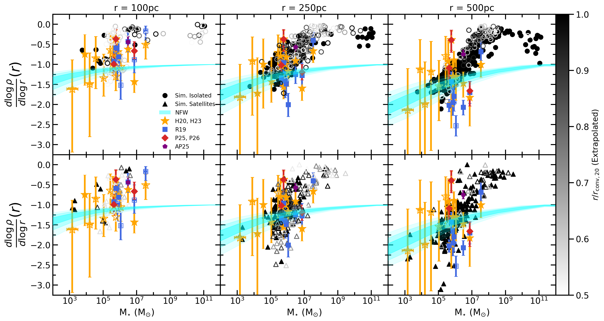

# arXiv Digest — 2026-07-13

- **Interest file used:** interests/2026.05.md (fallback — no 2026.07.md exists yet)
- **Categories pulled:** astro-ph.CO, astro-ph.EP, astro-ph.GA, astro-ph.HE, astro-ph.IM, astro-ph.SR, cs.LG, stat.ML, hep-ph
- **Papers scanned:** 216 (56 astro-ph new/cross + 160 cs.LG/stat.ML/hep-ph and their cross-lists)
- **After first filter:** 15 candidates reviewed with full text
- **Final selected:** 10 papers across 3 tiers

---

## Tier 1 — Highly relevant

### [Climbing the $N$-point Ladder Part I: Information in the Higher-Order Configuration-Space Clustering of Dark Matter Halos](http://arxiv.org/abs/2607.09116v1)

Sumi Kim, Cristiano G. Sabiu, Inkyu Park
**Primary category:** astro-ph.CO

Using ~38,000 GPU-accelerated $N$-point measurements on the Quijote halo catalogs at $z=0$ and fixed number density, the authors build Fisher forecasts for $\{\Omega_m, \Omega_b, h, n_s, \sigma_8, M_\nu\}$ from the configuration-space 2-, 3-, and connected 4-point correlation functions in both real and redshift space. Treated as a ladder (2PCF → +3PCF → +$\zeta^{(4)}_{\rm conn}$), the 3PCF supplies most of the accessible higher-order information — tightening every parameter, most strongly $\sigma_8$ and $M_\nu$, whose degeneracy it partially breaks — with per-parameter gains consistent with the Fourier-space bispectrum on the same simulations. The connected 4PCF adds a further ~1.4–1.5×. The rung-to-rung increments are shown to be stable against derivative-sample noise and compression regularization, though absolute constraints remain limited by the finite simulation ensembles and are flagged as preliminary.

---

### [Searching for signatures of fuzzy dark matter in cosmic filament profiles](http://arxiv.org/abs/2607.09609v1)

Callum J. O'Kane, Alfonso Aragón-Salamanca, Ulrike Kuchner et al.
**Primary category:** astro-ph.CO

The authors test whether ultralight ("fuzzy") dark matter ($m \sim 10^{-22}$ eV) leaves interference-fringe periodicities in the distribution of galaxies around cosmic-web filaments. They analyze 4,394 filaments (each with ≥10 members) from the Tempel et al. catalogue built on the SDSS Main Galaxy Sample, comparing observed transverse density profiles against a toy model with a periodic component $A\cos(2\pi d/\lambda)$ and a projection-angle-dependent wavelength. Most of the parameter space — including all no-periodicity ($A=0$) models — is consistent with the data at $2\sigma$; a region is excluded at $3\sigma$, giving $A > 0.16\lambda_0 + 0.18$ for $0.2\,{\rm Mpc} \lesssim \lambda_0 \lesssim 2\,{\rm Mpc}$. The result is a methodological proof of concept rather than a strong exclusion, and the authors note FDM–baryon interplay remains poorly understood.

---

## Tier 2 — Adjacent / useful context

### [CHEFT: A Hybrid Effective Field Theory halo model](http://arxiv.org/abs/2607.09571v1)

Marcos Pellejero Ibáñez, David Alonso, John A. Peacock et al.
**Primary category:** astro-ph.CO

The paper builds a "collapsed HEFT" (CHEFT) framework that fixes the halo model's inaccurate 2-halo term by measuring HEFT operator-expansion templates from simulations in which each halo's particles are collapsed to its centre, removing intra-halo structure. Halo-halo power spectra are then expressed as a sum over bias operators with mass-dependent bias parameters deduced probabilistically from simulations, giving a predictive model with no free bias parameters. Validated against SZ-, CIB-, and HOD-like weightings, it recovers matter power to percent-level accuracy across the 1-halo/2-halo transition and reaches ~3–5% for weighted tracers once an effective Laplacian term is added.

*Figure removed (figure-file cleanup): Proof_of_Concept.pdf*

---

### [Cosmological Constraints on the DGP Model in light of DESI DR2 2025 Data](http://arxiv.org/abs/2607.09240v1)

Xinyi Dai, Yupeng Yang, Yicheng Wang
**Primary category:** astro-ph.CO | also: gr-qc

Combining DESI DR2 BAO with cosmic chronometers, SNe Ia, and CMB distance priors, the authors update constraints on flat and non-flat Dvali-Gabadadze-Porrati braneworld models. They obtain $H_0 = 64.05 \pm 0.27$ (non-flat) and $63.28 \pm 0.25$ (flat) km s⁻¹ Mpc⁻¹ — both well below the Planck ΛCDM value — with $\Omega_k = 0.0088 \pm 0.0016$ favoring a small positive curvature in the non-flat case. DGP does not alleviate the Hubble tension and is strongly disfavored overall, primarily because it cannot simultaneously fit DESI BAO and CMB constraints.

---

### [Mitigating the overcooling problem with sink-based bursty star formation in a high-z dwarf galaxy](http://arxiv.org/abs/2607.08846v1)

Cheonsu Kang, Taysun Kimm, Daniel Han et al.
**Primary category:** astro-ph.GA

Cosmological zoom-in radiation-hydrodynamics simulations of a $10^{10}\,M_\odot$ halo at $z=6$ compare a Schmidt-type star-formation model against a sink-based model in which star formation follows local gas inflows. The sink-based model produces genuinely bursty star formation: rapid accretion onto young sinks drives intense radiation that ionizes and disperses star-forming clumps before the first supernova, so SNe explode in lower-density gas, imparting greater momentum and stronger outflows. Relative to the Schmidt model it yields ~3× lower total stellar mass and a ~10× higher Lyman-continuum escape fraction by $z=6$, with better agreement with JWST gas-phase metallicities and galaxy sizes.

---

### [Overview of the Canadian Hydrogen Observatory and Radio Transient Detector (CHORD) Project](http://arxiv.org/abs/2607.09374v1)

The CHORD Collaboration, Kevin Bandura, Leonid Belostotski et al.
**Primary category:** astro-ph.IM

This overview describes CHORD, a next-generation wideband radio interferometer at DRAO designed for precision 21 cm cosmology, fast-radio-transient discovery, spectral-line galaxy surveys, and pulsar science. The instrument is a redundant large-N, small-diameter drift-scan array: a 512-element core of 6 m dishes spanning 300–1500 MHz, plus two 64-dish outrigger stations for long-baseline transient localization. It builds on CHIME with an emphasis on precision beam control and stable instrumental response; a 64-dish pathfinder is being commissioned, with the full array expected in 2028.

---

### [Developing Machine Learning Models of Subgrid Turbulent Transport for Quiet Sun 3D Radiative Hydrodynamic Simulations](http://arxiv.org/abs/2607.08969v1)

Rimsha Hameed Syeda, Dustin Kempton, Viacheslav Sadykov et al.
**Primary category:** astro-ph.SR | also: physics.flu-dyn

The authors develop a 3D convolutional neural network as a surrogate for subgrid turbulent transport in realistic quiet-Sun radiative-hydrodynamic simulations, targeting the components of the Reynolds stress tensor from resolved 3D velocity fields plus scalar features such as density. Benchmarked against a multilayer perceptron and the physics-based Gradient and Smagorinsky closures, the 3DCNN reconstructs the stress tensor more accurately (~31% improvement on diagonal, ~8% on off-diagonal components), and a logarithmic transform of the heavily skewed targets further improves performance.

---

### [Dark matter density profiles of the Milky Way satellite population: reconciling simulations and observations](http://arxiv.org/abs/2607.08818v1)

Jorge Sarrato-Alós, José María Arroyo-Polonio
**Primary category:** astro-ph.GA

The authors argue the long-standing cusp-core "tension" between simulated and observed inner dark-matter slopes is largely a methodological artifact of evaluating $d\log\rho/d\log r$ at inconsistent radii. Comparing NIHAO and FIRE-2 profiles against dynamical inferences of 16 Milky Way dwarf spheroidals strictly within reliability limits — and, crucially, evaluating simulated slopes at observationally accessible radii at matched stellar mass — they find both populations follow a mass-dependent core-formation trend (cuspy $\approx -1.5$ at $M_\star \sim 10^5\,M_\odot$ rising to core-like $\approx 0$ to $-0.4$ at $\sim 10^8\,M_\odot$). Simulated profiles agree with observations within $\lesssim 1\sigma$ for most systems, outperforming NFW, with Willman 1 the main outlier.

---

## Tier 3 — Outside my area but notable

### [Fast Radio Bursts Trace Cosmic Star Formation with Little Delay](http://arxiv.org/abs/2607.09109v1)

Yi-Ying Wang, Yin-Jie Li, Yi-Zhong Fan
**Primary category:** astro-ph.HE | also: astro-ph.CO

Through a forward-modeling hierarchical Bayesian analysis of the CHIME/FRB population — jointly fitting the catalog sample, baseband fluences, and localized host redshifts while self-consistently folding in the survey selection function via injections — the authors reconstruct the intrinsic FRB rate across a range of delay-time models. The rate robustly peaks at the same redshift as the cosmic star-formation history, with a mean delay of only 0.1–0.3 Gyr consistent with a prompt, zero-delay origin at $2\sigma$. This rules out the multi-Gyr delays previously reported as evidence for a compact-binary-merger origin, pointing instead to young stellar remnants — most likely magnetars from core-collapse supernovae — as the dominant progenitors.

*Figure removed (figure-file cleanup): Figure2_rate.pdf*

---

### [Project Hephaistos — IV. James Webb Space Telescope Observations of Two Dyson Sphere Candidates](http://arxiv.org/abs/2607.09460v1)

Erik Zackrisson, Arjan Bik, Anita Ali Asgar et al.
**Primary category:** astro-ph.GA | also: astro-ph.SR

JWST/MIRI imaging and spectroscopy target two M-dwarfs previously flagged as Dyson-sphere candidates on the basis of mid-infrared excess. The excess is shown not to arise from megastructures or circumstellar emission but from background galaxies projected within ~1″ of each star, which contaminated the earlier WISE photometry. One background source is a Hot Dust-Obscured Galaxy at $z\approx0.9$; the other is a dusty starburst at $z\approx0.4$.
