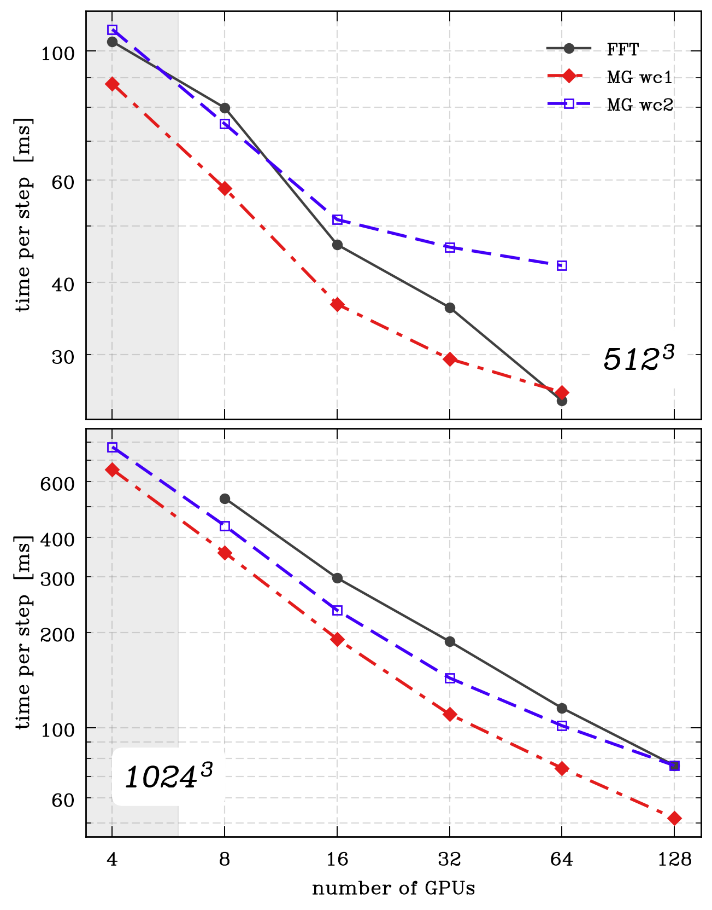
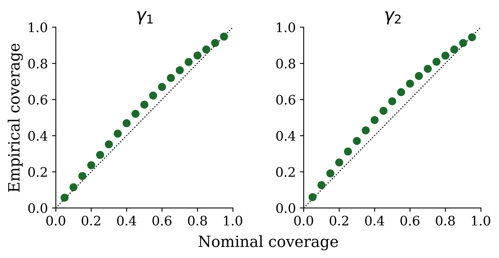

# arXiv Digest — 2026-07-14

**Interest file used:** interests/2026.05.md (fallback — no 2026.07.md exists yet)
**Categories pulled:** astro-ph.CO, astro-ph.EP, astro-ph.GA, astro-ph.HE, astro-ph.IM, astro-ph.SR, cs.LG, stat.ML, hep-ph
**Papers scanned:** 500 (129 astro-ph new/cross + 371 cs.LG/cs.AI/cs.CV/hep-ph/stat.ML/other)
**After first filter:** 19 candidates reviewed with full text
**Final selected:** 14 papers across 3 tiers

*Note: The bulk metadata pull failed on the ~500-ID `id_list` request (URL too long for the arXiv API), so the 500-paper announcement list was recovered and re-fetched in batches of 50. The 500-result cap truncated the hep-ph tail; all astro-ph papers were retained. Tier 3 is empty — nothing outside the researcher's area cleared the "genuinely groundbreaking" bar today. Two candidates were dropped after full-text reading: 2607.09731 (physics.gen-ph, a textbook Gaussian-process H(z) reconstruction adding nothing new) and 2607.11442 (generic CIFAR-10 image-generation ML with no science-inference angle). The two Tier-4 papers are PDF-only (no LaTeX source); they were read from their abstracts and carry no figures.*

---

## Tier 1 — Highly relevant

### [Constraints on Ultra-Light Axions from the DESI DR1 Full Shape, Planck and ACT](http://arxiv.org/abs/2607.11876v1)

Francesco Verdiani, Emanuele Castorina, Ennio Salvioni et al. (incl. Matteo Viel, high-value forest/DM author)
**Primary category:** astro-ph.CO | also: hep-ph

The authors derive the first constraints on an ultra-light axion (ULA) subcomponent of dark matter from the DESI DR1 full-shape galaxy power spectra combined with Planck+ACT DR6. They re-analyze the DESI monopole+quadrupole to k_max = 0.2 h/Mpc with a self-consistent two-fluid EFT of LSS that adds a ULA density field, an extra bias and counterterms, plus a 1-loop treatment of ACT CMB lensing to marginalize halo-model systematics. They set the tightest limits to date — the ULA fraction f_ax < 0.3% at m_a ≈ 10⁻²⁹ eV and sub-1% for all m_a ≲ 10⁻²⁷ eV — improving CMB-only bounds by more than 2× at the light end. A mild DESI-LRG preference for f_ax at m_a ≈ 10⁻²⁶ eV (echoing BOSS) is diluted across tracers and vanishes when CMB is added.

Direct hit on the researcher's secondary-but-central interests: DESI full-shape / EFT-of-LSS inference and small-scale-power dark-matter constraints (fuzzy/ULA free-streaming). The two-fluid EFT machinery and the paper's explicit discussion of Lyman-α-forest complementarity are directly transferable to forest-based DM work.

---

### [Fast(er)PM and Moving Mesh: JAX-native Geometric Multigrid Methods](http://arxiv.org/abs/2607.10983v1)

Benjamin Horowitz
**Primary category:** astro-ph.IM | also: astro-ph.CO

Horowitz presents a JAX-native geometric-multigrid Poisson solver for particle-mesh cosmological simulations, positioned as a communication-avoiding, autodiff-compatible alternative to distributed FFTs for both static FastPM evolution and a new differentiable moving-mesh (curvilinear, adaptive-force-resolution) scheme. The key idea is a warm-started, Chebyshev-smoothed V-cycle used as a defect-correction solver that exploits temporal coherence between PM time steps, so one or two cycles suffice for field-level accuracy. On Perlmutter A100s the one-cycle warm solve beats jaxdecomp FFTs by 1.5–2.4× per step at 1024³ (fitting a 2048³ mesh on half the GPUs), while two warm cycles reproduce the FFT power spectrum to P/P_FFT = 1.001. The moving-mesh branch reuses the same solver to concentrate force resolution in nonlinear structures.

This is exactly the differentiable-forward-modeling / field-level-inference infrastructure the researcher tracks as a rising primary interest — the same class of solver that underpins Lyman-α-forest field-level reconstruction (TARDIS is cited). A faster, memory-lighter, fully autodiff PM gravity solve is a direct enabler for forest/LSS inference pipelines.

---

### [Neural Posterior Estimation for Inferring Weak Lensing Shear](http://arxiv.org/abs/2607.09867v1)

Tim White, Dingrui Tao, Camille Avestruz et al.
**Primary category:** astro-ph.IM | also: astro-ph.CO

The authors apply neural posterior estimation (NPE), an amortized simulation-based-inference method, to infer weak-lensing shear directly from multiband LSST-like images, folding detection, deblending, measurement, and calibration into a single learned forward pass. A ResNet maps a 3×2048×2048 image to a variational posterior over the two constant-shear components, trained on descwl-shear-sims images with progressively added systematics (variable PSF, stars, cosmic rays, bad columns). Across all five settings the posteriors are well-calibrated (empirical ≈ nominal coverage), and on point estimates NPE beats the AnaCal benchmark (RMSE ≈ 0.0014–0.0019, r ≈ 0.99 vs AnaCal's ≈ 0.007, r ≈ 0.90), with only small negative multiplicative biases attributed to the Gaussian shear prior. The approach shifts systematics control from explicit calibration into the forward simulator.

A clean, well-calibrated demonstration of NPE/SBI for a cosmology inference problem — squarely in the researcher's ML-inference-for-cosmology focus. The lessons on amortized variational posteriors and implicit marginalization over nuisances (PSF, artifacts) generalize directly to forest/LSS simulation-based inference.

---

## Tier 2 — Adjacent / useful context

### [Assessing the large-scale angular clustering of UNIONS Lyman Break Galaxies via cross-correlations](http://arxiv.org/abs/2607.09943v1)

Constantin Payerne, Christophe Yèche (high-value author), William d'Assignies Doumerg et al.
**Primary category:** astro-ph.CO

The authors test whether u-dropout Lyman-break galaxies (z ≈ 2.5, ~1400/deg² over ~2,400 deg²) from the UNIONS photometric survey can serve as cosmological tracers. They find the LBG auto-angular power spectrum is unusable on large scales: imaging systematics (PSF depth, seeing, extinction, stellar density) inflate the power by orders of magnitude and survive both linear (NaMaster deprojection) and nonlinear (Random Forest) mitigation. Cross-correlations, by contrast, are robust — the LBG × Planck PR4 CMB-lensing spectrum is recovered at an amplitude consistent with theory and comparable to DESI DR1 QSO × lensing — though residual systematics inflate the jackknife variance by 3–15×, degrading future f_NL reach. UNIONS LBGs are thus established as viable cross-correlation probes.

Adjacent LSS with directly borrowable methods: imaging-systematics mitigation, tracer × CMB-lensing cross-correlation robustness, and f_NL scale-dependent bias. High-z LBGs are also the same population whose spectra populate the Lyman-α forest, and Yèche is a DESI Lyman-α working-group author.

*No figure extracted for 2607.09943 (the key result is a standard cross-spectrum-vs-theory plot; the text conveys "cross-correlation works where the auto-spectrum fails").*

---

### [HETDEX [OII] galaxies at z ≤ 0.48: Volume-limited samples and their power spectra](http://arxiv.org/abs/2607.08453v2)

Jeongin Moon, Eiichiro Komatsu, Robin Ciardullo et al.
**Primary category:** astro-ph.CO | also: astro-ph.GA

The authors build the first volume-limited samples of emission-line-selected [OII] galaxies from HETDEX PDR1 (z ≤ 0.48, three luminosity bins, 11k–65k galaxies), with number densities n̄ ≈ (2–5)×10⁻³ h³/Mpc³ — 5–10× higher than typical ELG surveys. They measure monopole and quadrupole power spectra (0.01 < k < 0.7 h/Mpc) with an FFT-based Yamamoto/FKP estimator (their MoonPower code) and interpret them with a lognormal HOD applied to the Uchuu N-body simulation. The data match the Planck-ΛCDM mocks to deep into the nonlinear regime, with a characteristic halo mass log(M₀) ≈ 11.9–12.3 scaling weakly as M₀ ∝ L^0.37, and ~13% of the galaxies in subhalos.

Adjacent clustering work whose value here is the directly borrowable FFT power-spectrum multipole estimator (Yamamoto/FKP, CIC deconvolution, Sellentin–Heavens likelihood) — the same machinery family as P1D/P3D estimation — plus a new high-density low-z tracer useful for cross-correlations.

*No figure extracted for 2607.08453 (the headline P₀-vs-mock result is a six-file composite; the ΛCDM agreement is adequately stated in text).*

---

### [A UV-to-Near-infrared QSO Composite Spectrum from the SPHEREx All-Sky Survey](http://arxiv.org/abs/2607.10282v1)

Minjin Kim, Yongjung Kim, Woong-Seob Jeong et al.
**Primary category:** astro-ph.GA

The authors construct the first unified UV-to-NIR QSO composite spectrum (rest-frame 0.14–4.5 μm) from SPHEREx all-sky spectrophotometry of ~61,000 type-1 SDSS quasars (median z ≈ 1.26). The UV/optical continuum follows f_ν ∝ ν^α with α_opt ≈ −0.10 (harder than van den Berk's −0.44 over a longer baseline), steepening to α_IR ≈ −1.46 from hot-dust torus emission; both slopes and the IR/optical ratio correlate with luminosity (receding-torus behaviour). Paschen-to-Balmer ratios match Case-B recombination (negligible BLR extinction), emission-line EWs rise with luminosity (an "anti-Baldwin" effect), and a NIR "knee" at 2–3 μm is flagged as host-galaxy contamination.

QSO continuum reconstruction is an essential systematic for Lyman-α forest measurements, so an empirical, luminosity-dependent composite template bears directly on the researcher's continuum-fitting and quasar target-selection concerns — even though this particular composite is low-resolution and NIR/torus-focused, making its forest utility indirect.

---

### [The Rise and Fall of Acoustic Oscillations at Cosmic Dawn](http://arxiv.org/abs/2607.09846v1)

Hector Afonso G. Cruz, Gabriele Montefalcone, Julian B. Muñoz et al.
**Primary category:** astro-ph.CO | also: astro-ph.GA

This Letter gives the first prescription to decompose the cosmic-dawn 21-cm power spectrum into its baryon acoustic oscillation (BAO) and velocity-induced acoustic oscillation (VAO) components, using the analytic Zeus21 code to split the matter and relative-velocity spectra into "wiggle" and "no-wiggle" parts. BAOs and VAOs are slightly out of phase and wax and wane non-monotonically across 10 < z < 25 — VAOs dominate early but briefly vanish near the T21 absorption minimum (z ≈ 18), while BAOs vanish later (z ≈ 14). Ignoring the phase offset biases inferred H(z) by ~2% via a spurious Alcock–Paczyński distortion, for which they provide a correction, and a 21cmSense forecast shows the combined signal is detectable at ~2σ with SKA-Low.

21-cm cosmic dawn is the complementary high-z probe to the Lyman-α forest (an explicit adjacent interest), and the paper's acoustic standard-ruler / AP-systematics analysis borrows directly from the BAO methodology central to the researcher's LSS work.

---

### [Diffhalos: A Generative Model of Cosmological Lightcones of Dark Matter Halos](http://arxiv.org/abs/2607.10419v1)

Georgios Zacharegkas, Andrew P. Hearin, Alan Pearl et al.
**Primary category:** astro-ph.GA | also: astro-ph.CO

Diffhalos is a fully differentiable (JAX) generative model that produces cosmological lightcones of dark matter halos, subhalos, and their mass assembly histories. Generation factors into three stages: inverse-transform sampling of a parametric halo mass function (via a differentiable halo model or a ~10%-accurate MLP emulator), a conditional subhalo mass function calibrated to N-body sims, and DiffmahNet, a normalizing flow emulating the distribution of MAH parameters. Differentiability enables gradient-based optimization and HMC, and the validation shows percent-level HMF agreement and faithful reproduction of both the mean and the scatter of simulated assembly histories. It is presented as a public proof-of-concept for calibrating galaxy–halo-connection models, not yet a precision emulator.

The methodology — normalizing-flow density estimation of population parameters inside a differentiable JAX generative/emulation pipeline — is a transferable template for emulation and forward-modeling in LSS/forest contexts, matching the researcher's normalizing-flows and emulator interests even though the science target (galaxy–halo connection) sits outside the core IGM focus.

*No figure extracted for 2607.10419 (the model-validation panels are illustrative of accuracy but not essential to grasp the generative pipeline from the text).*

---

### [Breaking the Dark Sector Degeneracy with Nonparametric Expansion–Growth Reconstruction](http://arxiv.org/abs/2607.11813v1)

Changyu You, Rong-Gen Cai, Tao Yang
**Primary category:** astro-ph.CO | also: hep-ph

The authors build a data-driven, nonparametric reconstruction that simultaneously infers the dark-energy equation of state w_de(z) and a dark-energy–dark-matter interaction Q(z), breaking the background-level degeneracy by promoting the comoving matter density to a free function and adding growth (RSD) information to expansion data. They reconstruct H(z) and fσ8(z) with Gaussian processes (kernel hyperparameters marginalized via emcee), then analytically isolate the coupling under two closure assumptions. Applied to Pantheon+, cosmic chronometers, BAO including DESI DR2, and RSD over 0 ≲ z ≲ 2, they find no statistically significant evidence for either an interaction or dark-energy dynamics — both consistent with ΛCDM — with the reconstructed EoS more dataset-dependent than the coupling.

The value here is the borrowable model-independent methodology: a joint GP reconstruction of two unknown functions and an expansion–growth consistency test used as a null check, applied to DESI DR2 BAO + RSD. The null ΛCDM result itself is not groundbreaking, but the nonparametric/Bayesian reconstruction technique overlaps the researcher's inference interests.

*No figure extracted for 2607.11813 (the central figure shows reconstructed bands consistent with ΛCDM — a null result adequately summarized in text).*

---

### [Two Earliest Optical-UV Tidal Disruption Events Hidden in the SDSS DR7 Catalog Unveiled by the Transformer-Based Spectrum Classifier](http://arxiv.org/abs/2607.11539v1)

Ranfang Zheng, Zheyu Lin, Xu Kong et al.
**Primary category:** astro-ph.HE | also: astro-ph.IM

The authors build a PCA-enhanced Transformer classifier to find tidal disruption events (TDEs) in optical spectroscopic catalogs. Rather than feeding raw spectra to the network, they project each spectrum onto fixed PCA templates (86 galaxy + 20 transient + 20 stellar components) and classify the coefficients with a time-series Transformer; training data are synthesized by superimposing rest-frame transient spectra onto SDSS host galaxies at controlled flux-mixing scales with injected noise. The model reaches precision 0.88 / recall 0.99, and applied to ~298,000 SDSS DR7 galaxy spectra it flags 14 candidates, of which follow-up confirms two new TDEs plus one previously reported — one claimed as the earliest optical-UV TDE known.

Directly on the researcher's "spectroscopic transformers / astronomical foundation models" interest and within the SDSS→DESI pipeline they work in: the PCA-compression-then-Transformer scheme and the synthetic-spectrum-by-superposition training recipe are transferable to rare-object and contaminant identification (DLAs, BALs) and to building training sets for forest/quasar spectral classifiers — and the authors flag DESI DR1 as their next target.

---

### [Signatures of 10–10⁴ M☉ Dark Matter halos in LISA via Stochastic Diffraction](http://arxiv.org/abs/2607.11887v1)

Han Gil Choi, Juan Urrutia, Miguel Zumalacárregui
**Primary category:** astro-ph.CO | also: hep-ph

The authors develop a "stochastic diffractive lensing" formalism in which gravitational waves passing the unresolved population of low-mass CDM halos acquire correlated, frequency-dependent amplitude/phase fluctuations set by the convergence power spectrum. They decompose these into a Karhunen–Loève eigenbasis (a "Dark Timbre"), project out degeneracies with binary parameters via a Fisher treatment, and forecast detectability for LISA massive-black-hole binaries. LISA is most sensitive to halos of ~10–10⁴ M☉; the per-event CDM signal is tiny (~10⁻³), but stacking ~50–500 loud sources could confirm light CDM halos at 2–5σ, and a null result would constrain small-scale power-spectrum enhancements, fuzzy DM (m ≳ 4×10⁻¹⁷ eV), axion miniclusters, and PBHs.

A genuinely novel probe of the small-scale matter power spectrum and low-mass halo function — the same "dark matter via small-scale power" physics the researcher tracks through the Lyman-α forest, here reaching complementary scales the forest cannot, with explicit comparison to JWST UV-luminosity-function limits.

*No figure extracted for 2607.11887 (the result is a LISA forecast rather than a measurement; the small-scale-power reach curve is informative but not essential to the takeaway).*

---

### [The Singularity Space: A Generative Diffusion Framework for Signal Representation](http://arxiv.org/abs/2607.10930v1)

Eli Bar-Yosef, Amir Averbuch, Eli Turkel
**Primary category:** cs.LG | also: eess.SP

The authors propose a Transformer-based conditional-diffusion framework that solves ill-posed inverse problems by generating a signal's complex-plane pole–residue (meromorphic) representation instead of dense grid amplitudes, targeting sharp transients that grid/spectral models blur. A Diffusion Transformer treats each singularity as a permutation-invariant token with self-attention (coordination) and cross-attention onto a CNN-encoded partial observation, predicts clean coordinates directly under a variance-preserving SDE, and enforces a minimum-separation projection each step; a fixed analytic decoder reconstructs on arbitrary grids. On 1D viscous-Burgers shocks it achieves 4.2× lower zero-shot sub-resolution error than a Fourier Neural Operator and recovers physical shock parameters to 10⁻⁴, staying stable under unseen test-time noise where FNO degrades.

Sits in the researcher's diffusion / neural-operator / field-level-inference methods space: an amortized conditional-diffusion inverse solver that reconstructs signals from partial, noisy observations with a resolution-free latent. The transfer to forest work is speculative but plausible — QSO continuum and IGM absorption recovery are exactly the sharp-transient 1D reconstruction problems that grid/Fourier emulators smear.

*No figure extracted for 2607.10930 (the method's transferability is the point and is described in text; the pipeline schematic and the Burgers-specific comparison plot are not essential).*

---

## Tier 4 — Meta-research about the field

### [Are We Ready for AI-Driven Discovery? AI Verification Before the Next Fundamental Physics Breakthrough](http://arxiv.org/abs/2607.10039v1)

Gaia Grosso, Vinicius Mikuni, Lukas Heinrich
**Primary category:** physics.data-an

This PHYSTAT-series perspective examines verification and reliability of machine-learning methods used for discovery claims across particle physics, astrophysics, and cosmology. It argues that ML's move to large black-box foundation and generative models forces a shift from a priori statistical guarantees (consistency, calibration, coverage) toward a posteriori verification protocols, situates ML within the end-to-end statistical-discovery workflow (acquisition → summarization → modeling → simulation → inference), and asks when being "wrong" is tolerable and what fundamental limits scale cannot overcome. It closes with practical guidelines and a reflection on the physicist's evolving role as experiment designer and evaluator.

Meta-research on the practice of AI-driven inference in physics and cosmology — directly relevant to the researcher's growing reliance on SBI, normalizing flows, emulators, and foundation models, where knowing when verification, calibration, and uncertainty quantification are essential for a defensible discovery claim is exactly the concern.

*No figures extracted for 2607.10039 (conceptual meta-review; PDF-only source, and its figures are illustrative workflow schematics with no quantitative result).*

---

### [Generative AI in Higher Education Laboratory Learning: A Qualitative Case Study of Epistemic Scaffolding and Assessment Boundaries](http://arxiv.org/abs/2607.11417v1)

Matteo Tuveri, Alessandro Riggio
**Primary category:** physics.ed-ph

This exploratory qualitative case study examines AstroTutor, a constrained generative-AI tutor offered as optional support in a Master's-level advanced astrophysics laboratory. Drawing on chat logs, final reports, and reflective responses from seven students, the analysis identifies five roles the tutor played — interface interpreter, warrant organiser, report scaffold, unstable authority, and a resource whose traces appear in downstream reports. The authors argue that AI use in advanced physics labs requires explicit design boundaries, verification routines, and assessment requirements that preserve students' epistemic responsibility.

Meta-research on how generative AI is reshaping the training of physicists and astronomers — a concrete look at what happens when an AI tutor enters an advanced astrophysics course, relevant to the sociology-of-the-field and AI-in-astronomy questions the researcher flags as worth tracking.

*No figures extracted for 2607.11417 (qualitative education case study; PDF-only source with no result figure to extract).*
