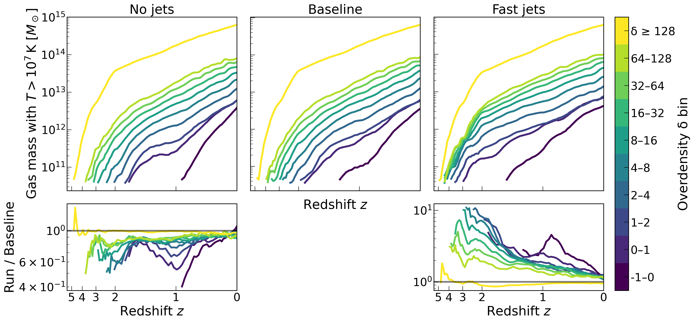
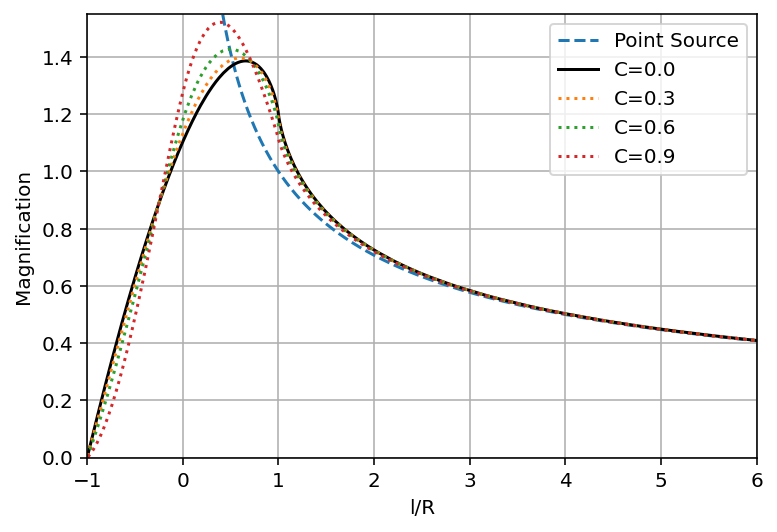

# arXiv Digest — 2026-07-16

**Interest file used:** interests/2026.05.md (fallback — no 2026.07.md exists yet)
**Categories pulled:** astro-ph.CO, astro-ph.EP, astro-ph.GA, astro-ph.HE, astro-ph.IM, astro-ph.SR, cs.LG, stat.ML, hep-ph
**Papers scanned:** 238 (64 astro-ph new/cross + 174 in cs.LG/stat.ML/hep-ph and other cross-listed categories)
**After first filter:** 19 candidates reviewed with full text
**Final selected:** 14 papers across 4 tiers

*Note: interest file is a fallback from May — no 2026.07 file exists yet. No new Lyman-α forest, IGM opacity, or DESI Lyα papers appeared today, so Tier 1 holds a single direct LSS/void hit rather than a core-focus cluster; the rest of the day's relevance is LSS/DESI, CGM, and borrowable inference methods in Tier 2. The two H0 World Cup entries are companion papers (a Letter and its comprehensive counterpart).*

---

## Tier 1 — Highly relevant

### [Radial velocity statistics of cosmic voids as a probe of interacting dark energy](http://arxiv.org/abs/2607.13362v1)

Kin Ho Luo, Ming-chung Chu, Kwan Chuen Chan et al.
**Primary category:** astro-ph.CO

Using N-body simulations of a "Type 3" interacting dark energy (IDE) model, the authors measure how the dark-sector momentum coupling $\beta$ ($<0$) and scalar-potential slope $\lambda$ imprint on the radial-velocity and velocity-dispersion profiles of cosmic voids (both halo-defined and CDM voids, $z=0$, $L_{\rm box}=1000\,h^{-1}$Mpc). Within the $1\sigma$ region of $\beta,\lambda$ allowed by Planck + DESI BAO + DES-Y5, they find up to $\sim$30% fractional deviations in the velocity/dispersion "span" relative to the uncoupled case, driven by the extra cosmological friction the coupling exerts on dark matter. They provide a compact 4-parameter quadratic regression (high adjusted $R^2$) that captures the non-linear $\beta$–$\lambda$ dependence, including a cross-term because faster scalar evolution amplifies sensitivity to the coupling.

Squarely in the LSS + voids + DESI + dark-energy wheelhouse: void velocity statistics as an independent, largely baryon-physics-insensitive DESI-era probe of the dark sector, delivered with an emulator-style regression fit.

---

## Tier 2 — Adjacent / useful context

### [The $H_0$ World Cup. II. A comprehensive competition between proposed Hubble tension solutions](http://arxiv.org/abs/2607.13283v1)

Nils Schöneberg, Vivian Poulin, Angelo G. Ferrari et al.
**Primary category:** astro-ph.CO | also: hep-ph

A common-pipeline benchmark (an update of the $H_0$ Olympics) comparing fourteen beyond-$\Lambda$CDM Hubble-tension models against current CMB (Planck PR4 + ACT DR6 + SPT-3G D1), DESI DR2 BAO, and Pantheon+ SNe, using both frequentist (profile likelihood, $Q_{\rm DMAP}$) and Bayesian (evidence, parameter-shift) metrics with free $\Sigma m_\nu$. Early-dark-energy-type injection performs best, reducing the residual $M_B$ tension from $>5.5\sigma$ to $\sim3\sigma$; varying $m_e$ at recombination is intermediate ($\sim4\sigma$); dark-radiation and late-time models remain marginal. They further test curvature, CPL dark energy, and a non-power-law primordial spectrum, and show ACT DR6 drives much of the ranking; no model fully resolves the tension.

Core cosmology-tension landscape built on DESI DR2 BAO, and a clean template for combining frequentist and Bayesian model-selection metrics — useful context even though it sits off the Lyα/IGM core.

---

### [The $H_0$ World Cup. I. Summary of the baseline group stage results](http://arxiv.org/abs/2607.13282v1)

Nils Schöneberg, Vivian Poulin, Angelo G. Ferrari et al.
**Primary category:** astro-ph.CO | also: hep-ph

The condensed companion Letter presenting the "group stage" of the same benchmark: each of the fourteen models faces CMB + BAO + SN with and without a local $M_B$ calibration prior, graded by $-\Delta$AIC / $\ln B$ (model preference) and $\Delta_{\rm DMAP}$ / $\Delta_{\rm shift}$ (residual tension). $\Lambda$CDM leaves $\Delta_{\rm DMAP}=5.4\sigma$. All four early-dark-energy models qualify (reducing tension to $\sim3\sigma$), varying $m_e$ barely qualifies, and dark-radiation, late-time, and mixed models are eliminated. The takeaway: a localized non-radiative energy injection near matter–radiation equality is the single most effective mechanism.

The TL;DR version of Paper II — a compact reference for the current model ranking and the selection criteria, on the same DESI-era dataset.

*No figures extracted for 2607.13282 (the headline ranking figure is carried by its companion Paper II above).*

---

### [Testing string theory with combined cosmological probes: a case study for dark matter gravitons](http://arxiv.org/abs/2607.13910v1)

Alkistis Pourtsidou
**Primary category:** astro-ph.CO

A short research note constraining the string-theory "Dark Dimension" scenario, in which dark matter is a tower of decaying massive gravitons with a time-dependent kick velocity ($v_{\rm kick}\propto t^{1/7}$) that suppresses structure growth. Implementing the model in CAMB and running Cobaya MCMC against Planck PR4 (CamSpec) + ACT DR6 lensing + DESI DR2 BAO gives $v_0 < 0.8\times10^{-3}c$ (95% CL), tighter than prior CMB+BAO bounds. A Fisher forecast for an LSST-Y1-like $3\times2$pt survey — using a decaying-DM N-body emulator for the nonlinear power ratio — projects $v_0$ to $\sim$15% fractional error, contingent on accurate cosmology-dependent nonlinear modelling.

Directly exercises the DESI DR2 BAO + Stage-IV $3\times2$pt forecasting + N-body-emulator toolkit the user works with, applied to an exotic DM model — a useful worked example of that inference chain.

---

### [A Universal Relation Between Primordial Density-Potential Cross-correlation Coefficient and Spin Factor Distribution](http://arxiv.org/abs/2607.13971v1)

Jun-Sung Moon, Jounghun Lee, Juhan Kim
**Primary category:** astro-ph.CO | also: astro-ph.GA

The authors develop a heuristic analytic model relating the primordial "spin factor" $\tau$ (misalignment between the initial density and potential Hessian principal axes, which sets halo/galaxy angular momentum via tidal-torque theory) to the initial density–potential cross-correlation coefficient $q$, positing that the mean and variance of the Gamma-distributed $\tau$ depend on $q$ alone. Testing against Multiverse N-body simulations ($2048^3$, $1\,h^{-1}$Gpc) across two $\Lambda$CDM and two $w$CDM cosmologies and nine smoothing-scale pairs, they find the fit parameters are essentially invariant to dark-energy density, equation of state, and $\sigma_8$. Because $\tau$ can reportedly be reconstructed from observed galaxy-size distributions, they argue $q$ — a probe of early-universe physics largely free of standard cosmological degeneracies — could be inferred from galaxy sizes.

An LSS initial-conditions diagnostic with a $w$CDM/DESI-motivated angle; niche (the galaxy-spin route) but conceptually adjacent to the user's LSS and statistical-inference interests.

---

### [Here, There and Everywhere: How AGN jets affect galaxy cluster environments](http://arxiv.org/abs/2607.13132v1)

Isaac Rosenberg, Martine Lokken, Renée Hložek et al.
**Primary category:** astro-ph.CO | also: astro-ph.GA

Zoom-in SIMBA-C hydrodynamic re-simulations of three THE THREE HUNDRED cluster regions vary AGN jet velocity cap, orientation, and hydro-decoupling time to map their effect on the warm-hot IGM and tSZ observables. Jet velocity is the dominant knob: fast jets produce nearly an order of magnitude more $T>10^7$ K gas in low-density regions at $z\sim1$–4, quench BCG/BH growth, and cut group-scale baryon fractions by up to an order of magnitude. The tSZ signal changes only $\sim$10% inside clusters/filaments but $\sim$100% outside filaments; high-velocity jets best match eRASS1 BCG masses, BH–halo relations, and gas fractions. They argue hot gas in underdense regions is the most sensitive discriminator, targetable by stacked tSZ with SO/FOSSIL.

Bears on the WHIM thermal state and feedback-driven redistribution of baryons on Mpc scales — adjacent to the user's IGM interests and directly relevant to feedback systematics that leak into LSS analyses.

---

### [Evaluating the flexibility of the MillenniumTNG galaxy formation model with multi-zoom re-simulations](http://arxiv.org/abs/2607.13151v1)

Francisco Maion, Raul E. Angulo, Volker Springel et al.
**Primary category:** astro-ph.GA | also: astro-ph.CO

Introduces a "multi-zoom" campaign that simultaneously re-simulates several sub-regions of a MillenniumTNG volume at higher resolution (cutting cost and load imbalance) to vary star-formation and AGN feedback parameters. Gaussian-process emulators trained on the galaxy stellar-mass function (GSMF) and halo gas fractions predict them to $\sim$0.1 dex and $\sim$10% precision, enabling joint fitting. They find a parameter combination that fits both the GSMF and the low gas fractions now observed even in massive clusters — requiring weaker stellar feedback and rarer-but-more-energetic kinetic AGN feedback than fiducial, showing MTNG can accommodate strong gas expulsion from groups and clusters.

A concrete emulator-based calibration/inference workflow (GP emulators over simulation feedback parameters) plus a cost-saving multi-zoom design — exactly the borrowable ML/statistical-inference machinery the user tracks for cosmology.

---

### [Supermagnified Stars in Lensing Clusters and Small-Scale Structure in the Dark Matter](http://arxiv.org/abs/2607.14034v1)

Gabriel Torralba, Jordi Miralda-Escudé
**Primary category:** astro-ph.CO

The authors argue that individual stars magnified by factors $\sim$1000 near cluster-lensing caustics ("supermagnified stars") are a unique probe of low-amplitude, small-scale dark-matter surface-density fluctuations. Intracluster stars shatter the macro-caustic into a corrugated band of micro-caustics; monitoring the lightcurve of a micro-caustic crossing effectively resolves the stellar disk at cosmological distances and becomes sensitive to perturbations at the $\mu^{-1}$ level. They fit the first supermagnified star (Icarus, $z=1.49$) HST data with single- and double-caustic models via nested sampling; current photometry is too imprecise for limb darkening, but the Habitable Worlds Observatory's sensitivity/resolution would open detection of DM small-scale structure such as axion minihalos.

Directly on the nature of small-scale dark-matter structure — a core user interest (§5) — via an independent cluster-microlensing route that complements the forest's small-scale constraints.

---

### [Cold Stream Penetration of Virial Shocks: Fragmentation, Coagulation, and Disruption in the Hot Circumgalactic Medium](http://arxiv.org/abs/2607.14090v1)

Zhiyuan Yao, Nir Mandelker, S. Peng Oh
**Primary category:** astro-ph.GA

Idealized 3D hydrodynamic simulations of a cylindrical cold stream penetrating a hot CGM, systematically varying stream radius, Mach number, and pressure/density contrasts. They identify three regimes — coagulation, fragmentation, and disruption (plus a borderline case) — set by a shear/KHI survival criterion ($t_{\rm cool,mix}/t_{\rm shear}$) and a pressure-driven fragmentation criterion; at large pressure contrast an oblique shock steepens into a bow shock and survival depends on post-shock cooling time versus virial crossing time. Surviving streams follow turbulent radiative entrainment (cold-gas mass flux grows, streamwise momentum flux roughly conserved). Applied to galaxy evolution, streams in high-$\sigma$ peaks at $z>2$ survive and can fragment into multiphase CGM structures, while at $z\lesssim0.5$ stronger bow shocks suppress penetration.

CGM/cold accretion is an explicit adjacent interest; the cold-stream survival physics connects to the multiphase IGM/CGM and to cool gas seen in high-$z$ absorption.

---

### [Dark Energy and Neutrino Flavor from the Weak Axion](http://arxiv.org/abs/2607.13128v1)

Pedro Bittar, Carlos E. M. Wagner
**Primary category:** hep-ph | also: astro-ph.CO

Proposes dynamical dark energy from a "weak axion" — the phase of the anomalous $U(1)_{B+L}$ of the Standard Model — whose radiatively-stable potential is generated by two inequivalent Weinberg operators. An $S_3$ flavor selection rule cancels the quadratic divergence and leading thermal force, so the leading potential first appears at quartic order in neutrino masses, and its amplitude $\Lambda_\nu$ is fixed by PMNS data, landing parametrically near the dark-energy scale ($\sim$1–4 meV) with the uncertainty dominated by $\delta_{\rm CP}$ and $\theta_{23}$. Cosmologically the field behaves as thawing quintessence and the authors recast DESI's algebraic thawing-quintessence constraints into their $(\Lambda_\nu, f)$ plane.

Ties the DESI dynamical-dark-energy signal to neutrino masses — both on the user's radar — though this is model-building rather than a data analysis.

*No figures extracted for 2607.13128 (a model-building paper; its one data-facing figure is a constraint recast that the text conveys adequately).*

---

### [Mono-Z Dark Matter Search with Neural Spline Flows Using CMS Run 2015D Open Data](http://arxiv.org/abs/2607.13771v1)

Hitesh Rasineni, Bhavishya Chebrolu
**Primary category:** cs.LG | also: hep-ex

Applies five independently-trained Neural Spline Flows to a mono-Z ($Z\to\ell\ell$ + missing $E_T$) dark-matter search on 2.32 fb$^{-1}$ of CMS Run-2015D open data. Two channel-specific flows learn the SM background density from a control region; three mediator-specific flows learn signal densities from MC, and the per-event test statistic is the log-density ratio $\log p(x|{\rm DM}) - \log p(x|{\rm SM})$. A simultaneous SR+VR profile-likelihood fit sets 95% CL limits, but the observed limits exceed expected by 7–12$\times$ because of an unresolved high-MET background-modelling residual where the CR-trained density fails to extrapolate into the sparse tail — a candid null result.

A concrete (if flawed) worked example of neural spline flows — a method in the user's own library — used as density estimators for a likelihood-ratio discriminant, including a clear illustration of where CR-trained flow extrapolation breaks down.

*No figures extracted for 2607.13771 (a null result driven by a background-modelling residual; the score-distribution plot adds little beyond the text).*

---

### [When X-ray Features Hurt: Label Noise and Luminosity Overlap in Machine Learning Classification of AGN and Star-forming Galaxies](http://arxiv.org/abs/2607.13233v1)

Jaymin Ding
**Primary category:** astro-ph.GA | also: astro-ph.IM

Diagnoses why adding an X-ray flux feature to a Random Forest AGN/SFG classifier previously *decreased* accuracy (97.5%$\to$89.3%). Two compounding causes: astrophysically, AGN and SFG X-ray luminosities overlap across the canonical $10^{42}$ erg/s threshold in a moderate-luminosity, optically-selected SDSS sample (HMXB emission in SFGs); and in ML terms, BPT-derived training labels are instance-dependent label noise concentrated exactly at the BPT demarcation where X-rays would be most discriminating. Misclassified objects cluster near the Kewley line (median 0.130 vs 0.748 dex; KS $D=0.701$, $p=3.9\times10^{-9}$) and the X-ray feature shows negative permutation importance — the drop is mainly an ML artifact amplifying a secondary real astrophysical overlap.

A clean cautionary tale on instance-dependent label noise, circular labels, and permutation-importance diagnostics — broadly instructive for any ML-for-astronomy inference pipeline, including forest contaminant/continuum classifiers.

*No figures extracted for 2607.13233 (the label-noise argument rests on summary statistics that the text states directly).*

---

## Tier 3 — Outside my area but notable

### [S-matrix bootstrap bounds on self-interacting dark matter](http://arxiv.org/abs/2607.13141v1)

Qing Chen, Zhuo-Hui Wang, Shuang-Yong Zhou
**Primary category:** hep-ph | also: astro-ph.CO

Uses the modern primal S-matrix bootstrap (fixed-$t$ dispersion relations, analyticity, crossing, locality, partial-wave unitarity, solved as a semidefinite program) to bound the mass of weakly-coupled scalar self-interacting dark matter. Fixing the halo-motivated benchmark $\sigma_{\rm self}=10^{-24}(M/{\rm GeV})\,{\rm cm}^2$, they find a generic weakly-coupled scalar must satisfy $M\lesssim0.3$ GeV — far stronger than the classic $\sim$12 GeV partial-wave-unitarity bound. For a derivative-dominated pseudo-Nambu-Goldstone scalar an additional null constraint pushes the bound to the MeV scale or below.

Held to a high bar: a genuinely novel methodological import — turning galactic-halo SIDM phenomenology into a sharp amplitude-theory mass bound — even though it is pure particle theory with no structure-formation observable.

*No figures extracted for 2607.13141 (the headline is a single number, the $\sim$0.3 GeV bound, which the text states directly).*

---

## Tier 4 — Meta-research about the field

### [JW-ASTClaw: A Generalizable Multi-Agent Framework for Autonomous Solar Telescope and Its Implementation within Chinese Meridian Project](http://arxiv.org/abs/2607.13549v1)

Li-Yue Tong, Jia-Ben Lin, Yuan-Yong Deng et al.
**Primary category:** astro-ph.IM | also: astro-ph.SR

Reports the first deployment of an end-to-end LLM-driven autonomous control system on an operational solar telescope (the Solar Full-disk Multi-layer Magnetograph in the Chinese Meridian Project). It uses a decoupled three-layer (perception–decision–execution) multi-agent architecture connected via the Model Context Protocol, with three perception agents (data-quality, cloud-analyzer, flare-detector) encoding senior-observer heuristics as LLM-callable rules and a central reasoning engine doing multi-source fusion. It emphasizes portability and graceful degradation from cloud LLM to local inference to rule-based fallback, and claims 100% cloud detection with zero false positives over 10 archival dates and active-region counts matching NOAA SRS (102 vs 100). A companion conceptual paper (SIDEST, arXiv:2607.13533) sketches an intent-parsing "self-evolving" research loop in the same vein.

A concrete datapoint on how LLM agents and MCP-based multi-agent systems are being wired into real observatory operations — squarely in the "how AI is changing astronomy" thread.

*No figures extracted for 2607.13549 (PDF-only source; no cleanly extractable figure).*
