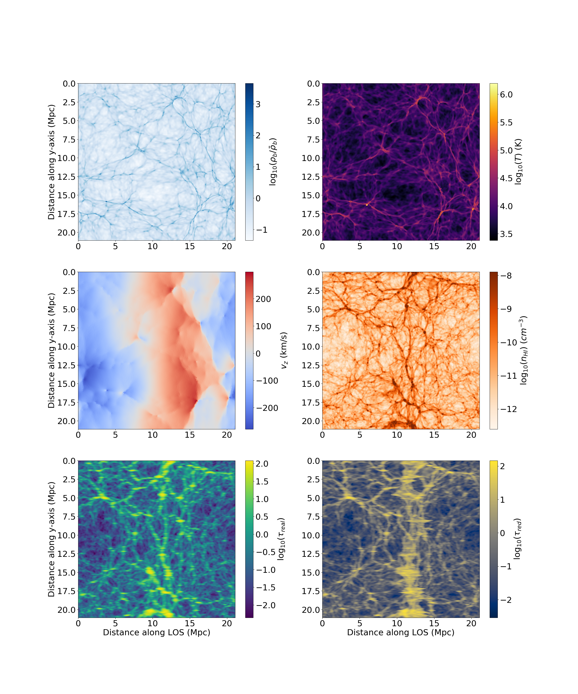
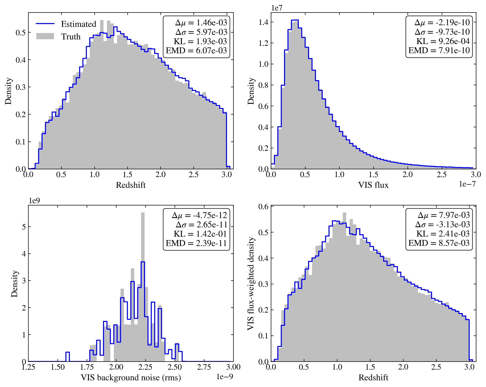
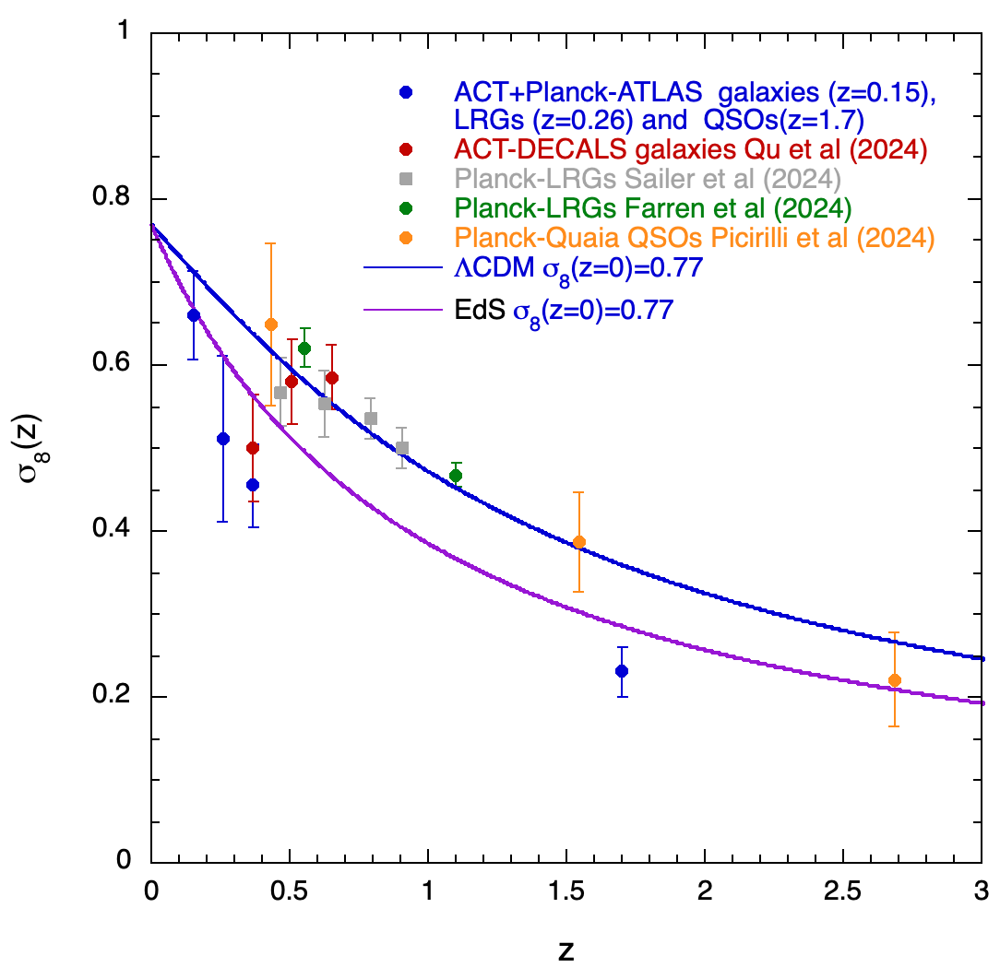
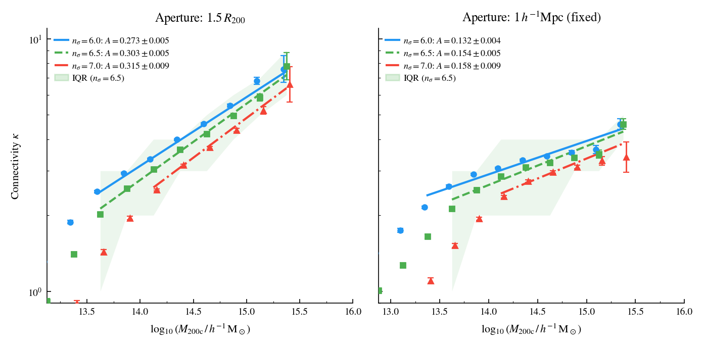

# arXiv Digest — 2026-07-17

**Interest file used:** interests/2026.05.md (fallback — no 2026.07.md exists yet)
**Categories pulled:** astro-ph.CO, astro-ph.EP, astro-ph.GA, astro-ph.HE, astro-ph.IM, astro-ph.SR, cs.LG, stat.ML, hep-ph
**Papers scanned:** 271 (91 astro-ph new/cross + 180 cs.LG/stat.ML/hep-ph)
**After first filter:** 15 candidates reviewed with full text
**Final selected:** 12 papers across 4 tiers

*Note: no current-month interest file exists, so the most recent prior file (2026.05.md) was used. One Tier 1 pick (THALAS, 2407.16009) is a July 2024 paper that resurfaced today as an astro-ph.IM cross-list, not a brand-new preprint — included because it is a direct hit on the differentiable-forest-inference interest. Three full-text candidates were dropped as below-bar: a primordial-black-hole dust-heating bound (weaker than existing constraints), an X-ray black-hole-spin standards paper (out of scope), and a redMaPPer satellite weak-lensing measurement (incremental confirmation of known tidal stripping).*

---

## Tier 1 — Highly relevant

### [High resolution Lyman-α forest constraints on dark matter-neutrino scattering](http://arxiv.org/abs/2607.15020v1)

Markus R. Mosbech, Olga Garcia-Gallego, Vid Iršič et al. (incl. V. Iršič, a high-value forest/IGM author from the interest file)
**Primary category:** astro-ph.CO | also: hep-ph

The authors derive the strongest direct bound to date on dark matter–neutrino scattering from the high-resolution Lyman-α forest flux power spectrum, using the HIRES/UVES data of Boera et al. (2019) at z = 4.2, 4.6, 5.0. They ran a dedicated suite of 48 full hydrodynamical simulations (Sherwood-Relics/P-Gadget3, spanning four interaction strengths matched to WDM cutoffs of 1.5–4 keV and twelve thermal histories) and trained a sub-1.5%-accurate neural-network emulator feeding a Cobaya MCMC. Their baseline analysis yields u_νχ ≤ 1.5×10⁻⁸ (95% C.L.), with conservative variants (dropping k > 0.1 s/km or inflating noise) giving ≲4×10⁻⁸ — excluding previous hints of nonzero coupling by orders of magnitude. They further show that mapping WDM limits onto this model via half-mode-type criteria overestimates the true constraining power.

This is a direct hit on the interest file's core program: small-scale Lyman-α P1D + emulator-based inference + a non-cold-dark-matter constraint, from exactly the author group (Iršič) flagged as high-value.

---

### [TensorFlow Hydrodynamics Analysis for Ly-α Simulations](http://arxiv.org/abs/2407.16009v1)

Jupiter Ding, Benjamin Horowitz, Zarija Lukić
**Primary category:** astro-ph.CO | also: astro-ph.IM

THALAS is a Python code that maps hydrodynamical-simulation baryon fields (density, temperature, line-of-sight velocity) to Lyman-α optical-depth fields in real and redshift space, and its defining feature is that it is **fully differentiable** (built on TensorFlow GradientTape, GPU/TPU-ready) so it supplies exact derivatives of derived fields for gradient-based inference. The neutral-hydrogen step is handled by a smooth spline interpolation of Gimlet's solver to keep backpropagation intact, and THALAS reproduces Gimlet's flux skewers and optical-depth power spectrum to below ~0.5%. As a demonstration the authors solve the forest inversion problem — reconstructing the real-space dark-matter density skewer from an optical-depth skewer via an FGPA forward model optimized with L-BFGS. The tool is aimed squarely at field-level / differentiable forward modelling of the forest.

Direct hit on the "field-level / differentiable forward modelling of the forest" expansion topic in the interest file, and on the ML-inference-for-forest program broadly. (Resurfaced 2024 cross-list, but too on-topic to omit.)

---

## Tier 2 — Adjacent / useful context

### [Simulation-Based Priors for HI Bias from Halo Occupation Physics](http://arxiv.org/abs/2607.14206v1)

Debanjan Sarkar, Simon Foreman
**Primary category:** astro-ph.CO

The authors build a simulation-based-prior framework for 21cm/HI EFT full-shape analyses by learning the conditional distribution p(θ_EFT | θ_HOD) that links a four-parameter HI halo-occupation model to the EFT bias parameters (b₁, b₂, b_G2, b₃). They paint HI onto Hidden Valley (and IllustrisTNG300) halos, measure biases at the field level with a shifted-operator forward model, and fit a conditional masked-autoregressive normalizing flow to 2000 HOD realizations per redshift over z = 1–4. The bias parameters occupy a narrow, curved, non-Gaussian manifold organized mainly by the high-mass HOD slope, so the resulting simulation-based priors shrink the Gaussian-equivalent EFT prior volume by ~1–2 orders of magnitude for a CHORD-like forecast; swapping to TNG300 shifts the prior center coherently, which they flag as a simulation-dependence systematic.

Squarely in the interest file's ML-for-cosmology section: conditional normalizing flows supplying informative EFT priors for a 21-cm survey — the same SBI-plus-EFT machinery the reader tracks for the forest, applied to the sibling high-z probe.

---

### [Probabilistic redshift estimation of unresolved galaxies from multi-band background light maps](http://arxiv.org/abs/2607.14525v1)

Shun-Sheng Li, Hendrik Hildebrandt, Ludovic Van Waerbeke
**Primary category:** astro-ph.CO | also: astro-ph.IM

This paper introduces the first framework to infer the redshift distribution of *unresolved* galaxies — those below the detection limit, contributing only to the diffuse cosmic optical background — directly from multi-band maps, using conditional normalizing flows (FlowJAX) trained on Euclid+Rubin-LSST ten-band image simulations. Mock unresolved samples are built from the Flagship catalogue by removing all SExtractor-detectable sources; the flow predicts true redshift, VIS magnitude, and VIS noise RMS from per-pixel ten-band flux ratios. For well-matched samples it recovers the flux-weighted redshift distribution to sub-per-cent accuracy in mean and width, supports four-bin pixel-level tomography, and — a nice methodological trick — carries the observable VIS noise RMS as a target variable to serve as a built-in out-of-distribution reliability flag.

Relevant as an ML-inference method: normalizing-flow conditional density estimation and the "predict-an-observable-as-a-diagnostic" idea are directly transferable to forest/LSS inference, even though photometric redshifts themselves sit at the edge of the reader's focus.

---

### [Analytical covariances for catalogue-based pseudo-$C_\ell$s](http://arxiv.org/abs/2607.14843v1)

Kevin Wolz, Elyas Farah, Robert Reischke et al.
**Primary category:** astro-ph.CO

The authors derive analytical disconnected ("Gaussian") covariances for angular power spectra estimated directly from discrete source catalogues — cosmic shear, FRB dispersion measures, galaxy clustering, momentum fields — without first pixelizing into maps. Their method generalizes the improved Narrow-Kernel Approximation: distinct-source-pair contributions use standard iNKA with each source treated as a finite-density "cloud," while self-pairs are computed exactly as an effective white-noise term, keeping O(ℓ_max³) cost. Validated against 1000 simulations across 32 field combinations from sparse FRB samples to dense DES-Y3-like shear (ℓ_max = 10⁴), the estimator matches empirical covariances even for the cosmic-shear B-mode case where standard NKA struggles, and ships in the public code NaMaster.

Belongs to the reader's "precision-cosmology methods shelf" (covariance estimation): a general, catalogue-native analytic covariance is exactly the kind of reusable technique that reduces reliance on expensive simulation-based covariances in survey analyses.

*No figures extracted for 2607.14843 (the payoff is a χ² validation panel; the contribution — a catalogue-native analytic covariance estimator — is fully conveyed by the text).*

---

### [The VST ATLAS Survey — IV: Galaxy, LRG and QSO bias and HODs via ACT CMB Lensing](http://arxiv.org/abs/2607.14904v1)

Harshnoor Kaur, T. Shanks, S. Bose et al.
**Primary category:** astro-ph.CO

Cross-correlating VST ATLAS galaxies, LRGs and QSOs with the higher-resolution ACT DR6 CMB-lensing map, the authors estimate linear bias and σ₈ from the ratio b = P_gg/P_gκ and fit halo masses from small-scale HODs. Galaxies (b = 1.22, σ₈ = 0.71) and LRGs (b = 2.76, σ₈ = 0.63) are consistent with ΛCDM, but QSOs at z ≈ 1.7 give an anomalously low σ₈(z=0) = 0.49 ± 0.06 and an implausibly high effective halo mass (~5×10¹⁴ M_⊙, ≈10× expectation), implying a faster-than-ΛCDM growth rate over 0.15 < z < 1.7. HOD+NFW fits describe LRGs and QSOs but fail for the low-z galaxies unless small-scale anti-bias (b ≈ 0.55) is invoked, echoing earlier QSO-lensing results.

Relevant on two counts the reader cares about: quasar clustering/bias (QSOs are the forest's background sources) and a CMB-lensing cross-correlation whose anomalous QSO growth signal is worth watching against the DESI-era LSS picture.

---

### [Charting the expansion of the Universe from z∼0 to z∼14 with HII galaxies](http://arxiv.org/abs/2607.14254v1)

R. Chávez, R. Terlevich, A. L. González-Morán et al.
**Primary category:** astro-ph.CO

The authors extend the L(Hβ)–σ relation as a standardizable-candle distance indicator into cosmic dawn, building a Hubble diagram of 243 HII regions and HII galaxies from z∼0 out to z = 14.18 (JADES-GS-z14-0), with new JWST/NIRSpec and ALMA+JWST data and a log-normal magnification model for the lensed high-z objects. The relation shows no significant evolution across the full range; for the joint anchor+HIIG sample under flat ΛCDM they find h = 0.725 ± 0.040 and Ω_m = 0.308. Allowing an evolving equation of state gives w₀ = −0.96 (constant) and w₀ = −0.92, w_a = −0.48 (CPL), all consistent with concordance across ~98% of cosmic time.

Adjacent to the reader's LSS/dark-energy secondary focus: an independent expansion-history probe reaching well beyond the BAO redshift range, offering a cross-check on the DESI DR2 dynamical-dark-energy hints without relying on the sound horizon.

---

### [Enabling Cosmic Web Analysis at Gigaparsec Scales: A Multi Block Approach for DisPerSE](http://arxiv.org/abs/2607.14785v1)

Ankit Singh, Frazer Pearce, Meghan Gray et al.
**Primary category:** astro-ph.GA | also: astro-ph.CO

The authors solve DisPerSE's memory bottleneck — a monolithic Delaunay tessellation of a 10⁸-halo catalogue would need ~0.5–1 TB — with a "frozen-core" decomposition into overlapping padded blocks, keeping only tetrahedra whose circumspheres fit inside the padding so tiles match the global tessellation, then stitching via KDTree deduplication. Validated on an MDPL2 subvolume, it recovers 99.6% of filament length and 100% of density extrema; applied to the full (1 h⁻¹Gpc)³ MDPL2 box (92 million halos at ~10 GB RAM/tile) it yields the first Gpc-scale topologically-rigorous filament catalogue. As a first application they confirm a power-law halo mass–connectivity relation across three decades in mass.

Relevant to the reader's LSS-techniques interest: a scalable, topologically-rigorous cosmic-web extractor is exactly the kind of infrastructure that becomes necessary for DESI/Euclid-volume filament and environment analyses.

---

### [The chemodynamical signature of coherent metal-poor inflow and enriched recycled accretion in the cool circumgalactic medium](http://arxiv.org/abs/2607.14359v1)

Glenn G. Kacprzak, Jerrard Doran, Sameer et al.
**Primary category:** astro-ph.GA

Combining cloud-by-cloud Bayesian ionisation modelling with galaxy rotation kinematics for 21 galaxies from the Multiphase Galaxy Halos Survey, the authors show that rotation-consistent low-ionisation CGM clouds near the projected major axis are ≈0.5 dex more metal-poor (2.6σ) than co-rotating clouds at larger azimuth, and also denser, with higher N(HI) and lower turbulent broadening. Crucially, this azimuthal metallicity signal only appears after the kinematic selection — it washes out when all clouds are averaged together. The higher-ionisation phase shows no azimuthal metallicity trend and physically distinct (hotter, more turbulent) properties. They interpret the low-ionisation signal as cold, metal-poor filamentary inflow along the disk plane versus enriched, angular-momentum-supported recycled accretion at higher azimuth.

Adjacent to the reader's IGM/CGM interest (§6): the same quasar-absorption-line lens used for the forest, here dissecting the baryon cycle — and the "kinematic selection is required to reveal the signal" lesson is a useful caution for absorption-line interpretation generally.

---

### [Non-Primordial Contribution to the Cosmic Microwave Background](http://arxiv.org/abs/2607.14211v1)

Akshith Asundi, Vikram Khaire
**Primary category:** astro-ph.CO

The authors perform the first test against the CMB anisotropy power spectrum (not just the monopole) of the Gjergo & Kroupa scenario in which dust-enshrouded z∼15–20 starbursts contribute at the percent level to today's CMB. They introduce a single emissivity parameter ε_CMB that rescales the primordial photon energy density above z = 17, implement it self-consistently in CAMB, and run a Cobaya MCMC against Planck 2018 + lensing + BAO. A deficit-only prior gives ε_CMB ≳ 0.971 (68%), i.e. a non-primordial contribution up to ~3%; a free ε_CMB gives 1.0104 ± 0.025. A fully non-primordial CMB is excluded at 42σ, but the ~1.4% dust contribution proposed by GK25 sits comfortably within 1σ, and ΛCDM parameters shift negligibly.

Relevant as a precision-cosmology consistency test the reader should be aware of: current CMB anisotropy data still leave percent-level room in the photon energy budget, which bears on how tightly the CMB anchors the cosmological model the forest is interpreted within.

*No figures extracted for 2607.14211 (the result is a single one-dimensional ε_CMB posterior, adequately summarized by the quoted bounds).*

---

## Tier 3 — Outside my area but notable

### [Helium escaping from the atmosphere of a nearby rocky exoplanet orbiting in a habitable zone](http://arxiv.org/abs/2607.14326v1)

Collin Cherubim, Shreyas Vissapragada, Tim Cunningham et al.
**Primary category:** astro-ph.EP

Using the WINERED near-IR spectrograph on Magellan, the team detected metastable helium absorption (1.24% excess depth) during a 2024 transit of LHS 1140b — a 5.6 M⊕, 1.7 R⊕ temperate rocky planet in the liquid-water habitable zone of a quiet nearby M dwarf. Parker-wind modelling implies an XUV-driven outflow of ~2–4×10⁸ g s⁻¹ from a strongly hydrogen-depleted, helium-dominated upper atmosphere, matching prior predictions of atmospheric fractionation. A 2025 repeat transit showed no helium (interpreted as time-variable escape), and the more-irradiated sibling LHS 1140c showed none, consistent with it being airless.

Well outside the reader's area, but a genuine milestone worth knowing: if it holds, this is the first atmospheric detection on a temperate, terrestrial, habitable-zone exoplanet. The caveat — a single positive transit with a next-year non-detection explained as variability — is worth carrying.

---

## Tier 4 — Meta-research about the field

### [CAMB v2: cosmological power spectra for high-precision surveys](http://arxiv.org/abs/2607.14854v1)

Antony Lewis
**Primary category:** astro-ph.CO

This paper documents a major CAMB update delivering fast, high-precision lensed-CMB and matter power spectra for next-generation surveys, headlined by a new Olver "action map" treatment of the hyperspherical Bessel functions that speeds up non-flat models by ~17× (a 10-model curvature sweep drops from 98 s to 5.8 s) at higher accuracy. What makes it meta-research is the process: the author states that essentially all of the new algorithms and code were developed with LLMs / AI agents under human supervision, and devotes an abstract line, two intro paragraphs, a dedicated "agentic testing and tuning" section, and the conclusions to a documented, reproducible workflow (isolating a failure in a disposable code copy, an orchestrator patching one failure at a time, an independent read-only auditor). He is candid about the limits — agents reliably found minimal test-passing patches but were "markedly less reliable" at finding the physically *correct* one, sometimes resting on numerical coincidence and requiring human judgement.

A rare, concrete, first-person account of AI-agent-driven development of a flagship cosmology code (CAMB, a tool the reader uses directly) — exactly the kind of "how AI is changing the practice of astronomy" data point worth tracking, with an honest ledger of where the agents helped and where they failed.

*No figures extracted for 2607.14854 (the noteworthy content here is the development methodology; the paper's figures are technical convergence-residual plots that do not illuminate that angle).*
