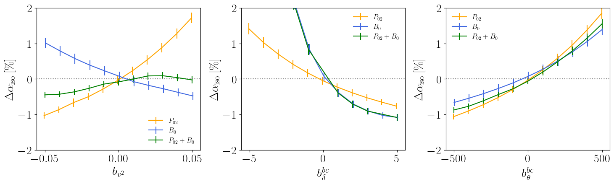

# arXiv Digest — 2026-07-22

**Interest file used:** interests/2026.05.md (fallback — no 2026.07.md exists yet)
**Categories pulled:** astro-ph.CO, astro-ph.EP, astro-ph.GA, astro-ph.HE, astro-ph.IM, astro-ph.SR, cs.LG, stat.ML, hep-ph
**Papers scanned:** 291 (58 astro-ph new/cross + 233 cs.LG/stat.ML/hep-ph)
**After first filter:** 18 candidates reviewed with full text
**Final selected:** 13 papers across 3 tiers

*Note: no core Lyman-α forest / IGM-opacity / DESI-Lyα paper appeared today, so Tier 1 is anchored on the nearest LSS/DESI-cosmology and dark-matter-structure hits rather than the forest itself; Tier 4 (meta-research) is omitted as nothing met the bar. The cs.LG/stat.ML/hep-ph pool (233 papers) was almost entirely off-topic ML/HEP phenomenology; only two crossovers (a neural-process method and an axion-via-filaments probe) survived.*

---

## Tier 1 — Highly relevant

### [Bispectrum BAO and the baryon-dark matter relative velocity](https://arxiv.org/abs/2607.18384)

Adriana Nadal-Matosas, Héctor Gil-Marín, Licia Verde
**Primary category:** astro-ph.CO

The authors extend the redshift-space tree-level galaxy bispectrum model to fully incorporate all baryon–dark-matter relative-velocity terms, and introduce a template-based technique to extract the isotropic BAO dilation parameter $α_\mathrm{iso}$ from the bispectrum monopole alone. Validated on N-body simulations, the estimator is unbiased and — combined with the pre-reconstruction power spectrum — boosts BAO constraining power by ~30%. Crucially, the three relative-velocity bias parameters shift $α_\mathrm{iso}$ differently in $P(k)$ vs. $B(k)$ (up to 2% for $b_{v^2}=\pm0.05$, up to 20% for $b_{δ^{bc}}$), so comparing the two independent BAO measurements detects, disentangles, and constrains the relative-velocity effect while mitigating its bias on power-spectrum-only pipelines.

A direct hit on the LSS/DESI-eBOSS BAO and higher-order-statistics-estimator focus: it delivers a new bispectrum-monopole BAO estimator, a concrete ~30% constraining-power gain, and a systematics-diagnostic prescription for next-generation spectroscopic surveys.

---

### [Dark Energy Bubble as Dynamical Dark Energy: Properties and CMB Constraints](https://arxiv.org/abs/2607.18376)

Batia Friedman-Shaw, Matthew C. Johnson, Katherine J. Mack
**Primary category:** astro-ph.CO

This paper builds a "dark energy bubble" model in which a first-order vacuum phase transition nucleates a spherical region of reduced dark-energy density that expands as a near-null thin wall, joined to an exterior ΛCDM cosmology via the Israel junction conditions. All distance measures and the parallel/perpendicular Alcock-Paczynski BAO stretch parameters are derived in this piecewise-FLRW geometry. A bubble nucleating at $z\sim1.4$ with ~10% lower interior dark-energy density reproduces DESI's radial/transverse BAO features strikingly well — but the combined CMB constraints (observer dipole, kSZ auto-power, velocity monopole, sound-horizon calibration) exclude the DESI-matching region at 2σ, with the kSZ effect most constraining.

Directly targets the DESI BAO tension with ΛCDM by asking whether *spatially* varying (not just time-varying $w_0$–$w_a$) dark energy can mimic the observed AP distortions; it gives a concrete, ruled-out toy model isolating how inhomogeneous late-time dark energy imprints on $α_\parallel/α_\perp$.

---

### [Decaying Dark Matter Halo Abundance from a Revised Spherical Collapse Model](https://arxiv.org/abs/2607.19244)

Thomas Montandon, Vivian Poulin, Oliver Hahn et al.
**Primary category:** astro-ph.CO

The authors develop a semi-analytical halo mass function (HMF) for decaying dark matter (DDM), where dark matter decays into a massive daughter inheriting a velocity kick $v_k$ plus dark radiation. Rather than injecting the suppressed DDM power spectrum into Press-Schechter (which fails), they keep the ΛCDM $P(k)$ and encode all DDM physics in a revised spherical-collapse model that tracks decay-induced mass loss, yielding a mass-dependent threshold $δ_c(M_0)$ and a mapping $M_\mathrm{coll}(M_0)$. Two analytic $δ_c$ plateaus plus a single-parameter transition fit (scale $M_1\propto v_k^3\tildeΓ^{-1/2}t_\mathrm{ta}$) emerge, validated against PKDGRAV3 N-body runs at $z=0$ and $z\approx1$, with residual large-kick discrepancies traced to the halo-mass definition.

Delivers a fast, closed-form $δ_c(M)$ and $M_\mathrm{coll}(M_0)$ prescription that makes non-cold (decaying) dark-matter halo abundance directly usable in MCMC inference — a concrete tool for small-scale/non-cold DM constraints from forthcoming cluster/HMF probes and an independent cross-check on the $S_8$ tension.

---

## Tier 2 — Adjacent / useful context

### [Dissecting the Scalar Cosmological Collider with the Cosmic Microwave Background](https://arxiv.org/abs/2607.18369)

Oliver H. E. Philcox
**Primary category:** astro-ph.CO | also: hep-ph

Philcox performs a joint Bayesian analysis of the full multi-field inflationary Lagrangian (a massive scalar coupled to the Goldstone mode), constraining single, double, and triple scalar exchange plus self-interactions across a wide range of masses, mixings, and sound speeds using recent Planck binned primordial-bispectrum measurements. He builds a large library of tree-level curvature bispectra via the cosmological bootstrap (weak mixing) and numerical cosmological flow / CosmoFlow (strong mixing), compressing the eight-parameter likelihood to a millisecond evaluation sampled with nested sampling and HMC. He presents the first analysis of the strongly-mixed regime — where Planck bounds are far tighter than theoretical unitarity limits but collider oscillations are exponentially suppressed — finding no evidence for new physics (max $χ^2$ improvement 5.3).

Relevant as a worked example of fast, high-dimensional Bayesian inference on real CMB data by a prominent LSS/inference author: the analytic marginalization of linear parameters and nested-sampling + HMC machinery are transferable, even though the target (inflation/CMB bispectra) is adjacent to the core forest focus.

*No figure extracted for 2607.18369 (the quantitative content is a high-dimensional, technical constraint set on inflationary amplitudes that the text conveys more clearly than any single panel).*

---

### [The impact of Hawking radiation from primordial black holes on recombination and the Hubble tension](https://arxiv.org/abs/2607.18528)

Adam Batten, Jeremy Mould
**Primary category:** astro-ph.CO

The authors modify the recfast recombination code to inject secondary-ionisation heating from evaporating primordial black holes ($10^{-20}$–$10^{-17.5}\,M_\odot$) via Hawking radiation, running 11 non-monochromatic PBH simulations plus a baseline to track how the extra heating delays recombination and shifts the last-scattering surface. A PBH energy density $Ω_\mathrm{PBH}\sim10^{-3}Ω_C$ delays decoupling enough to raise $H_0$ by ~8.9%, nominally closing the Hubble tension, while $Ω_\mathrm{PBH}>10^{-2}Ω_C$ is an absolute upper limit. Large caveats — unknown grey-body factors and neutrino losses (~40–50% of luminosity), plus a CAMB check showing the induced EE-polarisation change is only ~0.6% of peak — leave the correction uncertain by ~an order of magnitude and the tension not cleanly resolved.

Connects directly to the Hubble-tension, recombination/ionization-history, and PBH-as-dark-matter interests, and invokes Lyman-α IGM temperature/ionisation constraints at $z\sim10$ to exclude higher-mass PBHs.

*No figure extracted for 2607.18528 (the headline ~8.9% $H_0$ shift and its order-of-magnitude uncertainty are stated plainly in the text).*

---

### [Euclid: Inferring star-formation history via cross-correlations of photometric clustering and shear with the cosmic infrared background](https://arxiv.org/abs/2607.19290)

J. Han, S. Camera, M. Migliaccio et al.
**Primary category:** astro-ph.CO

This Euclid Consortium paper forecasts how tomographic cross-correlations of Euclid photometric galaxy clustering and weak-lensing shear with Planck cosmic-infrared-background (CIB) maps can reconstruct the bias-weighted star-formation-rate density $\langle b\,ρ_\mathrm{SFRD}\rangle$ out to $z\sim2$. Fixed power-spectrum templates from an HOD/halo model fit the galaxy auto-spectra for bias and the galaxy–CIB / shear–CIB cross-spectra for $\langle b\,ρ_\mathrm{SFRD}\rangle$, with the BNT nulling transform localizing the broad lensing kernel so shear–CIB can also be templated. A Fisher analysis yields ~2× tighter $\langle b\,ρ_\mathrm{SFRD}\rangle$ constraints over a deeper redshift range than a DELS-CIB baseline, ~2.5× tighter HOD parameters, and total S/N ~132.

A clean worked example of LSS cross-correlation methodology plus Fisher forecasting on concrete survey specs, including the BNT nulling technique for tomographic shear — reusable machinery for the reader's own cross-correlation and forecast work.

*No figure extracted for 2607.19290 (the key result is a factor-of-~2 forecast improvement that reads clearly as a number).*

---

### [Molecular gas hidden in plain sight in the early Universe](https://arxiv.org/abs/2607.18974)

Pasquier Noterdaeme, Jens-Kristian Krogager, Sergei Balashev
**Primary category:** astro-ph.GA

The authors report an extreme intervening molecular (H₂) absorber at $z=4.096$ toward the $z=4.67$ quasar SDSS J0800+3051, whose strong H₂ absorption sat unrecognized in SDSS/GMOS archival data for nearly two decades until new VLT/X-shooter follow-up. Voigt-profile fitting yields $\log N(\mathrm{HI})=20.8$, $\log N(\mathrm{H_2})=20.66$, ~1/5-solar metallicity, and modest reddening $A_V\sim0.06$. The molecular fraction $f_{\mathrm{H_2}}=0.59\pm0.08$ is the highest directly measured at $z>0$, rivaling the highest Local Group values. Detecting such a system despite only ~0.1 being expected implies either an unexpectedly high early-time H₂ incidence or substantial selection biases that cause strong molecular absorbers to be missed in both quasar colour selection and H₂-band recognition.

A direct application of high-z quasar absorption-line spectroscopy that quantifies QSO-survey selection/detection biases and explicitly motivates colour-independent quasar selection and H₂-template correlation detection algorithms — a real-system benchmark for developing such tools.

---

### [NAPTIME: A Neural-Process Framework for Rubin Alert Classification](https://arxiv.org/abs/2607.19236)

Nicholas Earl, Siddharth Chaini, K. Decker French et al.
**Primary category:** astro-ph.IM

NAPTIME is a neural-process framework (ConvGNP-style backbone + global latent path + optional metadata branch) that models sparse, irregularly sampled multiband transient light curves directly, jointly performing probabilistic light-curve reconstruction and family-level classification under partial context. Trained with a joint reconstruction + classification + KL objective, it reaches macro F1 = 0.903 / AUROC = 0.991 on the 15-family ELAsTiCC2 Rubin-like benchmark (0.874 / 0.986 photometry-only), with TDE one-vs-rest average precision 0.985. Metadata helps most in the low-context regime (earliest 10% of detections: F1 ~0.42 vs ~0.34).

Relevant as a borrowable inference technique: neural processes are an amortized, probabilistic alternative to Gaussian processes for irregularly sampled, partially observed data with uncertainty quantification — a natural fit for probabilistic modeling of spectra/forest data, even though the application here (transient classification) is off the core focus.

*No figure extracted for 2607.19236 (the contribution is a method plus headline metrics; the architecture panel is a schematic and the confusion matrix adds little beyond the quoted F1/AUROC).*

---

### [Probing the Cosmic Axion Background via Axion-Photon Conversion in Filaments](https://arxiv.org/abs/2607.18372)

Duncan Rocha, Gordan Krnjaic, Matthew J. Baldwin
**Primary category:** hep-ph

The authors propose an indirect-detection strategy for the cosmic axion background (CaB) — a relativistic axion population from GeV–TeV dark-matter decays ($χ\to aa$). As these axions traverse the ~1–100 nG magnetic fields of cosmological filaments, a fraction convert to photons via the Primakoff effect, producing an isotropic gamma-ray background computed by convolving the redshift-dependent conversion probability with the decay-axion flux. Comparing to Fermi-LAT, EGRET, COMPTEL, and INTEGRAL data excludes new $(m_a, g_{aγγ})$ parameter space for axion masses below $10^{-5}$ eV and lifetimes up to ~$10^{30}$ s — improving on existing bounds by up to seven orders of magnitude for optimistic fields, even touching the QCD-axion band.

A dark-matter/axion probe that uses the cosmic web itself — the magnetic fields of LSS filaments — as the conversion medium, tying together cosmic-web physics with ultralight-axion and cosmic-axion-background constraints.

---

### [Bright Galaxies at Cosmic Dawn: A Cloud-Scale Star Formation Model Unifying Variable SFE, IMFs, and Stochasticity](https://arxiv.org/abs/2607.18868)

Elie Cueto, Anne Hutter
**Primary category:** astro-ph.GA

Cueto & Hutter present a semi-analytic model that resolves star formation into discrete, sequentially sampled self-gravitating molecular clouds on ~1 Myr timesteps, each with an SFE set by a physically-motivated transition between photoionisation- and radiation-pressure-limited feedback and coupled to a dynamic, metallicity- and redshift-dependent IMF. The interplay of cloud mass, density, and feedback timescale produces three regimes as halos grow: a stochastic feedback-limited regime (largest UV scatter), a bursty cloud-mass-limited regime, and a smooth continuous regime in massive halos. Varying one ingredient at a time, they find the top-heavy evolving IMF most strongly boosts the bright end, while removing short-term burstiness collapses the bright-end tail — i.e. stochasticity is *required* to reproduce the observed $z>10$ UV luminosity function.

Directly addresses the origin of the JWST excess of UV-bright galaxies at $z>10$ and, because the same top-heavy-IMF/high-SFE physics raises the ionising-photon yield per stellar mass (tracked explicitly), feeds the ionizing-photon budget for reionization.

---

### [Star formation powers optical line emission from the CGM](https://arxiv.org/abs/2607.18385)

Huanian Zhang, Lizhi Xie, Zhijie Qu et al.
**Primary category:** astro-ph.GA

Using MaNGA integral-field spectroscopy, the authors build Hα, [O II], and [O III] emission-line maps of the inner CGM / disk-halo interface for 72 normal low-redshift galaxies spanning ~3 dex in stellar mass and ~4 dex in SFR. The radial profiles show a steep turnover at $(1$–$2)\,R_e$, beyond which the slope flattens as central SFR decreases. Critically, the line flux at large radius ($5$–$10\,R_e$, ~$0.1$–$0.25\,r_\mathrm{vir}$) correlates strongly with SFR/sSFR (Pearson $r=0.74$) but not with stellar mass ($r=0.02$); the authors attribute the emission to ionizing photons escaping central star-forming regions (escape fractions ~1–2%, up to ~35% for the highest-SFR object) and note that current simulations disagree on the cool-gas/SFR dependence.

Relevant to the CGM/cool-gas and ionizing-photon-escape interests: it provides emission-line (not just absorption) 2D maps of the cool ionized CGM and offers a discriminant for competing subgrid feedback prescriptions.

---

### [Physical Properties of 6.7 Million Galaxies from the DESI Bright Galaxy Survey: Spectral Fitting and Systematic Tests with Mock Spectra](https://arxiv.org/abs/2607.19162)

Niu Li, Hu Zou, Jinfu Gou et al.
**Primary category:** astro-ph.GA

The authors apply a full-spectral-fitting pipeline (BC03 SSPs via PCA, Calzetti dust, emission-line fitting) to ~6.7 million DESI DR1 Bright Galaxy Survey spectra, releasing a value-added catalog of stellar masses, velocity dispersions, ages, dust, and emission-line properties. To characterize systematics they build ~100,000 mock spectra with realistic DESI wavelength-dependent noise and refit them, measuring parameter recovery vs. continuum S/N and redshift. Stellar masses are near-unbiased for S/N > 5 (bias $\lesssim0.06$ dex) but overestimated by ~0.15 dex with ~0.3 dex scatter at S/N ≤ 3; masses agree with the official DESI CIGALE photometric VAC to within ~0.02–0.11 dex, and an S/N ≳ 5 threshold is recommended.

On-target as a DESI DR1 data product built by an optical spectral-fitting pipeline, with a mock-based, quantitative characterization of recovery bias vs. S/N — exactly the spectral-fitting-and-systematics methodology relevant to survey-scale inference.

*No figure extracted for 2607.19162 (the actionable content is an S/N ≳ 5 reliability threshold and per-parameter bias figures that summarize cleanly in text).*

---

## Tier 3 — Outside my area but notable

### [A Type Ia Supernova Candidate at $z\sim4.3$: A Transient Interloper in the Search for $z\sim14$ Galaxies](https://arxiv.org/abs/2607.18972)

Seiji Toshikage, Takahiro Morishita, Masaomi Tanaka et al.
**Primary category:** astro-ph.HE | also: astro-ph.GA

A point source in JWST/NIRCam pure-parallel imaging, originally flagged as a luminous ($M_\mathrm{UV}=-21$) $z\sim13.7$ galaxy candidate from its Lyman-break-like SED, is undetected in NIRCam epochs ~1 year before and after the detection — revealing it as a transient, not a persistent galaxy. Comparison against transient templates and SN 2011fe spectra classifies it as a normal Type Ia supernova near peak at $z\sim4.3$, where strong rest-UV Fe-group absorption mimics the Lyman break. The implied event rate exceeds delay-time-distribution models, implying a minimum SN Ia delay time shorter than 1 Gyr at a cosmic age of only ~1.5 Gyr.

A concrete, well-modeled demonstration that an ordinary low-z transient can masquerade as an extreme $z\sim14$ Lyman-break dropout; the authors quantify that even one such interloper inflates inferred bright-galaxy number densities at $z\sim14$ by ~0.25 dex — a catastrophic, asymmetric contamination for the small-volume JWST searches now driving claims of an early-Universe overabundance of luminous galaxies.

