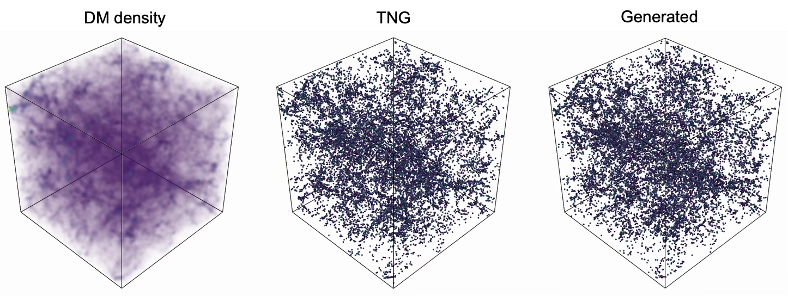
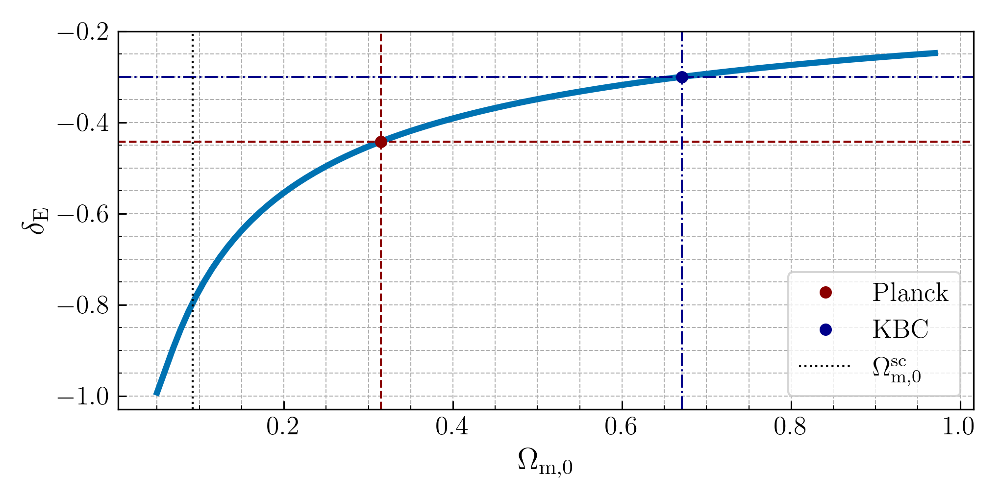
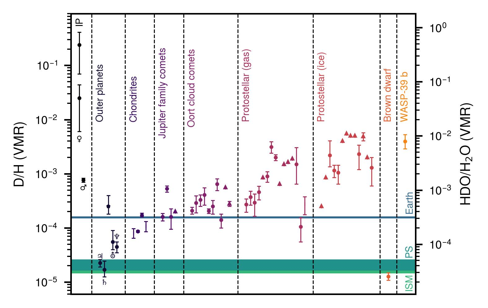

# arXiv Digest — 2026-07-23

**Interest file used:** interests/2026.05.md (fallback — no 2026.07.md exists yet)
**Categories pulled:** astro-ph.CO, astro-ph.EP, astro-ph.GA, astro-ph.HE, astro-ph.IM, astro-ph.SR, cs.LG, stat.ML, hep-ph
**Papers scanned:** 266 (93 astro-ph new/cross + 173 cs.LG/stat.ML/hep-ph and other cross-lists)
**After first filter:** 21 candidates reviewed with full text
**Final selected:** 13 papers across 3 tiers

*Note: interest file is a two-month fallback (no 2026.06.md or 2026.07.md yet); proceeding on the most recent prior file. Tier 4 (meta-research) omitted — nothing on the practice of the field appeared in today's pull. The cs.LG/stat.ML/hep-ph pools were almost entirely generic ML and collider/axion-detection work with no cosmology angle.*

---

## Tier 1 — Highly relevant

### [Ringing of the Reionization: A first direct measurement of the intergalactic pressure smoothing scale at redshift z>4.2 as imprinted onto small-scale peculiar velocities in the Lyman-alpha forest](https://arxiv.org/abs/2607.19938)

Vid Iršič, Matteo Viel, Martin G. Haehnelt et al. (Iršič, Viel — interest-file high-value authors)
**Primary category:** astro-ph.CO | also: astro-ph.GA

Using the Sherwood-Relics hydrodynamical suite, the authors identify an acoustic-like feature in the 1D power spectrum of the projected line-of-sight peculiar-velocity gradient η, and show via an "expanding spheres" toy model and Gnedin-Hui linear theory that it traces the gas pressure smoothing (filtering) scale set by reionization heat injection. The same feature is imprinted on the small-scale Lyα flux power spectrum at k ≈ 0.1–1 s/km. Fitting empirical smooth+peak functions and applying the method to the observed Boera et al. (2019) flux power spectra yields the first *direct* measurements of the pressure smoothing scale at z > 4.2: λ_p(4.2) > 33.78 ckpc (1σ), λ_p(4.6) = 32.36 ± 8.35 ckpc, λ_p(5.0) = 31.27 ± 18.28 ckpc. It is a proof-of-concept pointing toward recovering the IGM thermal history from small-scale forest observations with future high-resolution surveys.

This is the most direct hit possible on the primary focus: small-scale Lyα forest P1D as a probe of IGM thermal history and pressure/Jeans smoothing, from the exact author group (Iršič, Viel, Haehnelt, Bolton) at the center of the interest profile.

---

### [Probing the matter-dominated expansion with multi-redshift Lyman-α BAO from DESI DR2](https://arxiv.org/abs/2607.19619)

Hiram K. Herrera-Alcantar, Julien Guy, Alma X. Gonzalez-Morales et al. (DESI Lyman-α working group)
**Primary category:** astro-ph.CO

The DESI collaboration splits the DR2 Lyα forest auto-correlation and Lyα×quasar cross-correlation into three redshift bins and measures BAO at z_eff = 2.13, 2.40, 2.81 using the same Vega framework and 400-mock validation as the headline DR2 analysis, reaching ~2.0–2.5% radial/transverse precision per bin (~1.1–1.2% isotropic). The Hubble distance D_H/r_d falls from 9.40 ± 0.20 to 7.22 ± 0.17, tracing the expansion history as H(z) ∝ (1+z)^n with n = 1.34 ± 0.16, consistent with ΛCDM matter-dominated scaling. The split also self-consistently measures clustering evolution — Lyα bias γ_α = 3.05 ± 0.16, RSD γ_β = −0.97 ± 0.26 (~3.7σ non-zero evolution), quasar bias γ_Q = 1.56 ± 0.23. Combined with DESI DR2 galaxy/quasar BAO, the constraints match the single-bin analysis and improve ΛCDM+Ω_K curvature by ~12%.

Squarely on the primary focus — DESI Lyα forest BAO, the current flagship of the P1D/P3D-and-BAO program the library is built around, and a natural companion to the DR1 Lyα analyses already in the collection.

---

## Tier 2 — Adjacent / useful context

### [From Dark Matter to Galaxies: Halo-Free Mock Generation via Conditional Point-Cloud Diffusion](https://arxiv.org/abs/2607.19808)

Kana Moriwaki, Ken Osato, Naoki Yoshida
**Primary category:** astro-ph.GA | also: astro-ph.CO

The authors build a diffusion generative model (Elucidated Diffusion framework, transformer denoiser) that produces galaxy catalogues directly as *point clouds* — 3D position plus SFR and stellar mass per galaxy — conditioned on a low-resolution dark-matter density field, with no halo finding. Trained on IllustrisTNG at z=2, it reproduces the SFR/M⋆ distributions, the galaxy auto-power spectrum, and the galaxy–DM cross-power spectrum, and crucially populates galaxies below the input DM resolution limit by marginalizing over unresolved small-scale structure. With an optimized sampling schedule it generates a (151.3 Mpc)³ catalogue in ~10 s on a single GPU. The authors frame it as an engine for large mock ensembles and a path toward simulation-based inference that bypasses halo finding.

Directly relevant to the rising-primary ML-for-cosmology thread: a field-level generative model connecting DM statistics to observable galaxies, exactly the kind of fast forward model / SBI ingredient the profile flags for LSS and line-intensity-mapping inference.

---

### [LMC-induced Perturbations in the Milky Way Halo II: Bridging Field-level Inference and Summary-level Simulation-Based Inference](https://arxiv.org/abs/2607.20006)

Yanjun Sheng, Yuan-Sen Ting, Tomasz Różański et al.
**Primary category:** astro-ph.GA

The authors train a Conditional Flow Matching model on the raw 6D phase-space particles of the HaloDance N-body suite to obtain an *exact field-level likelihood* for the MW–LMC parameters (M_MW, M_LMC, concentration, flattening), used as an information benchmark — it tightens constraints by factors 2.5–9.9 over an all-sky velocity-moment forecast. They then compress a basis-function expansion of the density/velocity fields with MOPED into four interpretable summaries, show via variational mutual information that these and the velocity moments are complementary, and combine them into a 19D vector reaching within a factor 1.3–2.9 of the field-level benchmark. The result quantifies how much information standard summary statistics discard relative to the full field.

The science target (MW–LMC dynamics) is peripheral, but the methodology is core to the profile: conditional flow matching for a field-level likelihood, MOPED compression, and an explicit field-level-vs-summary information accounting — the same questions the interest file raises about summary-statistic sufficiency for cosmic fields.

---

### [Microlensing Detection and Inference via Learned Bayes Factors](https://arxiv.org/abs/2607.20260)

Nolan Smyth, Laurence Perreault-Levasseur, Yashar Hezaveh
**Primary category:** astro-ph.IM | also: astro-ph.GA

This work recasts gravitational-microlensing *detection* as Bayesian model comparison using Evidence Networks (learning calibrated Bayes factors from binary labels) and *parameter inference* via Neural Posterior Estimation with a masked autoregressive flow, both sharing a transformer encoder that ingests irregularly-sampled light curves without imputation. On simulated Roman data the Evidence Network reaches 99.9% detection efficiency with a false-positive rate < 6×10⁻⁴, beating hard-cut pipelines especially in the extreme finite-source regime (~95% vs ~65%) most relevant to free-floating planets. The NPE posteriors are calibrated (validated by TARP) and ~16,000× faster than MCMC, and an ablation shows the SBI-trained encoder transfers to detection at near-zero extra cost.

A clean, transferable template for the SBI toolkit the profile is building toward: Evidence Networks for model comparison, amortized NPE for parameters, and a transformer front-end for messy time series — patterns that carry directly to spectroscopic and forest-inference problems.

---

### [AGNFormer I: Reconstruction of AGN spectra using a probabilistic transformer model](https://arxiv.org/abs/2607.19640)

Benedict L. Rouse, Franz E. Bauer, Tomasz Różański et al.
**Primary category:** astro-ph.GA | also: astro-ph.IM

AGNFormer is an encoder-only, BERT-style probabilistic transformer trained by masked autoencoding to reconstruct masked regions of SDSS DR16 quasar spectra, taking rest-frame flux and uncertainty as input with a physical log-wavelength positional encoder and outputting a per-pixel Gaussian mean and variance via an NLL loss. It reconstructs unseen broad lines (masked to ±10⁴ km/s) to better than 10–16% of the flux (4–8% for S/N > 10), down to a ~2–6% floor at S/N ≈ 40, and faithfully reproduces the broad AGN diversity across the optical/UV quasar main sequence, including Fe II complexes and C IV blueshifts. Performance matches or beats existing C IV and Lyα reconstruction algorithms.

Relevant on two counts the profile cares about: quasar continuum/line reconstruction is an essential systematic for Lyα forest measurements, and the masked-transformer / spectroscopic-foundation-model approach is exactly the modeling direction (SpecPT, AstroCLIP, AION) tracked in the ML branch.

*No figure extracted for 2607.19640 (the informative options are a second network-architecture schematic — redundant with the Evidence-Network diagram above — or many small per-line reconstruction panels; the contribution is clear from the text).*

---

### [The burgeoning rise of the 21-cm forest I: constraints on the optical depth of the intergalactic medium at 5.38 < z < 5.84](https://arxiv.org/abs/2607.20371)

Chanasorn Kongprachaya, Gianni Bernardi, Emilio Ceccotti et al.
**Primary category:** astro-ph.CO | also: astro-ph.GA

The authors develop a framework that jointly fits a power-law radio continuum plus an intervening 21-cm absorption model — a smooth "global model" and a residual-cold-patch "island model" — validated on SKAO-like simulations, then apply it to an 18-hour uGMRT observation of the radio-loud quasar J2329-1520 (z=5.84) in the 203–222.5 MHz band. They find no 21-cm absorption over 5.38 < z < 5.84, setting τ_21 < 0.02 (95% C.L.) in the global model and a spin-temperature floor T_s > 1.73 K in the island model. These limits sit above the adiabatic cooling temperature (~0.8 K at z=5.68), confirming the IGM was heated by the end of reionization and disfavoring extremely cold residual HI regions at z < 5.84.

A complementary radio probe of the same physics as the profile's second primary focus — IGM neutral fraction, spin temperature, and opacity at the end of reionization — and a concrete step toward the "joint Lyα + 21cm reionization inference" the interest file lists as an emerging direction.

---

### [Accurate parameter inference for the Light-cone Epoch of Reionization 21-cm signal](https://arxiv.org/abs/2607.19792)

Suman Pramanick, Anoop Krishna, Rajesh Mondal et al.
**Primary category:** astro-ph.CO | also: gr-qc

This letter tests the "evolving power spectrum" P_e(k,z) as a summary statistic for the light-cone EoR 21-cm signal, which the standard power spectrum fails to capture because the light-cone effect breaks line-of-sight homogeneity. Using ReionYuga simulations, the authors show the evolving PS recovers the benchmark coeval 3D power spectrum across almost all k and z, then train ANN emulators (R² > 0.99) on 500 light-cone simulations and run emcee inference on three reionization parameters including cosmic variance and SKA-Low noise. The evolving PS yields the tightest constraints — on average ~3× narrower than the cylindrical PS and ~1.4× narrower than the slice-wise PS — establishing it as the preferred statistic for forthcoming SKA-Low data.

Adjacent-probe methods with two ingredients the profile values: a deliberate optimization of the summary statistic against information loss, and neural emulators standing in for expensive simulations during inference.

---

### [Reading Between the Lines: Forward Modeling Dust, Continuum, and Spectral Cleaning for Multi-Line Intensity Mapping](https://arxiv.org/abs/2607.19504)

Anirban Roy, Rachel S. Somerville, Anthony R. Pullen
**Primary category:** astro-ph.GA | also: astro-ph.CO, astro-ph.IM

The authors build an end-to-end forward model of optical/near-IR multi-line intensity mapping on a Santa Cruz semi-analytic lightcone, producing intensity maps for the stellar continuum plus Hα, Hβ, [OIII], and [OII] with property-dependent nebular dust attenuation, targeting SPHEREx-like surveys. They measure cross-channel angular power spectra and show the expected same-redshift line-ridge correlations, then demonstrate that dust suppresses line cross-power in a line-pair-, wavelength-, and redshift-dependent way that no single amplitude captures. Because the bright continuum hides the ridges, they apply PCA cleaning and calibrate the line-transfer function against simulation truth, finding ~20 modes optimal. The headline lesson is that continuum cleaning is not signal-preserving and its transfer function must propagate into any quantitative inference.

Adjacent LSS/LIM methodology, but the transfer-function bookkeeping for foreground/continuum removal is conceptually the same problem — and the same trap — as continuum fitting and estimator bias in the Lyα forest P1D.

---

### [Can cosmic voids ease the Hubble tension? Local expansion in w0waCDM](https://arxiv.org/abs/2607.20257)

Tommaso Moretti, Noemi Frusciante, Giovanni Verza
**Primary category:** astro-ph.CO | also: gr-qc

Using a hydrodynamical model of isolated spherical inverse-top-hat underdensities, the authors compute the void-induced local Hubble shift as a function of redshift, enclosed density contrast, and cosmology in flat w0waCDM. They find the effect is controlled mainly by the matter sector, with dynamical dark energy contributing only sub-percent late-time corrections. Matching the SH0ES value would require a present-day void depth δ_E(z=0) ≈ −0.44, substantially deeper than the KBC-like benchmark; a KBC-like void lowers the SH0ES–Planck discrepancy only to ~2σ, and DES/DESI-motivated (w0, wa) changes this at the percent level. The conclusion is that local underdensities in this spherical setup cannot resolve the Hubble tension.

Touches two secondary threads of the profile at once — void cosmology and the DESI dynamical-dark-energy context — and cleanly bounds how much a local-structure explanation can (not) do for H0.

---

### [Beyond j=1: Observational Constraints on Almost-ΛCDM Cosmologies](https://arxiv.org/abs/2607.20348)

Jess Worsley, Saikat Chakraborty, Peter Dunsby
**Primary category:** astro-ph.CO | also: gr-qc

The authors test departures from the ΛCDM cosmographic condition j(z)=1 using three phenomenological "almost-ΛCDM" closures with a small jerk-deformation parameter, constrained by MCMC against DESI BAO, compressed Planck, and Union3/Pantheon+/DESY5 supernovae. The framework reconstructs the expansion history directly, with the dark-energy equation of state emerging as a derived quantity rather than an assumed CPL form. All three closures are confined to a small neighborhood of the ΛCDM fixed point, with Planck driving j0 ≈ 1 and w_DE,0 ≈ −1, and the reconstructed w(z) shows smooth freezing behavior without crossing the phantom divide — unlike CPL. AIC/BIC comparison finds the models competitive with (and Akaike-favored over) CPL while assuming less about w(z).

A model-independent counterpoint to the DESI CPL dynamical-dark-energy story the profile follows: it argues the data constrain the expansion history far more robustly than the detailed w(z) evolution the phantom-crossing headlines imply.

---

## Tier 3 — Outside my area but notable

### [Four, One, and None: Quantifying the Ultra-High-Energy Neutrino Anomaly Across ANITA-IV, KM3NeT, and IceCube](https://arxiv.org/abs/2607.19487)

Dibya S. Chattopadhyay, Carlos A. Argüelles, Vedran Brdar
**Primary category:** astro-ph.HE | also: hep-ex, hep-ph

The authors perform the first joint statistical analysis of the four near-horizon ANITA-IV events, the single 220-PeV KM3NeT event, and IceCube's null result, building semi-analytic energy- and direction-dependent effective areas with time-dependent exposures for all three detectors. For a diffuse all-sky power-law flux, the three rates cannot be jointly reproduced: the best fit predicts ~5 IceCube events while underpredicting ANITA-IV and KM3NeT, a ~7.5σ tension. A fine-tuned transient scenario aligned exactly with the observed directions and windows can alleviate it, but realistic randomly-distributed rare transients still leave 5.9σ tension over IceCube's ~15-year exposure. Within the Standard Model, directional and temporal variations alone cannot reconcile the observations.

Well outside the area, but a 7.5σ incompatibility across three flagship neutrino observatories is a genuinely striking multi-messenger anomaly — the kind of "the Standard Model can't currently fit this" result worth tracking as a scientist.

---

### [Atmospheric retrieval evidence for water isotopologue HDO on exoplanet WASP-39b](https://arxiv.org/abs/2607.19579)

Fabian Gruebel, Karan Molaverdikhani, Barbara Ercolano et al.
**Primary category:** astro-ph.EP

Using petitRADTRANS retrievals on the combined JWST transmission spectrum (NIRISS/NIRCam/NIRSpec/MIRI) of the hot Jupiter WASP-39b, the authors report the first retrieval evidence for deuterated water (HDO) in an exoplanet atmosphere. Bayesian model comparison gives decisive evidence (4.8σ for the fiducial temperature profile), driven mainly by NIRSpec PRISM in the 3–4 μm range, yielding a water D/H = (4.0₋₁.₁⁺¹·³)×10⁻³. That value is substantially elevated above Solar System gas giants and comets, overlapping inner-Solar-System and protostellar values, and is interpreted as either inherited water-rich material accreted beyond the snow line or in-situ isotopic processing via photochemistry and escape.

Far from the profile, but a first-of-kind isotopologue detection in an exoplanet atmosphere is a notable measurement milestone — deuterium fractionation as a new tracer of planet formation and accretion history.

