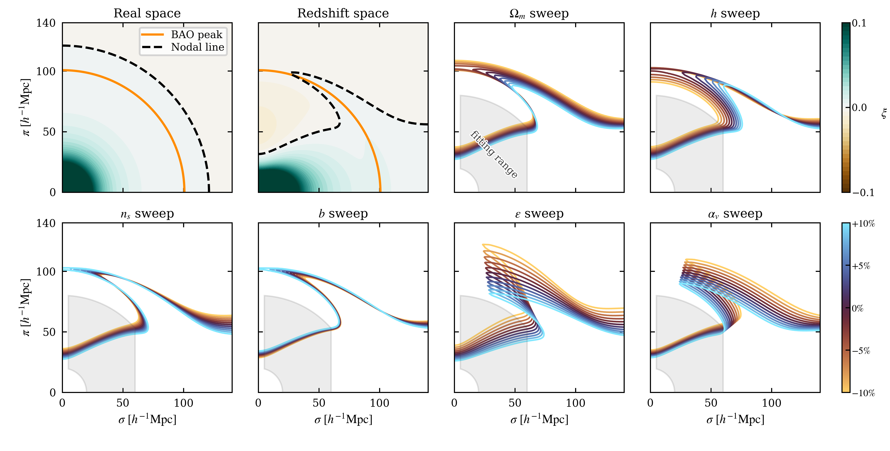
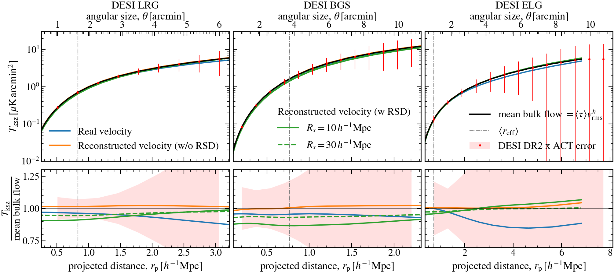
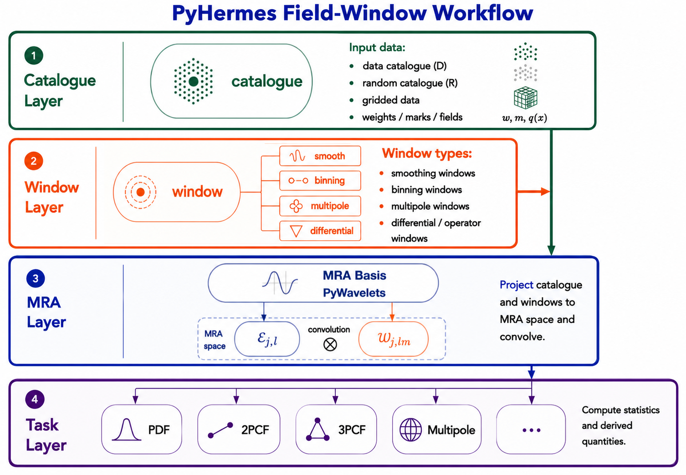
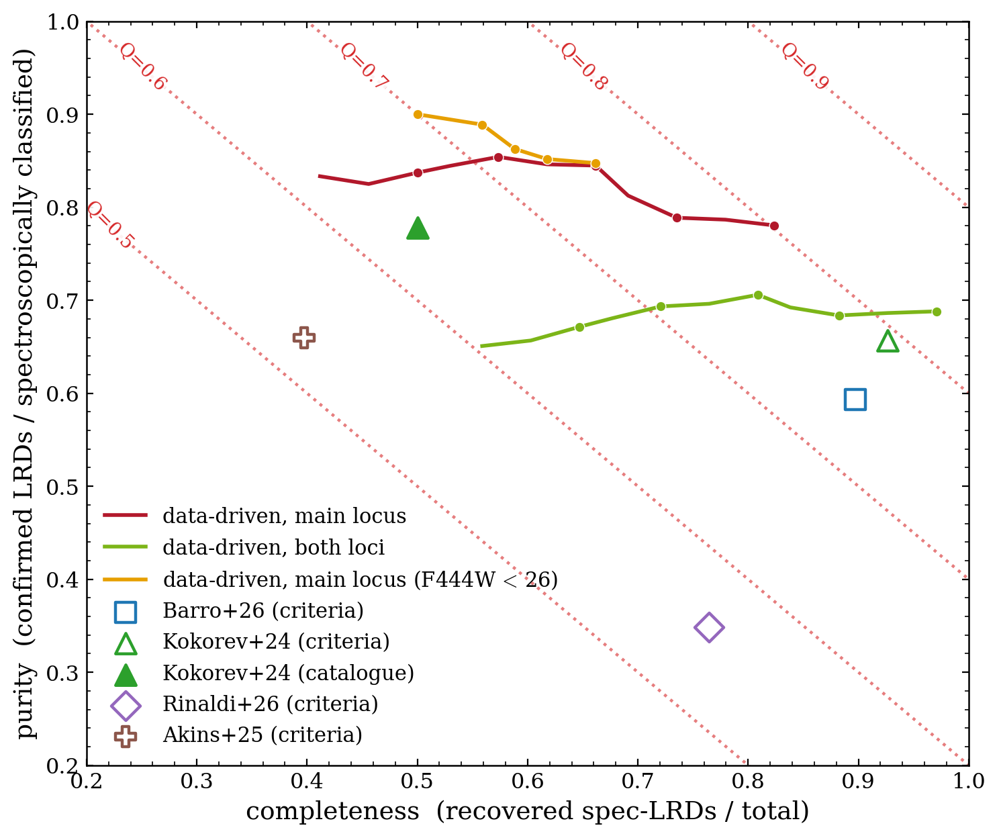

# arXiv Digest — 2026-07-28

**Interest file used:** interests/2026.05.md (fallback — no 2026.07.md exists yet)
**Categories pulled:** astro-ph.CO, astro-ph.EP, astro-ph.GA, astro-ph.HE, astro-ph.IM, astro-ph.SR, cs.LG, stat.ML, hep-ph
**Papers scanned:** 503 (123 astro-ph new/cross + 380 cs.LG/stat.ML/hep-ph)
**After first filter:** 15 candidates reviewed with full text
**Final selected:** 13 papers across 3 tiers

*Note: interest file is a fallback from May (no July file yet). Today's crop had limited overlap with the Lyα-forest/IGM/DESI/ML-inference focus, so the full-text pool was tighter than the usual 25–40 target; nothing padded. Tier 4 (meta-research) is omitted — nothing met the bar. Two on-topic-but-thin papers were read and dropped: an incremental distance-ladder H₀ update (2607.24443) and an early 21-cm commissioning report with no science result yet (MANAS, 2607.23329).*

---

## Tier 1 — Highly relevant

### [Measuring Cosmic Neutrino Masses Independently of Dark Energy](https://arxiv.org/abs/2607.24742v1)

Frank J. Qu, Fei Ge, Hanyue Wang et al.
**Primary category:** astro-ph.CO | also: hep-ph

The authors dissect, probe by probe, how much of the cosmological Σmν bound is entangled with late-time dark-energy assumptions, and build two dark-energy-robust routes. The standard dark-energy-marginalized route (retain all data, marginalize over w₀,wₐ) gives Σmν < 0.152 eV and is shown to *saturate* there even under flexible binned and cubic w(a) histories, sharpening to σ(Σmν) ≈ 0.043 eV with Simons Observatory lensing plus Spec-S5 BAO. A new "late-Universe-free" route — primary CMB with acoustic-peak smoothing marginalized via A_lens, plus the reconstructed CMB-lensing spectrum C_L^κκ and differenced high-z BAO — yields Σmν < 0.41 eV essentially flat across every dark-energy model tested, tightening to 0.28 eV at the cosmic-variance limit. The physical insight is that all late-time information enters Σmν through ω_m, anchored by the same low-z distance scale that dark energy rescales; only the 4-point lensing channel carries dark-energy-insensitive neutrino information.

Squarely on the neutrino-mass-from-cosmology interest and top-priority DESI: it uses DESI DR2 BAO (including the z = 2.33 Lyα point), CMB lensing, and engages the reionization optical-depth τ–Ω_m degeneracy that also touches the IGM/reionization program.

---

### [Hierarchical Gaussian-process test of DESI's dynamical dark-energy preference](https://arxiv.org/abs/2607.23593v1)

Yu-Hao Mu, Zhihuan Zhou, Enkun Li
**Primary category:** astro-ph.CO

The authors reconstruct the late-time expansion history with a hierarchical Gaussian process that *co-samples* the kernel hyperparameters (σ_f, l) jointly with (H₀, Ω_m, Ω_k, ω_b h²), conditioning on 37 cosmic-chronometer H(z) points and coupling DESI DR2 BAO + compressed Planck distance priors + Pantheon+ through a Monte-Carlo effective likelihood. The baseline gives w(z≈0) = −0.80⁺⁰·²⁶₋₀.₂₃ (only ~0.8σ from w = −1) with a large smoothing length l = 3.79, and a same-data CPL fit improves on nested ΛCDM by merely Δχ² ~ 1. Extensive ablations — fixing the hyperparameters, dropping SN or LRG1/2 BAO, switching to a Matérn-5/2 kernel, tightening the prior on l — all leave w = −1 viable at ≲1σ. The conclusion: the mild dynamical-dark-energy preference is specific to the compressed-CMB pipeline and does not reproduce DESI's 2.8–4.2σ full-Planck result.

Directly on the DESI-DR2-BAO / dark-energy interest, and a nice ML-inference angle (hierarchical GP reconstruction) — a robustness check on the headline DESI dynamical-dark-energy claim that the reader is tracking as a recent-additions signal.

---

### [The Nodal Line of the Galaxy Correlation Function as a Geometric Cosmological Probe](https://arxiv.org/abs/2607.24694v1)

Lado Samushia
**Primary category:** astro-ph.CO

Samushia proposes a new purely geometric probe: the "nodal line," the near-straight zero-crossing locus of the anisotropic correlation function ξ(σ,π) over 20–80 h⁻¹Mpc. Because the estimator uses only sgn(ξ), it is exactly invariant to amplitude (bσ₈) rescaling and largely complementary to BAO. In a proof-of-concept on DESI DR1 galaxies (five tracer/redshift bins, 0.4 < z < 2.1, with mocks for covariance), the nodal line constrains Ω_m h^{3/2} = 0.1761 ± 0.0053 (3% at fixed bias; ~4.8% under a 10% bias prior). Combined with DESI DR1 BAO it delivers a sound-horizon-free H₀ to 4.45% (h = 0.719 ± 0.032) from clustering geometry alone, with no r_d calibration or BBN/CMB prior.

A DESI DR1 galaxy-clustering analysis proposing a novel, sound-horizon-independent complement to BAO and full-shape — right in the LSS/DESI techniques shelf, and the kind of estimator idea that could carry over to forest clustering.

---

### [Reionization driven by the few: the ionizing budget of galaxies at z=5–10 from JWST/NIRSpec](https://arxiv.org/abs/2607.22834v1)

Emma Giovinazzo, Pascal A. Oesch, Anne Verhamme et al.
**Primary category:** astro-ph.GA

Using 1428 JWST/NIRSpec PRISM spectra at 5 < z < 10 from the DAWN JWST Archive, the authors perform SED fitting with a picket-fence f_esc model to measure each galaxy's *escaping* ionizing output directly, bypassing the usual ξ_ion × f_esc decomposition (validated against the standard Hα method to 0.05 dex). Convolving the inferred distribution with UV luminosity functions integrated to M_UV = −13, they build ionizing emissivity functions, the cosmic emissivity ṅ_ion(z), and the neutral-fraction evolution, finding reionization ends at z ~ 5.8 with a τ_CMB consistent with Planck. The headline result: strong leakers (f_esc > 10%), only ~20% of sources, produce ~87% of all ionizing photons; bright galaxies dominate at z = 5–6 while faint ones contribute comparably at z > 6, with the UV-LF faint-end slope the dominant uncertainty.

Squarely on the IGM & reionization interest (neutral fraction, opacity, timeline, τ); it compares ṅ_ion against quasar Lyα-forest constraints and explicitly flags that its low τ contradicts the high DESI τ invoked to ease the neutrino-mass tension — tying it back to the DESI/neutrino paper above.

---

## Tier 2 — Adjacent / useful context

### [Evidence for Azimuthally Anisotropic MgII Absorption around DESI Luminous Red Galaxies](https://arxiv.org/abs/2607.24071v1)

Xuanyi Wu, Cheng Li
**Primary category:** astro-ph.GA

Using DESI DR1 LRGs (0.4 < z < 1.1) and background quasar spectra, the authors apply a "forced-EW" method that assigns a MgII doublet-window equivalent width to every LRG–quasar pair (including non-detections), subtracting a redshift-matched random control, to map the mean MgII EW field versus projected radius and azimuth relative to the LRG major axis. The all-angle profile declines smoothly from ~1.28 Å at r_p ~ 0.01–0.03 Mpc to ~0.03 Å near 1 Mpc, with stronger inner absorption at lower redshift. They detect a localized major-axis enhancement at r_p ≈ 30–80 kpc: the integrated major-minus-minor difference over 0.03–0.077 Mpc is 0.184 ± 0.075 Å (position-angle randomization p = 0.013, ~2.5σ), with no significant redshift evolution of the anisotropy.

Hits the CGM-via-quasar-absorption theme — a natural sibling of the IGM interest seen through the same absorption lens — and is built entirely on DESI DR1 spectra. The forced-EW + random-subtraction estimator is a methodologically relevant stacking technique.

---

### [Constraining the z ≈ 1 neutral hydrogen (HI) distribution](https://arxiv.org/abs/2607.24412v1)

Minal Chhabra, Raghunath Ghara, Somnath Bharadwaj
**Primary category:** astro-ph.CO | also: astro-ph.GA

The authors jointly model two existing z ≈ 1 21-cm observations — Ω_HI from uGMRT stacking of star-forming galaxies and the CHIME 21-cm autocorrelation power spectrum — to constrain a three-parameter HI mass–halo mass relation via emcee MCMC, populating HI onto FoF halos in a 150 Mpc N-body simulation. They infer a cutoff halo velocity implying M_cut ≈ 4×10¹¹ M⊙ and predict the z ≈ 1 HI mass function: nearly flat below ~3.6×10⁹ M⊙ and dropping sharply above, with ~90% of HI in M_HI ∈ [2×10⁹, 4×10¹¹] M⊙. Notably they predict a larger abundance of high-mass HI galaxies than earlier indirect estimates and than TNG100/EAGLE/SIMBA.

Post-reionization HI / 21-cm cosmology constrained by Bayesian inference over the CHIME power spectrum — matches the 21-cm adjacent interest and the SBI/MCMC-over-simulations methodology, with a halo-model grid that mirrors the emulation approach used for the forest.

---

### [Interpreting the stacked kinetic SZ effect I: velocity reconstruction and non-linear velocity effects](https://arxiv.org/abs/2607.23339v1)

Lurdes Ondaro-Mallea, Raul E. Angulo, Boryana Hadzhiyska et al.
**Primary category:** astro-ph.CO | also: astro-ph.GA

Using the FLAMINGO hydrodynamical simulations with DESI-like LRG/BGS/ELG mocks, the authors decompose the velocity-weighted stacked kSZ signal into a dominant mean-bulk-flow term (∝ mean optical depth) plus two non-linear terms from small-scale gas momentum coupling to the stacking velocity. The two non-linear terms each reach ~50% individually but largely cancel, leaving a net 10–20%; with linear-theory real-space velocity reconstruction they wash out (net < 2%), but redshift-space distortions make reconstruction errors correlate with environment and suppress the signal ~10% on small scales (driven by satellite Fingers-of-God). Crucially the effect is gravitational in origin — baryonic feedback changes it by < 5–10% — so it is a 1–2σ issue for current ACT×DESI DR2 but statistically significant for upcoming surveys.

A DESI-mock-based study of the gas/velocity-reconstruction systematics that limit kSZ×DESI cross-correlations — relevant to LSS survey inference, estimator choice, and the S/N-versus-modelling-simplicity trade-off.

---

### [Hermes — Towards an Optimal High-Performance Algorithm for Cosmic Statistics of Large Data Sets](https://arxiv.org/abs/2607.23494v1)

Long-long Feng, Tengpeng Xu, Tian-Cheng Luan et al.
**Primary category:** astro-ph.CO

Hermes is an in-situ multiresolution framework that replaces conventional counting of particle tuples with algebraic products of window-filtered continuous fields: a catalogue is reconstructed once as a density field in a compact scaling-function (wavelet) basis, and counts-in-cells, 2PCF, higher-point functions, multipoles, and marked statistics all become choices of window kernels acting on that field. The authors release PyHermes (multiresolution reconstruction + FFT window convolution + MPI/thread + GPU), validated against pair-counting codes on Quijote halos. Benchmarks include a redshift-space DD(s,μ) measurement in ~120 s and a multipole 3PCF up to ℓ_max = 20 in ~230 s; the payoff is amortizing one field reconstruction across many statistics for the million-to-billion-tracer regime.

A scalable clustering-estimator toolkit aimed explicitly at DESI/Euclid/Rubin catalogues — directly in the LSS techniques and covariance/estimator interest, and the sort of infrastructure that feeds both survey analysis and simulation-based work.

---

### [Accurate method for ultralight axion CMB and matter power spectra](https://arxiv.org/abs/2412.15192v2)

Rayne Liu, Wayne Hu, Daniel Grin
**Primary category:** astro-ph.CO | also: hep-ph

Liu, Hu & Grin present AxiECAMB, a full Boltzmann code (successor to axionCAMB) that computes accurate, efficient CMB and matter power spectra for ultralight axions across 10⁻³³ ≲ m/eV ≲ 10⁻¹⁸, extending the effective-time-average + effective-fluid method below the previously required m ≫ 10 H_eq regime. The new physics is time-averaging of the metric perturbations and enforcing hydrostatic equilibrium of the effective fluid at the field→fluid switch, which removes spurious Jeans oscillations. This yields many-orders-of-magnitude accuracy gains over axionCAMB in extreme parameter regions and order-unity corrections near ΛCDM, at precision sufficient for Simons Observatory / CMB-S4 analysis; the code is public and intended for likelihood sampling of fuzzy-DM / early-dark-energy models bearing on the S₈ and H₀ tensions.

Precisely the fuzzy/ultralight-axion dark-matter interest, with small-scale power suppression and an emulator-grade Boltzmann tool for inference — the matter-power-spectrum work connects naturally to Lyα-forest and LSS constraints on the nature of dark matter.

---

### [Speeding up Gravitational Lens Mass Models with Machine Learning: Applications in X-ray Astronomy](https://arxiv.org/abs/2607.22812v1)

Alex Ostridge, Rafael Martínez-Galarza, Júlia M. Sisk-Reynés et al.
**Primary category:** astro-ph.GA | also: astro-ph.CO

The authors build a simulation-based ML framework to accelerate mass modeling of quadruply lensed quasars for the caustic method (which boosts Chandra's effective angular resolution at high z). They simulate >6×10⁶ SIE lens–source configurations and train two small fully-connected networks that take only the four image positions and distance ratios to predict the SIE mass parameter and ellipticity, reaching RMS errors of 0.148″ and 0.030. Used as optimizer initial values, 151/200 simulated systems converge to reproduce image positions at 0.5 mas in minutes, validated on seven real Gaia-observed quadruply lensed quasars with archival Chandra data. The method supplies fast, CPU-only initializations to scale to the ~10³–10⁴ lensed AGN expected from Euclid, Rubin, Roman, and Gaia DR4.

A clean simulation-based-inference / neural-network method for lens modeling, with line-of-sight dark-matter substructure as a stated motivation — the SBI-for-surveys workflow is borrowable even though the science target (X-ray AGN astrometry) is peripheral.

*No figure extracted for 2607.22812 (the accuracy is well conveyed by the text; the method/architecture panels are inline TikZ with no standalone key-result plot worth reproducing).*

---

### [Unsupervised selection and characterisation of Little Red Dots in JWST surveys with manifold learning](https://arxiv.org/abs/2607.22835v1)

Michele Ginolfi, Filippo Mannucci, Alessandro Marconi et al.
**Primary category:** astro-ph.GA | also: astro-ph.IM

The authors apply UMAP manifold learning to ~242,000 sources from the ASTRODEEP-JWST catalogue, embedding an 11-feature space (colors + reference flux + stellarity + size + photo-z) into 2D and anchoring it semi-supervised with spectroscopically confirmed Little Red Dots. With no color cut imposed, the spectroscopic LRDs concentrate into two well-defined regions differing mainly in redshift; the main region reaches purity ~0.78 at completeness ~0.82, competitive with or cleaner than literature color cuts, and yields ~107 new candidates (81% of which fail strict redness cuts). A feature-ablation test shows broadband colors alone carry the LRD signature, and the same manifold recovers brown dwarfs, broad-line AGN, and instrumental outliers with no explicit criterion.

A directly borrowable representation-learning / anchored-manifold recipe — the reader's ML profile explicitly includes foundation models and self-supervised spectral/photometric representations, and this is a concrete "unsupervised map + sparse spectroscopic anchors" template for population selection in large survey catalogues.

---

## Tier 3 — Outside my area but notable

### [Probing Dark Matter Substructure with Wave-Optics Distortions of Strongly Lensed LISA Gravitational Waves](https://arxiv.org/abs/2607.22787v1)

Tonghua Liu, Kai Liao, Marek Biesiada et al.
**Primary category:** astro-ph.CO | also: gr-qc

The authors test whether wave-optics phase distortions in strongly lensed LISA gravitational waves can distinguish three dark-matter substructure models — NFW, self-interacting (SIDM), and fuzzy/ultralight (FDM, m ~ 10⁻²¹ eV) — in lens galaxies. Using the detectable lensed massive-black-hole-binary population for a 4-year LISA mission (132 systems, 311 time-resolved image waveforms), they inject each model's amplification factor, fit every image with the same smooth SIE+shear lens, and use the residual mismatch as the statistic. Median mismatches are 5.7×10⁻⁶ (NFW), 1.0×10⁻⁵ (SIDM), and 1.1×10⁻⁴ (FDM); FDM's coherent de-Broglie-scale density fluctuations leave by far the largest frequency-dependent residual, and a KS test separates NFW–FDM with ~60 and SIDM–FDM with ~110 resolved waveforms.

Far from the reader's daily toolkit (LISA GW lensing), but notable because it targets the *nature of dark matter* — specifically distinguishing fuzzy/ultralight DM free-streaming/coherence signatures — a genuinely different-community probe of the same small-scale-structure question the forest constrains.

---

### [The Degree of Fine-Tuning Needed for a Viable Universe: Not Fragile?](https://arxiv.org/abs/2607.23374v1)

Fred C. Adams
**Primary category:** astro-ph.CO

This single-author review surveys how much fine-tuning of ~12 fundamental and cosmological parameters (the force couplings; up/down/electron masses; Ω, ρ_Λ, η, dark-matter fraction, fluctuation amplitude Q, spatial dimensions) is actually required for a habitable universe, assuming a multiverse in which they can vary. Working through the classic cases analytically, Adams argues most parameters can vary by orders of magnitude and still yield working stars, galaxies, and planets — stars survive stable diprotons, the triple-alpha resonance can shift by ~800 keV, unstable deuterium is survivable. The tightest constraints are the down-quark mass (variable only by ~7×) and the cosmological constant, which retains a genuine hierarchy problem even when Q is allowed to co-vary. The verdict: the universe looks "not fragile," pending the unknown priors over parameters.

Off the main program, but a well-argued reframing of famous fine-tuning claims touching parameters the reader does care about (dark-matter fraction, Λ, Q, Ω, η) — worth knowing as a scientist even though it is a review rather than a new measurement.

