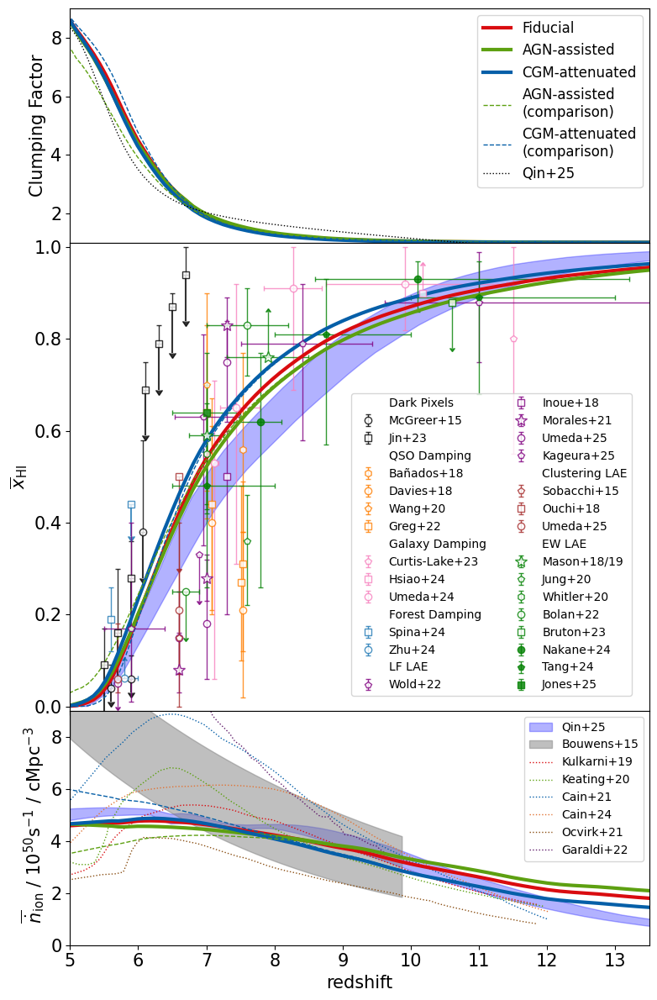
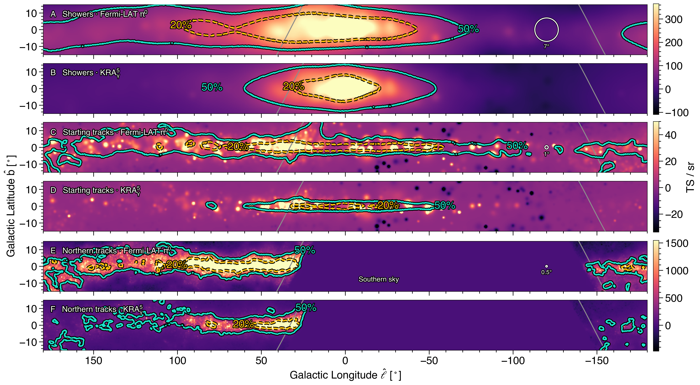

# arXiv Digest — 2026-07-29

**Interest file used:** interests/2026.05.md (fallback — no 2026.07.md exists yet)
**Categories pulled:** astro-ph.CO, astro-ph.EP, astro-ph.GA, astro-ph.HE, astro-ph.IM, astro-ph.SR, cs.LG, stat.ML, hep-ph
**Papers scanned:** 311 (97 astro-ph new/cross + 214 from the cs.LG/stat.ML/hep-ph feeds)
**After first filter:** 13 candidates reviewed with full text
**Final selected:** 10 papers across 4 tiers

*Note: interest file is a fallback from 2026.05 (no 2026.07 file yet). The arXiv API returned HTTP 400/503 on the combined ~290-ID metadata batch, so the first pass was run per-category and merged; all six astro-ph feeds plus cs.LG/stat.ML/hep-ph were retrieved in full. None of the 214 ML/hep-ph papers survived filtering — today's cs.LG/stat.ML output is generic ML (calorimeters, beams, LLMs) and the hep-ph output is particle-physics model-building/direct-detection, both explicitly low-priority in the profile.*

---

## Tier 1 — Highly relevant

### [Robust Lyα forest constraints on reionization from semi-analytic galaxy formation models](http://arxiv.org/abs/2607.25722v1)

Yuxiang Qin, J. Stuart B. Wyithe
**Primary category:** astro-ph.CO | also: astro-ph.GA

Using the Meraxes semi-analytic model in a (210 h⁻¹ cMpc)³ volume with merger trees down to the atomic-cooling threshold, the authors test how sensitive Lyα-forest-inferred reionization histories are to the modelling of the ionizing sources. They build a suite of source prescriptions in which the galaxy escape fraction depends on halo mass, stellar mass, SFR, sSFR, or star-forming disc surface density, plus AGN-assisted and CGM-attenuated variants, and calibrate every model to the observed XQR-30+ distribution of Lyα effective optical depths. Despite very different photon-budget allocations across the galaxy population, all viable calibrated models converge on a late and extended end of reionization, with midpoint z ≈ 6.2–6.9 and the final stages at z ≈ 5.36–5.57. The spread among models therefore quantifies the source-modelling systematic on forest-based EoR inference: the forest pins the timing of the final stages, but not how the ionizing photons are divided among galaxies, AGN, and unresolved absorbers.

This is a direct hit on the primary Lyα-forest + IGM/late-reionization focus: it uses the XQR-30 opacity CDFs the profile already tracks (Bosman, Zhu) and directly addresses how robust the forest-inferred reionization history is to astrophysical source modelling.

---

### [Simulation-based tension quantification of the cosmic dipole](http://arxiv.org/abs/2607.25703v1)

Mali Land-Strykowski, Harry T. J. Bevins, Oliver T. Oayda et al.
**Primary category:** astro-ph.CO

The authors build "tensionnet", an ensemble of Neural Ratio Estimators (NREs) that evaluates the log Bayesian evidence ratio and returns an Nσ tension directly from forward simulations, and validate it against nested sampling. Applied to Planck, NVSS, RACS-low and CatWISE under the kinematic interpretation of the number-count dipole, it recovers a ≈5.7σ Planck–CatWISE tension; crucially, they then push the same architecture into the intractable-likelihood regime by forward-modelling the CatWISE Eddington bias (a case with no analytic likelihood), where the tension rises to ≈6.7σ. The paper is candid about the cost: the forward-modelled simulations are ~4,700× slower than the toy Poisson/Gaussian case, motivating GPU acceleration and sequential/online training.

This is a direct hit on the rising-primary ML-inference focus — an amortised NRE for tension quantification is exactly the SBI machinery the profile flags for expensive-simulation, intractable-likelihood cosmology, and it is co-authored by Bevins (a high-value author in the profile). The reusable tension-from-simulations tool matters more here than the specific dipole application.

---

## Tier 2 — Adjacent / useful context

### [Primordial Physics in the Nonlinear Universe: Revealing the oscillating halo bias from cosmological collider models](http://arxiv.org/abs/2607.24939v1)

Dhayaa Anbajagane, Neal Dalal
**Primary category:** astro-ph.CO | also: gr-qc

Cosmological-collider models imprint oscillations in the primordial bispectrum, which should translate into scale-dependent oscillations in the halo bias. The authors introduce an initial-conditions method that reproduces a given (squeezed-limit-accurate) bispectrum template to percent level without the usual template basis-decomposition, and present the first simulation measurements of oscillating halo bias. Amplitude and phase depend strongly on halo mass (a factor-of-ten mass shift moves the oscillation location by a factor of two) and on assembly bias, and higher-frequency bispectra are suppressed as the oscillations average down within the halo window. A simple peak-background-split model with two coefficients (b_φ, b_σ) fits all of this, and a common (b_φ, b_σ) works across collider models — so existing local-PNG b_φ calibrations transfer to collider PNG.

Adjacent LSS/primordial-non-Gaussianity methods: the profile follows the primordial-physics-in-LSS and simulation-infrastructure shelf, and the publicly released initial-conditions code (arbitrary-bispectrum ICs) is a reusable tool for anyone forward-modelling higher-order statistics.

*No figure extracted for 2607.24939 — the key oscillating-bias plot is informative but the mass/phase dependence is fully captured in the summary.*

---

### [Weighted Webs: Morphology-Informed Marked Fields](http://arxiv.org/abs/2607.26021v1)

Mikel Martin Barandiaran, Jessica A. Cowell, David Alonso et al.
**Primary category:** astro-ph.CO

Marked power spectra recover beyond-two-point information cheaply by weighting the density field before computing its two-point statistics, but almost all existing marks are functions of local density only. This work generalises the mark to any scalar describing local cosmic-web morphology — the tidal-tensor invariants (δ, s², s³), shear amplitude, isotropy/filament marks, and a local fractal dimension — and quantifies constraining power on (Ω_m, σ_8, M_ν) via Fisher forecasts on Quijote N-body suites. Density-based marks remain the strongest single choice, but the shear field is a moderately effective mark that outperforms density at the smallest smoothing scale (R = 5 h⁻¹ Mpc), and combining density and morphology marks consistently beats either alone. The conceptual takeaway: marked statistics are best viewed as local non-linear transformations that reorganise existing information into a form the power-spectrum estimator can access.

Adjacent LSS methodology directly in the profile's "beyond-2pt / neutrino-mass / Quijote" territory — a concrete recipe for squeezing more out of two-point estimators, the kind of summary-statistic-sufficiency question the profile already collects.

*No figure extracted for 2607.26021 (the result is a Fisher error-improvement comparison table best read as numbers, not a single plot).*

---

### [Interlopers as Signal in Line Intensity Mapping](http://arxiv.org/abs/2607.24917v1)

Anirban Roy
**Primary category:** astro-ph.CO | also: astro-ph.GA, astro-ph.IM

Line intensity mapping (LIM) blends emission from several lines at different redshifts into one observed frequency, and interloper lines are usually treated purely as contaminants to be removed. This paper argues that removal is not always optimal: once the emitting lines and their redshifts are in the model, interlopers become additional large-scale-structure tracers at other epochs, projected into the target line's coordinates. Framing interloper treatment as a Fisher decision problem (requiring both improved precision and sub-tolerance parameter bias), SPHEREx forecasts for Hα (with [O III], Hβ, [O II] interlopers) and FYST forecasts for [C II] (with CO interlopers) show that Ω_m h² and BAO distances are robust to astrophysical calibration errors, while σ_8, w_0 and w_a are more prior-sensitive. Modelling interlopers effectively turns two observed bands into a transverse BAO distance ladder over 0.7 ≲ z ≲ 5.8.

Adjacent survey/BAO methodology: BAO and spectroscopic-survey inference are secondary-focus topics, and reframing a nuisance as signal is a transferable idea for any multi-tracer LSS analysis.

*No figure extracted for 2607.24917 (a forecast/Fisher paper; the argument is conceptual and needs no plot to convey).*

---

### [Lyα Escape in JWST/NIRCam F430M-Selected Hα Emitters at z≃5.5](http://arxiv.org/abs/2607.25801v1)

Cheng Cheng, Zhen-Ya Zheng, Chunyan Jiang et al.
**Primary category:** astro-ph.GA

By selecting star-forming galaxies at z ≃ 5.5 via JWST/NIRCam F430M (Hα) excess rather than via Lyα itself, and anchoring the intrinsic Lyα production to Hα, this study builds a Lyα-unbiased probe of the Lyα escape fraction for SFR ≳ 0.1 M_⊙ yr⁻¹ systems covered by archival VLT/MUSE. Only 4 of 13 galaxies show detectable Lyα, giving a conservative population-averaged upper bound ⟨f_esc^Lyα⟩ < 0.32; detections are preferentially dust-free with no clear SFR correlation, pointing to a stochastic escape picture. Notably, three of the four Lyα detections sit in a known z ≃ 5.66 overdensity, hinting that local environment eases Lyα escape in the post-reionization era.

Adjacent to the IGM/reionization focus from the galaxy side: Lyα escape and its stochasticity set the source term and visibility that forest-based reionization inference (see the Qin & Wyithe entry above) has to fold in.

*No figure extracted for 2607.25801 (small-sample result with upper limits; the numbers convey it more cleanly than a plot).*

---

### [Tightening Bounds on Warm Dark Matter with High-Redshift Gamma-Ray Bursts](http://arxiv.org/abs/2607.25261v1)

Jun-Jie Wei, Jing-Meng Hao, Ding-Fang Hu et al.
**Primary category:** astro-ph.HE | also: astro-ph.CO, astro-ph.GA

Warm dark matter with keV-scale particles suppresses small-scale structure, so the mere existence of collapsed objects at high redshift sets lower limits on the WDM mass m_x. Using ~two decades of Swift GRBs as extreme-brightness high-z tracers, the authors tie the comoving GRB rate to the cosmic star-formation rate with an extra (1+z)^α evolution term and run a maximum-likelihood analysis on 118 GRBs at z < 10 with L ≥ 4×10⁵² erg s⁻¹. They obtain m_x ≳ 1.3 keV (95% CL) conservatively, tightening to m_x ≳ 3.4 keV if the GRB rate exactly traces the SFR — competitive with, and complementary to, forest-based limits.

Adjacent to the small-scale-structure dark-matter focus (WDM free-streaming), which the profile pursues mainly through the Lyα forest; this is the same physics constrained by an independent high-z probe, useful as an external cross-check on forest WDM bounds.

*No figure extracted for 2607.25261 (the deliverable is a mass limit; the likelihood-vs-m_x curve adds little beyond the quoted numbers).*

---

### [Observational Evidence for Anisotropic Metal Excess around Galaxies](http://arxiv.org/abs/2607.24929v1)

Cheqiu Lyu, Enci Wang, Zeyu Chen et al.
**Primary category:** astro-ph.GA

Simulations predict that galactic winds escape anisotropically along galaxy minor axes, but direct evidence of chemical enrichment in neighbours has been scarce. Analysing 1,433 DESI galaxy pairs, the authors detect a gas-phase metallicity excess of 14.6%±3.7% to 24.2%±2.6% in neighbours aligned with the minor axis of massive primaries at 15–60 kpc separations, rising from a marginal (>92%) signal at 15–30 kpc to a significant (>98%) one at 30–60 kpc, and vanishing for a 60–100 kpc control. The angular trend and its dependence on primary stellar mass are qualitatively reproduced by IllustrisTNG (with shallower simulated slopes), supporting outflow-driven CGM enrichment as the mechanism.

Adjacent CGM interest, done observationally on DESI: this is quasar-absorption-adjacent baryon-cycle physics (metal transport in the circumgalactic medium) using the survey the profile treats as top priority.

---

## Tier 3 — Outside my area but notable

### [High-energy neutrino emission from the Milky Way](http://arxiv.org/abs/2607.25966v1)

R. Abbasi, M. Ackermann, J. Adams et al. (IceCube Collaboration)
**Primary category:** astro-ph.HE | also: astro-ph.GA, hep-ex

Combining all three neutrino flavours with improved ice modelling, calibration and reconstruction across 12 years of IceCube data, this analysis establishes high-energy neutrino emission from the Galactic plane at 5.7σ in a predefined global analysis — consolidating and sharpening the 2023 first-detection result. The inner Galaxy stands out as a prominent source, with 217 shower events above 5 TeV against an expected background of 154.4 ± 4.1. The measurement opens Galactic multi-messenger astronomy: a diffuse neutrino view of cosmic-ray propagation over kiloparsec scales, cross-comparable to Fermi-LAT π⁰ and KRAγ diffuse-emission templates.

Outside the forest/LSS focus, but a genuine headline: an all-flavour, 5.7σ diffuse-Galactic-neutrino measurement that localises the inner Galaxy is worth knowing as a scientist, even if it builds incrementally on the 2023 detection.

---

## Tier 4 — Meta-research about the field

### [AI's Capability in Assisting Scientific Research in Physics, Astrophysics, and Cosmology I: Literature Review](http://arxiv.org/abs/2607.25672v1)

Anamaria Hell, Kateryna Vovk, Veena Krishnaraj et al.
**Primary category:** astro-ph.IM

In a controlled study across eight expert-conceived projects in physics, astrophysics and cosmology, human experts and LLM prompters performed identical literature-review tasks in parallel. The overlap between human- and AI-selected references was small (<6%) for mid-2025 models (ChatGPT-4o, ChatGPT Deep Research, Gemini), meaning the models do not yet reproduce a competent expert search on their own, though they can complement one. On reliability, 3% of AI-generated references were outright fabrications, but 64% were real papers with at least one incorrect field (title, author, year, journal, DOI, or link) — mandating systematic verification. Encouragingly, a single-project test of the 2026 ChatGPT Pro 5.5 showed zero fabrications or metadata mismatches.

Meta-research squarely in the Tier 4 remit — how AI is (and isn't yet) changing the day-to-day practice of research in this exact field, with concrete, sobering numbers on hallucination and verification that bear directly on using LLMs for literature work.

*No figures extracted for 2607.25672 (a controlled-study/benchmark paper; its content is tabulated overlap and error rates, not a figure that aids understanding at a glance).*
