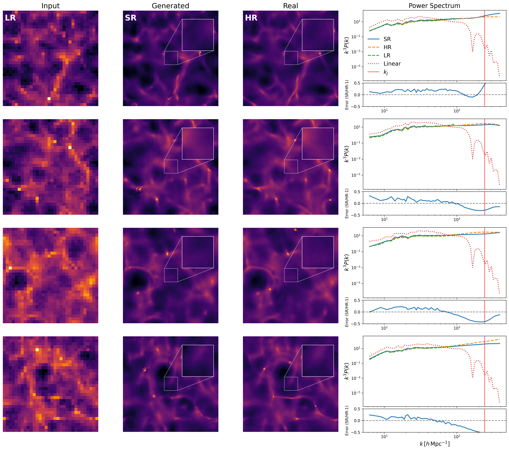

# arXiv Digest — 2026-07-31

**Interest file used:** interests/2026.05.md (fallback — no 2026.07.md exists yet)
**Categories pulled:** astro-ph.CO, astro-ph.EP, astro-ph.GA, astro-ph.HE, astro-ph.IM, astro-ph.SR, cs.LG, stat.ML, hep-ph
**Papers scanned:** 293 (132 astro-ph new/cross + 161 cs.LG/stat.ML/hep-ph)
**After first filter:** 18 candidates reviewed with full text
**Final selected:** 11 papers across 2 tiers

*Note: interest file is a fallback from May (no July file yet). The combined-category pull hit an arXiv API 400 (id_list too long), so categories were pulled individually and merged; the cs.LG announcement feed was capped at 120 of 196 papers (extras are secondary and heavily filtered, so this is not a material loss). Tiers 3 and 4 are omitted: nothing outside the user's area cleared the high bar for "groundbreaking," and no meta-research papers appeared.*

---

## Tier 1 — Highly relevant

### [DESI DR2 Results IV: Alcock-Paczyński Measurements from the Lyman Alpha Forest and Cosmological Constraints](http://arxiv.org/abs/2607.27410v1)

DESI Collaboration, A. G. Adame, J. Aguilar et al.
**Primary category:** astro-ph.CO

Using the full shape of the Lyα forest auto-correlation and the Lyα–QSO cross-correlation from over 820,000 forests in DESI DR2, this flagship paper measures the Alcock-Paczyński (AP) effect to 1% in \(D_M/D_H\) at \(z_\mathrm{eff}=2.33\) — a factor of ~1.8 tighter than the BAO-only constraint from the same data and the tightest \(D_M/D_H\) at \(z>1\) to date. The template approach separates a smooth (broadband) AP component from the BAO peak and adds two methodological advances: analytic marginalization over small-scale power spread to large scales by continuum fitting, and a scale-dependent Lyα bias from UV-background fluctuations. Combined with a BBN prior, the forest alone gives \(H_0=66.5\pm1.3\), independent of CMB anisotropies. The higher inferred \(\Omega_\mathrm{m}=0.325\pm0.018\) mildly reduces the DESI–CMB tension (2.4σ→2.2σ) and slightly weakens the DESI preference for \(w_0w_a\)CDM.

This is the central paper of the DR2 Lyα forest release and a direct hit on the primary research focus (forest P1D/P3D, BAO, full-shape, DESI). It defines the state of the art for extracting cosmology from the high-redshift forest.

---

### [Validation of the DESI DR2 Lyα forest full-shape analysis](http://arxiv.org/abs/2607.27411v1)

M. Herbold, A. Cuceu (DESI Lyα working group), P. Martini et al.
**Primary category:** astro-ph.CO

This companion paper defines and executes the pre-unblinding validation program for the DR2 Lyα full-shape analysis above, using substantially larger and more realistic mocks (CoLoRe 2LPT and AbacusSummit Lyα) than DR1. The modeling is improved via analytic marginalization over scales \(<10\,h^{-1}\)Mpc and treatment of UV-background fluctuations, with quantitative pass/fail requirements set on the parameters of interest across hundreds of mock realizations. The BAO and AP parameters satisfy all requirements and remain stable across data splits and analysis variations, but mock studies reveal a significant bias in the growth-rate parameter \(f\sigma_8\), leading the collaboration to exclude that measurement from the final analysis.

Directly relevant as the methodological backbone that certifies the DR2 forest AP result. The honest exclusion of \(f\sigma_8\) is a useful cautionary datapoint for anyone attempting full-shape growth measurements from the forest.

*No figures extracted for 2607.27411v1 (validation paper; content is mock-recovery tables and pass/fail thresholds that do not compress well into a single glance-level plot).*

---

### [CoLoRe-2LPT: Lyman-α mock catalogues for the validation of DESI cosmological analyses](http://arxiv.org/abs/2607.27412v1)

M. F. Ruiz-Herrera Bernal, S. Avila, A. Font-Ribera (COSMO-LYA/DESI) et al.
**Primary category:** astro-ph.CO

The authors build a new generation of fast Lyα forest mocks that replace the log-normal density evolution of previous CoLoRe mocks with a second-order Lagrangian perturbation theory (2LPT) description, capturing mildly non-linear clustering and the physical non-linear broadening of the BAO peak while remaining cheap enough to generate large ensembles. QSO catalogues are calibrated against Abacus HOD mocks (linear bias to <5%, Fingers-of-God via 2LPT velocities), and the pipeline reproduces DESI DR1 P1D, mean flux, Lyα bias and β to within ~10%. Four hundred contaminated full-sky 10 Gpc/h mocks including HCDs (\(b_\mathrm{HCD}\sim2\)) and metals were produced and used to set the modeling decisions and systematic error budget of the DR2 full-shape analysis.

A direct hit on forest simulation/validation methodology (mock generation, P1D, BAO broadening, contaminants) — the mock infrastructure that underpins current DESI forest cosmology and any future WEAVE-QSO/PFS-scale analysis.

*No figures extracted for 2607.27412v1 (the informative plots are per-statistic mock-vs-DESI ratio panels; none stands alone as a single key result).*

---

### [Lyman-α forest holography: 3D predictions from 1D measurements](http://arxiv.org/abs/2607.27413v1)

J. Chaves-Montero, A. Font-Ribera (COSMO-LYA), J. Aguilar et al.
**Primary category:** astro-ph.CO

This paper bridges the historically separate 1D (P1D) and 3D (BAO/full-shape) forest analyses using ForestFlow, an emulator trained on hydrodynamical simulations that describes forest clustering from linear to non-linear scales. Propagating the DESI DR1 P1D constraints through ForestFlow ("holography") predicts the range of 3D clustering models — recovering the large-scale \(b_\delta\) and β measured by the DR1/DR2 BAO analyses and supplying physically motivated small-scale priors used directly by the DR2 full-shape paper. The methodology is validated against the high-resolution ACCEL-2 simulation, and the authors show that P1D and BAO deliver comparable constraining power on \(b_\delta\sigma_8\) and \(b_\eta f\sigma_8\) with complementary degeneracy directions.

A near-perfect match to the interest profile: it operationalizes ForestFlow (already in the library) to unify P1D and P3D within a single inference framework — exactly the "Lyman-α × emulation × unified inference" direction the profile flags as the forward trajectory.

---

### [Dark Matter Constraints from Small-Scale Cosmic Structure](http://arxiv.org/abs/2607.28564v1)

Ethan O. Nadler, Keir K. Rogers (interest-file high-value author), Alex Drlica-Wagner
**Primary category:** astro-ph.CO | also: hep-ph

A comprehensive review of how sub-Mpc structure constrains the fundamental nature of dark matter — warm, fuzzy, interacting, self-interacting and decaying DM — across dwarf galaxies, strong lensing, stellar streams, high-z galaxies, weak lensing, 21 cm, and the Lyman-α forest. The forest section is a detailed, up-to-date genealogy of WDM/FDM/axion/IDM bounds from the forest 1D flux power spectrum, tracing the field from SDSS/BOSS/eBOSS to DESI DR1, emphasizing the central role of IGM/reionization marginalization and the shift toward emulator and simulation-based-inference methods. The review closes by arguing that probe combination and SBI are the frontier for turning small-scale structure into precision DM physics.

A direct hit fusing two primary interests — the forest and small-scale dark matter — written by a flagged high-value author (Rogers). It is effectively a curated reading list and status report for the forest-DM program the library is built around.

*No figures extracted for 2607.28564v1 (review paper; its most useful visual is a multi-page constraint-compilation, not a single self-contained result plot).*

---

## Tier 2 — Adjacent / useful context

### [Emulating Cosmic Structure Formation with a Lagrangian Neural Cellular Automaton](http://arxiv.org/abs/2607.27320v1)

Cooper Jacobus, Beatriz Tucci, Oliver Philcox
**Primary category:** astro-ph.IM | also: astro-ph.CO, cs.LG

The authors introduce the Lagrangian Neural Cellular Automaton (LNCA), a field-level emulator of structure formation that operates in the Lagrangian frame, learning only the non-linear residual displacement on top of the Zeldovich approximation via a local, recurrent, E(3)-equivariant update rule. The internal function is a compact Kolmogorov-Arnold Network (learnable Taylor expansions) of only a few thousand terms, yet it recurrently integrates full particle trajectories from \(z=127\) to \(z=0\) and reaches percent-level power-spectrum and cross-spectrum accuracy for \(k\lesssim0.5\,h\,\mathrm{Mpc}^{-1}\) — comparable to dense-CNN emulators with ~\(10^4\times\) more parameters. Being cheap, differentiable, continuous in time, and symmetry-faithful, it is designed as the forward operator for field-level inference and mock production.

Squarely in the "rising primary" ML-for-cosmology branch: a differentiable, cheap forward model is exactly the machinery needed for the many-evaluation inner loops of field-level inference and SBI that the profile identifies as the methodological direction for forest/LSS data.

---

### [Cosmo-SPINN: Fuzzy Dark Matter Simulations with Physics-Informed Generative Networks](http://arxiv.org/abs/2607.28604v1)

Ashutosh Kumar Mishra, Emma Tolley, Nicolas Cerardi
**Primary category:** astro-ph.CO

This work presents a physics-informed generative U-Net for fuzzy dark matter (FDM) that enforces the Schrödinger-Poisson dynamics through the training loss, addressing two tasks: evolving cosmological fields from initial conditions to a target scale factor, and super-resolving FDM simulations. The physics loss substantially cuts the training data needed — reproducing reference simulations in a \(1\,h^{-1}\)Mpc box using only 20% of snapshots — and the super-resolution model recovers the target power spectrum up to \(k\simeq100\,h\,\mathrm{Mpc}^{-1}\) with sub-20% error on most modes while preserving wave-interference structure. The authors flag autoregressive neural operators as the next step for scaling to larger volumes.

Sits at the intersection of two interests — fuzzy dark matter (a forest-constrained small-scale DM model) and generative/emulator ML — and is a concrete example of physics-informed surrogate modeling for the expensive simulations that forest-DM inference depends on.

---

### [GGI Lectures on Large-Scale Structure Perturbation Theory (Effective Field Theory)](http://arxiv.org/abs/2607.28314v1)

Mikhail M. Ivanov (interest-file high-value author, EFT of the forest)
**Primary category:** astro-ph.CO | also: hep-ph, hep-th

A self-contained pedagogical introduction to the effective field theory (EFT) of large-scale structure, developed from scratch for students: the failures of Standard Perturbation Theory, non-linear BAO evolution and its link to the equivalence principle, counterterms and loop renormalization, stochastic effects, and EFT for galaxy bias and redshift-space distortions. It is a single-author lecture set that assembles the modern perturbative toolkit for modeling galaxy clustering in real and redshift space.

Useful reference material: the EFT machinery here is the same framework now being applied to the Lyman-α forest (the "analytic compression of the EFT of the forest" line of work in the library), and Ivanov is a flagged author central to that program.

*No figures extracted for 2607.28314v1 (pedagogical lecture notes; figures are illustrative schematics rather than a headline result).*

---

### [Growth, geometry, and early-universe split of the matter density parameter Ω_m](http://arxiv.org/abs/2607.28326v1)

Felicitas Keil, Isaac Tutusaus, Alain Blanchard
**Primary category:** astro-ph.CO

The authors stress-test ΛCDM by splitting \(\Omega_\mathrm{m}\) into three phenomenological regimes — geometry (expansion/curvature), growth (structure formation), and the early universe (pre-recombination) — extending the usual geometry-vs-growth split. Using DES 3×2pt, Planck CMB, DESI BAO, Pantheon+ SNe, and RSD, they find a strong correlation between the geometric and early-universe \(\Omega_\mathrm{m}\) but no strong growth correlation; all regimes are consistent in the posterior, though the geometry-vs-early difference sits ~2σ from zero.

A clean example of the internal-consistency / regime-split tests that the LSS-cosmology and DESI-tension interest revolves around, and a template for isolating where any emerging ΛCDM cracks actually live.

*No figures extracted for 2607.28326v1 (key content is multi-probe posterior contours; no single panel captures the three-way split at a glance).*

---

### [Semi-analytic Inference of Satellite Densities in the Cold Dark Matter Model Part I. Comparison to Ultra-faint Dwarf Kinematics](http://arxiv.org/abs/2607.27316v1)

Kailash Raman, Dylan Folsom, Manoj Kaplinghat et al.
**Primary category:** astro-ph.GA | also: astro-ph.CO, hep-ph

Using the SatGen semi-analytic satellite generator to model the expected CDM subhalo population, the authors infer Milky Way dwarf density profiles two ways — from stellar velocity dispersions and from stellar masses via the stellar-to-halo-mass relation — and find the kinematic densities span a larger diversity than CDM predicts, with compact ultra-faints overdense and larger systems underdense. For dwarfs with ≥10 spectroscopic stars the discrepancy persists at ~2.4σ across systematic variations, providing a novel population-level consistency test of CDM (a companion Part II recasts the resulting J-factors for indirect-detection limits).

A small-scale-structure test of the dark-matter paradigm from the galactic (rather than forest) side — complementary to the forest WDM/FDM constraints, and a reminder of the diversity-of-densities tension that any non-CDM model invoked to fit the forest must also confront.

*No figures extracted for 2607.27316v1 (the result is a density-diversity scatter across many dwarfs; no single figure is essential to the takeaway).*

---

### [Unified dark sector approaches to cosmological tensions](http://arxiv.org/abs/2607.27515v1)

Sergio Sevillano Muñoz, Mark Trodden
**Primary category:** astro-ph.CO

This analytic study shows that a minimal mass-varying dark matter model — a single scalar controlling the DM mass — can naturally become dynamically relevant at both matter-radiation equality and the present day, producing an early-dark-energy-like injection (relevant to \(H_0\)) and an apparent phantom crossing as hinted by DESI BAO, while also lowering \(S_8\). The authors derive analytic conditions under which one model addresses early- and late-time tensions simultaneously without extra fine-tuning or new long-range forces.

Relevant to the DESI dark-energy / dynamical-\(w\) thread that is one of the library's newest directions: it is a worked example of the kind of unified dark-sector model the DESI BAO phantom-crossing hints are motivating, and clarifies which couplings could jointly move \(H_0\), \(S_8\), and \(w(z)\).

*No figures extracted for 2607.27515v1 (analytic model paper; figures are parameter-space schematics, not a central data result).*
