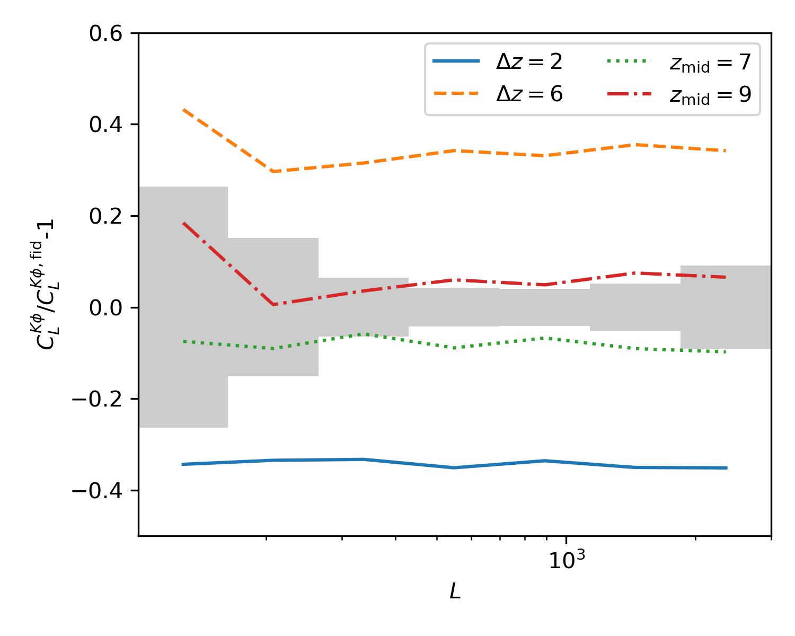

# arXiv Digest — 2026-08-06

**Interest file used:** interests/2026.05.md (fallback — no 2026.08.md exists yet)
**Categories pulled:** astro-ph.CO, astro-ph.EP, astro-ph.GA, astro-ph.HE, astro-ph.IM, astro-ph.SR, cs.LG, stat.ML, hep-ph
**Papers scanned:** 289 (75 astro-ph new/cross + 214 cs.LG/stat.ML/hep-ph and their cross-lists)
**After first filter:** 10 candidates reviewed with full text
**Final selected:** 7 papers across 2 tiers

*Note: interest file is a fallback from 2026.05 (no August file yet). Tiers 3 and 4 are omitted — the cs.LG/stat.ML/hep-ph pool was almost entirely generic ML (MoE routing, distillation, PINNs) and particle-theory model-building with no cosmology-inference angle, and nothing off-topic in astro-ph cleared the "genuinely groundbreaking" bar. Minimum of 5 was met on genuine relevance, so no padding was needed.*

---

## Tier 1 — Highly relevant

### [Is Dark Matter Really Matter?](http://arxiv.org/abs/2608.04763v1)

Jun-Qian Jiang, Arman Shafieloo
**Primary category:** astro-ph.CO | also: gr-qc, hep-th

The authors jointly test the two assumptions $w_{\rm dm}=0$ and $w_{\rm de}=-1$ using DESI DR2 BAO plus, crucially, the recent DESI DR1 Lyman-$\alpha$ full-shape Alcock-Paczynski compression at $z_{\rm eff}=2.33$, combined with DES 5-year supernovae and two complementary CMB treatments (a conservative $\ell_{\max}=1000$ cut and a lensing-spectrum-marginalized construction). When both equations of state are varied together they find $w_{\rm dm}=0.00097^{+0.00050}_{-0.00050}$ and $w_{\rm de}=-0.938^{+0.026}_{-0.026}$, with the $\Lambda$CDM point lying outside the 95% joint contour (~$2\sigma$), even though neither parameter departs from its standard value when varied alone. The preference for positive $w_{\rm dm}$ persists whenever phantom crossing is forbidden, and a non-phantom Padé-$w$+$w_{\rm dm}$ model is even mildly favored over unrestricted CPL in both CMB treatments. Their conclusion: the apparent "phantom-crossing" signal in DESI may actually reflect a small deviation in the dark-matter sector rather than dark-energy dynamics.

This is a direct hit on the DESI Lyman-$\alpha$ / LSS core of the profile — it is one of the first papers to fold the new DESI DR1 Lyman-$\alpha$ full-shape AP information into a joint dark-sector equation-of-state analysis, exactly the kind of forest × DESI × cosmological-inference convergence the library is built around.

---

### [Characterising the epoch of reionisation using the cross-correlation of the kSZ effect and CMB lensing](http://arxiv.org/abs/2608.04868v1)

Niall MacCrann, Christopher Cain, Aleksandra Kusiak et al.
**Primary category:** astro-ph.CO

The paper proposes a new "projected-fields" statistic for reionization: the cross-correlation $C_L^{K\phi}$ between the squared, high-pass-filtered kSZ temperature field $K$ and the CMB lensing potential $\phi$. Because the raw kSZ signal depends on the sign of the line-of-sight velocity, its direct correlation with $\phi$ vanishes; squaring the field removes the sign and yields a non-zero cross-correlation that traces how ionized electrons are distributed relative to the total matter field during the EoR. Using AMBER reionization simulations they show the signal is sensitive to both the duration $\Delta z$ and midpoint $z_{\rm mid}$ of reionization (a ~30% fractional change in $C_L^{K\phi}$ when $\Delta z$ goes from 4 to 6), forecasting a marginal $S/N=2$–$3$ detection for a Simons-Observatory-like setup and $S/N\sim50$ for CMB-HD. They also work through the main systematics — low-redshift foregrounds, lensing contamination of the kSZ-squared estimator, and estimator biases — and propose mitigations for each.

Reionization physics — its midpoint, duration, and the electron-vs-matter distribution — is squarely in the IGM/reionization primary focus, and this is a genuinely new observable that complements the forest-based opacity and mean-free-path measurements the library tracks from the CMB side.

---

## Tier 2 — Adjacent / useful context

### [Revisiting the equation of state of dark energy from DESI BAO with SNe Ia and CMB](http://arxiv.org/abs/2608.04353v1)

Jie Zheng, Da-Chun Qiang, Zhi-Qiang You et al.
**Primary category:** astro-ph.CO

Using DESI DR2 BAO, Pantheon+ supernovae, and a Planck 2018 CMB distance prior, the authors re-examine the mild $w_0w_a$CDM preference in the $w_0w_a$CDM model by splitting the data into $z<z_{\rm cut}$ and $z>z_{\rm cut}$ subsamples. They find the deviation from $\Lambda$CDM (reaching ~$2\sigma$) is driven almost entirely by BAO and SNe Ia in the $z\sim0.4$–$0.8$ range, and progressively weakens as higher-redshift data are added; information criteria show no significant preference over $\Lambda$CDM, with the BIC consistently favoring $\Lambda$CDM. A parameter-shift consistency test finds no significant tension between the redshift subsamples, so they attribute the apparent shifts to statistical fluctuations and limited precision in the current data rather than genuine dynamical dark energy.

A useful, sober counterpoint to the DESI dynamical-dark-energy excitement that runs through the library's DESI BAO branch — it provides a redshift-cut diagnostic for judging how robust the "$w_0w_a$" preference actually is, directly relevant to interpreting DESI DR2 results.

*No figures extracted for 2608.04353 (results are marginalized-contour and redshift-cut tables that the text summary already conveys; no single plot is essential).*

---

### [Fractal properties of the cosmic web](http://arxiv.org/abs/2608.04694v1)

Jaan Einasto
**Primary category:** astro-ph.CO

This is a review/synthesis of how the fractal (multifractal) description of the cosmic web is derived within the concordance $\Lambda$CDM framework. Einasto walks through the relationship between the two-point correlation function, its logarithmic derivative (the structure function), and the fractal dimension function, and shows how these are recovered from both the angular and spatial distributions of galaxies. The paper connects the classical correlation-function machinery to the fractal-geometry language for filaments, walls, and voids, clarifying what each statistic does and does not capture about clustering across scales.

Correlation-function and clustering-statistic methodology is foundational to the LSS/spectroscopic-surveys branch; this is a compact reference for how fractal-dimension and structure-function descriptions relate to the 2PCF estimators the library already emphasizes.

*No figures extracted for 2608.04694 (methodological review; figures are illustrative fractal-dimension curves rather than a single central result).*

---

### [Predicting the Kinematics of the Cold Circumgalactic Medium from its Morphology using Convolutional Neural Networks](http://arxiv.org/abs/2608.04087v1)

Connor Jennings, Earl P. Bellinger, Imad Pasha et al.
**Primary category:** astro-ph.GA

The authors train a UNet convolutional neural network on TNG50-derived H$\alpha$ emission maps of 182 Milky Way/Andromeda-analog galaxies to predict the plane-of-sky velocity field of cold circumgalactic gas — a quantity that traditional line-of-sight spectroscopy cannot access. With forward-modeled noise matched to upcoming facilities (e.g. MOTHRA), the network recovers overall flow direction with a typical RMS error of $0.3$–$0.5\,v_{\rm vir}$ at expected survey depths, correctly identifying disk rotation and inflow gradients in simpler morphologies and degrading gracefully to a global-infall default as noise rises. Monte Carlo Dropout is used to flag high-epistemic-uncertainty regions. The result implies deep 2D emission maps can add two phase-space dimensions to cold-CGM studies.

A double hit: the CGM is an adjacent absorption-line interest, and this is a clean example of the ML-for-inference toolkit (CNN image-to-field regression with forward-modeled noise and uncertainty quantification) applied to gas kinematics — the same class of methods the profile is tracking for forest/LSS work.

---

### [Cold Dark Matter and Self-Interacting Dark Matter Interpretations of Cloud-9](http://arxiv.org/abs/2608.04362v1)

Morgan Ohana, Xingyu Zhang, Hai-Bo Yu
**Primary category:** astro-ph.GA | also: hep-ph

Cloud-9 is a gas-rich, optically dark 21 cm HI cloud near M94, interpreted as a Reionization-Limited HI Cloud (RELHIC) — a nearly baryon-feedback-free laboratory for dark matter. Reconstructing the halo density profile from the observed HI column-density profile under hydrostatic equilibrium, the authors fit both CDM and velocity-dependent SIDM models with an MCMC framework and impose dynamical stability plus the cosmological concentration–mass relation. They find the CDM interpretation requires an extreme halo ~$7\sigma$ below the median concentration, whereas core-forming SIDM halos with $\sigma/m\gtrsim50\,{\rm cm^2/g}$ reduce the tension to ~$3$–$4\sigma$, and they identify SIDM (but no CDM) analogs in the Concerto zoom-in simulation suite.

This lands on the small-scale-structure dark-matter branch from a different observational handle than the forest — RELHICs from 21 cm rather than the Lyman-$\alpha$ power spectrum — and offers a complementary probe of non-cold dark matter that is worth watching as more RELHIC candidates appear.

---

### [MIGHTEE-HI: Environmental effects of cosmic filaments on extragalactic HI detections in the COSMOS and XMM-LSS fields](http://arxiv.org/abs/2608.04656v1)

Seoyoung Lyla Jung, Madalina N. Tudorache, Matt J. Jarvis et al.
**Primary category:** astro-ph.GA

Combining MeerKAT MIGHTEE HI data with DESI optical galaxies at $0.02<z<0.09$, the authors measure the fraction of galaxies detected in HI as a function of stellar mass, morphology, local density, and distance to the nearest cosmic filament. After controlling for the fact that near-filament galaxies are more massive, denser-environment, and more early-type, they still find residual filament effects: late-type galaxies in low-density environments show reduced HI detection near filaments (consistent with ram-pressure stripping / cosmic-web detachment), while massive early-types show enhanced HI near filaments (suggesting filamentary accretion or gas-rich mergers). The net effect of the cosmic web on cold-gas reservoirs is a competition between depletion and replenishment that varies with mass and environment.

Relevant on the cosmic-web / large-scale-structure side — it uses the DESI galaxy sample and a filament-finder to connect the same web topology the library studies cosmologically to a concrete astrophysical (HI gas) observable.

*No figures extracted for 2608.04656 (the key trends are conditional detection-fraction curves best conveyed by the text; no single plot is central).*
