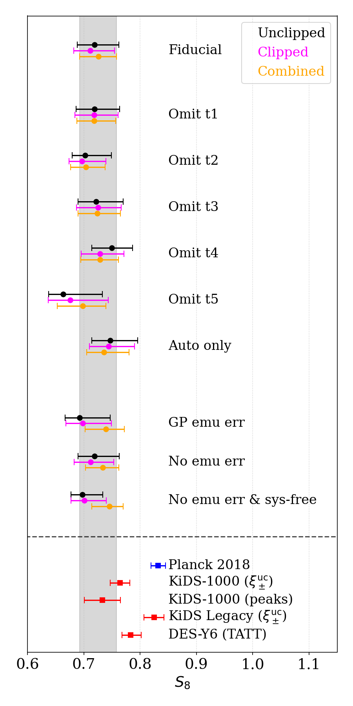
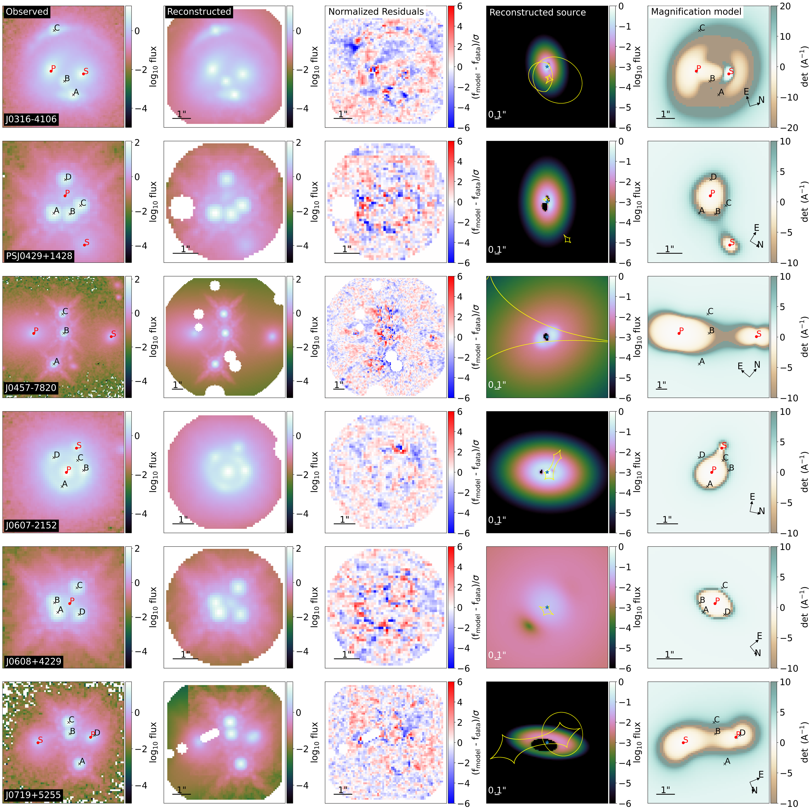
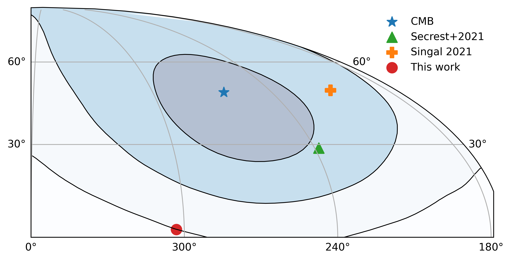
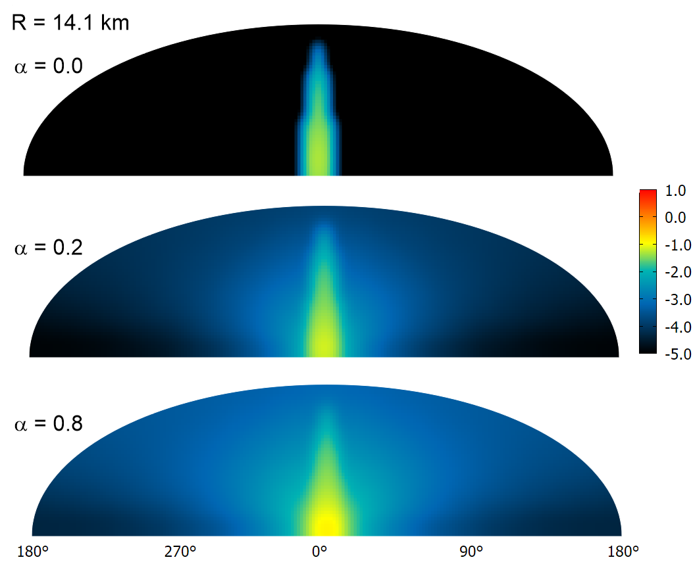

# arXiv Digest — 2026-08-10

**Interest file used:** interests/2026.05.md (fallback — no 2026.08.md exists yet)
**Categories pulled:** astro-ph.CO, astro-ph.EP, astro-ph.GA, astro-ph.HE, astro-ph.IM, astro-ph.SR, cs.LG, stat.ML, hep-ph
**Papers scanned:** 249 (73 astro-ph new/cross + 176 cs.LG/stat.ML/hep-ph and other cross-lists)
**After first filter:** 22 candidates reviewed with full text
**Final selected:** 13 papers across 4 tiers

*Note: the current month's interest file (2026.08.md) does not exist yet, so the most recent prior file (2026.05.md) was used. The cs.LG/stat.ML pool (84+ papers) yielded no cosmology/astro-ML crossovers with a genuine inference/emulation angle — they were generic ML (RL, LLMs, federated learning, speech) and were excluded per the interest file's "skip generic ML" rule; likewise the hep-ph dark-matter/neutrino papers were laboratory/collider detection work outside the small-scale-structure forest focus. Two Tier-4 papers (2608.06431, 2608.06937) were PDF-only; abstracts and PDFs were read directly.*

---

## Tier 1 — Highly relevant

### [Sample Variance Cancellation for Future Spectroscopic Surveys](https://arxiv.org/abs/2608.07339v1)

James M. Sullivan, Martin White
**Primary category:** astro-ph.CO

Future high-redshift spectroscopic surveys will lean on Lyman-α emitters (LAEs) for growth-of-structure and RSD constraints, but the radiative transfer (RT) of Lyα photons alters the symmetry of the LAE overdensity field, imprinting an anomalous large-scale angular ($\mu$-dependent) clustering signal that can bias cosmological inference. Working in a linear, Gaussian model, the authors show that cross-correlating LAEs with a second, RT-free tracer at the same redshift (e.g. Lyman-break galaxies) enables sample-variance cancellation that can (1) detect the presence of a nontrivial RT angular term via conditional field-level reconstruction, (2) recover its functional form with a derived optimal filter, and (3) measure its amplitude with an adapted quadratic estimator. Forecasts show that even a modest ~100 deg² pilot survey pins down the RT amplitude in the multi-tracer configuration far better than a single-tracer analysis. The cross-stochasticity between simulated LAEs and LBGs is shown to be suppressed by more than an order of magnitude, validating the multi-tracer premise.

This is a direct hit on the interest file's core program: it couples LAE/high-z spectroscopic clustering, radiative transfer systematics, and the quadratic-estimator + field-level machinery that sit at the intersection of the Lyman-α, LSS, and inference threads — the same estimator technology used for the forest P1D, applied to protect next-generation survey cosmology.

---

## Tier 2 — Adjacent / useful context

### [Sensitivity of Next-Generation CMB Surveys to Neutrinos and Other Light Relics](https://arxiv.org/abs/2608.07453v1)

Cynthia Trendafilova, Srinivasan Raghunathan, Benjamin Wallisch et al.
**Primary category:** astro-ph.CO | also: hep-ph

Fisher-matrix forecasts assess the sensitivity of several CMB-S4 survey configurations to the effective number of relativistic species $N_\mathrm{eff}$, which parameterizes neutrinos and other light relics and their imprint on the damping tail. The conceptual two-site design reaches $\sigma(N_\mathrm{eff}) < 0.03$ over a seven-year campaign, while the revised Chile-only configuration attains the same precision over a longer timescale; a cosmic-variance-limited comparison quantifies the residual headroom. The forecasts are performed with the publicly released DRAFT pipeline, spanning foreground simulation, component separation, delensing, and projected parameter sensitivities. The paper connects percent-level $N_\mathrm{eff}$ measurements to BBN, light thermal relics, and other early-universe physics.

Relevant on two counts: neutrino mass/light-relic constraints are a fundamental-physics thread the interest file tracks (cf. the forest-neutrino-mass work), and the paper explicitly notes that these CMB bounds will be tightened by LSS surveys — the DESI/high-z spectroscopic program the user works in.

### [Joint Geometric and Dynamical Constraints on Cosmology from Anisotropies in Galaxy Intrinsic-Alignment Correlations](https://arxiv.org/abs/2608.06927v1)

Teppei Okumura
**Primary category:** astro-ph.CO | also: astro-ph.GA

This is the first joint cosmological analysis extracting both geometric and dynamical information from galaxy intrinsic alignments (IAs). Using BOSS spectroscopy cross-matched with DESI Legacy Imaging shapes over $0.43 \le z \le 0.7$, the author measures anisotropic density–intrinsic-ellipticity (GI) and intrinsic-ellipticity (II) correlations and decomposes their spin-dependent angular structure into Legendre multipoles. The GI correlation shows the expected BAO feature, and jointly modeling redshift-space and Alcock–Paczynski distortions constrains $f\sigma_8$, $D_A$, and $H$ — reducing their fractional uncertainties by 32%, 18%, and 29% relative to galaxy clustering alone. Mapped onto $w_0$CDM, IA also tightens $w_0$, $\Omega_m$, and $H_0$, though the $w_0$ constraint is sensitive to the minimum scale used.

Directly relevant to the LSS/BAO/RSD secondary focus: intrinsic alignments are established here as an additional, largely independent source of geometric and dynamical information for spectroscopic cosmology — a complementary probe the user could fold into DESI-era clustering analyses.

### [KiDS-1000: Improved constraints on cosmology, intrinsic alignments and baryonic feedback from clipped cosmic shear](https://arxiv.org/abs/2608.07377v1)

Benjamin Giblin, Joachim Harnois-Déraps, Louise Paquereau, Catherine Heymans
**Primary category:** astro-ph.CO

The authors apply "clipped" shear correlation functions to KiDS-1000 weak lensing, filtering the highest-density regions of the reconstructed density field so that two-point statistics capture additional (non-Gaussian) information. For the first time they model the impact of intrinsic alignments, baryonic feedback, photo-z uncertainties, and source-lens clustering on clipped statistics, training Gaussian-process emulators on dark-matter-only and hydrodynamical $N$-body simulations to predict both clipped and unclipped correlation functions. Combining clipped + unclipped probes tightens the $w$CDM constraints — a 16% reduction in the $S_8$ uncertainty and 24% for $w_0$ — yielding $S_8 = 0.724 \pm 0.027$ and $w_0 = -1.24^{+0.26}_{-0.28}$, consistent with $\Lambda$CDM. The clipped statistic also improves IA constraints by 27% and bounds baryon-feedback strength.

The relevant transferable element is methodological: GP emulators trained on simulation suites to forward-model both cosmology and systematics — exactly the simulation-based emulation approach (cf. ForestFlow, cosmopower) the interest file flags as a rising focus, here demonstrated end-to-end for a non-Gaussian summary statistic.

### [Beyond Feedback: Disentangling Baryonic Effects with tSZ×FRB Cross-Correlations](https://arxiv.org/abs/2608.06455v1)

Isabel Medlock, Daisuke Nagai
**Primary category:** astro-ph.GA

Recent first detections of the tSZ×FRB cross-power spectrum have been interpreted as constraining AGN feedback and $\sigma_8$, but the baryon models used cannot separate feedback efficiency from non-thermal pressure support. Using the Baryon Pasting framework, which independently parameterizes feedback efficiency $\epsilon_f$ and non-thermal pressure amplitude $A_\mathrm{nt}$, the authors show that the cross-correlation breaks this degeneracy because tSZ traces electron pressure while FRB dispersion measures trace electron density alone. In the noise-free limit, adding the cross-spectrum drops the condition-number metric $r_\mathrm{cond}$ from 0.96 to 0.08 and boosts the joint figure of merit 19-fold; with $5\times10^4$ FRBs from DSA-2000 plus Simons Observatory they forecast 3.8% precision on $A_\mathrm{nt}$ (2.3% with CMB-HD). The results directly inform the hydrostatic mass bias for cluster cosmology.

Useful adjacent context: baryonic feedback is a leading systematic for the matter power spectrum that any LSS/forest cosmologist must contend with, and this is a clean demonstration of degeneracy-breaking via a cross-correlation of two tracers with different physical sensitivities — a design pattern that recurs in the user's own multi-tracer work.

### [Cosmic birefringence from a joint analysis of ACT and Planck](https://arxiv.org/abs/2608.06480v1)

Johannes R. Eskilt
**Primary category:** astro-ph.CO | also: hep-ph

A parity-violating rotation of CMB linear polarization — cosmic birefringence — would arise if dark matter or dark energy is an ultralight pseudoscalar coupling to electromagnetism via a Chern–Simons term, and is not predicted by $\Lambda$CDM. Leveraging the cross-power spectra between Planck DR4 and ACT DR6 polarization maps, this joint analysis measures a birefringence angle $\beta = 0.277° \pm 0.057°$, non-zero at $4.8\sigma$ when the reported instrumental priors are taken at face value. A robustness test mitigating dust $EB$ contamination still excludes $\beta = 0°$ at $3.5\sigma$, and recovering a null would require both the dust model and the instrumental priors to fail simultaneously. The author cautions that unresolved systematics must be understood before drawing firm cosmological conclusions.

Relevant to the ultralight-axion/fuzzy-dark-matter thread in the interest file: cosmic birefringence is one of the cleanest probes of axion-like fields, complementary to the forest and CMB-lensing ULA constraints the library tracks — and a near-5σ hint of new physics is worth watching regardless of subfield.

### [HST imaging, pipeline modeling, and time-delay predictions of 2 triply-imaged and 15 quadruply-imaged lensed quasars](https://arxiv.org/abs/2608.07470v1)

William Sheu, Tommaso Treu, Adriano Agnello et al.
**Primary category:** astro-ph.CO | also: astro-ph.GA

Strong-lensing time-delay cosmography offers a geometric, distance-ladder-independent handle on $H_0$, but only a handful of the hundreds of known lensed quasars have been analyzed because of the follow-up cost. Using high-resolution HST WFC3/IR F160W imaging, the authors perform uniform Lenstronomy pipeline modeling of 17 newly discovered systems (2 triple, 15 quad), constraining deflector mass and light profiles and predicting Fermat-potential differences and time delays under a fiducial cosmology. Propagating modeling and time-delay errors into the time-delay distance, they classify systems as "excellent" (≤3%), "good", "suitable", or "impractical", and recommend prioritizing the 11 best for monitoring campaigns.

Context for the $H_0$-tension and geometric-cosmology landscape the interest file situates DESI BAO within: this is an independent, well-controlled route to $H_0$, and the paper is a practical map of which systems will actually deliver competitive precision.

### [Average soft X-ray surface brightness profile of massive galaxy clusters in Magneticum simulations](https://arxiv.org/abs/2608.06619v1)

A. Kruglov, N. Lyskova, I. Khabibullin, V. Biffi, K. Dolag
**Primary category:** astro-ph.CO | also: astro-ph.HE

Exploiting the self-similarity of massive clusters, the authors stack simulated soft-X-ray (0.3–2.3 keV) surface-brightness profiles from the Magneticum cosmological hydrodynamical simulations and compare them one-to-one with a stack of several dozen SRG/eROSITA-observed clusters at low redshift. They find very good out-of-the-box agreement across most of the radial range, with a significant discrepancy only in the very central region — where AGN feedback in the simulation over-redistributes core gas. Beyond several virial radii the simulated signal falls orders of magnitude below the fluctuating background, implying that detecting cluster outskirts will remain challenging even with larger samples.

Relevant to cluster-based cosmology and to the perennial baryon/feedback-calibration problem: stacking observations against identically-derived simulation predictions is a clean population-level test, and the central-region mismatch is a concrete diagnostic of feedback modeling that feeds into cluster cosmological inference.

---

## Tier 3 — Outside my area but notable

### [Dipole Anisotropy in Newly Sampled AGN Population: Still in Tension with CMB Dipole](https://arxiv.org/abs/2608.06458v1)

Dahee Lee, Minji Oh, Gayathri Asok, Tsutomu T. Takeuchi, Kyungjin Ahn
**Primary category:** astro-ph.CO

Revisiting the number-count-dipole test of the cosmological principle, the authors reselect AGN from the WISE catalog using a flux cut plus multiple color cuts and adapt the Ellis & Baldwin (1984) formalism for photometric SEDs that deviate from a pure power law. The reselected AGN sample still shows an anomalous dipole with amplitude ~2.5× the purely kinematic expectation, at $5.3\sigma$, with a direction ~$3\sigma$ away from the CMB dipole. They discuss possible causes, including nonlinearity in the nearby universe and a mismatch between the matter and CMB rest frames.

Worth knowing as a scientist: the number-count-dipole anomaly is one of the sharper standing challenges to the cosmological principle, and an independent reanalysis with a cleaner selection reproducing it at >5σ keeps the tension alive — directly bearing on the foundational isotropy assumptions underlying all LSS cosmology.

### [Search for gamma-ray spectral lines from dark matter annihilation with the H.E.S.S. Inner Galaxy Survey](https://arxiv.org/abs/2608.07234v1)

H. E. S. S. Collaboration, F. Aharonian, H. Ashkar et al.
**Primary category:** astro-ph.HE

Using 546 hours of H.E.S.S. observations of the inner Galactic Centre, the collaboration searches for the sharp gamma-ray line features expected from annihilation of TeV-scale dark matter. No signal is found; a 2D spectral–spatial likelihood analysis (assuming an Einasto profile) yields the most constraining line-annihilation cross-section limits to date, reaching $\langle \sigma v \rangle_\mathrm{line} = 2.3\times10^{-28}$ and $2.4\times10^{-27}$ cm³ s⁻¹ at 1 and 10 TeV. These limits constrain Wino, Higgsino, and Quintuplet models, and for the first time probe thermal Higgsino dark matter for realistic Milky Way density profiles.

Held to a high bar for Tier 3: this is a genuinely landmark result — the first time the thermal Higgsino, a benchmark WIMP candidate, is reached by any experiment — and although it is indirect-detection particle astrophysics rather than the interest file's forest/small-scale-structure route to dark matter, closing in on a canonical WIMP is worth a cosmologist's attention.

### [Atmospheric Light Pollution by Proposed Reflect Orbital Space Mirrors](https://arxiv.org/abs/2608.06433v1)

Miroslav Kocifaj, Gáspár Bakos, František Kundracik
**Primary category:** astro-ph.IM | also: astro-ph.EP

ReflectOrbital plans an 18×18 m space mirror at ~600 km to illuminate a 2.5 km ground patch, as a pathfinder for a proposed constellation of ~50,000 larger (54×54 m) mirrors. Modeling Rayleigh and aerosol scattering of the beam plus light reflected from the illuminated patch, the authors find the light pollution is severe: to an observer inside the beam a single 54 m mirror appears at magnitude $-16.7$ — about 4 magnitudes brighter than the full Moon — and produces a diffuse sky glow comparable to dusk, washing out even the brightest stars. The glow exceeds full-moon sky brightness out to ~14 km from a single mirror and, for 400 mirrors on one patch, would be obvious from 80 km.

A surprising, concrete quantitative result every observational astronomer should know: a commercial "sunlight-on-demand" constellation would degrade the night sky over tens of kilometers per mirror — an existential concern for ground-based astronomy of exactly the kind the interest file's surveys (DESI and successors) depend on.

---

## Tier 4 — Meta-research about the field

### [The Early Career Astrobiology Workforce Under Strain: Survey Evidence from 2025-2026](https://arxiv.org/abs/2608.06431v1)

Katherine Dzurilla, Gabby Rizzo, Perianne Johnson et al.
**Primary category:** astro-ph.IM | also: astro-ph.EP

Between November 2025 and February 2026, 165 self-identified early-career astrobiologists responded to a survey run by the NOW early-career group FLOW and the Scientific Society of Astrobiology on the state of the field amid federal grant delays. 90% of respondents are concerned about their future careers and 89% report that funding delays have affected their career paths, with open responses citing scarce funding and employment opportunities. Over half of PhD students, postdocs, and junior scientists are unsure about or not planning to stay in academia, though junior faculty largely intend to remain.

Directly a Tier-4 concern: this is quantitative evidence of how the current US funding disruption is reshaping the early-career pipeline in a nearby astronomy subfield — the kind of workforce/funding signal that generalizes across astronomy and is worth tracking for anyone mentoring or entering the field now.

*No figures extracted for 2608.06431v1 (PDF-only survey report; content is tabulated response percentages best conveyed in text).*

### [The Kepler and TESS Asteroseismic Consortia - A Historical Overview](https://arxiv.org/abs/2608.06937v1)

Mikkel N. Lund, Tiago L. Campante
**Primary category:** astro-ph.IM | also: astro-ph.SR

This overview documents the origins and evolution of the Kepler Asteroseismic Science Consortium (KASC) and its successor TASC — not as data-access structures but as collaborative ecosystems in which students, postdocs, and senior scientists built the working practices of space-era asteroseismology across continents. Drawing on primary sources and participant memory, it recounts how the consortia were negotiated, how working groups formed, how the (notoriously contentious) data-filtering conventions were settled, and how trust was built within a large international collaboration. It is timed to the return of the KASC/TASC workshop series to Aarhus in 2026.

A sociology-of-science document worth a glance: it is a candid case study of how a large, long-lived astronomical collaboration actually forms and sustains itself — relevant meta-knowledge as survey cosmology (DESI, and future forest/LSS surveys) increasingly depends on exactly this kind of large-consortium coordination.

*No figures extracted for 2608.06937v1 (PDF-only historical/booklet-style overview; figures are archival photographs and organizational charts, not scientific results).*
