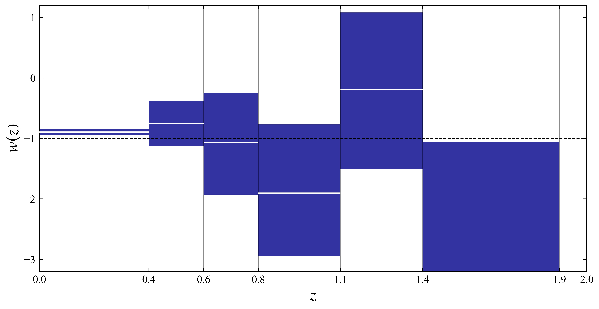
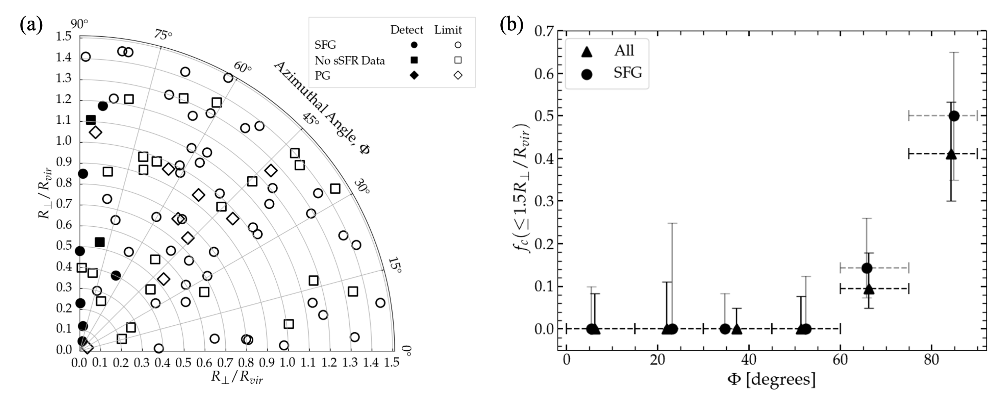
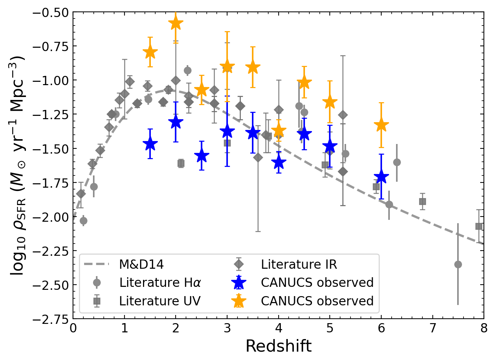

# arXiv Digest — 2026-08-11

**Interest file used:** interests/2026.05.md (fallback — no 2026.08.md exists yet)
**Categories pulled:** astro-ph.CO, astro-ph.EP, astro-ph.GA, astro-ph.HE, astro-ph.IM, astro-ph.SR, cs.LG, stat.ML, hep-ph
**Papers scanned:** 530 (128 astro-ph new/cross + 402 cs.LG/stat.ML/hep-ph)
**After first filter:** 22 candidates reviewed with full text
**Final selected:** 15 papers across 2 tiers

*Note: no Lyman-α forest P1D/P3D or z>5 IGM-opacity papers appeared today, so Tier 1 is thin and the digest leans Tier 2 (breadth this profile explicitly welcomes); Tiers 3–4 are empty. The minimum of 5 was not an issue. The arXiv metadata API rejects an `id_list` of ~530 ids in one request, so cs.LG (320 papers) was fetched in id-chunks; all target papers were retrieved. Seven full-text candidates were dropped as off-focus (galaxy-formation number counts, a low-z Lyα-emitter dust library, a z=7 dusty-galaxy SED, a generic physics-attention forecaster, a lunar-anomaly VAE, an LSBG detection CNN, and a single-sightline partial-Lyman-limit case study).*

---

## Tier 1 — Highly relevant

### [Implicit Likelihood Inference and z-Binned Reconstruction of Dark Energy w(z)](https://arxiv.org/abs/2608.08007)

Ke Wang, Jia-Yi Feng, Jianbo Lu
**Primary category:** astro-ph.CO

The authors reconstruct the dark-energy equation of state w(z) in 7 piecewise-constant redshift bins using simulation-based (implicit-likelihood) inference instead of explicit-likelihood MCMC. They build CLASS-based forward simulators for Planck 2018 TT/TE/EE+lensing, DESI DR2 BAO, and Pantheon+ SNe, then run the LtU-ILI pipeline with Sequential Neural Likelihood Estimation — an ensemble of masked-autoregressive-flow density estimators — over 6 rounds of 20,000 simulations, validated with rank statistics and coverage plots. The recovered w(z) marginally favors dynamical dark energy in the lowest-z bin, is consistent with a cosmological constant elsewhere, and is unconstrained in the two highest-z bins where BAO/SNe data thin out at z>1.

Direct hit on the ML-inference-for-cosmology thread: SNLE/normalizing-flow SBI applied to CMB+BAO+SNe with DESI DR2, a concrete template for amortized neural-likelihood inference of a high-dimensional cosmological reconstruction.

---

### [Multi-tracer mass bias in matched cosmic voids from SDSS DR7 and the ELUCID constrained simulation](https://arxiv.org/abs/2608.09086)

Youcai Zhang, Xiaohu Yang, Hong Guo et al.
**Primary category:** astro-ph.CO | also: astro-ph.GA

Using SDSS DR7 galaxies and the ELUCID constrained simulation of the local Universe, the authors build 102 one-to-one matched galaxy/subhalo void pairs (watershed voids matched by proximity, IoU, and mutual-best criteria) to compare galaxy, subhalo, and dark-matter mass in the same underdensities. Both galaxy-to-DM and subhalo-to-DM mass ratios fall steeply toward void centres (subhalo/DM drops from ~0.30 to ~0.05) while the galaxy-to-subhalo ratio stays roughly flat, implying the environmental trend is driven by the subhalo population. A common-frame scheme reduces coordinate-offset scatter, but the void-core galaxy-to-subhalo measurement is fundamentally limited by the scarcity of massive subhaloes — valid pairs collapse from 102 to ~2 at r/R_v=0.05.

Void cosmology with SDSS spectroscopy is explicitly a secondary-focus LSS probe in the interest file; this is an observationally anchored, multi-tracer view of the galaxy–subhalo–dark-matter connection in voids, with a forward tie to ELUCID-DESI.

---

### [Deus ex H0 — Is evidence for dynamical dark energy conditioned on early cosmology?](https://arxiv.org/abs/2608.07654)

Nils Schöneberg, Rodrigo Calderón, Julien Lesgourgues
**Primary category:** astro-ph.CO

The authors argue that the widely publicized DESI DR2 BAO + SNe evidence for dynamical dark energy is not model-independent but conditioned on early-universe assumptions. Recasting BAO, uncalibrated SNe, and the CMB acoustic angle as purely geometric constraints in the (Ω_m, h·r_d) plane, they show the w0–wa preference is minimized in a "nexus" region at high h·r_d and low Ω_m — exactly where early Hubble-tension solutions (modified recombination, early dark energy, dark radiation) push the cosmology. Using a Mahalanobis-distance significance map and Chebyshev dark-energy-density reconstructions, the dynamical-DE preference drops from ~2.5σ to ~1.3σ once an early solution is adopted, at the cost of a modestly worse Ω_m tension with SNe. They flag future ShapeFit and Lyman-α flux-power-spectrum Ω_m measurements as ways to break the degeneracy.

Reinterprets the headline DESI BAO dark-energy result and explicitly names the Lyman-α flux power spectrum as a future discriminator — squarely in the DESI BAO / dark-energy-inference territory that frames the reader's own forest work.

---

## Tier 2 — Adjacent / useful context

### [Locating the missing baryons in the warm-hot intergalactic medium with fast radio bursts and the Sunyaev-Zel'dovich effect](https://arxiv.org/abs/2608.09014)

Dao-Hong Zhai, F. Y. Wang, Zi-Gao Dai et al.
**Primary category:** astro-ph.HE | also: astro-ph.CO

The authors report the first cross-correlation between FRB dispersion measures (2656 CHIME/FRB Catalog 2 events) and the Planck PR4 tSZ Compton-y map to isolate the warm-hot intergalactic medium. After masking virialized clusters and using NaMaster pseudo-Cℓ estimation with jackknife covariances, they detect a positive cross-power at 3.05σ (>99.77%). A two-parameter MCMC anchored to T_e=2.4×10⁶ K yields f_WHIM = 0.48 (0.27–0.61), stable under wider masking and RA-shuffle null tests. Combined with prior censuses — including the ~28% of baryons in the Lyman-α forest — the WHIM at ~48% closes the local cosmic baryon budget.

A novel FRB×tSZ probe of the diffuse cosmic web that explicitly situates the Lyman-α-forest photoionized phase within a closed baryon budget, using CMB-style power-spectrum estimators the reader would recognize.

---

### [The Circumgalactic Medium of Present-Epoch Luminous Galaxies as Probed by CIV Absorption](https://arxiv.org/abs/2608.07752)

Mark A. Croom, Christopher W. Churchill, Bart Wakker et al.
**Primary category:** astro-ph.GA

The authors search for C IV λλ1548,1550 CGM absorption toward background quasars around 88 isolated, bright (L_B≥0.2 L*) galaxies at z<0.03, selected blind to absorption with unbiased inclination and azimuth (HST/COS G160M, W_r≥0.1 Å). Only 9/88 galaxies show absorption, and all nine lie within 30° of the projected minor axis and R_perp<1.2 R_vir of star-forming galaxies, ruling out a random azimuthal distribution at 4.3σ. This is interpreted as biconical polar outflows, though the ~0.5 covering fraction within 30° of the minor axis implies patchy or transient winds. Spatial-kinematic modelling favors a wind origin for 7/9, with C IV tracing an intermediate-ionization interface between low-ionization Mg II and high-ionization O VI.

A clean, selection-controlled quasar-absorption census of metal-enriched CGM outflows — directly in the CGM / QSO-absorption adjacent thread and methodologically close to absorption-line work on the diffuse gas.

---

### [A New Window on the Hα Luminosity Function and Star Formation Rate Density from 1.2 < z < 6.6 from JWST Medium-Band Photometry](https://arxiv.org/abs/2608.08203)

Nicholas S. Martis, Chris Willott, Gregor Rihtaršič et al.
**Primary category:** astro-ph.GA

Using deep JWST NIRCam medium-band imaging (CANUCS, JWST in Technicolor, JUMPS; up to 20 filters, 29.5–30 AB), the authors measure the Hα luminosity function self-consistently across 1.25<z<6.6 by tracing the line through 11 medium bands, validated against NIRSpec prism spectra (0.04 dex offset, 0.2 dex scatter). From 4101 sources they fit Schechter LFs, apply per-object dust corrections and completeness simulations, and build the cosmic SFRD, recovering the z~2 peak and the decline to z=6. The dust-corrected SFRD sits at the high end of prior measurements (aligning with IR rather than UV), with the obscured fraction declining from ~80% at z~1.5–2 to a ~50% plateau at z≥4, and a non-evolving faint-end slope down to L~10⁴⁰·⁵ erg/s.

Adjacent to the reionization / ionizing-sources thread: a wide-baseline Hα SFRD reaching into the epoch of reionization, constraining the star-formation budget of the sources that drive it.

---

### [An emerging baryon cycle in a galaxy 500 million years after the Big Bang](https://arxiv.org/abs/2608.09813)

Shengzhe Wang, Xin Wang, Hang Zhou et al.
**Primary category:** astro-ph.GA

Deep JWST spectroscopy of Gz9p3, a merging galaxy at z=9.311, reveals a substantial neutral-gas reservoir along a merger-driven tidal structure and a multiphase outflow. Using Si II / C II fine-structure absorption, the authors make the first direct high-z electron-density measurement of the cool outflowing gas (~17 cm⁻³), giving a mass-outflow rate independent of assumed radius and an exceptionally high ionized mass-loading factor (η=12.3). They interpret the high η as feedback emerging after an intense "feedback-free" starburst phase, and jointly fit four Lyman-α sightlines to constrain the local N_HI, finding the outflow unlikely to escape the halo — implying metal recycling through the CGM.

Adjacent reionization-epoch physics: a z~9.3 galaxy with DLA Lyman-α sightline modelling and quantified stellar feedback, probing the neutral gas and baryon cycle during the epoch of reionization.

---

### [Spec-S5: A Next-Generation All-Sky Spectroscopic Facility Enabling Large-Scale Surveys for Cosmology and Astrophysics](https://arxiv.org/abs/2608.07927)

Claire Poppett, David J. Schlegel, Arjun Dey et al.
**Primary category:** astro-ph.IM

Concept overview for the Stage-5 Spectroscopic Experiment (Spec-S5), the post-DESI, post-Rubin all-sky facility. The baseline upgrades the Mayall and Blanco 4-m telescopes to 6-m wide-field (2.2°) observatories, each with ~13,000 robotic fiber positioners feeding 23 DESI-heritage spectrographs (360–980 nm), delivering >10× DESI survey speed over a 25,000 deg² wide plus 11,000 deg² deep survey reaching z~4.5. Science goals emphasize high-z large-scale structure, primordial non-Gaussianity/inflation, neutrino mass, dark matter, and dark energy, with a forecast primordial figure-of-merit of ~9–10 versus ~0.9 for DESI. Dark-time targets explicitly include Lyman-α forest quasars, Lyman-break galaxies, and Lyman-α emitters, with a Cassegrain design favoring blue throughput for the forest.

Defines the next-generation facility that would extend DESI-style BAO/full-shape and Lyman-α forest cosmology to z~4.5 — directly the future of the reader's DESI/LSS/forest program.

---

### [Foreground Subtraction with a Tensor-Based Oriented Singular Value Decomposition Method for HI Experiments](https://arxiv.org/abs/2608.09129)

Shifan Zuo, Xuelei Chen, Yi Mao
**Primary category:** astro-ph.IM | also: astro-ph.CO

The authors introduce a native third-order-tensor foreground-mitigation framework for 21 cm intensity mapping using the Oriented SVD (O-SVD), a hierarchical multilinear generalization of the matrix SVD. Rather than flattening data cubes into 2D matrices (which discards spatial–spectral topology), O-SVD decomposes multi-frequency sky maps directly on the tensor manifold, choosing the spectral axis as the "oriented" dimension to exploit smooth foreground coherence versus rapid signal fluctuations. It is validated on SKA Science Data Challenge 3a EoR simulations and on real Tianlai Cylinder Pathfinder Array data, recovering the cosmological signal and outperforming conventional matrix SVD/PCA. It is presented as a general, blind foreground-subtraction tool for HI experiments.

A borrowable blind signal/foreground-separation method for 21 cm large-scale-structure and EoR power-spectrum recovery — adjacent to the reader's IGM/reionization and LSS interests.

---

### [Simulation-based inference for AGN jet population modelling](https://arxiv.org/abs/2608.08733)

Clara Lilje, James H. Matthews, Rob Fender
**Primary category:** astro-ph.HE

The authors apply likelihood-free simulation-based inference with normalizing flows to the MOJAVE 1.5 Jy AGN jet parent population, where flux-limit selection and degenerate parameters make the likelihood intractable. The flow learns the posterior directly and is extensively validated with simulation-based calibration (SBC rank tests), TARP, and coverage/KS metrics across multiple training seeds. They show prior maximum-likelihood fits significantly underestimated parameter errors and missed posterior non-Gaussianity, and infer a Lorentz-factor distribution N(Γ) ∝ Γ^b with b=−1.32 (+0.20/−0.19), consistent at 2σ with the X-ray-binary jet population. The paper reads as a clean template for SBI on flux-limited population-inference problems.

A well-validated worked example of normalizing-flow SBI with full calibration diagnostics (SBC, TARP, coverage) on a selection-limited astro population — directly transferable methodology for the reader's ML-inference-for-cosmology program.

---

### [Leveraging generative models to assist Monte Carlo sampling](https://arxiv.org/abs/2608.07648)

Marylou Gabrié
**Primary category:** stat.ML | also: cs.LG

A tutorial review of a fast-growing paradigm: using generative models (normalizing flows, autoregressive nets, continuous flows, diffusion models) not as data-driven density estimators but as flexible proposals to sample distributions known only up to a normalization constant. It organizes the field into choosing a model family, training without data, and building exact/verifiable sampling algorithms, covering reweighting (Boltzmann-generator-style importance sampling), neural-transport MCMC, and annealed/diffusion samplers, with honest discussion of failure modes (mode collapse, imperfect flows in high dimension). It explicitly frames Bayesian inference and high-dimensional integration as target applications and connects to lattice-QFT sampling.

A directly borrowable toolbox for cosmological posterior sampling and SBI: how flow/diffusion samplers can draw from unnormalized targets (e.g. forest/IGM or LSS likelihoods) with asymptotically exact reweighting, and how to train them without simulations.

*No figures extracted for 2608.07648 (tutorial review; figures illustrate individual sub-methods rather than a single at-a-glance result).*

---

### [Do AI Forecast Ensembles Sample the Correct Conditional Distribution?](https://arxiv.org/abs/2608.08954)

Lucas J. Howard, Elizabeth A. Barnes
**Primary category:** physics.ao-ph | also: cs.LG

The authors train a denoising diffusion model for probabilistic sea-level forecasts at 8 tide gauges and find a sharp decoupling: positive marginal skill (CRPS) everywhere while the joint spatial structure is worse than a climatological draw. A shuffle-based permutation decomposition shows the energy score is blind to this failure but the variogram score detects it. Lorenz-96 experiments (up to ~170 equivalent years) show the gap does not close with more training data and is reproduced by a linear multivariate-normal baseline — structural inadequacy, not undertraining. A dynamical ensemble avoids the failure while a deterministic AI emulator reproduces it, pinning it to data-driven emulation.

A cautionary lesson and ready-to-borrow diagnostic for generative/diffusion emulators and SBI in cosmology: marginal skill (and even the energy score) can hide badly miscalibrated joint/covariance structure — exactly what matters for field-level LSS/forest emulators — and the variogram-score shuffle test is directly reusable.

---

### [Bayesian Symbolic Regression with Entropic Reinforcement Learning](https://arxiv.org/abs/2608.09617)

Oussama Boussif, Mohammed Mahfoud, Younesse Kaddar et al.
**Primary category:** cs.LG

The authors introduce ERRLESS, recasting Bayesian symbolic regression as amortized posterior sampling over expression trees using maximum-entropy RL / GFlowNet trajectory-balance training, with the unnormalized posterior log-density as reward. A neural policy builds expressions bottom-up while enforcing arity, redundancy, and dimensional-analysis (physical-unit) constraints, jointly sampling tree structure, real-valued constants, and noise level. On the Feynman benchmark it gives competitive accuracy with short, interpretable expressions and, unlike single-best-fit or SMC baselines, produces a full posterior whose predictive mean is more robust in the scarce/noisy-data regime.

A scalable, uncertainty-quantified symbolic-regression engine of the kind the interest file already tracks (AI Feynman, neural symbolic models): it amortizes posterior sampling over formulae with built-in dimensional consistency, attractive for discovering interpretable IGM/forest or LSS scaling relations with honest epistemic uncertainty.

*No figures extracted for 2608.09617 (central method figure is a TikZ diagram with no extractable image file; the only bitmap is a minor search-space plot).*

---

### [Inflationary Axion Isocurvature in the CMB across All Ultralight Masses](https://arxiv.org/abs/2608.07803)

Rayne Liu, Wayne Hu, Daniel Grin
**Primary category:** astro-ph.CO | also: hep-ph

The authors extend the AxiECAMB Boltzmann code to evolve inflationary axion isocurvature perturbations accurately across the full ultralight-axion mass range, from dark-energy-like (m_a<H0) to CDM-like fuzzy dark matter. They provide sub-percent analytic fits for axion abundance versus initial field value and map the isocurvature amplitude to the tensor-to-scalar ratio r. The derived Planck bound r·f_dm < 0.08 (m_a/10⁻²⁷ eV)⁻¹ᐟ² can beat BICEP tensor limits; Jeans suppression breaks the CDM–isocurvature degeneracy for 10⁻³²–10⁻²⁸ eV; and a compatibility window near m_a~10⁻²⁵ eV, f_dm≳0.1 is identified where isocurvature and tensors could both be detected while alleviating the S8 tension.

Sits squarely in the ultralight/fuzzy dark-matter regime the Lyman-α forest constrains (it cites Rogers and Iršič forest/ULA bounds), delivering calibrated initial conditions for fuzzy-DM structure and tying small-scale primordial/DM physics to the S8 tension.

---

### [The Fate of Large Scale White Noise in Second-Order Cosmological Perturbation Theory](https://arxiv.org/abs/2608.09897)

Aurora Ireland
**Primary category:** astro-ph.CO | also: hep-ph

The paper reexamines the recently proposed "Large Scale White Noise" effect, which claimed the covariant kurvature density develops k→0 white noise that would imprint a 1/k² IR enhancement on the second-order curvature perturbation R₂ — turning CMB large scales into a probe of the otherwise-inaccessible small-scale primordial power spectrum. Working consistently to second order in radiation domination, the author confirms δρ₂ genuinely develops white noise but shows it is not inherited by R₂: the earlier claim used a linear Poisson relation between two genuinely second-order quantities, missing extra quadratic terms. A soft-limit conservation law forces lim k²R₂ = 0, so the proposed bound on small-scale primordial power is invalid.

Bears directly on whether there is a new handle on the small-scale primordial power spectrum — the regime the Lyman-α forest uniquely probes; by retracting a would-be CMB constraint, it leaves the forest and other small-scale probes as the operative bounds.

*No figures extracted for 2608.09897 (single figure is a technical source-weight-function plot that does not convey the conservation-law result at a glance).*
