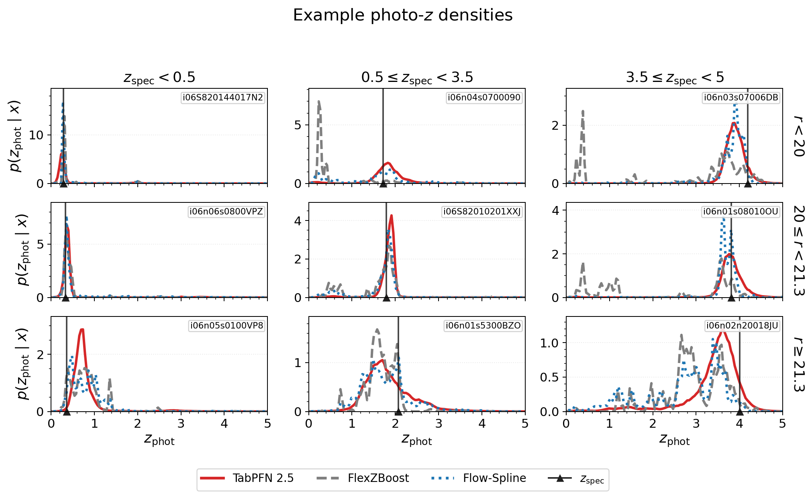
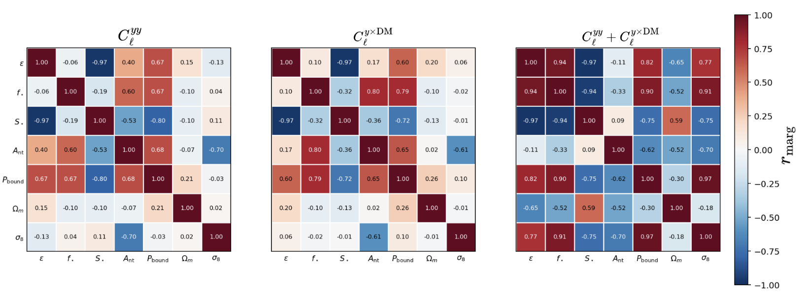

# arXiv Digest — 2026-08-12

**Interest file used:** interests/2026.05.md (fallback — no 2026.08.md exists yet)
**Categories pulled:** astro-ph.CO, astro-ph.EP, astro-ph.GA, astro-ph.HE, astro-ph.IM, astro-ph.SR, cs.LG, stat.ML, hep-ph
**Papers scanned:** 294 (81 astro-ph new/cross + 213 cs.LG/stat.ML/hep-ph and other cross-lists)
**After first filter:** 14 candidates reviewed with full text
**Final selected:** 11 papers across 4 tiers

*Note: interest file is a fallback from May — no 2026.08.md exists yet. The cs.LG/stat.ML extras were dominated by generic ML-systems, RL-training, and recommender-system work with no scientific-inference angle, so the adjacent tiers draw mostly from cross-subfield astronomy rather than the ML feed.*

---

## Tier 1 — Highly relevant

### [Lyman Break Galaxy selection and redshift measurement with supervised contrastive learning](https://arxiv.org/abs/2608.10080)

J. Choppin de Janvry, C. Yèche, Arjun Dey et al. (C. Yèche — interest-file high-value DESI Lyα-group author)
**Primary category:** astro-ph.CO

DESI's second phase (Run 2) will push spectroscopy toward Lyman Break Galaxies (LBGs) at z∼2–4.5, where faint spectra make redshift measurement and sample decontamination hard even after target selection. The authors train a supervised *weighted* contrastive-learning model that simultaneously learns a redshift-ordered latent representation of spectra and separates LBGs from quasar and low-z ELG contaminants, generalizing the contrastive loss with continuous relationship weights (a redshift kernel). The model matches the redshift performance and improves the outlier classification of DESI's previous QuasarNET-derived network on the same data, and is well-suited to the small, visually-inspected training sets available for this population.

Direct hit on the DESI × machine-learning convergence at the center of the interest file: it is a representation-learning method for spectroscopic redshifting and decontamination of the exact high-z tracers DESI Run 2 will use for forest/LSS cosmology, from the DESI Lyα working group (Yèche).

---

### [The Last Crossing in Excursion-Set Theory of Cosmic Reionization](https://arxiv.org/abs/2608.10066)

Hanjue Zhu
**Primary category:** astro-ph.CO

Introduces the *last* crossing of the FZH04 photon-counting barrier as a new analytic statistic for reionization, complementing the familiar first crossing (which sets the ionized-bubble scale). The last-crossing scale R_ℓ marks the smallest scale on which a point's enclosed photon budget still ionizes the enclosed gas; its distribution is derived analytically and measured in CROC simulations via an empirical barrier. Regions with a resolved R_ℓ are "externally ionized" — predominantly underdense, with a source-poor center embedded in a richer surrounding environment (roughly half the central ionizing-luminosity density of matched regions, with an excess at intermediate radius).

Directly in the IGM/reionization primary focus, and it closes onto the Lyman-α forest: the paper argues these externally ionized, low-density regions are where Lyα *transmission spikes* preferentially arise (low opacity maintained by distant sources), yielding a testable prediction — a central galaxy deficit with an excess at finite separation around transmission-selected IGM locations.

---

### [Tabular foundation models for the estimation of probabilistic quasar photometric redshifts in S-PLUS](https://arxiv.org/abs/2608.10280)

Raquel R. Valença, Lilianne Nakazono, Rafael Izbicki et al.
**Primary category:** astro-ph.IM | also: astro-ph.CO

Benchmarks tabular foundation models (TabPFN 2.5, RealTabPFN 2.5, TabICL) as off-the-shelf *probabilistic* quasar photo-z estimators on the 12-band S-PLUS DR6 survey, against eight task-specific baselines including FlexZBoost, mixture-density networks, normalizing flows, random forests, and gradient-boosted trees. TabPFN 2.5 is best or statistically tied for best on nearly all density and point-prediction metrics, with its clearest gains at small training sets and in the difficult regimes (very bright/faint sources, high redshift), while keeping near-nominal calibration under the train/target covariate shift that plagues spectroscopically-trained photo-z. Its main practical cost is inference-time GPU memory; SHAP attributions flag WISE W1/W2 as the strongest predictors.

Hits the rising-primary ML-for-cosmology focus squarely: foundation models applied to survey inference, with explicit attention to calibrated multimodal posteriors and covariate shift — the deployment concerns that matter for quasar/forest survey pipelines and simulation-based inference.

---

## Tier 2 — Adjacent / useful context

### [Radiative Transfer Modeling of Stripped-envelope Supernovae II: Neural Network Emulation of Light Curves](https://arxiv.org/abs/2608.10058)

S. Karthik Yadavalli, V. Ashley Villar, Maria R. Drout et al.
**Primary category:** astro-ph.HE

Presents the first neural-network emulator of stripped-envelope supernova light curves, trained on a grid of 4499 light curves from the `sedona` radiative-transfer code. Using the emulator, the authors infer Ni-56 mass, ejecta mass, ejecta-velocity profile, and Ni-56 mixing from multiband light curves, and show the ejecta-mass–velocity degeneracy is substantially weaker than in traditional semianalytic (Arnett) models, which bake that degeneracy in by design. Inference is more accurate than Arnett for both simulated ZTF-like and LSST-like data, and is demonstrated on SN 1994I, 2007gr, and iPTF13bvn.

The connection is methodological: this is a clean instance of replacing an expensive radiative-transfer simulation grid with a fast NN surrogate to enable parameter inference — the same emulator/surrogate-modeling pattern (à la ForestFlow) the interest file tracks for forest and IGM simulations.

*No figures extracted for 2608.10058 (results are parameter-recovery scatter/corner plots that need the full text to read; the emulator gain is stated cleanly in the summary).*

---

### [A fast, differentiable neural-network surrogate for precessing binary black-hole waveforms](https://arxiv.org/abs/2608.09978)

Beka Modrekiladze
**Primary category:** gr-qc | also: astro-ph.HE, astro-ph.IM

Builds a fully differentiable NN surrogate for the precessing numerical-relativity waveform model NRSur, predicting the inertial-frame spherical-harmonic modes so both polarizations at an arbitrary orientation follow from a single network evaluation via an analytic mode-to-strain projection. Trained on 6×10⁵ waveforms, it reaches orientation-averaged matches of mean 0.94 (median 0.975) and generates a waveform in ~12 ms. Because the projection is analytic, the surrogate is differentiable in both intrinsic and extrinsic parameters, yielding a full 13-D Fisher matrix and enabling gradient-based (HMC/NUTS) parameter estimation.

Relevant as a transferable inference method rather than for its GW science: a differentiable forward-model surrogate that unlocks gradient-based samplers is exactly the emulator + differentiable-inference toolkit the interest file emphasizes for cosmological parameter estimation.

*No figures extracted for 2608.09978 (the contribution is the differentiable-surrogate method and its match/timing metrics, which are conveyed in text).*

---

### [Beyond Feedback: Disentangling Baryonic Effects with tSZ×FRB Cross-Correlations](https://arxiv.org/abs/2608.06455)

Isabel Medlock, Daisuke Nagai
**Primary category:** astro-ph.GA | also: astro-ph.CO

Because the thermal Sunyaev–Zel'dovich effect traces electron *pressure* while fast-radio-burst dispersion measures trace electron *density*, their cross-power spectrum constrains the thermal and non-thermal structure of cluster gas that neither probe can pin down alone. Using the Baryon Pasting framework — which separately parameterizes feedback efficiency ε_f and non-thermal pressure amplitude A_nt — the authors show the joint tSZ×FRB constraint breaks the ε_f–A_nt degeneracy, cutting the conditional correlation from 0.96 to 0.08 and improving the figure of merit ×19 in the noise-free limit. They forecast 3.8% precision on A_nt with DSA-2000 FRBs combined with Simons Observatory, with direct implications for the hydrostatic mass bias in cluster cosmology.

A cross-correlation methods paper in the LSS/cluster-cosmology space the interest file lists as an expansion direction (Lyα × other tracers, tSZ, kSZ), and it establishes FRB dispersion as a complementary electron-density probe for breaking baryon-model degeneracies.

---

### [CORN — Chronometers of Relic Nature I: The first estimate of the expansion rate of the Universe using compact relic galaxies](https://arxiv.org/abs/2608.10163)

Krzysztof Lisiecki, Nicola Principi Cavaterra, Agnieszka Pollo et al.
**Primary category:** astro-ph.CO | also: astro-ph.GA

Applies the cosmic-chronometer method — measuring H(z) from the differential age evolution of quiescent galaxies without assuming a cosmological model — but restricts the sample to *relics*: ultra-compact massive galaxies hosting the oldest stellar populations, which minimizes the star-formation- and merger-history systematics that dominate chronometer uncertainties. This yields a first, deliberately conservative measurement H(z=0.15) = 85 ± 53 km/s/Mpc, presented as a proof of concept for a cleaner chronometer population rather than a competitive constraint.

Adjacent to the LSS-cosmology focus: a model-independent H(z) probe bearing on the Hubble tension, complementary to the DESI BAO expansion-history measurements the interest file follows.

*No figures extracted for 2608.10163 (this is a proof-of-concept single-point H(z) measurement; the headline number sits in the summary).*

---

### [The Rotation Curve of the Milky Way: State of the Art, the Keplerian Decline Debate, and Implications for Dark Matter](https://arxiv.org/abs/2608.10189)

Alessandro Melchiorri, Ruchika
**Primary category:** astro-ph.GA

A self-contained pedagogical review of the post-Gaia DR3 controversy over the Milky Way's outer rotation curve, where several analyses now find a velocity decline beyond R≈15 kpc and the most radical interpretation claims a near-Keplerian fall-off implying a total dynamical mass of only ∼2×10¹¹ M_⊙ — three to five times below pre-Gaia estimates. The authors derive the full machinery from first principles (Jeans equations, asymmetric-drift correction, DM-halo and baryonic mass models, the MOND flat-RC prediction, the timing argument) and present an illustrative MCMC fit and Gaussian-process reconstruction, while cautioning that stellar streams, clusters, and the timing argument favor a heavier halo and that Jeans-inferred outer curves can be biased.

Useful context for the dark-matter side of the profile: the inferred local DM density and halo mass feed directly into direct-detection predictions and into how forest-based small-scale DM constraints are interpreted, and the review is a careful, well-sourced entry point to a live debate.

*No figures extracted for 2608.10189 (a review; its figures are reproductions and illustrative fits rather than a single decisive result).*

---

## Tier 3 — Outside my area but notable

### [Reconstructing Dark Matter Mass and Discriminating Standard and Non-Standard WIMP-Nucleus Interactions with Paleo-Detectors](https://arxiv.org/abs/2608.10105)

Dionysios P. Theodosopoulos, Katherine Freese, Chris Kelso et al.
**Primary category:** astro-ph.CO | also: astro-ph.IM, hep-ph

Paleo-detectors read out the crystal-damage tracks left in ancient minerals by dark-matter nuclear recoils accumulated over geological timescales. This is the first detailed study of how well they can reconstruct DM parameters and distinguish interaction types, covering both elastic and inelastic scattering. The authors find paleo-detectors can reconstruct WIMP masses ≲10 GeV — a regime that challenges conventional direct-detection experiments — and up to ~1 TeV, roughly doubling the reconstructable mass range, and can discriminate canonical spin-independent/dependent interactions from non-canonical velocity- or momentum-dependent NREFT couplings without requiring directional readout.

Outside the forest program, but a genuinely novel detection concept that materially extends the reconstructable WIMP mass range and interaction discrimination — worth knowing on the dark-matter side, and carrying weight given the author list (Freese).

*No figures extracted for 2608.10105 (the results are reconstruction/discrimination forecasts best read from the tables and text).*

---

## Tier 4 — Meta-research about the field

### [AIFS-TC: A simple correction competitive with the operational frontier for tropical cyclone intensity forecasting](https://arxiv.org/abs/2608.09959)

Anna Allen, Wessel P. Bruinsma, Michael Maier-Gerber et al.
**Primary category:** physics.ao-ph | also: cs.LG

AI weather models forecast tropical-cyclone *tracks* well but badly underestimate *intensity*. AIFS-TC is a simple post-processing correction on top of the open-source AIFS-Single model that becomes competitive with the operational state of the art for maximum wind speed and minimum central pressure from 12 h to seven days, including rapid-intensification events. The paper's headline meta-point: the entire system was autonomously designed and built by a large language model (Claude Fable 5) in a few hours, directed by a single domain scientist through a handful of natural-language prompts — offered as evidence that agentic coding is a route to rapid progress in life-saving early-warning systems.

Meta-research on how AI is changing the practice of computational physical science: an LLM autonomously producing a frontier-competitive scientific model with minimal human coding is a concrete data point on where agentic tooling is heading, directly relevant to how a data-driven cosmologist's own workflow may change.

*No figures extracted for 2608.09959 (the interesting content is the agentic-authorship claim and the skill tables, not a single plot).*

---

### [Spectroscopic Binary Detection as Agent-Callable Tools: Detecting 40,000+ Main-Sequence Binary Candidates from SDSS DR19 APOGEE Spectra](https://arxiv.org/abs/2608.10866)

Serat M. Saad, Yuan-Sen Ting
**Primary category:** astro-ph.SR | also: astro-ph.IM

Packages the El-Badry et al. (2018) double-lined spectroscopic-binary (SB2) decomposition as reusable *agent infrastructure*: nine tool servers built on the Model Context Protocol (MCP) plus a "Skill" that encodes the usually-unwritten operating know-how. Run over 238,205 SDSS DR19 APOGEE dwarfs under a fixed driver script, it flags 41,466 SB2 candidates (median q=0.91, ~15× the DR13 count), and refitting individual visits confirms 68.5% of the multiply-visited systems and adds thousands of orbit-ready binaries. An ablation shows a fresh agent recovers a deliberately removed operating decision only when its absence leaves a measurable trace in the fit.

Meta-research about AI in astronomy: it tackles the reproducibility gap that "operating know-how is rarely written down" by turning a spectroscopic-analysis method into agent-callable tools plus a Skill, and it directly touches the interest file's expansion interest in foundation-model/agent tooling for spectroscopic survey pipelines.

*No figures extracted for 2608.10866 (the contribution is the agent-tooling framework and the released catalog, not an explanatory figure).*
