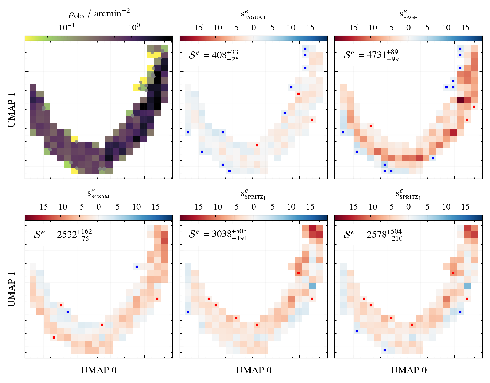

# arXiv Digest — 2026-08-14

- **Interest file used:** interests/2026.05.md (fallback — no 2026.08.md exists yet)
- **Categories pulled:** astro-ph.CO, astro-ph.EP, astro-ph.GA, astro-ph.HE, astro-ph.IM, astro-ph.SR, cs.LG, stat.ML, hep-ph
- **Papers scanned:** 263 (66 astro-ph new/cross + 197 cs.LG/stat.ML/hep-ph and their cross-lists)
- **After first filter:** 17 candidates reviewed with full text
- **Final selected:** 10 papers across 4 tiers

---

## Tier 1 — Highly relevant

### [Forecast for the detectability of patchy hydrogen reionization in WEAVE-QSO measurements of the Lyman-α forest power spectrum at redshift z ≥ 4](http://arxiv.org/abs/2608.13153v1)

Ke Ma, James S. Bolton, Vid Iršič et al. (incl. high-value co-authors Vid Iršič and James S. Bolton, forest/IGM cosmology)
**Primary category:** astro-ph.CO

Using the Sherwood-Relics reionization simulations and a new forward-modelling pipeline (WEAVEify), the authors generate mock WEAVE-QSO spectra in four redshift bins (z = 4.0–4.6) and build a full covariance budget for the 1D Lyα forest power spectrum, folding in sample size, resolution, noise subtraction, continuum placement, uncorrelated and correlated (Si III) metals, and damping wings from high-column-density absorbers. On the large scales that matter (k ≲ 0.01 s km⁻¹) the total forecast uncertainty stays below 10% per bin. Running the mock P1D through an MCMC inference that marginalizes over the IGM thermal state (τ_eff, T₀, γ, u₀) plus a patchy-reionization amplitude A_p, they find the relic large-scale power enhancement from patchy reionization should be detectable at ≃4.5σ (Δχ²=29.2 for four extra parameters).

---

### [Don't Cut Corners: How Training Outside the Prior Makes Simulation-Based Inference More Robust](http://arxiv.org/abs/2608.12470v1)

Chaipat Tirapongprasert, Matthew Ho (high-value ML-for-cosmology co-author Matthew Ho)
**Primary category:** astro-ph.IM | also: stat.ML

Neural posterior estimators trained on parameters drawn from a hard Uniform prior box (as CAMELS, Quijote, and DREAMS suites do via Latin hypercubes) learn poor posteriors near the box edges because gradient-based density estimators cannot represent the sharp proposal discontinuity. The authors propose "Tailed-Uniform," a family of proposals that pad the Uniform core with decaying tails (Gaussian, linear, exponential, flat) so the network sees training points near and beyond the boundary. On a Gaussian toy problem and on cosmological parameter inference from the matter power spectrum, Tailed-Uniform-trained NPE yields more accurate posteriors near the edges, and the advantage grows in high dimensions where boundaries dominate the parameter-space volume — even when the assumed prior stays Uniform.

---

## Tier 2 — Adjacent / useful context

### [Cosmography with DESI-DR1 Cosmic Chronometers: Direct H(z) measurements from Luminous Red Galaxy ages](http://arxiv.org/abs/2608.13178v1)

Carlos A. Álvarez, Marcos M. Cueli, Balakrishna S. Haridasu et al. (incl. Michele Moresco)
**Primary category:** astro-ph.CO | also: astro-ph.GA

From ~2 million DESI-DR1 luminous red galaxy spectra the authors build a spectroscopically purified sample of 527,287 LRGs, stack them into velocity-dispersion groups by redshift to reach S/N ≈ 150, and measure Lick indices to date the passively evolving population. The differential-age (cosmic chronometer) method then yields a model-independent expansion history H(z) over 0.36 < z < 0.80, via both a pivotal-redshift cosmographic fit and direct finite-difference estimates (e.g. H(z≈0.61) = 88.5⁺⁶·⁷₋₁₂·₆ (stat.) ± 8.1 (syst.) km s⁻¹ Mpc⁻¹ from the reddest, purest envelope). They release chains, an H(z) grid, and the full covariance matrix.

---

### [SPURS: Massive Stars, Dense Gas, and Lyα Escape in GN-z11 at z = 10.6](http://arxiv.org/abs/2608.12699v1)

Zuyi Chen, Daniel P. Stark, Charlotte A. Mason et al.
**Primary category:** astro-ph.GA

Ultra-deep JWST/NIRSpec spectroscopy of GN-z11 (the SPURS Cycle 4 program) reveals P-Cygni stellar-wind features and broad He II jointly reproduced by very massive stars (>100 M⊙) at low metallicity and young age (≲3 Myr), plus a fast (~500 km s⁻¹) highly ionized outflow with negligible neutral-gas covering fraction. The weak Lyα line (EW = 5.6 Å, f_esc,Lyα = 2.7%) shows a broad red wing, with 44% of the flux at >500 km s⁻¹. That velocity offset is the key point: photons scattered to the red should experience reduced IGM damping-wing suppression, helping explain how Lyα stays visible at z > 10 even in a substantially neutral intergalactic medium.

*Figure removed (figure-file cleanup): IGM_effects.pdf*

---

### [FLAGS II: Constraining Galaxy Formation Models with Dimensionality Reduction of Direct Observables](http://arxiv.org/abs/2608.12471v1)

Jack C. Turner, Stephen M. Wilkins, William J. Roper et al.
**Primary category:** astro-ph.GA

The authors show that 2D UMAP embeddings of JWST+HST photometric fluxes retain enough information to statistically distinguish five galaxy-formation models (JAGUAR, SC-SAM, SAGE, and two SPRITZ variants) against GOODS-S observations using a χ²-like score computed directly in observable space — no SED fitting required. JAGUAR reproduces the bright-galaxy population six times better than SC-SAM and twelve times better than SAGE; the method flags specific model failures (e.g. missing extreme-emission-line starbursts at 2.5<z<3.5 traceable to SN feedback and simulation snapshot cadence). Crucially, non-linear UMAP preserves discriminating power that linear PCA discards (differences up to >90%), and embedding is >100× faster than Bayesian property inference.

---

### [Learned proposals in trans-dimensional inference are optimal at equilibrium, not during assembly](http://arxiv.org/abs/2608.12392v1)

Argyro Sasli, Nikolaos Karnesis, Minas Karamanis et al.
**Primary category:** physics.data-an | also: astro-ph.IM

Reversible-jump MCMC solves the problem of inferring model dimension (how many sources/components explain the data) jointly with parameters, but mixes slowly, and whether learned proposals can speed the dimension-changing moves has been unclear. The paper gives a structural answer: the optimal birth-move proposal is a *different object* in different phases — while the fit is being assembled it must match the current residual (a state-dependent quantity no fixed network can represent), but at equilibrium it degenerates to the posterior's single-component marginal, exactly what an adaptive normalizing flow learns from the sampler's own history. With an exact Metropolis-Hastings correction the learned births accelerate model-order mixing (meeting a stopping rule in 6/10 seeds vs 1/10 for a hand-tuned baseline); they release the method as HyperWave.

---

### [Unifying Generative Models with Path Integrals](http://arxiv.org/abs/2608.12438v1)

Ramon Winterhalder
**Primary category:** cs.LG | also: hep-ph, stat.ML

The author recasts generative modelling as a path integral in which flow-based, diffusion-based, variational, and adversarial models all arise as different evaluation principles of a single master action. Written in Martin-Siggia-Rose-Janssen-de Dominicis (MSRJD) form, the action separates free from interacting probability flows and opens them to diagrammatic perturbation theory: a one-loop correction improves deterministic samplers at no extra stochastic-sampling cost (reducing a 53% tree-level error to 1.6% on nonlinear drifts), imperfect learned scores enter as insertions yielding a response-weighted score-matching objective, and symmetry-equivariant drift design becomes an EFT-power-counting operator expansion.

---

### [The Production of Electron-Capture Elements in Thermonuclear Supernovae: Theory vs. Observations](http://arxiv.org/abs/2608.13432v1)

S. Shiber, P. Hoeflich, T. Mera et al.
**Primary category:** astro-ph.SR | also: astro-ph.HE

Type Ia supernovae standardize the distance ladder that underpins high-precision cosmology, so their explosion channel matters for dark-energy inference. Using detailed magneto-hydrodynamical simulations, the authors argue that the near-universal JWST detection of electron-capture (EC) elements traces high-density burning, which largely rules out the currently popular helium-triggered sub-Chandrasekhar detonation models as the dominant channel and shifts focus back to near-M_ch explosions (deflagration-to-detonation, à la W7) and mergers. Small-scale pre-existing turbulence from the smoldering phase proves essential to the 3D physics and systematically halves EC production, implying white-dwarf central densities closer to the accretion-induced-collapse regime.

---

## Tier 3 — Outside my area but notable

### [Large-Scale Dynamos Driven by Shear-Flow-Induced Jets](http://arxiv.org/abs/2608.12530v1)

B. Tripathi, A. E. Fraser, P. W. Terry et al.
**Primary category:** astro-ph.SR | also: astro-ph.HE, physics.flu-dyn

Mean-field dynamo theory (Parker 1955) reproduces observed large-scale magnetic fields but relies on parameters not justified from first principles. Using analytic theory plus 3D simulations of driven, unstable shear flow at up to 4096×4096×8192 grid points, the authors demonstrate *ab initio* generation of quasi-periodic large-scale magnetic fields via the mean-vorticity effect. The key ingredient is the prior formation of large-scale 3D jets — shown to be topologically protected, exact nonlinear MHD solutions — which then seed the field. They argue the mechanism operates in binary neutron-star mergers, generating some of the Universe's strongest fields within milliseconds and providing multimessenger signals.

---

### [The Ĝ Infrared Search for Extraterrestrial Civilizations V: When Galaxies Glow with Industry](http://arxiv.org/abs/2608.12458v1)

Olivia Curtis, Aidan J. Rowland, Jason T. Wright et al.
**Primary category:** astro-ph.GA

The authors run the most robust stellar-population-synthesis search for galaxy-spanning technological waste heat to date, embedding the AGENT Dyson-sphere formalism into FSPS so nebular and dust emission respond self-consistently to reprocessing, and fitting 129 nearby galaxies with Prospector. Across 1,419 injection-recovery tests they detect injected covering fractions down to α ~ 4–5% in quiescent galaxies. None of the 129 galaxies prefers a Dyson-sphere component, yielding the first per-galaxy 95% upper limits on warm swarms (median α < 0.3%) and a population bound of <2.6% of galaxies hosting α = 25% swarms.

---

## Tier 4 — Meta-research about the field

### [Training AI Scientists to Replicate Research](http://arxiv.org/abs/2608.13331v1)

Damon Falck, Samer Sabri, Anja Surina et al.
**Primary category:** cs.LG | also: cs.AI

Arguing that reproducing papers requires the same hypothesis-driven exploration as open-ended research, the authors build Replica, a scalable task space for paper replication, with an auto-generated rubric-based judge that is low-noise and agrees with human assessment of replication quality. They post-train Faraday, a 27B-parameter "AI Scientist" agent that drives coding agents as tools, and report that it surpasses Claude Opus 4.8 and GPT-5.5 on held-out replication tasks while adopting a more scientifically principled approach in its rollouts.
