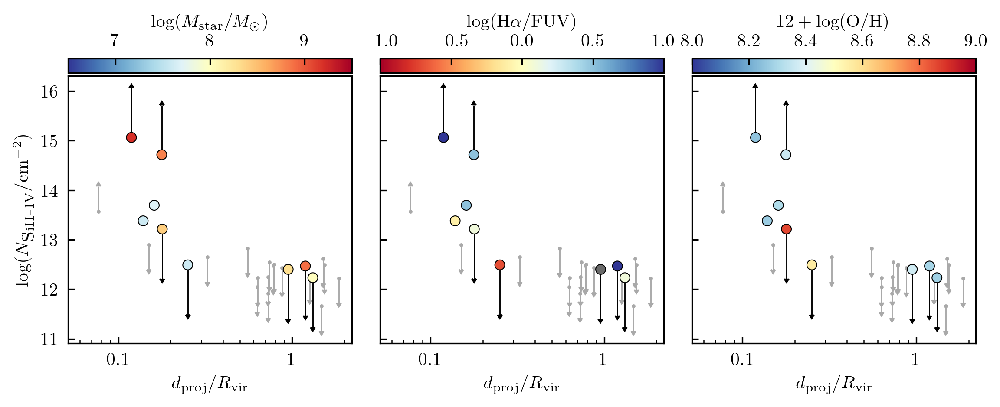

# arXiv Digest — 2026-08-18

- **Interest file used:** interests/2026.05.md (fallback — no 2026.08.md exists yet)
- **Categories pulled:** astro-ph.CO, astro-ph.EP, astro-ph.GA, astro-ph.HE, astro-ph.IM, astro-ph.SR, cs.LG, stat.ML, hep-ph
- **Papers scanned:** 520 (107 astro-ph new/cross across the six sub-categories + 413 cs.LG/stat.ML/hep-ph)
- **After first filter:** 12 candidates reviewed with full text
- **Final selected:** 10 papers across 3 tiers

---

## Tier 2 — Adjacent / useful context

### [Improved Cosmological Constraints from Morphology-Based Marked Correlation Functions](http://arxiv.org/abs/2608.15083v1)

Xu Xiao, Zhao Chen, Yu Yu et al.
**Primary category:** astro-ph.CO

The authors build marked correlation functions (MCFs) for halos by tagging each halo with its cosmic-web morphology from the NEXUS classifier — either a discrete label (knot/filament/wall) or a continuous "morphology strength" weight — and train Gaussian-process emulators of the projected MCFs across the 129-cosmology `Kun` w0waCDM simulation suite (plus a tracer-bias nuisance parameter). Running a likelihood analysis on independent `Jiutian` mock halo catalogues, the continuous strength marker combined with the standard 2PCF raises the Figure of Merit by ~8.6× and shrinks the σ8 uncertainty by ~5×, with most of the gain coming from dense knot regions; the discrete marker adds <20%. The improvement is robust to smoothing scale, separation range, and a 4.5× change in halo-mass threshold, remaining unbiased even for the lowest-mass tracers. Leave-one-out tests confirm the emulator is accurate enough that its uncertainty can be folded into the covariance.

*Figure removed (figure-file cleanup): mcmc_strength_keys.pdf*

---

### [Two domains of extended Lyman-alpha emission around galaxies: from local radiation to environmental regulation](http://arxiv.org/abs/2608.16665v1)

Daria Kozlova, Lutz Wisotzki, John Pharo et al.
**Primary category:** astro-ph.GA

Using the ultra-deep MUSE eXtremely Deep Field (reaching ~10⁻²⁰ erg cm⁻² s⁻¹ arcsec⁻²), the authors measure radial Lyα surface-brightness profiles out to >2 virial radii (~50 kpc) for 21 intrinsically faint Lyα emitters at 3<z<4 and correlate the brightness against internal (host SFR) and external (environmental density δ+1) drivers. They find a sharp change in behaviour near ~1 r_vir (~20 kpc): inside the break the emission tracks SFR and is uncorrelated with environment, while beyond it the SFR dependence vanishes and a correlation with δ+1 emerges. They further show that integrated light from undetected faint LAEs is insufficient to explain the outer signal, concluding the outer-halo Lyα arises mostly from diffuse gas regulated by the surrounding environment rather than discrete sources.

*Figure removed (figure-file cleanup): sketch_v3.pdf*

---

### [The Low-Mass Baryon Cycle in QUEST Dwarf Galaxies I: Sample definition and first results](http://arxiv.org/abs/2608.15782v1)

Ava Polzin, Hsiao-Wen Chen, Zhijie Qu et al.
**Primary category:** astro-ph.GA

QUEST Dwarfs pairs optical spectroscopy and imaging of low-mass galaxies (M⋆ ≤ 10⁹ M⊙, z ≈ 0.001–0.017) with FUV absorption spectra of bright background sources to probe their circumgalactic medium; this first release has 14 galaxies, each with ≥1 CGM sightline at <100 kpc, tripling the available inner-halo probes for field dwarfs. They find the total silicon column falls off with projected distance much faster than HI, implying chemically enriched cool gas is concentrated in the inner CGM, and infer cool-CGM metal masses within 0.3 R_vir of ≈3% and ≈16% of the metals ever produced for median log M⋆ = 7.6 and 8.6 dwarfs. Individual ions show a clear multiphase structure — low-ionization species in the inner halo, high-ionization species extending farther — and more massive dwarfs show systematically stronger metal absorption. Environment for the sample is defined against the 50 MGC and DESI DR1 catalogs.

---

### [RIOJA. Environmental Effects on Stellar Populations and Ionized Gas in a Protocluster at z=7.88](http://arxiv.org/abs/2608.16343v1)

Wataru Osone, Takuya Hashimoto, Javier Álvarez-Márquez et al.
**Primary category:** astro-ph.GA | also: astro-ph.CO

JWST/NIRCam and NIRSpec observations of 23 members of the A2744-z7p9OD protocluster at z=7.88 are used to map stellar populations, UV sizes, and ionized-gas properties as a function of global (distance to the most massive galaxy) and local (nearest-neighbor) environment. Stellar mass, recent SFR, dust attenuation, and size correlate with the global structure but not with local density, and the ionization-sensitive O32 ratio traces low-ionization gas in the core. Combined with non-detection of Lyα, an ALMA [CII]-traced neutral-gas reservoir, and evidence for high-column-density neutral hydrogen in the core, the picture is of a neutral-gas-rich protocluster core where ionizing-photon escape is currently suppressed even in an overdense region during the epoch of reionization.

---

### [Nonlinear velocity power spectrum: modeling the cosmological dependence on the Hubble constant and cold dark matter density](http://arxiv.org/abs/2608.16489v1)

Francesca Lepori, Ruth Durrer, Martin Kunz et al.
**Primary category:** astro-ph.CO

This paper presents a semi-analytic model for the peculiar-velocity power spectrum in ΛCDM for k < 1/Mpc, focusing on the dominant divergence (curl-free) part but also giving results for the vorticity contribution. Separating cosmological parameters into "evolution" (h) and "shape" (ω_cdm) categories, the model captures their dependence to better than 2.5% accuracy. A notable finding is that the velocity power spectrum becomes essentially independent of ω_cdm on nonlinear scales. A Python implementation is released publicly.

---

### [Galaxy Morphology Classification: Uncertainty Modeling and Out of Distribution Detection](http://arxiv.org/abs/2608.16654v1)

Prem Prakash, Shantanu Desai, P. K. Srijith et al.
**Primary category:** astro-ph.IM

Working on Galaxy Zoo DECaLS, the authors train a ResNet-34 under three regimes — plain cross-entropy, the distance-based IsoMaxPlus loss for out-of-distribution (OOD) detection, and IsoMaxPlus combined with Monte-Carlo Dropout for uncertainty — to make automated morphology classification aware of what it doesn't know. IsoMaxPlus replaces softmax logits with distance-to-class-prototype scores, raising OOD detection (TNR@TPR95) by ~90% over the baseline while holding ~97% accuracy across nine classes and needing no extra architecture or tuning. Adding MC Dropout further stabilizes predictions and cuts the Expected Calibration Error by ~65–73%, and misclassified/underconfident cases show higher predictive entropy and lower prototype-distance scores, giving an interpretable "trust" metric.

---

### [Addressing position anomalies in the Strong Gravitational Lensing System HS 0810+2554 through Dark Matter Subhalos](http://arxiv.org/abs/2608.15554v1)

Yuanlin Gong, Lei Wu, Qiang Yuan et al.
**Primary category:** astro-ph.CO | also: hep-ph

The authors test whether the mas-scale image-position anomalies in the two radio quads of HS 0810+2554 (VLBI) require exotic dark matter, modeling the lens as an elliptical power-law macro-lens plus a population of CDM subhalos drawn from numerical simulations and doing a joint dual-source reconstruction of all eight radio images. Subhalos below 10⁶ M⊙ shift images by less than the astrometric errors, whereas more massive subhalos naturally produce the required milliarcsecond perturbations without disturbing the global lens; adding the CDM subhalos improves the fit from χ²=60.4 (macro-lens only) to χ²=1.6. They conclude the anomalies are a sharp, testable manifestation of the CDM subhalo population and do not by themselves demand fuzzy DM or added macro-lens complexity.

---

## Tier 3 — Outside my area but notable

### [Population-Level Verification of the Black-Hole Area Law with First- and Second-Generation Black Holes](http://arxiv.org/abs/2608.16563v1)

Shao-Peng Tang, Yin-Jie Li, Yi-Zhong Fan et al.
**Primary category:** astro-ph.HE | also: gr-qc

Hawking's area theorem — that total black-hole horizon area cannot decrease — has so far been tested only on individual loud gravitational-wave events. This work performs the first population-level test by exploiting the GWTC-5 decomposition into a low-spin, stellar-collapse subpopulation and a high-spin subpopulation formed by hierarchical mergers of the former: if the high-spin black holes are merger remnants, the area law demands their horizon areas statistically exceed the summed pre-merger areas of the low-spin binaries. Using inspiral-only parameter estimation for 241 events (independent of merger–ringdown modeling), both peaks of the second-generation horizon-area distribution lie above their first-generation counterparts at 3.3σ and 2.1σ. The result both supports the area law statistically for typical catalog mergers and reinforces the stellar-collapse-vs-hierarchical classification.

*Figure removed (figure-file cleanup): fig1.pdf*

---

### [Unveiling Neutrino Nature with the Diffuse Supernova Background](http://arxiv.org/abs/2608.14785v1)

Marco Manno, Pablo Martínez-Miravé, Irene Tamborra et al.
**Primary category:** astro-ph.HE | also: hep-ph

The authors propose the diffuse supernova neutrino background (DSNB) as a new probe of whether neutrinos are Dirac or Majorana, exploiting the fact that strong magnetic fields in a subset of collapsing massive stars can trigger resonant chirality flips whose effect on the DSNB flux differs by neutrino nature — provided neutrino magnetic moments are ≳10⁻¹⁴ μ_B. A 20-year combined exposure of gadolinium-loaded Hyper-Kamiokande plus JUNO could distinguish the two cases at 90% (99%) confidence if the magnetorotational fraction of core collapses exceeds 12% (20%), independent of the neutrino mass ordering.

---

## Tier 4 — Meta-research about the field

### [A Social Network Analysis of JWST General Observer Programs: The Emergence of a Decentralized Heterarchy](http://arxiv.org/abs/2608.15883v1)

Christopher Williams
**Primary category:** astro-ph.IM

Williams builds the co-investigator network of accepted JWST General Observer programs over the telescope's first five cycles — 5,252 unique astronomers linked by 144,740 program-level connections — and applies modularity/community detection to it. Ten dominant sub-communities emerge that map onto STScI science categories, and separation along the graph's long axis tracks the physical scale of the science (AU-scale planetary vs. kpc–Gpc cosmic-structure work). While affiliation- and country-level structures are highly centralized, the investigator-level network is heterarchical and decentralized, appearing to support cross-disciplinary and cross-institutional collaboration that is broad and redundant rather than routed through a few brokers. The author draws out implications for time-allocation policy (its legacy of network structure) and for individual access strategy.
