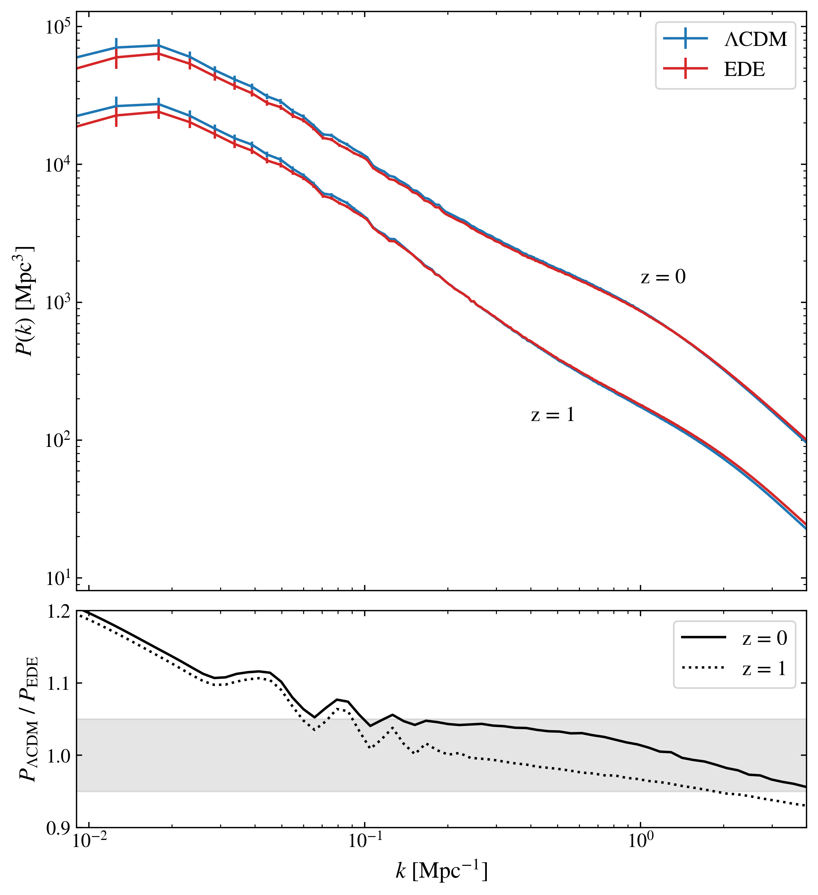
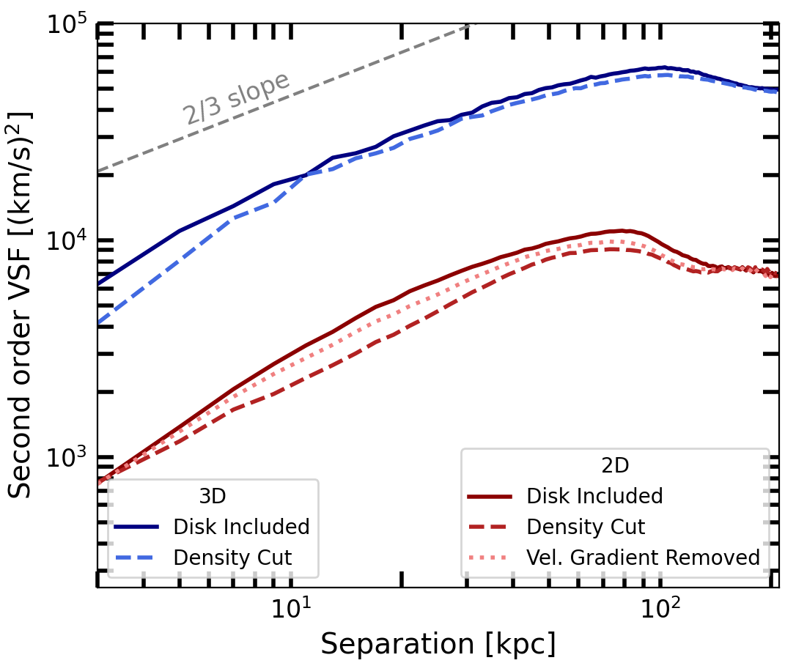

# arXiv Digest — 2026-08-19

**Interest file used:** interests/2026.05.md (fallback — no 2026.08.md exists yet)
**Categories pulled:** astro-ph.CO, astro-ph.EP, astro-ph.GA, astro-ph.HE, astro-ph.IM, astro-ph.SR, cs.LG, stat.ML, hep-ph
**Papers scanned:** 534 (106 astro-ph new/cross + 428 cs.LG/stat.ML/hep-ph)
**After first filter:** 12 candidates reviewed with full text
**Final selected:** 9 papers across 3 tiers

*Note: No Tier 1 today — this announcement contains no direct Lyman-α forest, DESI P1D/P3D/BAO, or IGM-opacity/reionization papers, so the Tier 1 section is omitted. The extras feeds (cs.LG/stat.ML/hep-ph) were dominated by generic ML with no scientific-inference angle; the only relevant hep-ph papers already appear as astro-ph cross-listings. The by-id metadata API was heavily rate-limited (429/503) and rejected the 428-id extras batch (HTTP 400), so the extras were read from the RSS announcement feed (title + abstract) instead.*

---

## Tier 2 — Adjacent / useful context

### [A stochastic forward model for the intergalactic dispersion-measure distribution of Fast Radio Bursts](http://arxiv.org/abs/2608.17658v1)

Jéferson A. S. Fortunato, Valerio Marra, Wiliam S. Hipólito-Ricaldi et al.
**Primary category:** astro-ph.CO | also: astro-ph.IM

The authors present `turboFRB`, a semi-analytic stochastic forward model for the intergalactic dispersion-measure distribution P(DM_IGM | z), building each sightline as the sum of three physical channels — a mean-preserving lognormal diffuse IGM, Poisson-sampled halo encounters through NFW gas profiles, and Poisson-sampled finite-cylinder filament encounters — coupled by a latent line-of-sight environmental variable. Only four effective parameters are calibrated against a ray-traced IllustrisTNG benchmark, after which the model matches the benchmark mean DM to the percent level with a per-redshift Jensen–Shannon divergence ≤5×10⁻³ over z = 0.5–2.5. The per-sightline channel decomposition makes explicit what closed-form PDF fits cannot: the diffuse IGM sets the body of the distribution while halos and filaments populate the high-DM tail. A closed-loop test recovers an injected H₀ within 1σ, and the forward likelihood quantifies host-excess events without invoking their astrophysical signatures.

This is the closest paper to the interest profile today: it sits squarely at the intersection of the ionized IGM, a stochastic forward model calibrated on hydrodynamical simulations, and a forward likelihood for cosmological parameter inference. The Poisson line-of-sight-encounter architecture (borrowed from weak-lensing LOS PDF sampling) and the "resolve the channels rather than assume a PDF shape" philosophy are directly transferable to forward-modelling the Lyman-α forest and to Lyα × galaxy / lensing cross-correlations.

---

### [Investigating The Effects of Early Dark Energy on Large-scale Structure Within the EDENS Suite](http://arxiv.org/abs/2608.17212v1)

Sophie Hodgson, Patrick Wells, Katrin Heitmann et al.
**Primary category:** astro-ph.CO

The EDENS (Early Dark Energy N-body Simulations) suite extends available EDE simulations in volume and resolution to test EDE as a Hubble-tension solution against large-scale-structure probes. The authors derive the halo mass function, the nonlinear matter power spectrum, and the concentration–mass relation, then populate the boxes with an HOD model to measure the galaxy correlation function and galaxy bias. They find EDE produces more massive, galaxy-rich halos, a significant difference near the BAO scale in the power spectrum, and a BAO peak shift in the correlation function — though much of the signal traces the accompanying σ₈ and n_s shifts rather than EDE dynamics per se. Simulation outputs are released via the OpenCosmo portal.

Relevant to the LSS-cosmology and simulation/emulation threads: this is a clean characterization of how an H₀-tension model imprints on the halo mass function, nonlinear P(k), and BAO — the same observables that anchor DESI-era full-shape and BAO analyses, and a useful reference for what a beyond-ΛCDM signal looks like at the field level.

---

### [Intrinsic Alignments in Redshift Space I: Symmetries](http://arxiv.org/abs/2608.17078v1)

Kazuyuki Akitsu, Shi-Fan Chen, Zvonimir Vlah
**Primary category:** astro-ph.CO

This paper develops a general formalism for the full 3D structure of galaxy-shape (tensor) statistics in redshift space, including the anisotropy imposed by the line of sight and redshift-space distortions. The authors show constructively that the redshift-space mapping yields form factors strictly polynomial in the line-of-sight angle μ, and that parity and exchange symmetries reduce scalar–tensor and tensor–tensor correlators to 3 and 9 independent form factors respectively. They build optimally-weighted estimators in a total-helicity basis and validate the machinery against halo-shape statistics in N-body simulations, detecting all channels up to total angular momentum |M| ≤ 2.

Relevant to the LSS methodology and "new physics beyond the scalar sector" threads: intrinsic alignments are both a key systematic and an emerging tensor probe of large-scale structure, and the symmetry-based selection rules and helicity-basis estimators here are the kind of clean formalism that carries over to any redshift-space tensor or higher-spin analysis.

*No figures extracted for 2608.17078 (formalism paper; the plots are technical form-factor power spectra that are not self-explanatory out of context).*

---

### [eROSITA cosmology with galaxy groups: hot gas budget out to the virial radius](http://arxiv.org/abs/2608.17735v1)

H. Khalil, A. Finoguenov, D. Eckert et al.
**Primary category:** astro-ph.GA | also: astro-ph.CO

Using eROSITA-DE (eRASS1) observations of 25 galaxy groups cross-identified with the 2MRS catalogue, the authors measure hot-gas surface-brightness, gas-mass, and gas-fraction profiles out to R₂₀₀c, finding a sub-cosmic gas fraction (f_gas,500 = 4.3%, f_gas,200 = 5.8%) that implies substantial AGN-driven gas ejection. They build aperture-covariance-corrected M_gas–M_tot and L_X–M scaling relations and compare against modern hydrodynamical suites, favouring fiducial FLAMINGO and BAHAMAS over strong-feedback variants (2.5σ–8σ tension). Feeding the measured baryon budget through the SP(k) model, they infer a 10–15% suppression of the matter power spectrum at k = 5 h/Mpc relative to dark-matter-only.

Relevant to the small-scale power-spectrum thread: baryonic-feedback suppression of P(k) on Mpc-and-smaller scales is a direct systematic for any small-scale cosmological probe, and an empirical, data-driven constraint on the suppression amplitude (rather than a simulation prior) is exactly the kind of external input needed when interpreting small-scale forest and LSS measurements.

---

### [Generative artificial intelligence for reconstructing neutron-star matter](http://arxiv.org/abs/2608.17457v1)

Julia Yu. Panteleeva, Herzallah Alharazin, Evgeny Epelbaum
**Primary category:** nucl-th | also: astro-ph.HE

The authors reconstruct the neutron-star equation of state with a denoising diffusion model designed to keep prior, physics, and data cleanly separated: it learns an inspectable, physically-motivated prior anchored to first-principles nuclear theory, while perturbative-QCD and astrophysical constraints are imposed exactly. Because the constraints are enforced rather than baked into a functional form, future measurements update the posterior by reweighting alone — no retraining or resampling. The inferred R = 12.6 km and Λ = 469 at 1.4 M_⊙ reproduce Gaussian-process and heavy-ion-informed inferences despite a far broader prior, and they find near-conformal but stiff matter disfavouring a strong first-order transition.

The application is neutron-star matter, but the method is the draw: a learned generative prior coupled to exactly-enforced physics is a template for the ill-posed inverse problems at the heart of the interest profile (SBI, normalizing flows, diffusion for cosmology). The "reweight-don't-retrain" posterior-update trick and the separation of prior/physics/data are directly relevant to forest and LSS inference where the prior is usually smuggled into a fixed parameterization.

*No figures extracted for 2608.17457 (Nature-format methods paper; the value is the inference architecture, which the text summary conveys without a plot).*

---

### [Merging Galaxy Clusters and the Search for New Physics of Dark Matter: A Review](http://arxiv.org/abs/2608.16987v1)

Rogério Monteiro-Oliveira
**Primary category:** astro-ph.CO

This review synthesizes how merging galaxy clusters — where high-velocity collisions separate the collisionless dark matter and stellar components from the collisional X-ray gas — are used to test whether dark matter is strictly collisionless or self-interacting. It traces the field from the Bullet Cluster to modern multi-probe analyses that combine gravitational lensing and X-ray mapping with N-body/hydrodynamical simulations to translate macroscopic offsets into microscopic constraints on the self-interaction cross-section, and argues for leveraging heterogeneous merger ensembles rather than individual showcase systems.

Relevant to the dark-matter thread of the profile: merging-cluster SIDM constraints are the macroscopic complement to the microscopic small-scale-structure limits (WDM/fuzzy DM/free-streaming) derived from the Lyman-α forest. A current review of where the cluster-merger bounds stand is useful context for situating forest-based DM constraints against an independent, systematically different probe.

*No figures extracted for 2608.16987 (review article; figures are reproduced from the primary literature it surveys).*

---

### [Measuring Simulated Circumgalactic Medium Turbulence with Emission-Weighted Projected Velocity Structure Functions in FOGGIE](http://arxiv.org/abs/2608.17013v1)

Helena Bouchereau, Cassandra Lochhaas, Jake S. Bennett et al.
**Primary category:** astro-ph.GA

The authors use the high-resolution cosmological zoom-in FOGGIE simulations to test velocity structure functions (VSFs) as a probe of circumgalactic-medium turbulence, focusing on the "turnover" in the VSF slope that is commonly read as the turbulence driving scale. They quantify how projection and emission-weighting bias the recovered VSF: converting the 3D VSF to an observable 2D emission-weighted VSF lowers both the normalization and the turnover location relative to the true 3D turbulence, and they characterize how disk removal, resolution, and box size affect the measurement.

Relevant to the CGM adjacent interest, viewed through the same diffuse-gas-kinematics lens as the IGM work in the profile: it is a careful "what does the observable actually measure" methods paper, quantifying the systematic gap between an intrinsic 3D statistic and its projected, emission-weighted estimator — a caution that applies broadly whenever a line-of-sight-integrated kinematic statistic is interpreted physically.

---

## Tier 3 — Outside my area but notable

### [Infrared Lines from Sterile-Neutrino Transition Magnetic Moments at JWST](http://arxiv.org/abs/2608.17679v1)

Hriditi Howlader, Alekha C. Nayak, Tripurari Srivastava
**Primary category:** astro-ph.CO

This paper repurposes publicly-available JWST/NIRSpec IFU blank-sky observations to search for infrared line signatures of radiatively-decaying sterile-neutrino dark matter. The key idea is that for a sterile-to-sterile transition N₁→N₂γ driven by a transition magnetic dipole, the emitted photon energy is set not by the full dark-matter mass but by the small mass splitting Δm — so a keV-scale sterile-neutrino state can produce an eV-scale infrared line in the JWST band. Building a χ²-based line-search against the blank-sky data toward GN-z11 and modelling the Milky Way halo decay flux, they derive projected limits reaching d_NNγ ≲ 7×10⁻¹⁴ GeV⁻¹ for 0.1 eV ≲ Δm ≲ 1 eV.

Included here for the genuinely clever, transferable idea rather than the (null) result: decoupling the observable photon energy from the total DM mass via a mass splitting opens the entire JWST spectroscopic archive as a dark-matter line-search dataset, a nice example of extracting a fundamental-physics constraint from data taken for an unrelated purpose.

---

## Tier 4 — Meta-research about the field

### [VERaiPHY -- Validation & Evaluation for Robust AI in PHYsics](http://arxiv.org/abs/2608.17724v1)

Gaia Grosso, Ramon Winterhalder, Lydia Brenner et al.
**Primary category:** hep-ph | also: astro-ph.CO, stat.ML

VERaiPHY is a PHYSTAT-programme initiative aimed at establishing statistical standards for the development, evaluation, and deployment of machine-learning methods in fundamental physics — arguing that while ML has delivered large gains in precision and efficiency, statistical validation, uncertainty quantification, and robustness assessment remain under-addressed. This opening article lays out the probabilistic, statistical, and machine-learning foundations and common notation that later domain-specific contributions in the series will assume.

Relevant as meta-research on how AI is being absorbed into the practice of physics: as the interest profile leans harder on SBI, flows, emulators, and foundation models, a community effort to define what counts as proper validation and uncertainty quantification for these tools is worth tracking — it is likely to shape referee expectations for ML-based cosmology inference.

*No figures extracted for 2608.17724 (foundations/perspective paper with no result figure).*
