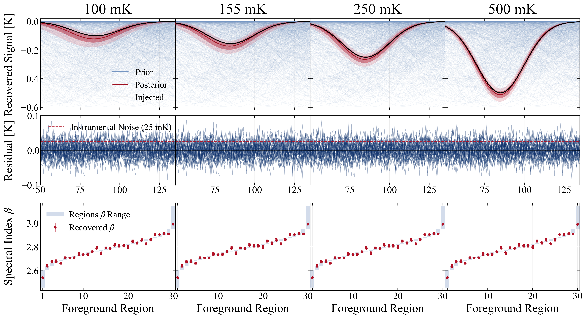
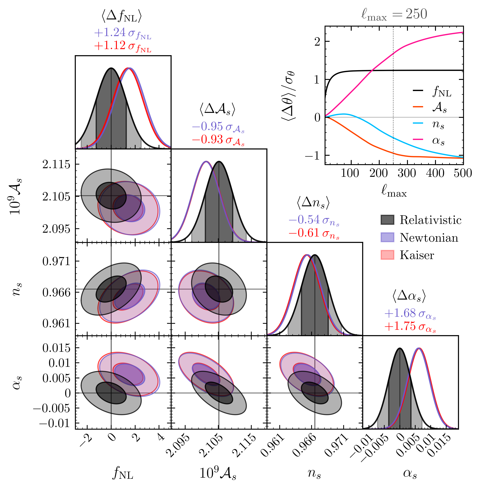
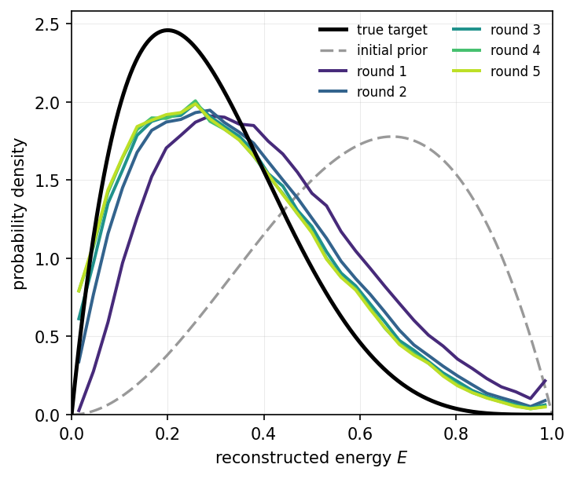
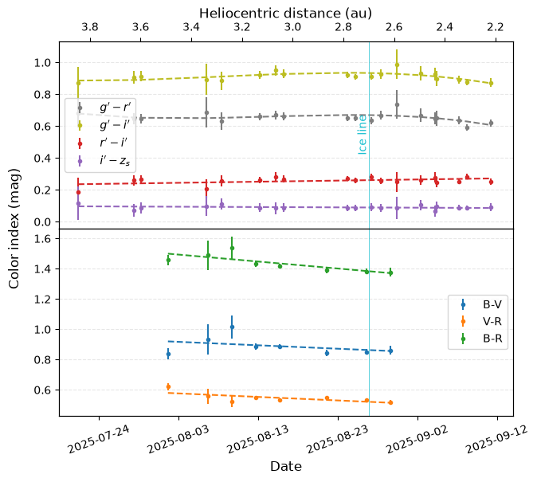
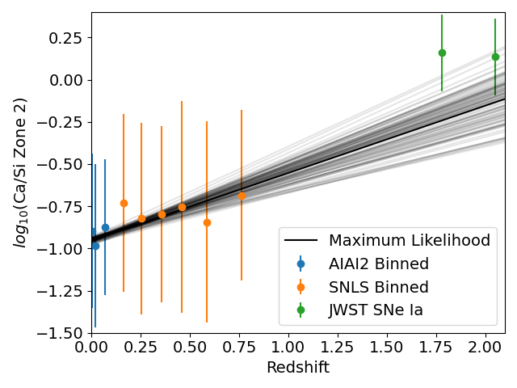

# arXiv Digest — 2026-08-20

**Interest file used:** interests/2026.05.md (fallback — no 2026.08.md exists yet)
**Categories pulled:** astro-ph.CO, astro-ph.EP, astro-ph.GA, astro-ph.HE, astro-ph.IM, astro-ph.SR, cs.LG, stat.ML, hep-ph
**Papers scanned:** 251 (66 astro-ph primary + 185 cs.LG/stat.ML/hep-ph and other cross-listed)
**After first filter:** 14 candidates reviewed with full text
**Final selected:** 12 papers across 3 tiers

*Note: No direct Lyman-α forest, IGM-opacity, or DESI-forest paper appeared in today's announcement, so Tier 1 is filled by the inference-methodology strand of the profile rather than the primary forest topic; Tier 4 is empty (nothing meta-research met the bar). Two candidates were dropped at the final stage — a repeating-FRB energy-hierarchy paper (2608.18455, too specialist) and an axion bound from the diffuse supernova neutrino background (2608.17681, bound weaker than existing limits).*

---

## Tier 1 — Highly relevant

### [Towards end-to-end Bayesian forward models in global 21-cm cosmology: surrogate modelling and marginalisation of beam uncertainty](http://arxiv.org/abs/2608.18962v1)

Jacob L. Tutt, Dominic J. Anstey, John Cumner et al. (incl. H. T. J. Bevins, a REACH/21-cm name flagged in the profile)
**Primary category:** astro-ph.CO | also: astro-ph.IM

This is the first joint Bayesian forward model for global 21-cm cosmology that propagates continuous, chromatic *beam* uncertainty — learned from electromagnetic simulations — alongside foreground and signal parameters, extending the differentiable REACH pipeline. From 500 method-of-moments beam simulations spanning a 7-D geometric/soil-permittivity space, they build a two-stage surrogate (an SVD into 400 angular basis functions, then a PCA into 100 modes), shrinking the instrumental parameterisation by a factor of ~340 while keeping antenna-temperature reconstruction error at 24.5 mK (below the 25 mK thermal-noise target), and then analytically marginalise over the linear beam coefficients. Whereas a fixed but mismatched beam produces tens-of-kelvin residuals and catastrophically biased recovery, the marginalised framework recovers 11 unseen validation beams at roughly the noise level, and as few as 100 simulations suffice to build the surrogate.

This sits directly on the profile's rising-primary focus — Bayesian/differentiable forward modelling, emulators/surrogates, and analytic nuisance marginalisation for reionization-era inference. The SVD+PCA surrogate and conjugate-Gaussian marginalisation are exactly the kind of techniques that transfer to Lyman-α/LSS pipelines, and 21-cm × forest reionization inference is a named expansion candidate.

---

### [Mapping the Information Geometry of an Unresolved Dark Matter Population using a Differentiable Strong Lensing Simulator](http://arxiv.org/abs/2608.18224v1)

Alexandre Adam
**Primary category:** astro-ph.CO | also: astro-ph.IM

Adam introduces an information-geometry framework, built on the differentiable strong-lensing simulator Caustics (PyTorch), to quantify how much information about an unresolved dark-matter subhalo population survives marginalisation over nuisance macro-lens and source models. Substructure is encoded as lensing-potential perturbations in a spectral (Laplacian) eigenbasis on an annulus around the Einstein ring (up to 5060 modes), and degeneracies are read off the Fisher matrix via a matrix-free (conjugate-gradient + autodiff) transfer function ranging from 1 (identifiable) to 0 (fully degenerate). Macro-model degeneracies stay confined to a narrow band of low azimuthal-order modes, whereas increasing source resolution drives the transfer toward zero across a broad range of scales; a new Fisher Graph Laplacian prior stabilises it at ≈0.6. Propagated into CDM vs WDM populations, the substructure coefficient power spectra are distinguishable, with power-law slopes α=2.7 (CDM) versus α=3.5 (WDM) in a resolvable window.

Two profile priorities meet here — dark matter from small-scale structure (CDM-vs-WDM discrimination via the small-scale matter power spectrum) and differentiable/Bayesian inference (a Fisher/information-geometry treatment using an autodiff simulator). The degeneracy-diagnostics machinery is directly analogous to what one needs when the source-model flexibility fights the signal in forest inference.

---

## Tier 2 — Adjacent / useful context

### [PowerFull: fast and accurate computation of the relativistic angular galaxy power spectrum including local primordial non-Gaussianity](http://arxiv.org/abs/2608.18334v1)

Gregory Lukens, Donghui Jeong
**Primary category:** astro-ph.CO | also: gr-qc

PowerFull is a relativistic extension of the Julia 2-FAST package that computes the full relativistic, wide-angle angular galaxy power spectrum $C_\ell(r,r')$ in the total-angular-momentum (TAM) basis rather than the ill-defined flat-sky Fourier picture, folding in RSD, Doppler/potential, ISW, Shapiro, lensing, and the scale-dependent bias from local $f_\mathrm{NL}$. The radial integrals are validated to sub-percent accuracy, and the Limber approximation is shown to carry a ~1–2% sign-indefinite bias precisely at the low multipoles where the relativistic signal lives. In a SPHEREx-like multi-tracer Fisher forecast, $\sigma(f_\mathrm{NL})\sim1$ is reachable, but neglecting relativistic/wide-angle effects biases the recovered $f_\mathrm{NL}$ by ≈1.2σ at $\ell_\mathrm{max}=250$ — and by >5σ for the full multi-sample vector at low magnification bias.

Squarely in the LSS/DESI + primordial-non-Gaussianity corner of the profile: a fast forward-model tool with a concretely quantified systematic on $f_\mathrm{NL}$ for the Stage-IV surveys (SPHEREx, Euclid, LSST, DESI) the owner tracks.

---

### [CosmoPyro: Gradients for Gravitational-Wave Cosmology](http://arxiv.org/abs/2608.18281v1)

Konstantin Leyde, Elena Colangeli
**Primary category:** astro-ph.CO | also: gr-qc, hep-ph

CosmoPyro is a fully differentiable (JAX/NumPyro) hierarchical Bayesian spectral-siren code that infers $H_0$ from gravitational-wave compact-binary catalogs while modelling the source-frame mass distribution non-parametrically with a one- or two-dimensional Gaussian process, sampled with gradient-based HMC/NUTS. Applied to GWTC-5, the GP-1D model gives $h=0.66^{+0.17}_{-0.20}$ and GP-2D gives $h=0.57^{+0.20}_{-0.15}$, both consistent with LVK within 1σ despite noticeably different reconstructed mass functions. On simulated O5-like data both flexible models recover the injected $H_0$ at the 1σ level, and the result is robust to marginalising versus fixing the GP hyperparameters.

The GW/$H_0$ application is outside the forest world, but the machinery — Gaussian-process population models under gradient-based hierarchical Bayesian inference — is exactly the differentiable-inference toolkit the profile is accumulating, and a clean reference implementation of GP-in-the-likelihood with HMC.

*No figures extracted for 2608.18281v1 (the headline is two $H_0$ numbers, fully conveyed in text; the posterior plot adds little at a glance).*

---

### [Safe Domain Adaptation for Physics: Overcoming Nuisances, Label Shifts, and Simulation Priors](http://arxiv.org/abs/2608.18190v1)

Ivan Kharuk
**Primary category:** cs.LG | also: astro-ph.IM

Kharuk dissects how domain adaptation (DA) fails when a physics simulation trains a network later applied to real data, using a toy air-shower benchmark with three switchable mismatches: a detector-response nuisance, a physics misspecification, and an energy-spectrum (label) shift. The key pathology: standard adversarial DA handles conditional shifts but, once source and target spectra differ, it *aligns* them and drags the reconstructed spectrum toward the simulation prior — biasing the very measurement. The proposed Adaptive Domain Adaptation reweights simulated events so the adversary acts only on the genuine physical mismatch, with an iterative variant that feeds back the predicted spectrum as an improved prior (driving Wasserstein error from 0.113 to 0.045 in the triple-mismatch case), plus a label-free model-selection rule.

The paper explicitly names redshift-distribution inference as a target and diagnoses a transferable failure mode of simulation-trained networks — directly relevant to anyone doing SBI or emulator-based inference where the quantity of interest *is* the target distribution.

---

### [Composing Flow-Matching Energies with Known Physics: Generation, OOD Detection, and Inversion on PDE Fields](http://arxiv.org/abs/2608.18004v1)

Yixuan Sun, Anirban Samaddar, Sandeep Madireddy
**Primary category:** cs.LG | also: physics.comp-ph

The authors show that parameterising a flow-matching model with a scalar potential (whose gradient is the velocity) yields an explicit, time-dependent scalar energy function read straight from the regression objective — no partition function, MCMC, or variational form. That single trained energy then serves three roles: energy-corrected generation via an Energy-based Predictor-Corrector that adds a PDE-residual physics term; out-of-distribution detection using energy as a score; and inverse problems by composing a quadratic observational likelihood into a posterior energy. On Poisson, Helmholtz, and Burgers fields the approach lowers PDE residual and spectral distance versus flow-ODE baselines, and the data energy and physics residual act as complementary OOD scores.

A concrete bridge between flow/diffusion generative models and energy-based composition — the profile's stochastic-interpolant/flow strand — with compositional physics-informed posterior sampling that maps naturally onto cosmological field generation and inverse problems.

*No figures extracted for 2608.18004v1 (the contribution is a methodological identity; the toy energy-landscape figure is illustrative rather than a key result).*

---

### [Diffuse HI emission in the circumgalactic medium of NGC891 and NGC4565 - III: azimuthal profiles](http://arxiv.org/abs/2608.19186v1)

Mary Rickel, Sanskriti Das, Nickolas M. Pingel et al.
**Primary category:** astro-ph.GA

This third paper in a series completes a 360° azimuthal view of the inner neutral circumgalactic medium of two nearby edge-on spirals, adding four off-axis GBT deep-stare pointings and reaching a 5σ column-density sensitivity of 1.1–1.2×10¹⁷ cm⁻² over 20 km/s. By subtracting WSRT/HALOGAS interferometric maps (with channel-wise brightness-temperature scaling and velocity-edge corrections) they isolate true CGM emission from disk contamination, finding that 30–38% (NGC 891) and 18–28% (NGC 4565) of GBT emission is genuine CGM, with 4–6× more HI along the off-axes than the major axis. This nullifies the common assumption of azimuthal symmetry and revises the inner-CGM HI mass upward by ~2×, with the gas showing lagged co-rotation with the disk.

The CGM is a flagged adjacent interest, and the core problem — separating diffuse low-N(HI) circumgalactic gas in the 10¹⁶–10¹⁸·⁵ cm⁻² regime — is the same column-density window probed by Lyman-α absorption, making this a useful emission-side complement to the absorption view.

---

### [The progenitors of $z\gtrsim10$ JWST galaxies in the COLIBRE simulations](http://arxiv.org/abs/2608.19007v1)

Evgenii Chaikin, Andrew Pontzen, Carlos S. Frenk et al.
**Primary category:** astro-ph.GA

Chaikin et al. search the COLIBRE cosmological hydrodynamics simulations for counterparts of six spectroscopically confirmed luminous $z>10$ JWST galaxies (GN-z11 through MoM-z14), matching each in stellar mass and tracing main-progenitor branches back to $z\approx25$. Despite no tuning to $z>0$ data, COLIBRE reproduces the observed stellar masses, compact sizes, SFRs, ages, gas content, and sub-solar metallicities; matched galaxies grow from ~10⁶ to ~10⁹ M⊙ in only ~300 Myr in haloes reaching ~10¹¹ M⊙. The two discrepancies — underpredicted UV magnitudes and overpredicted dust masses — are both attributed to the uncertain high-z dust grain-growth rate, possibly with a top-heavy IMF. The headline: standard ΛCDM plus standard galaxy-formation physics naturally explains even the most extreme early-Universe JWST galaxies.

This is a direct test of whether the luminous $z>10$ population demands exotic physics or modified cosmology — it concludes it does not, which is exactly the kind of foundational ΛCDM result that shapes how one reads early-Universe and reionization-source claims.

---

### [Dipolar power asymmetry in wide-angle correlations of galaxy density, velocity and ellipticity](http://arxiv.org/abs/2608.19039v1)

Yusuke Mikura, Teppei Okumura, Ippei Obata, Maresuke Shiraishi
**Primary category:** astro-ph.CO | also: hep-ph

The authors develop a full-sky (beyond plane-parallel) formalism for the two-point correlations of galaxy density, peculiar velocity, and intrinsic-alignment ellipticity in the presence of a position-dependent dipolar modulation of the primordial power spectrum — the CMB hemispherical-asymmetry-type anomaly. Using a spin-weighted tripolar spherical-harmonic decomposition that treats the two lines of sight separately, they show the modulation contribution scales as $\cos\theta_d$ with the preferred direction, and that the plane-parallel approximation becomes unreliable for opening angles $\Theta\gtrsim30^\circ$. They conclude that wide-angle treatment is essential for testing dipolar asymmetry with DESI/Euclid/SPHEREx.

Relevant to the LSS-anomaly and primordial-physics threads: a wide-angle correlation-function forward model tying an inflationary statistical-isotropy violation to galaxy surveys. The connection is formalism rather than data analysis, so it reads as a methods reference rather than a result to act on.

*No figures extracted for 2608.19039v1 (the operative result — plane-parallel breakdown beyond ~30° — is stated quantitatively in text; the comparison figure is a technical validation).*

---

### [Inferring the Dark from the Observable: Estimating Halo Masses Using Galaxy Properties](http://arxiv.org/abs/2608.19154v1)

Alice Chen, Syeda Lammim Ahad
**Primary category:** astro-ph.GA | also: astro-ph.CO

Using TNG100 (1988 field and 215 group+cluster haloes), the authors test how well observable galaxy properties predict host halo/subhalo mass, comparing random forest, ordinary least squares, and PySR symbolic regression. Both random forest and symbolic regression rank gas mass as the most important predictor, followed by stellar mass, colour, and r-band magnitude, while formation redshift and half-stellar radius matter little. Multi-observable models clearly beat the standard stellar-to-halo-mass relation — for field centrals R² rises from 0.64 to 0.84–0.88, and symbolic regression reaches R²=0.97 for group+cluster haloes — though a TNG-trained model underpredicts masses on a real cluster sample, attributed to simulation–observation offsets.

The direct hook is interpretable ML — symbolic regression (PySR) and random-forest feature importance are named toolkit items in the profile — applied to inferring a "dark" quantity from survey observables; the galaxy–halo-connection science itself is only loosely connected to the forest program.

*No figures extracted for 2608.19154v1 (the headline R² gains are given as numbers in text; the summary bar chart adds little beyond them).*

---

## Tier 3 — Outside my area but notable

### [The Inbound Gas and Dust Evolution of Interstellar Comet 3I/ATLAS from Optical Spectroscopy and Multi-band Photometry](http://arxiv.org/abs/2608.18371v1)

Toni Santana-Ros, Alexey Sergeyev, Oleksandra Ivanova et al.
**Primary category:** astro-ph.EP | also: astro-ph.GA

A two-month (2025 July–September) homogeneous photometric and spectroscopic campaign monitored interstellar comet 3I/ATLAS on its inbound pre-perihelion leg using MuSCAT3/4, Maidanak, and SALT/NOT. The coma shows a stable red colour ($g'-i'=0.909\pm0.007$) with no strong secular variation, a persistent sunward jet from a high-latitude active region, and a secure CN detection with C₂/C₃ upper limits placing 3I in the carbon-chain-depleted class; light-scattering models favour a ~90% organics / 10% pyroxene aggregate mix. The characterisation points to formation in a distinct protoplanetary environment while remaining volatile-rich but carbon-chain-poor.

Only the third confirmed interstellar object ever seen — any well-characterised compositional record of pristine material from another star system is worth a scientist's glance, even if this particular analysis is a solid incremental confirmation rather than a single surprising result.

---

### [High-Redshift Type Ia Supernovae Exhibit Enhanced Calcium Abundances](http://arxiv.org/abs/2608.18342v1)

Xingzhuo Chen, Ulisses Braga-Neto, Lifan Wang
**Primary category:** astro-ph.HE

An AI-assisted spectral inversion method (CNNs trained on TARDIS radiative-transfer spectra) is used to infer zone-resolved ejecta abundances for 201 SNLS Type Ia supernovae plus two JWST-observed gravitationally lensed SNe Ia, extending abundance analysis to $z=2.05$. The authors report a positive correlation between calcium abundance and redshift, with the Ca/Si ratio rising by ~0.5–0.8 dex from $z=0$ to $z=2$ — far exceeding the ~0.1–0.2 dex predicted by nucleosynthesis models that vary only progenitor metallicity. They argue high-$z$ SNe Ia may have different progenitors or explosion mechanisms.

If robust, cosmic evolution of SN Ia explosion physics would be a genuinely notable systematic for the standard-candle distance ladder — but the result rests on a novel, hard-to-validate ML inversion applied to low-S/N high-$z$ spectra plus only two $z>1.7$ anchors, so it belongs here as a surprising claim to watch with skepticism rather than an established result.

