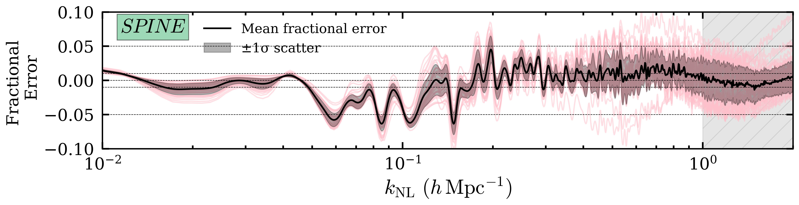

# arXiv Digest — 2026-08-28

- **Interest file used:** interests/2026.05.md (fallback — no 2026.08.md exists yet)
- **Categories pulled:** astro-ph.CO, astro-ph.EP, astro-ph.GA, astro-ph.HE, astro-ph.IM, astro-ph.SR, cs.LG, stat.ML, hep-ph
- **Papers scanned:** 273 (81 astro-ph new/cross + 192 in the cs.LG / stat.ML / hep-ph feeds, incl. cross-lists)
- **After first filter:** 15 candidates reviewed with full text
- **Final selected:** 8 papers across 2 tiers

---

## Tier 1 — Highly relevant

### [Cross-simulator transfer with foundation model summaries: Towards robust SKA-era reionization inference](http://arxiv.org/abs/2608.26354v1)

Yannic Pietschke, Caroline Heneka, Ayodele Ore et al.
**Primary category:** astro-ph.CO | also: cs.LG

The authors test whether a self-supervised Vision Transformer can produce summary statistics for 21cm reionization inference that survive a change of both simulator and instrument. SKATR — a ViT pretrained label-free with a Joint Embedding Predictive Architecture (JEPA) on 67k cheap semi-numerical 21cmFAST lightcones — is frozen and reused as an encoder feeding an ensemble of conditional flow-matching posterior estimators on hydrodynamical + radiative-transfer Loreli II lightcones it has never seen. On noiseless data it reaches mean R²=0.98 across five astrophysical parameters (vs 0.96 for a fully supervised in-domain ViT) with the tightest, best-calibrated posteriors, and it matches the full-budget supervised baseline using 2.6× fewer expensive target simulations (~1.6M CPU-h saved). Under realistic SKA AA* thermal noise plus foreground-wedge removal — a zero-shot double domain shift — the frozen encoder retains 96% of its accuracy and is the only pipeline that stays simultaneously accurate, informative, and calibrated (TARP/SBC).

---

### [SPINE: Symbolic Models to Predict the Evolution of the ΛCDM Nonlinear Power Spectrum](http://arxiv.org/abs/2608.26276v1)

Manvi Chauhan, Daniel J. Farrow, Ariel G. Sánchez et al.
**Primary category:** astro-ph.CO

SPINE and SPINEX are analytic emulators for the z=0 nonlinear matter power spectrum, derived by symbolic regression (genetic programming via PySR) from the ΛCDM Quijote Latin-hypercube simulations over 0.01 < k < 2 h/Mpc. Building on the Peacock–Dodds mapping, they express the dewiggled nonlinear P(k) as closed-form equations of the linear spectrum plus a handful of cosmological parameters, the two models differing in parameterisation (SPINEX uses h-independent "physical" parameters). They achieve sub-5% mean absolute percentage error in the majority of cases across Planck-like, fiducial, and broad Latin-hypercube cosmologies, remain competitive with numerical emulators, and — being closed-form — are interpretable and better-behaved under extrapolation. The authors flag galaxy bias and redshift-space distortions as the next extensions toward survey application.

---

## Tier 2 — Adjacent / useful context

### [ELUCID-DESI II. Revealing dark matter mass, tidal, and velocity (MTV) fields using galaxy group phase information](http://arxiv.org/abs/2608.26668v1)

Qingyang Li, Xiaohu Yang, Wensheng Hong et al.
**Primary category:** astro-ph.CO | also: astro-ph.GA

The paper introduces a method to reconstruct the cosmic mass, tidal, and velocity (MTV) fields over 0 < z < 0.6 from the phase-space information of galaxy groups, designed for spectroscopic surveys such as the DESI Bright Galaxy Survey. Rather than an explicit theoretical bias correction, it uses a simulation-calibrated statistical mapping between groups and the underlying dark-matter density field, cutting a major systematic. Tested on DESI-like BGS mocks with a full set of selection effects, the reconstructed velocities are unbiased with ~120 km/s residual dispersion; iteratively applying this velocity field to correct the Kaiser (RSD) effect then recovers the tidal and mass-density fields, with results stable against grid resolution.

*Figure removed (figure-file cleanup): velocity_field_reconstruction.pdf*

---

### [Assembly bias from nuisance to probe II: Salvaging linear clustering from DESI and SDSS data](http://arxiv.org/abs/2608.26262v1)

Nelson Padilla, Dante Paz, Iván Lacerna
**Primary category:** astro-ph.CO | also: astro-ph.GA

This work asks whether "compensated" galactic-conformity statistics can expose the linear matter correlation-function shape in DESI BGS and SDSS MGS. By combining correlations of related red/blue populations, shared nonlinear clustering is suppressed while a differential large-scale response survives. In DESI the compensated conformity signals track the linear-matter template substantially further into the nonlinear regime than ordinary colour-selected clustering — strongest for central-primary, dense samples — and the behaviour is reproduced qualitatively, though with model-dependent amplitudes, by MTNG, FLAMINGO, and MDPL2-SAG. The authors caution that surviving nonlinear contamination must be calibrated before precision cosmological use.

---

### [Derivative hierarchy as the origin of kernel-dependent trends in Gaussian process reconstructions of the Hubble parameter](http://arxiv.org/abs/2608.26774v1)

Afaq Maqsood
**Primary category:** astro-ph.CO

A model-independent Gaussian-process reconstruction of H(z) from 32 cosmic-chronometer measurements, examining how the covariance kernel's smoothness controls the inferred H0. Across a differentiability hierarchy (Matérn 3/2 → 5/2 → 7/2 → 9/2 → squared exponential), increasing kernel smoothness monotonically lowers the reconstructed H0 and shrinks its uncertainty, effectively interpolating between SH0ES-like and Planck-like values with no cosmological model assumed. The ordering persists when DESI DR2 BAO are added and survives jackknife resampling, but near-degenerate marginal likelihood and LOO-CV show no decisive Bayesian preference for any kernel — so the effect is prior sensitivity, not bias against a known truth.

---

### [Approximating the peculiar velocity distribution of dark matter halos with Tsallis statistics](http://arxiv.org/abs/2608.26572v1)

Jun Pan, Ming Li
**Primary category:** astro-ph.CO | also: cond-mat.stat-mech

The authors fit the one-point peculiar-velocity distribution of dark-matter halos from large N-body simulations with a two-parameter Tsallis (non-extensive statistics) model, accurate to better than 5% for |v| ≲ 1000 km/s at z ≤ 2. The distribution becomes increasingly non-Gaussian toward z=0; the invariant index κ0 (measuring departure from equilibrium) and characteristic velocity depend only weakly on halo mass, with low-mass halos slightly more non-Gaussian. Within a superstatistics / generalized Gram-Charlier framework they show the halo velocity PDF is formally a superposition of Tsallis functions whose zeroth-order term already suffices, and note the fitted parameters as candidate cosmological probes.

---

### [Active Diffusion-Based Inference for Ill-Posed Inverse Problems under Incomplete Priors](http://arxiv.org/abs/2608.27080v1)

Jitao Xu, Nobuo Sato, Yaohang Li
**Primary category:** stat.ML | also: cs.LG

This proposes an "active" diffusion-model solver for ill-posed inverse problems when the training prior is misspecified — specifically when the true parameters lie outside the initial training bounds. A diffusion model learns the mapping between parameter and observable space, and by iteratively detecting and correcting model misspecification through posterior uncertainty, it discovers and relearns the correct region of parameter space, providing a principled Bayesian justification for adaptive domain augmentation. It is demonstrated on a toy inverse problem with infinitely many solutions and on parameterising quantum correlation functions in a QCD analysis of nucleon structure.

---

### [Barren but not Empty: The Impact of Void Environments on Galaxy and Halo Populations](http://arxiv.org/abs/2608.26256v1)

Anita M. Schiller, Benjamin A. Seidel, Rhea-Silvia Remus et al.
**Primary category:** astro-ph.GA | also: astro-ph.CO

Using the Magneticum hydrodynamical simulation suite, the authors quantify how void environments reshape halo and galaxy populations, introducing void halo mass functions (VHMFs) as a function of void-centric distance. Halos in voids are systematically less massive than field halos, a discrepancy that widens with cosmic time as voids grow more underdense (the populations are similar at cosmic dawn), and the only void property that matters is the core underdensity. Despite lower total stellar mass, void galaxies follow the same stellar-mass–halo-mass relation and star-forming main sequence as elsewhere — star formation proceeds "conventionally" in voids, consistent with recent observations.
