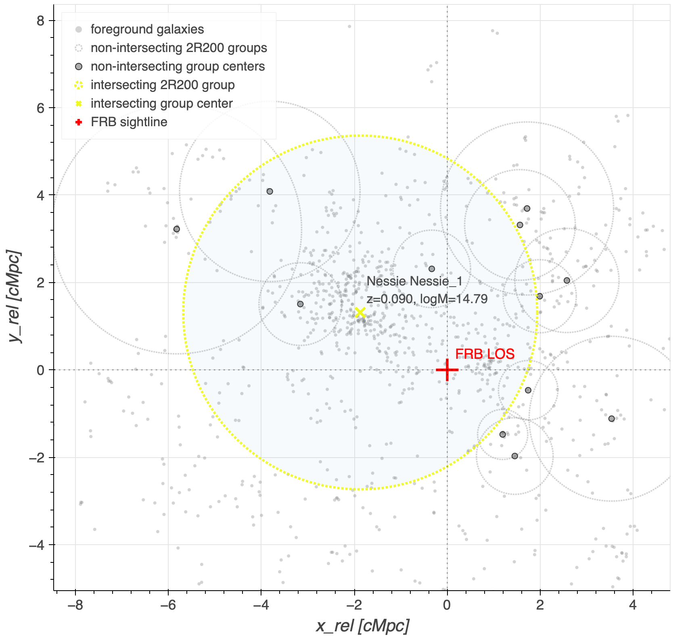

# arXiv Digest — 2026-08-31

- **Interest file used:** interests/2026.05.md (fallback — no 2026.08.md exists yet)
- **Categories pulled:** astro-ph.CO, astro-ph.EP, astro-ph.GA, astro-ph.HE, astro-ph.IM, astro-ph.SR, cs.LG, stat.ML, hep-ph
- **Papers scanned:** 243 (82 astro-ph new/cross + 161 cs.LG/stat.ML/hep-ph and other cross-lists)
- **After first filter:** 18 candidates reviewed with full text
- **Final selected:** 11 papers across 4 tiers

---

## Tier 1 — Highly relevant

### [A Unified Tracer Analysis of DESI DR2 Baryon Acoustic Oscillations](https://arxiv.org/abs/2608.27830)

N. Sanders, H. Seo, M. Rashkovetskyi et al.
**Primary category:** astro-ph.CO

This paper combines all overlapping DESI DR2 galaxy tracers over $0.8<z<1.6$ into a single "unified" catalog by weighting each galaxy by its linear bias, which folds in the auto- and cross-tracer information ignored in the baseline analysis and avoids double-counting the same cosmic volume between QSOs and other tracers. Adding redshift-dependent FKP weights and a redshift-dependent bias for reconstruction, they find the unified tracer is highly consistent with the DR2 baseline while marginally improving BAO precision (~3% aggregate gain over $0.8<z<1.6$) and enabling flexible redshift rebinning. Crucially, the finer rebinning shows no missed feature in the expansion history between the baseline redshift points, and the dynamical dark-energy constraints ($w_0$–$w_a$ from BAO+CMB+DESY5) reproduce DESI's preference for an evolving equation of state. They also find no evidence of tracer-dependent systematics.

---

### [Discovering Substellar Dark Matter Halos with Astrometric Weak Lensing of Multiply Imaged Quasars](https://arxiv.org/abs/2608.27557)

Ken Van Tilburg, David E. Kaplan
**Primary category:** astro-ph.CO | also: hep-ph

The authors propose time-domain astrometric weak lensing of multiply imaged quasars as a probe of dark-matter halos down to $10^{-6}\,M_\odot$ and sizes of 0.01–1 pc — 12 to 14 orders of magnitude below the smallest structures detected to date. Microhalos crossing each macro-image's sightline produce stochastic centroid motion with a calculable red power spectrum, and halos whose crossing time exceeds the survey produce a relative angular acceleration (~$10^{-2}\,\mu$as yr$^{-2}$) between image pairs. Forecasting ten-year, 300-epoch campaigns with extended-path intensity correlation on B1422+231 ($0.1\,\mu$as/epoch) and the cluster-lensed triple SDSS J1029+2623 ($1\,\mu$as), they reach the fiducial ΛCDM microhalo population, with a positive detection raising universal DM-particle-mass bounds to $\gtrsim400$ keV (fermions) / $\gtrsim10^{-12}$ eV (bosons) and constraining the running of the primordial spectral tilt over 15–20 e-folds.

---

## Tier 2 — Adjacent / useful context

### [Learning the averaged history of an inhomogeneous universe from its present day density field](https://arxiv.org/abs/2608.27962)

Jonas Broe Bendtsen, Sofie Marie Koksbang
**Primary category:** astro-ph.CO

Using an implementation of the simplified silent-universe framework, the authors generate 92,610 relativistic simulations spanning a range of initial conditions and averaged cosmological parameters, then train a CNN to predict averaged matter, cosmological-constant, curvature, and kinematical-backreaction density parameters plus the Hubble parameter — at both initial and present time — directly from the present-day matter density field. The network reaches $R^2>0.9$ for all predicted quantities. The simplified framework precludes direct application to real data, but it is a clean proof-of-principle that averaged cosmological history, including backreaction, is encoded in the late-time density field and extractable by ML.

---

### [Fast and efficient nested sampling with BEST](https://arxiv.org/abs/2608.28514)

Andreas Nygaard
**Primary category:** astro-ph.IM | also: astro-ph.CO

BEST is a new nested-sampling implementation written entirely in TensorFlow for XLA compilation on CPU/GPU, combining clustering and slice sampling with the ability to update several live points simultaneously. Because batching breaks nested sampling's strict likelihood ordering, the author introduces sorting and history-based corrections to control the resulting evidence bias, finding $m/N_{\rm live}\lesssim0.1$ a useful regime. On a 27-dimensional cosmological likelihood emulator, batched live-point updates substantially cut wall-clock time while staying consistent with sequential sampling.

*Figure removed (figure-file cleanup): cosmo.pdf*

---

### [PIFFLE: Characterizing the Foreground Contributions from 4 Decades in Halo Mass to the FRB20230907D Dispersion Measure](https://arxiv.org/abs/2608.28374)

Qi Guo, Khee-Gan Lee, Sunil Simha et al.
**Primary category:** astro-ph.CO

FRB20230907D, at $z=0.464$, has an observed dispersion measure of 1031 pc cm$^{-3}$, well above the Macquart relation, implying a large foreground excess. Combining Subaru/PFS and SDSS spectroscopy, group catalogs, Rubin/LSST imaging, and eROSITA X-ray data, the authors run a friends-of-friends search and identify a massive foreground system at $z\simeq0.09$ ($M_{200}\simeq5.2\times10^{14}\,M_\odot$) plus a nearer group, estimating observer-frame contributions of $150^{+110}_{-70}$ and $80^{+60}_{-40}$ pc cm$^{-3}$ under a modified-NFW gas profile. Together with the Milky Way, diffuse IGM, Virgo, M49, and host contributions, the foreground structures account for the DM excess within uncertainties.

---

### [Near-Infrared Spectroscopy of Low-Redshift Palomar-Green Quasars and Composite Spectra](https://arxiv.org/abs/2608.27773)

Amy Cavanaugh, Michael Brotherton, Jacob McLane et al.
**Primary category:** astro-ph.GA

The authors present NIR spectra of all 87 PG quasars at $z<0.5$ observed with the APO 3.5-m TripleSpec, and build a high-S/N NIR composite quasar spectrum spanning rest-frame ~8800–22000 Å, characterizing its continuum and emission-line properties. They further construct composites binned by luminosity and Eddington ratio, finding more luminous composites grow redder at long wavelengths, consistent with relatively stronger hot-dust emission.

---

### [Measuring Extragalactic Microlens Masses and Motions in Strongly Lensed Quasar Systems with Intensity Interferometry](https://arxiv.org/abs/2608.27577)

Abigail Moran, Ken Van Tilburg
**Primary category:** astro-ph.GA | also: astro-ph.CO, astro-ph.IM

The companion paper to the substellar-DM proposal above: it shows that time-resolved intensity interferometry of strongly lensed quasars, combined with flux-ratio photometry, can break the source-size / microlens-mass / transverse-velocity degeneracies of conventional light-curve microlensing. Using B1422+231 and a next-generation interferometer (~800 m² collecting area, $R\sim20{,}000$, few-ps timing), they forecast $\sim4\%$ (single-epoch) to $\lesssim1\%$ (33-epoch) precision on the accretion-disk size and order-unity mass measurements for individual stellar-mass microlenses, plus resolved proper motions and $\mu$as yr$^{-2}$ light-centroid acceleration sensitivity.

---

### [Euclidean Fourier Neural Operators](https://arxiv.org/abs/2608.28425)

Nathanael Bosch, Niklas Frederik Schmitz, Michael F. Herbst
**Primary category:** cs.LG | also: cond-mat.mtrl-sci, physics.comp-ph

Standard Fourier neural operators (FNOs) are grid-resolution independent but not domain independent: their spectral weights are indexed by integer Fourier mode numbers, so applying a trained FNO on a different-sized/shaped periodic domain silently changes the operator it represents. The authors propose Euclidean FNOs (EFNOs), which parameterize the spectral kernel as a continuous function of the physical wavevector, allowing a single trained operator to act consistently across periodic domains of varying shape and size, demonstrated on a heat equation and on learning exchange-correlation potentials across crystal structures.

---

## Tier 3 — Outside my area but notable

### [A first-principles binary neutron star merger model of GW170817, GRB170817A, and AT2017gfo](https://arxiv.org/abs/2608.27555)

Kenta Kiuchi, Sho Fujibayashi, Kota Hayashi et al.
**Primary category:** astro-ph.HE | also: gr-qc

The authors present an end-to-end, first-principles simulation of the GW170817 event: a general-relativistic magnetohydrodynamics neutrino-radiation-transfer merger simulation, followed by nucleosynthesis and photon radiative transfer to generate kilonova light curves. They show that a large-scale dynamo simultaneously produces a relativistic jet with isotropic-equivalent luminosity $\sim10^{51}$ erg s$^{-1}$ and $\approx0.08\,M_\odot$ of neutron-rich ejecta, jointly reproducing the GRB170817A afterglow and the AT2017gfo kilonova. This is a unified, physically self-consistent framework spanning the gravitational-wave, gamma-ray, and kilonova channels of a landmark multimessenger event.

*Figure removed (figure-file cleanup): BNS_GRB170817A_Afterglow-crop.pdf*

---

### [Formation of black hole stars via star–black hole collisions](https://arxiv.org/abs/2608.27596)

Yanlong Shi, Qingru Hu, Zhenghao Xu et al.
**Primary category:** astro-ph.HE | also: astro-ph.GA, astro-ph.SR

Combining semi-analytic models, 3D hydrodynamical simulations, and 1D MESA stellar evolution, the authors study collisions between stellar-mass black holes and a $100\,M_\odot$ main-sequence star in dense environments (globular clusters, AGN disks). They find gas drag retains the black hole within the envelope below a critical impact velocity, and for $M_\bullet\lesssim0.2\,M_\star$ the collision forms a "black hole star" (BH*): a quasi-hydrostatic extended envelope surrounding an embedded BH that thermally relaxes without runaway expansion. They discuss implications for gravitational-wave binary assembly within stellar envelopes, rapid BH growth via repeated collisions, and possible relevance to JWST's "little red dots."

*Figure removed (figure-file cleanup): analytic_10_grid.pdf*

---

## Tier 4 — Meta-research about the field

### [Future of Artificial Intelligence for Science in Japan 2024 Community Report](https://arxiv.org/abs/2608.27807)

Yoshitaka Itow, Jia Liu, Hirokazu Maesaka et al.
**Primary category:** hep-ph | also: astro-ph.IM, hep-ex, physics.acc-ph

This white paper summarizes scientific challenges and AI/ML research opportunities identified through the FAIRS Japan 2024 unconference across three physics domains — accelerator physics, cosmology/astrophysics, and neutrino physics. For cosmology and astrophysics specifically, it lays out four priority areas: optimal (simulation-based and field-level) reconstruction and inference, fast differentiable forward modeling and surrogate simulation, calibration/domain-adaptation/uncertainty propagation, and anomaly detection — with interpretability, generalization across simulation suites, and survey-scale scalability as first-class constraints.
