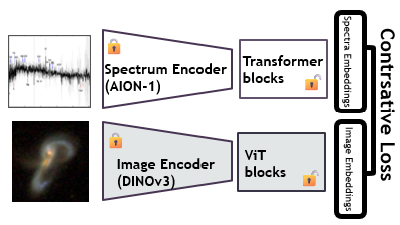
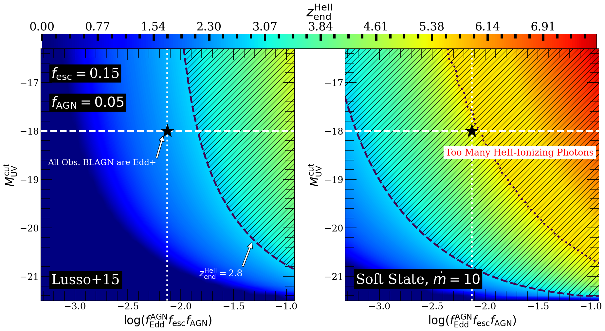

# arXiv Digest — 2026-09-01

**Interest file used:** interests/2026.05.md (fallback — no 2026.09.md exists yet)
**Categories pulled:** astro-ph.CO, astro-ph.EP, astro-ph.GA, astro-ph.HE, astro-ph.IM, astro-ph.SR, cs.LG, stat.ML, hep-ph
**Papers scanned:** 500 (121 astro-ph new/cross + 379 cs.LG/stat.ML/hep-ph and other cross-lists)
**After first filter:** 11 candidates reviewed with full text
**Final selected:** 10 papers across 3 tiers

*Note: The combined announcement hit the 500-result ceiling. Because the astro-ph sub-categories are queried first, all astro-ph new/cross papers were captured; the truncation fell only on the tail of the pure-ML (cs.LG/stat.ML) feed, so some non-astronomy ML preprints were not seen. There were no Lyman-α forest, DESI P1D/BAO-forest, or H I reionization-measurement papers in today's announcement — the closest hits are in reionization modelling, foundation models, and DESI-era LSS. Tier 3 is omitted (nothing off-area cleared the bar).*

---

## Tier 1 — Highly relevant

### [A consistent, physical, and analytical model for CMB observables of reionisation I. Derivation, constraining power, and detectability of the auto-spectra](http://arxiv.org/abs/2608.30766v1)

Adélie Gorce
**Primary category:** astro-ph.CO

Presents a fast, physically-parameterised analytical model for the three main CMB imprints of the Epoch of Reionisation — spatial fluctuations of the Thomson optical depth ($C_\ell^{\tau\tau}$), the patchy kinetic Sunyaev-Zel'dovich effect ($C_\ell^{\rm kSZ}$), and the scattering/screening $B$-modes — all tied to a common set of physical reionisation parameters (typical ionised-bubble size, duration) and calibrated on high-resolution hydrodynamical simulations. Unlike prior analytical treatments, the shared physical basis lets the three observables be modelled and analysed jointly. The paper shows that $C_\ell^{\tau\tau}$ and $C_\ell^{BB}$ are within reach of CMB-S4-like and CMB-HD-like experiments respectively, and demonstrates the complementarity of the three probes for pinning down reionisation history and morphology. The code is released as the `preion` Python package.

Reionisation and the IGM are a primary focus of the library; this is a directly usable, code-backed framework for extracting reionisation history and morphology from CMB data — and, as the author notes, in combination with the high-redshift 21 cm signal — which sits squarely in the reionization-observables core of the interest profile.

### [DINOspec: Efficient Multimodal Alignment of Vision and Spectral Foundation Models for Astronomy](http://arxiv.org/abs/2608.30503v1)

Erica Lastufka, Mariia Drozdova, Daniel Schaerer et al.
**Primary category:** astro-ph.IM

Introduces DINOspec, a framework that aligns a frozen DINOv3 image encoder with a pre-trained AION-1 spectral tokenizer using only lightweight adapters and contrastive learning on ~20k paired galaxy images and spectra — i.e., composing two independently-trained foundation models without retraining either encoder. Training at most 21M parameters, it improves galaxy morphology classification (F1 0.72→0.78) and spectral classification (0.70→0.74), while spectroscopic redshift prediction stays unchanged (R²≈0.9). The results reveal asymmetric transfer between separately-learned representations and show that scientific foundation models can be stitched together cheaply via representation alignment.

Astronomical foundation models — and AION-1 specifically, the single newest item in the library — are a stated rising-primary focus. This is exactly the "how do I reuse and combine spectral + image foundation models on survey data" question, answered with a cheap, practical recipe.

---

## Tier 2 — Adjacent / useful context

### [SPT-3G D1: Quadratic-Estimator CMB Lensing Reconstruction and Cosmology](http://arxiv.org/abs/2608.31136v1)

Y. Omori, W. L. K. Wu, Y. Nakato et al.
**Primary category:** astro-ph.CO

Reconstructs the CMB lensing potential from the 1500 deg² SPT-3G Main field (2019–2020) with a quadratic estimator jointly using $T$, $E$ and $B$, delivering the highest signal-to-noise-per-mode lensing measurement to date (polarisation-dominated for $L\lesssim600$). From SPT-3G lensing alone they measure $\sigma_8\Omega_{\rm m}^{0.25}=0.6046\pm0.0096$. Combining with primary CMB and DESI DR2 BAO gives $\sum m_\nu<0.072$ eV (95% C.L.); the improved agreement with DESI DR2 both relaxes that bound and reduces the ~2σ preferences for nonzero curvature and for $(w_0,w_a)$ departures from ΛCDM, while combining with DES Y3 3×2pt yields $S_8=0.811\pm0.011$.

A precision LSS result built on DESI DR2 BAO (one of the strongest recency signals in the library) that lands a neutrino-mass constraint and structure-growth amplitudes — foundational numbers that directly shape how forest/LSS parameter constraints ($\sigma_8$, $\sum m_\nu$, $w_0w_a$) are interpreted.

### [Measuring peculiar velocity and tomographic redshift dipole with DESI DR1 catalogs](http://arxiv.org/abs/2608.30914v1)

Yi-Wen Wu, Jun-Qing Xia
**Primary category:** astro-ph.CO

Determines the kinematic dipole using the redshift-dipole method on DESI DR1, exploiting the Doppler modulation of observed redshifts — an estimator intrinsically less sensitive to the imaging systematics and selection effects that bias number-count dipoles. A tomographic analysis of four tracers (BGS, LRG, ELG, QSO) over $0.1<z<2.1$, with geometry and errors from 1000 EZmock realisations, finds the high-$z$ QSO sample implies $v=358^{+55}_{-48}$ km/s, in excellent agreement with the CMB value $369.82\pm0.11$ km/s. The complementary number-count analysis instead yields an anomalously large dipole, which the authors attribute to large-scale power leakage and DR1 footprint incompleteness — arguing the redshift dipole is the cleaner probe and supports the standard kinematic interpretation.

A DESI DR1 test of the Cosmological Principle using the spectroscopic samples central to the interest profile, offering a systematics-robust estimator and a candidate resolution of a live "dipole tension."

*No figures extracted for 2608.30914 (the only source figure is the survey footprint; the result is fully conveyed by the text).*

### [Learning Radio Astronomical Representations with LeJEPA and Very Small Models](http://arxiv.org/abs/2608.30594v1)

Erica Lastufka, Mariia Drozdova, Vitaliy Kinakh et al.
**Primary category:** astro-ph.IM

Tests whether self-supervised pretraining directly on astronomical images (rather than transferring from natural-image foundation models) lets very small vision models (~6M parameters) compete with large ones. Pretraining on Radio Galaxy Zoo images with LeJEPA and evaluating radio-galaxy morphology classification across three datasets, the tiny domain-specific model matches a substantially larger foundation model while producing more consistent representations across training and evaluation sets. The authors argue the choice of self-supervised objective — not just model size — is what enables small domain models to reach foundation-model-competitive performance.

The practical counterpoint to the big-foundation-model approach: it directly informs the "which SSL objective, how large a model" trade-off for building domain models on survey imagery/spectra — a methods question relevant to any spectroscopic/LSS pipeline the interest profile is heading toward. (Same lead authors as the DINOspec entry above.)

*No figures extracted for 2608.30594 (the source figures are UMAP embedding scatterplots that add little at a glance; the quantitative claims are in the text).*

### [Super-Eddington Little Blue Dots May Reionize Helium Too Early](http://arxiv.org/abs/2608.28745v1)

Christopher Cain, Brent Smith, Gibson B. Bowling et al.
**Primary category:** astro-ph.GA | also: astro-ph.CO

Tests the super-Eddington-accretion scenario proposed for JWST "Little Blue Dots" (faint $z\gtrsim4$ broad-line AGN, possibly the same family as Little Red Dots seen at a different viewing angle) against the timing of He II reionization. High extreme-UV output from super-Eddington BLAGN would ionise He II too early; requiring He II reionization to end no earlier than $z\approx2.8$ disfavours scenarios in which the majority of $3\lesssim z\lesssim7$ LBDs are highly super-Eddington. For fiducial assumptions, ≲10% of the LBD population can be in that state (unless escape fractions are ≲1.5% or LBDs are less abundant than observed). The conclusion is sensitive to the assumed EUV spectral shape of super-Eddington black holes.

He II reionization and the ionizing/UV-background budget are part of the IGM/reionization program; this applies the same "reionization timing as a clock" logic — familiar from H I opacity work — to constrain a new AGN population.

### [The DSA/Chronoscope fast radio burst survey: forecasts and science overview](http://arxiv.org/abs/2608.30943v1)

Liam Connor, Kaitlyn Shin, Vikram Ravi et al.
**Primary category:** astro-ph.HE | also: astro-ph.CO

Forecasts the FRB yield and lays out the science case for the Deep Synoptic Array (1650×6.15 m antennas in Nevada, 0.7–2 GHz) with the real-time Chronoscope backend. Extrapolating from existing surveys, it projects ~$10^4$ FRBs/yr per sub-band and ~$10^5$ FRBs over a 5-year survey, with ≲250 mas localisations from the well-characterised synthesised beam. The headline cosmological use is FRB dispersion/propagation as a probe of the cosmic baryon distribution on ≲10 Mpc scales — bearing on cosmological inference and on astrophysical feedback from the circumgalactic medium to cluster scales — alongside host-galaxy and multiwavelength studies.

FRBs are an emerging, complementary handle on the cosmic baryon budget and feedback (CGM to filaments), adjacent to the IGM/CGM interests and the "missing baryons" question; worth tracking as a survey-scale dataset comes online.

*No figures extracted for 2608.30943 (a forecast/overview paper; the projected yields and science cases are best read as text).*

### [The Analysis, not the Aperture: End-to-End Transformer Reconstruction for Imaging Atmospheric Cherenkov Telescopes](http://arxiv.org/abs/2608.31148v1)

Elli Jobst, Lea Heckmann, Lukas Heinrich et al.
**Primary category:** astro-ph.IM | also: astro-ph.HE

Replaces the four-decade-old hand-engineered image-parameterisation step of IACT event reconstruction by feeding each event as a short "movie" directly into a video vision transformer with a factorised spatio-temporal encoder, performing gamma/hadron classification, energy regression and arrival-direction regression jointly via a gradient-normalised multi-task loss. On a deliberately simple, idealised compact-telescope simulation it lowers the energy threshold three-fold (0.22→0.07 TeV), triples the effective collection area at 0.2 TeV, and raises the gamma/hadron separation AUC from 0.80 to 0.91; at 0.05 TeV — where the standard analysis retains almost nothing — discrimination improves by nearly two orders of magnitude. It is the first application of a video vision transformer to IACT data.

The transferable lesson — that a hand-designed summary statistic discards information a learned end-to-end model can recover — maps directly onto the summary-statistic-sufficiency question in cosmic-field inference; both the argument and the architecture are worth borrowing for survey pipelines that currently compress raw data to hand-crafted statistics.

*No figures extracted for 2608.31148 (the key claims are the quantitative threshold/area/AUC improvements, already stated in the summary).*

---

## Tier 4 — Meta-research about the field

### [Agentic research is oxymoronic](http://arxiv.org/abs/2608.31161v1)

Natalie B. Hogg
**Primary category:** astro-ph.IM

A short polemical essay by a cosmology postdoc (Cambridge / Handley Research Group) arguing that using agentic LLMs to carry out scientific *interpretation* — as opposed to constrained "grunt work" like debugging code — reflects a fundamental misunderstanding of what research is. Invoking the OECD Frascati definition (research requires human creativity and interpretation), the author contends that delegating the hermeneutic step to an agent produces "hollow" papers and coins *deliteration*: the gradual weakening of the astronomy literature, and of collective trust in it, as LLM-generated papers proliferate. The piece explicitly foregrounds the stakes for early-career researchers.

A direct early-career voice on how agentic AI is reshaping astronomy's research practice and the trustworthiness of its literature — exactly the meta-research this tier exists to surface. Worth reading with the irony that this very digest is produced by an agentic routine.

*No figures extracted for 2608.31161 (a text-only opinion essay).*

### [Ad Astra White Paper: A Pitch for the Next 25 Years of NASA's Physics of the Cosmos Program](http://arxiv.org/abs/2608.31160v1)

Eric Burns, Ivan Agullo, Igor Andreoni et al.
**Primary category:** astro-ph.IM | also: astro-ph.CO

A community white paper giving a quarter-century status update on the 2003 NRC report *Connecting Quarks with the Cosmos: Eleven Science Questions for the New Century*, and laying out which space-based facilities are needed for continued progress on each question. It is framed to guide NASA's Physics of the Cosmos program and its preparatory work for the Astro2030 Decadal Survey.

Meta-level, field-shaping planning: a compact read on which of the big cosmology and fundamental-physics questions have advanced, and where facility and funding priorities are heading — useful context for anticipating the data landscape of the next decade.

*No figures extracted for 2608.31160 (a programmatic/planning white paper; no single figure is central).*
