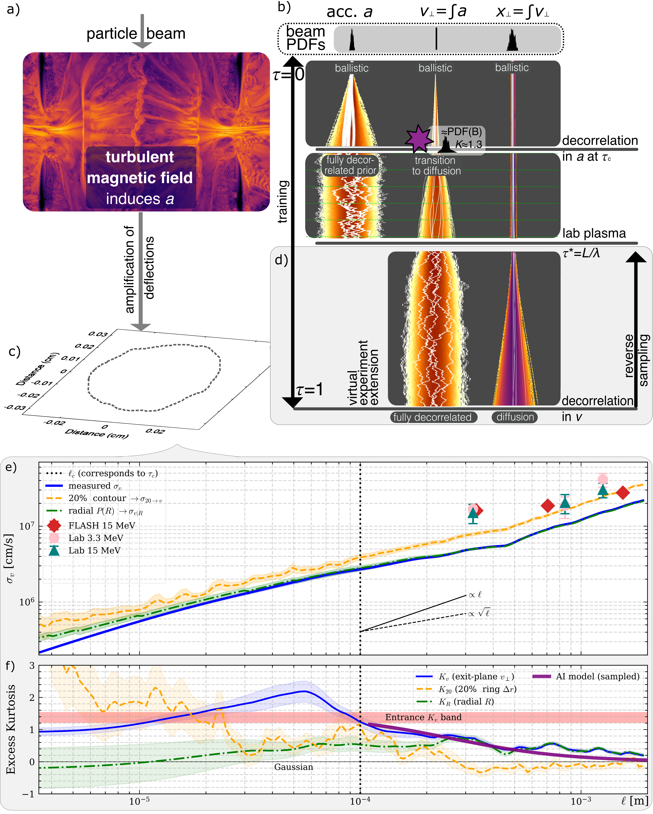

# arXiv Digest — 2026-09-03

**Interest file used:** interests/2026.09.md (current month)
**Categories pulled:** astro-ph.CO, astro-ph.EP, astro-ph.GA, astro-ph.HE, astro-ph.IM, astro-ph.SR, cs.LG, stat.ML, hep-ph
**Papers scanned:** 286 (80 astro-ph new/cross + 206 cs.LG/stat.ML/hep-ph, incl. cross-lists)
**After first filter:** 13 candidates reviewed with full text
**Final selected:** 10 papers across 3 tiers

*Note: No Tier 1 today — nothing landed squarely on the Lyα forest / IGM thermal-state core focus, and astro-ph.CO was unusually thin (only 4 new/cross papers, none on the forest). The five-paper minimum was comfortably met, so no bar was relaxed; the digest is Tier 2 + Tier 3 + Tier 4.*

---

## Tier 2 — Adjacent / useful context

### [Constraining reionization-era Lyα escape with JELS-MUSE: a highly complete Hα-selected sample at z∼6.1](http://arxiv.org/abs/2609.02558v1)

A. L. Patrick, K. J. Duncan, Z. Li et al.
**Primary category:** astro-ph.GA

The authors measure the Lyα escape fraction for a highly complete, Hα-flux-limited sample of 24 star-forming galaxies at z ≈ 6.1, drawn from the JWST Emission Line Survey (JELS) and followed up in Lyα with VLT/MUSE. They detect Lyα in 12 of 24 sources and, incorporating non-detections via reverse Kaplan-Meier survival analysis, find a population-averaged ⟨f_esc^Lyα⟩ = 0.07 (+0.04/−0.03), consistent with an independent stacked-flux estimate of 0.08. Reionization simulations matched to the survey's area, depth, and redshift show that all galaxies should experience broadly similar IGM transmission, so the authors argue the large scatter in f_esc reflects genuine ISM-driven variance rather than IGM sightline differences. Higher-escape galaxies tend to have lower dust attenuation, bluer UV slopes, and lower stellar mass, consistent with feedback-carved low-column-density escape channels.

This benchmarks the *intrinsic*, ISM-set Lyα escape at the end of reionization — the baseline against which IGM suppression at z > 7 is interpreted — which is directly the §2 reionization/IGM-neutral-fraction problem, here approached from the galaxy-emission side rather than the forest-absorption side.

---

### [Linking neutral gas inflows and outflows to offsets in the star-forming main sequence and mass-metallicity relation](http://arxiv.org/abs/2609.01707v1)

S. Weng, M. Pieri, A. Saintonge et al. (M. Pieri — Lyα-forest/IGM high-value co-author)
**Primary category:** astro-ph.GA

Using ~6,000 star-forming galaxies with down-the-barrel Na I D absorption from DESI DR2, the authors classify systems by detected neutral-gas inflows and outflows and ask where they sit on the star-forming main sequence (SFMS) and mass-metallicity relation (MZR). Outflow hosts show enhanced sSFR (0.25–0.40 dex) and slightly elevated central metallicities; slow-inflow hosts show comparable sSFR enhancement but no metallicity offset, while fast-inflow hosts show weaker SFR enhancement and modestly lower metallicities. The pattern supports a baryon-cycle "regulator" picture in which neutral gas flows trace distinct phases of accretion and feedback and contribute to scatter in galaxy scaling relations.

Adjacent on two counts: it is a DESI DR2 working-material analysis, and it exploits down-the-barrel absorption-line spectroscopy — the same quasar/galaxy absorption toolkit (here Na I D rather than the forest) that underpins the IGM/CGM program, with a forest-community co-author (Pieri).

*No figures extracted for 2609.01707 (results are population-offset statistics; the scaling-relation panels add little beyond the text summary).*

---

### [Blast.jl: Differentiable Non-Limber Power Spectra for Joint Clustering, Shear, and CMB lensing Analyses](http://arxiv.org/abs/2609.01855v1)

Sofia Chiarenza, Marco Bonici, Stefano Camera et al.
**Primary category:** astro-ph.CO | also: astro-ph.IM

This is a major extension of Blast.jl, a Chebyshev-decomposition toolkit for fast, fully differentiable computation of non-Limber angular power spectra. The update adds redshift-space distortions, magnification bias, primordial non-Gaussianity, intrinsic alignments, CMB lensing, and the ISW effect while preserving end-to-end automatic differentiation via custom AD rules, and it retains favorable scaling by precomputing cosmology-independent quantities. The authors validate against brute-force integration and established codes and demonstrate readiness for gradient-based inference by recovering unbiased parameters from a 35-parameter LSST Y10-like mock likelihood using gradient-based samplers.

Relevant as LSS-methods infrastructure: differentiable forward models plus gradient-based (HMC-style) inference on high-dimensional nuisance-heavy likelihoods is exactly the estimator/inference direction the forest program is moving toward, and a fast differentiable angular-power-spectrum engine is reusable for cross-correlation analyses (Lyα × CMB lensing, Lyα × galaxies).

*No figures extracted for 2609.01855 (the contribution is the differentiable algorithm and its validation; the speed/precision trade-off curves are not illuminating out of context).*

---

### [Empirical Near-Infrared Spectral Templates from SPHEREx: Disentangling AGN and Host-Galaxy Emission](http://arxiv.org/abs/2609.02167v1)

Wenke Ren, Hengxiao Guo, Zhenya Zheng et al.
**Primary category:** astro-ph.GA | also: astro-ph.IM

The authors build a data-driven framework combining weighted non-negative matrix factorization with forward modeling to learn empirical rest-frame near-IR templates (0.75–5.0 μm) from 2,777 galaxies and 1,064 AGN in the SPHEREx North Ecliptic Pole field. The resulting 14-component dictionary (seven galaxy + seven AGN templates) gives an additive, operational decomposition of host starlight versus AGN torus emission; inferred host fractions correlate with independent SDSS and HSC decompositions at a level comparable to those methods' mutual agreement. The templates recover redshifts to |Δz| < 0.01 for ~93% of sources and classify galaxies / narrow-line / broad-line AGN at 81% accuracy (72.9% at all-sky depth), and they flag questionable DESI classifications.

This is a survey-scale, data-driven generative spectral model for AGN/quasar spectra — the §4 "quasar continua & AGN" thread — and its NMF host/AGN decomposition is methodologically kin to the data-driven continuum models used to control the QSO-continuum systematic in forest measurements.

*No figures extracted for 2609.02167 (the core deliverable is the 14-template dictionary; a single static template panel does not summarize the method's value at a glance).*

---

### [The Intermediate-Mass Black Hole Reverberation Mapping Project: Scientific Overview and Sample Characteristics](http://arxiv.org/abs/2609.02179v1)

Hengxiao Guo, Jiancheng Wu, Wenwen Zuo et al.
**Primary category:** astro-ph.GA

The IMBH-RM project assembles a homogeneous SDSS sample of active broad-line intermediate-mass black holes by uniformly reanalyzing literature candidates with consistent spectral decomposition and mass estimation. The sample contains 192 reliable candidates at z ≲ 0.3 with log(M_BH/M_⊙) < 6 (four with < 5). The goal is direct reverberation-mapped masses and broad-line-region/accretion-disk sizes for a selected subsample, providing low-mass anchors to calibrate single-epoch mass estimators and extend BH–galaxy scaling relations into the IMBH regime, with CSST's Multi-Channel Imager flagged as the future platform.

Adjacent through the §4 reverberation-mapping thread (the library already tracks SDSS-RM): careful spectral decomposition and RM-based mass calibration on broad-line AGN is the same measurement machinery that feeds quasar-continuum and demographic work relevant to forest quasar samples.

*No figures extracted for 2609.02179 (an overview/sample-definition paper; the sample-selection panels are not a single at-a-glance result).*

---

### [Do Tabular Foundation Models Know Physics? Contamination, Units, and the Deterministic Limit](http://arxiv.org/abs/2609.02766v1)

Wassim Tenachi, Yashar Hezaveh, Laurence Perreault Levasseur et al.
**Primary category:** cs.LG | also: astro-ph.IM

Tabular foundation models (TFMs) are trained to fill in masked table cells the way LLMs fill in text; since most physical measurement arrives as tables, the authors ask what physics their (Bayesian-by-construction) prior actually contains. Probing four TFMs (TabPFN-3, TabICLv2, TabDPT, Real-TabPFN-2.5) against six baselines on datasets sampled from 316 physical equations, in and out of domain, they find TFMs dominate out of the box and after tuning. But the prior can represent neither a noiseless mechanism nor physical units, so the models interpolate physics where there is data and fail immediately outside it — they cannot yet act as physical models.

A clean interpretability/foundation-model result on the §6 threads: it probes what a scientific foundation model's prior encodes and where it breaks (units, extrapolation, deterministic limit), the kind of question that transfers directly to spectral foundation models — and the author list (Tenachi, Hezaveh, Perreault Levasseur) is squarely in the astro-ML/Ciela orbit.

---

### [Generative Diffusion Surrogates with Analytical Variance Schedule](http://arxiv.org/abs/2609.01705v1)

Patrick Reichherzer, Gianluca Gregori, David N. Hosking et al.
**Primary category:** cs.LG | also: astro-ph.IM, physics.plasm-ph

Diffusion models corrupt data with Gaussian noise and learn a reverse flow, but their noise schedules are usually heuristic. The authors note that for physical stochastic transport the variance (mean-square displacement) is often known from macroscopic theory even when the full distribution is not, and prescribe the forward noising rate as the time-derivative of that variance — turning generative time into a calibrated physical clock. The variance path is then enforced by construction while the learned score field only has to represent how non-Gaussian structure is smoothed along it, needing no intermediate-time transport data. For ballistic-to-diffusive transport in turbulent plasmas the surrogate matches test-particle distributions, reproduces the laboratory-measured variance scale, and tracks the simulated kurtosis evolution without schedule tuning, enabling calibrated emulation and likelihood-based inference.

This sits on the §6 generative-modeling / emulation / SBI thread: a physics-anchored diffusion surrogate that is probabilistic, time-resolved, and set up for likelihood-based inference is exactly the kind of surrogate-plus-inference construction relevant to emulating forest/IGM observables and building SBI pipelines.

---

### [Learning and Predicting the Nonlinear Variability of X-ray Binaries with the Koopman Operator](http://arxiv.org/abs/2609.01734v1)

Eric Miao, Ruo-Yu Shang, Kaya Mori et al.
**Primary category:** astro-ph.IM | also: nlin.CD

The authors apply Koopman operator theory — via its data-driven approximation, extended dynamic mode decomposition (EDMD) — to X-ray light curves for the first time. Koopman theory represents nonlinear evolution as an infinite-dimensional *linear* operator whose eigendecomposition yields independently evolving modes; the authors derive that each eigenfunction contributes a Lorentzian to the power spectrum, giving QPOs a dynamical interpretation. On chaotic Duffing simulations and ~30 yr of RXTE/MAXI monitoring of 4U 1705-44, the slowest-varying eigenfunction partitions state space into low- and high-flux regimes and changes sign days-to-weeks before flux transitions become visible, and iterating the operator yields short-horizon flux forecasts.

On the §6 time-series / interpretable-ML thread: a linear-operator decomposition of nonlinear dynamics that is both interpretable (modes with explicit dynamical meaning) and predictive is a transferable representation-learning idea for sequential/spectral scientific data, demonstrated here on real astronomical time series.

---

## Tier 3 — Outside my area but notable

### [An Exact Engine for Black-Hole Jets](http://arxiv.org/abs/2609.02742v1)

Yu Wang
**Primary category:** astro-ph.HE | also: gr-qc

For fifty years the Blandford–Znajek mechanism has been force-free electrodynamics on a *prescribed* metric, with the jet's own field carrying no weight. Here that field gravitates: a split-monopole threading the hole weighs like a magnetic charge, so its self-gravity makes the geometry exactly magnetic Reissner–Nordström, and gluing two copies across an equatorial current sheet puts hole, disk, and jet-driving flux into one exact spacetime with a force-free magnetosphere. Three consequences follow that no test-field calculation can see: a truly steady jet is impossible (a slipping magnetosphere must heat the horizon, so a working jet is a black hole in decay); magnetic flux enters black-hole mechanics as a charge sharing one extremality budget with spin, capping jet power at c⁵/48G independent of mass; and the lifetime output is finite, with a maximally spinning hole delivering ~9.2% of its mass.

Held to a high Tier-3 bar: this is a genuinely surprising, closed-form result that converts the field's canonical accepted jet mechanism from an approximate model into an exact gravitating solution and derives hard, universal limits (a mass-independent power ceiling; finite total output) — the kind of foundational theory result worth knowing as a scientist even though it is far from the forest.

---

## Tier 4 — Meta-research about the field

### [Agentic research is oxymoronic](http://arxiv.org/abs/2608.31161v1)

Natalie B. Hogg
**Primary category:** astro-ph.IM | also: astro-ph.CO

A short perspective from an early-career cosmologist (Handley Research Group) who, after eight months of near-daily agentic-LLM use, argues that delegating scientific *interpretation* — as opposed to verifiable "grunt work" like debugging — misunderstands what research is. Leaning on the Frascati Manual's definition (research requires human creativity and interpretation) and on postmodern hermeneutics, she contends that agentic LLMs writing up and interpreting results produce "hollow" papers, coining *deliteration*: the gradual weakening of the astronomy literature by LLM-generated work and the resulting collapse of trust. She rejects a punitive ban but proposes disclosure statements, full data/result release, dedicated ethics sessions, and — more structurally — dismantling the "publish or perish" incentives (longer postdoc contracts, mentoring) that drive the behavior.

Squarely §Tier-4 meta-research: a direct, opinionated intervention on how agentic AI is reshaping astronomy's practice, trust in the literature, and early-career conditions — the AI-changing-the-field debate, argued from inside a group that uses these tools heavily.

*No figures extracted for 2608.31161 (single-page perspective essay with no figures).*
