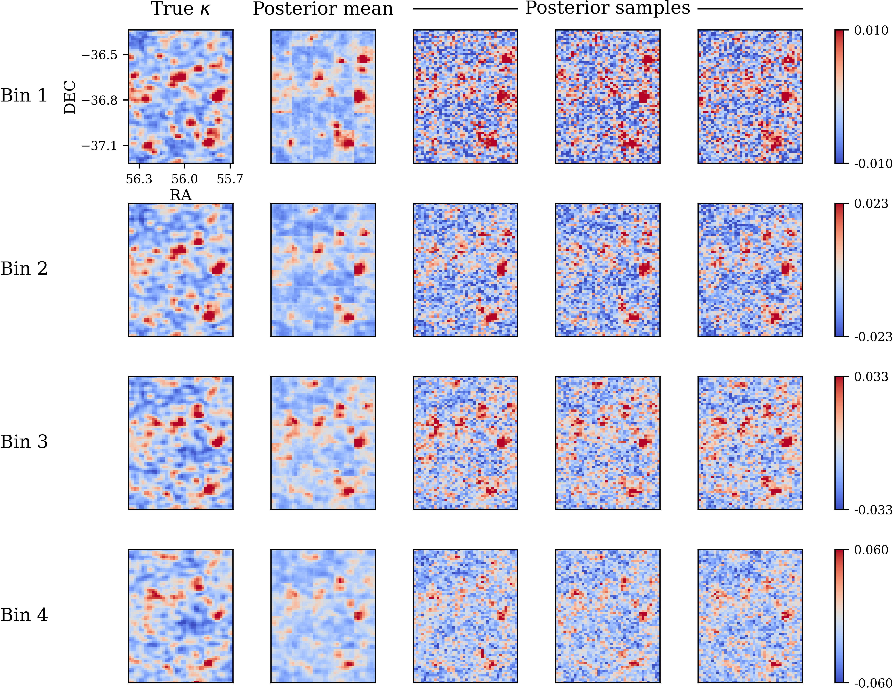

# arXiv Digest — 2026-09-09

**Interest file used:** interests/2026.09.md (current month)
**Categories pulled:** astro-ph.CO, astro-ph.EP, astro-ph.GA, astro-ph.HE, astro-ph.IM, astro-ph.SR, cs.LG, stat.ML, hep-ph
**Papers scanned:** 768 (229 astro-ph new/cross + 539 cs.LG/stat.ML/hep-ph new/cross, deduplicated)
**After first filter:** 11 candidates reviewed with full text
**Final selected:** 11 papers across 2 tiers

*Note: The first-pass metadata pull was taken directly from arXiv's RSS announcement feeds because the fetcher's id_list metadata API returned persistent HTTP 429 rate-limit errors on every batch and retry; all 768 announced new/cross papers were still recovered with full abstracts, and the second-pass full-text fetch for the 11 survivors succeeded. No Lyman-α forest P1D/P3D/DESI-forest paper appeared in today's announcement, so the primary-focus tier is thin (two reionization/IGM papers); the selection leans on adjacent DESI/LSS, quasar/AGN, and on-thread ML-inference work. ML was deliberately held to two picks per the 2026.09 profile's astronomy-up weighting. Tiers 3 and 4 are omitted — nothing met the bar.*

---

## Tier 1 — Highly relevant

### [Stacking HI in the dark: Towards detecting the reionization-epoch 21 cm signal in Lyman-α dark gaps](http://arxiv.org/abs/2609.05980v1)

Barun Maity, Frederick B. Davies (Davies — high-value IGM/reionization author on the interest list)
**Primary category:** astro-ph.CO

The authors propose a real-space stacking technique to detect the redshifted 21 cm signal from late reionization ($z\sim5.0$–$6.1$) by using the long dark gaps in quasar Lyα absorption spectra as physical anchors. Using a semi-numerical reionization model, they show that stacking 21 cm images on long dark gaps ($L>32\,h^{-1}$cMpc, threshold flux $F_{\rm th}<0.005$) yields a mean-subtracted brightness-temperature peak of $\delta\tilde{T}_b\sim2$–$3$ mK for a volume-weighted neutral fraction $x_{\rm HI}\sim0.1$ at $z=5.9$. Extending to realistic lightcones with thermal noise and foreground-wedge avoidance, they find roughly 100 dark gaps suffice for a combined root-sum-square S/N exceeding 10 in an optimistic foreground scenario. Given the abundance of known $z>6$ quasars, this cross-probe detection may already be within reach of existing optical (VLT, Keck) and 21 cm (HERA, SKA) facilities.

This is the closest paper to the core program: it fuses the two primary foci — late-reionization IGM astrophysics probed through quasar absorption (dark gaps, neutral fraction) and the 21 cm reionization signal — into a single synergistic estimator, exactly the kind of quasar-absorption-anchored reionization diagnostic the interest file flags as a live sub-focus.

---

### [TILING I: Field-level Bayesian reconstruction of cosmological initial conditions during the epoch of reionization](http://arxiv.org/abs/2609.09102v1)

Nikolaos Triantafyllou, Andrei Mesinger, Steven Murray et al.
**Primary category:** astro-ph.CO | also: astro-ph.GA

TILING is a hybrid machine-learning pipeline that reconstructs the linear initial conditions (ICs) of the matter field during the epoch of reionization ($z\gtrsim5$) from mock galaxy maps and 21 cm interferometric data. It first produces a point estimate of the ICs and then refines a score-based diffusion network to draw posterior samples, achieving posterior-mean cross-correlation coefficients $>0.8$ and power-spectrum errors of a few percent down to $k\lesssim0.2$ cMpc$^{-1}$ for fiducial survey choices. The authors show that most constraining power — especially for IC Fourier phases — comes from galaxy maps rather than 21 cm interferometry, and that TILING can recover 21 cm power-spectrum modes excised by foreground-wedge contamination. The framework can also guide follow-up observations, reconstruct reionization morphology for specific volumes, and isolate the contribution of galaxies too faint for JWST.

This lands on two interest threads at once: EoR/reionization inference (primary focus #2) and the §6 ML method threads — a score-based diffusion generative model doing field-level Bayesian inference, precisely the flows/diffusion + simulation-based-inference machinery the profile wants recommended, here applied to recovering foreground-excised 21 cm modes.

---

## Tier 2 — Adjacent / useful context

### [AstroSpecLM: A Spectrum-Language Model for Evidence-Grounded Astronomical Spectral Analysis](http://arxiv.org/abs/2609.07102v1)

Jinghang Shi, Yanxia Zhang, Ali Luo et al.
**Primary category:** astro-ph.IM | also: cs.AI

AstroSpecLM connects one-dimensional DESI spectra to a Qwen3-4B language model to answer questions and produce explanations grounded in spectral features. Rather than generating question–answer pairs from raw catalog fields, the authors first distill each spectrum into a compact set of catalog- and spectrum-derived facts, then use those facts to synthesize instruction-following conversations for training. The resulting model is competitive with specialist supervised baselines on classification and redshift estimation while additionally producing natural-language explanations that cite specific spectral features. The work demonstrates that grounding an LLM in 1D scientific spectra is feasible and that fact-mediated instruction data yields a model capable of both prediction and explanation.

This is a data-driven foundation-model-style approach applied directly to DESI spectra — one of the §6 "strongest match" categories (spectroscopic foundation models) and adjacent to the QGPT quasar-spectra project; the fact-distillation + instruction-tuning recipe is a concrete pattern to weigh against representation-learning approaches for survey spectra.

*No figures extracted for 2609.07102 (the contribution is the fact-mediated training recipe and benchmark numbers, both captured in text; the paper's figures are pipeline schematics and example dialogues).*

### [Neural Posterior Estimation for Tomographic Weak Lensing Mass Mapping](http://arxiv.org/abs/2609.07833v1)

Tim White, Shreyas Chandrashekaran, Camille Avestruz et al.
**Primary category:** astro-ph.IM | also: astro-ph.CO

The authors train a deep neural network to map a multiband image directly to a variational distribution over the underlying tomographic shear and convergence fields, replacing the usual multistage ellipticity-averaging-plus-calibration pipeline. This neural posterior estimation (NPE) procedure implicitly marginalizes over nuisance variables in the cosmological forward model, requires no likelihood evaluation, and is amortized so that inference is fast once trained. Evaluated on synthetic images from the LSST-DESC DC2 simulation, it produces well-calibrated posteriors for shear and convergence consistent with ground truth. The maps sampled from these variational distributions are intended to feed a downstream simulation-based inference of cosmological parameters.

A clean, end-to-end worked example of amortized NPE / field-level SBI applied to an image-based astronomical inverse problem — directly relevant to the ML-inference toolkit (§6), since the same neural-posterior machinery is what one would deploy for forest/LSS field-level inference.

### [Little Red Dot Cosmology: A Matter-Era Baryon Acoustic Oscillations Probe of ΛCDM](http://arxiv.org/abs/2609.06926v1)

Jessica A. Zebrowski, Rohan P. Naidu
**Primary category:** astro-ph.CO | also: astro-ph.GA

The authors argue that JWST-discovered Little Red Dots (LRDs), most numerous at $4\lesssim z\lesssim9$, are a favorable new tracer for baryon acoustic oscillation measurements deep in the matter-dominated era, bridging low-redshift large-scale-structure surveys and the CMB. With fiducial inputs — number density $\bar n\sim10^{-4}\,h^3$Mpc$^{-3}$, a bias rising from $b\sim3$ to $\sim8$, and distinctive spectrophotometric signatures — a Fisher forecast for a DESI-footprint (14,000 deg$^2$) spectroscopic survey of LRDs delivers percent-level isotropic $D_V/r_d$ measurements across four bins spanning $4\lesssim z\lesssim9$. Because dark energy is dynamically negligible at these redshifts, the measurement is a clean consistency test of the standard expansion history. The paper positions LRDs as a compelling target for future wide-field near- to mid-infrared spectroscopy.

This connects the rising LRD/AGN interest (§4) to the DESI-era BAO/LSS program (§3): a concrete, forecastable way to extend standard-ruler cosmology into an unmapped redshift window using a quasar-adjacent tracer, and a template for how a new spectroscopic sample gets vetted for cosmology.

*Figure removed (figure-file cleanup): lrd_bao_forecast.pdf*

### [Optical Depths from the Thermal Sunyaev-Zel'dovich Effect with ACT DR6 and DESI DR1 Spectroscopic Galaxies and Optically-Selected Clusters](http://arxiv.org/abs/2609.08939v1)

J. E. Moore, C. Popik, Y. Gong et al.
**Primary category:** astro-ph.CO

Using ACT DR6 + Planck component-separated Compton-$y$ maps and coadded temperature maps, the authors measure stacked thermal Sunyaev-Zel'dovich signals for DESI DR1 luminous red galaxies, the DESI DR1 Bright Galaxy Sample, and an eROMaPPer optically-selected cluster sample, reaching S/N above 38, 27, and 39 respectively at 90 GHz. They carry out a detailed treatment of dust and cosmic-infrared-background contamination — which dominates near and below the disk aperture for the galaxy samples — and derive Compton-$y$–optical-depth ($\bar y$–$\bar\tau$) scaling relations to infer optical depths. The inferred optical depths agree with pairwise kinematic-SZ values for the same tracers, and the eROMaPPer scaling relation is the first derived directly from SZ measurements. The work supplies a cross-checked route to the optical-depth calibration that limits kSZ cosmology.

Relevant on two counts: it is DESI DR1 working material (§3) and it tackles the optical-depth degeneracy that gates kSZ/pairwise-velocity constraints — the systematics-frontier flavor of precision LSS analysis the profile prioritizes.

*No figures extracted for 2609.08939 (the headline is the high-S/N detections and the $\bar y$–$\bar\tau$ scaling agreement with kSZ, both stated numerically; the figures are aperture-profile and scaling-relation scatter plots that add little at a glance).*

### [Non-linear Pairwise Velocities as a Cosmological Probe](http://arxiv.org/abs/2609.07976v1)

Mariana Jaber, Antonela Taverna, Rasmus Strid et al.
**Primary category:** astro-ph.CO

The authors build a simulation-calibrated likelihood for the mean pairwise velocity $v_{12}(r,a)$, based on the exact pair-conservation equation combined with PyCAMB HMcode-2020 non-linear clustering, and validate it against the QUIJOTE and TNG300-3 suites across resolution, sampling, box size, and redshift. Extending the fit to non-linear separations tightens the $1\sigma$ constraints on $\Omega_m$ and $\sigma_8$ by 74–81% at $z=0.5$ relative to a linear-regime baseline, with $\sigma(f\sigma_8)$ improving by up to 86% and the joint $\Omega_m$–$f\sigma_8$ figure of merit by up to $9.1\times$. They are candid that these gains are conditional on $h$ fixed at the QUIJOTE fiducial value because of a near-degeneracy with $\sigma_8$, and that jointly sampling $h$ shifts and widens the contours. The framework targets upcoming direct peculiar-velocity, redshift-space, and kSZ analyses with DESI, Euclid, and PFS.

A concrete example of squeezing small-scale non-linear information out of a summary statistic with a simulation-calibrated likelihood — the estimator-methodology and covariance/Fisher-adjacent territory (§3 techniques) that transfers directly to how one models non-linear scales in forest and clustering analyses.

*No figures extracted for 2609.07976 (the contribution is the constraint-tightening percentages quoted above; the figures are corner plots and $v_{12}(r)$ validation curves that do not add insight at a glance).*

### [Sizing the Universe with DESI Galaxy Sizes: Plain Fundamentals of Fundamental-Plane Lensing](http://arxiv.org/abs/2609.09151v1)

Kun Xu, Jiaqi Wang, Ravi K. Sheth et al.
**Primary category:** astro-ph.CO | also: astro-ph.GA

The authors present a spectroscopic galaxy–galaxy lensing magnification measurement using Fundamental-Plane size residuals of 3.26 million DESI luminous red galaxies behind DESI Bright Galaxy Survey lenses, predicting intrinsic sizes from lensing-invariant quantities (velocity dispersion, surface brightness) with 0.06–0.07 dex scatter. Lensing magnifies LRG sizes with a direct convergence response $\delta_r(\kappa)=\kappa/\ln10$, but they show the full response is modified by magnification bias induced when fitting $R_e$ with surface brightness, and calibrate for it. After calibration, the recovered surface-density profiles have uncertainties comparable to individual Stage-III shear surveys using 5–20 million higher-redshift sources, and agree with shear-based measurements. The estimator is robust to size-measurement uncertainties, with a convergence multiplicative bias only $\simeq-0.2$ times the size bias.

A genuinely novel, purely spectroscopic lensing estimator built on DESI data that sidesteps shape-measurement and photo-$z$ systematics — a clever methods contribution in the DESI-LSS wheelhouse (§3) and a reminder that spectroscopic surveys can deliver competitive weak-lensing information by non-shear routes.

*No figures extracted for 2609.09151 (the method and the "comparable to Stage-III shear" result are fully conveyed in text; the figures are surface-density-profile comparisons that do not clarify the idea at a glance).*

### [Low-Redshift Interlopers in the SDSS DR16 z > 5 Quasar Catalogue](http://arxiv.org/abs/2609.08290v1)

Vivek Kumar Jha, Harikumar N, Yogesh Wadadekar
**Primary category:** astro-ph.GA | also: astro-ph.HE

Examining the 655 $z>5$ sources in the SDSS DR16 quasar catalogue, the authors find 480 (73.2%) where the pipeline redshift disagrees significantly with a re-derived fit, and visual inspection confirms that 125 (19.1% of the total) are actually low-redshift AGN. In 114 cases broad Mg II with C III and C IV was misidentified as Lyα, and in 11 cases Hα was; the error is immediately exposed by the absence of a Gunn–Peterson trough blueward of Lyα. Crucially, the fitting algorithm itself recovers the correct redshift when emission lines are prominent — the problem lies in community reliance on the pipeline redshift rather than in the method. The authors recommend Z_FIT as the preferred estimator and urge caution in using pipeline redshifts for $z>5$ DR16Q sources.

Directly useful as a quasar-sample-systematics caution (§3/§4): high-$z$ quasar catalogs are the raw input for forest and reionization work, and a nearly one-in-five interloper rate — cleanly diagnosable via the Gunn–Peterson trough — is exactly the kind of selection systematic worth internalizing before trusting a $z>5$ quasar list.

*No figures extracted for 2609.08290 (the key number — 19.1% low-$z$ interlopers, diagnosed by the missing Gunn–Peterson trough — is fully stated in text).*

### [Transformers as In-Context Samplers: From Closed-Form Diffusion to Estimation-Free Sampling](http://arxiv.org/abs/2609.08981v1)

Arman Adibi, Alireza Jafari, Mohammad Ghavamzadeh et al.
**Primary category:** cs.LG | also: stat.ML

The authors prove that in-context learning extends beyond supervised tasks to data generation: frozen transformers can simulate iterative generative samplers from in-context examples. They give explicit constructions in which softmax attention computes responsibility weights and weighted empirical averages while feedforward layers implement Euler updates, realizing closed-form and smoothed closed-form diffusion samplers, and further show transformers can approximate an energy-based sampler. Empirically, in a semantic-topic sampling setup, normalized hidden states trace a two-stage U-shaped geometry across layers — moving toward a uniform spherical reference in intermediate layers, then returning to structured, topic-dependent representations near the output — mirrored by an interacting-particle energy measured on the hidden-state clouds. The result gives a concrete mechanistic reading of how attention can implement generative sampling.

Squarely on the §6 method threads: it ties transformer mechanics to diffusion/energy-based sampling and offers an interpretability handle on hidden-state geometry — the transformer-interpretability-meets-generative-modeling intersection the profile treats as a first-class recommendation target, astronomy hook not required.

*No figures extracted for 2609.08981 (a theory paper; its figures are hidden-state-geometry and energy-curve diagnostics that need the surrounding derivation to read).*

### [On the Recall Scaling Laws in Mamba: A Theoretical and Mechanistic Study via Hashing](http://arxiv.org/abs/2609.07681v1)

Yuval Koren, Assaf Ben-Kish, Raja Giryes et al.
**Primary category:** cs.LG | also: cs.CL

The authors reverse-engineer how the Mamba state-space model performs associative recall and find it implicitly learns linear hash functions, identifying the low-level circuit responsible. Building on similarity-preserving-hashing theory (the Johnson–Lindenstrauss lemma), they develop "Recall Scaling Laws" that predict the embedding and state dimensions Mamba needs for perfect recall, the recall success probability for given model dimensions, and the behavior of multi-layer and multi-head SSM configurations. Empirically the predictions are accurate, offering a quantitative account of how recall capacity scales with vocabulary size, state dimension, embedding size, and architecture. The study is a clean piece of mechanistic interpretability paired with predictive scaling theory for a non-attention sequence architecture.

On-thread for §6 (mechanistic interpretability + deep-learning scaling/generalization theory): a rigorous, predictive reverse-engineering of a state-space model's internal algorithm — the kind of interpretability-plus-theory work relevant both to the QGPT interpretability interest and to understanding sequence models for spectral/time-series data.

*No figures extracted for 2609.07681 (the contribution is the hashing mechanism and the scaling-law predictions; its figures are recall-probability-vs-dimension curves best read alongside the theory).*
