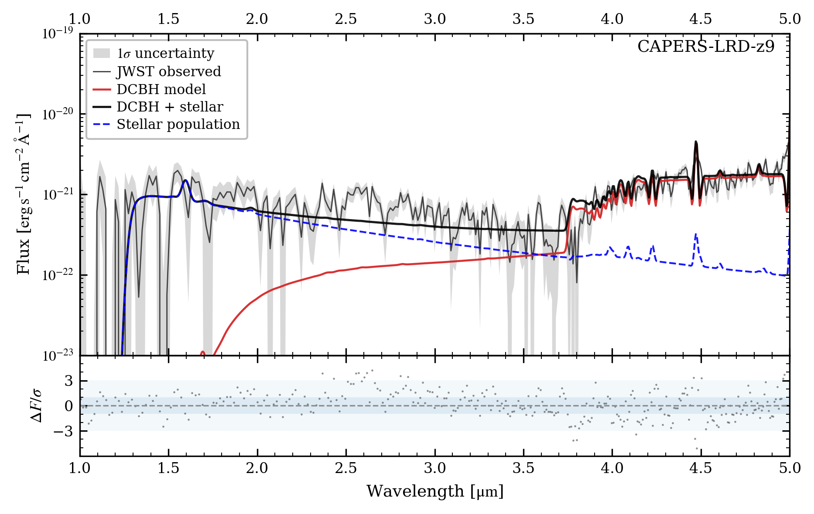

# arXiv Digest — 2026-09-14

- **Interest file used:** interests/2026.09.md (current month)
- **Categories pulled:** astro-ph.CO, astro-ph.EP, astro-ph.GA, astro-ph.HE, astro-ph.IM, astro-ph.SR, cs.LG, stat.ML, hep-ph
- **Papers scanned:** 263 (70 astro-ph new/cross + 193 cs.LG/stat.ML/hep-ph)
- **After first filter:** 16 candidates reviewed with full text
- **Final selected:** 11 papers across 2 tiers

---

## Tier 2 — Adjacent / useful context

### [The Role of Big Bang Nucleosynthesis in Joint Cosmological Analyses](https://arxiv.org/abs/2609.12065)

Mehmet Akharman, Nicholas DePorzio, Cara Giovanetti et al.
**Primary category:** astro-ph.CO | also: hep-ph

The authors run joint BAO+BBN and BAO+BBN+CMB analyses with Planck CMB and DESI DR2 BAO, marginalizing over BBN nuisance parameters for the first time in these data combinations. Their fiducial results are $h=0.6833^{+0.0048}_{-0.0053}$ (ΛCDM, BAO+BBN) and $h=0.6823\pm0.0027$ (+CMB), with $N_{\rm eff}=2.97\pm0.10$ (BAO+BBN) and $3.07\pm0.08$ (+CMB) when the radiation density floats. A central methodological point is that the inferred $N_{\rm eff}$ depends on the choice of BBN reaction network (PRIMAT vs. PArthENoPE vs. PRyM), an effect neglected in some recent work, and that pre-marginalized "summary" BBN likelihoods are not equivalent to the full likelihood. They provide a validated pipeline and recommendations for treating BBN nuisance parameters in precision joint analyses.

### [Big Bang For Your Helium Buck](https://arxiv.org/abs/2609.13140)

Marilena Loverde, Murali M. Saravanan, Zachary J. Weiner
**Primary category:** astro-ph.CO

Using a recent Large Binocular Telescope measurement of the primordial helium fraction, the authors show that CMB-based cosmological and inflationary constraints can be made agnostic to BBN theory yet remain as precise as those that enforce standard BBN predictions. They then apply the measurement to new-physics scenarios: constraining interacting and free-streaming nonstandard radiation sectors, searching for evolution of the radiation abundance between nucleosynthesis and recombination, and testing Hubble-tension models (self-interacting light relics, varying fundamental constants), which the helium data preclude in most but not all cases. As an independent bonus, they use the He measurement as an indirect test of the neutron-lifetime anomaly, inferring values consistent with "bottle" experiments and $2.4\sigma$ below "beam" experiments.

### [Little Red Dots are Direct-Collapse Black Hole-Forming Galaxies](https://arxiv.org/abs/2609.12049)

Daniel J. Whalen, Muhammad A. Latif, Konstantinos Topalakis et al.
**Primary category:** astro-ph.GA

The authors argue that JWST "Little Red Dots" (LRDs) are direct-collapse black hole (DCBH) galaxies in which the black hole is still shrouded by the massive disk that created it. Radiation-hydrodynamics simulations (Enzo + MORAY, post-processed with Cloudy and BPASS) show that densities $\gtrsim10^{10}\,{\rm cm}^{-3}$ at the disk center trap the BH's X-rays — preventing X-ray breakout even at effective masses $\sim10^7\,M_\odot$ — and produce the observed Balmer absorption and V-shaped SEDs, while UV/optical/reprocessed-IR flux partly escapes. The host halo's $r^{-2.2}$ density profile naturally builds a compact $\sim10^8\,M_\odot$ stellar cluster of $\sim$150 pc radius with the BH offset by $\sim$75 pc, matching lensed-LRD morphologies. The model reproduces a range of LRD spectra from RUBIES-EGS-42046 ($z=5.28$) to MoM-BH*-1 ($z=7.76$) and CAPERS-LRD-z9 ($z=9.29$) with reasonable BH/stellar mass ratios.

### [Mapping the Quasar Main Sequence in the UV range: A Connection with the UV Fe III Emission](https://arxiv.org/abs/2609.12333)

D. Martínez Collipal, M. L. Martínez-Aldama, A. Pandey et al.
**Primary category:** astro-ph.GA

The optical quasar "main sequence" (MS) organizes type-I AGN via FWHM(Hβ) and the Fe II/Hβ flux ratio, but Hβ and optical Fe II become inaccessible from the ground at high redshift. Fitting 69 low-$z$ ($z\lesssim0.8$) HST quasar spectra over 1700–2200 Å, the authors show that a UV plane defined by FWHM(Al III λ1860) and the equivalent width of the combined Fe III+Fe II emission cleanly mirrors the optical MS and separates its populations. A cut at $W({\rm Fe\,III+Fe\,II})\approx17$ Å isolates the extreme-accretor "xA" sources with 100% completeness (though a non-negligible 22.7% false-positive rate), from an isolated spectral region that does not require a full deblend of the λ1900 complex. This offers a practical way to trace the MS — and thus accretion state — up to $z>3$ in ground-based and SDSS-scale surveys.

*Figure removed (figure-file cleanup): A3_F3_OPT_MS.pdf*

### [High-redshift supermassive black hole population from core-collapse in self-interacting dark matter halos](https://arxiv.org/abs/2609.13041)

Sambo Sarkar, Ujjal Kumar Dey
**Primary category:** astro-ph.GA | also: astro-ph.CO, hep-ph

The authors test whether gravothermal core-collapse of velocity-dependent self-interacting dark matter (SIDM) halos can seed the supermassive black holes seen near cosmic dawn. Using semi-analytic core formation on top of realistic mass-accretion and merger histories (SatGen + hmf), plus Eddington-limited growth, they build a synthetic SMBH catalog over $4\le z\le11$ and compare it to a large compilation of pre-JWST and JWST broad-line quasar/AGN masses. An MCMC fit favors median SIDM parameters $\sigma_0/m_\chi\sim46$–$56\,{\rm cm^2/g}$ and characteristic velocity $\omega\sim102\,{\rm km/s}$, roughly stable across sub-, near-, and super-Eddington accretion, with larger cross-sections letting lower-mass halos host early seeds. The framework accommodates the observed SMBH mass–redshift distribution and binned mass functions within the 16–84th percentile bands.

### [Clustering-based halo mass assignment for high-redshift galaxies: method, validation, and application to JWST](https://arxiv.org/abs/2609.12040)

Seunghwan Lim, Sandro Tacchella, Sara Saleh et al.
**Primary category:** astro-ph.GA | also: astro-ph.CO

The authors present and validate a clustering-based method for inferring halo masses of high-redshift galaxies, matching the galaxy two-point correlation function in stellar-mass bins to reference halo clustering over an optimal range $0.5<r_p/{\rm cMpc}<1.0$. Validated against COLIBRE + HOMA mocks, it recovers halo masses with $<0.3$ dex scatter to $z=12$ even for photometric samples, and splitting by SFR/colour/age mitigates assembly bias — a key advantage over abundance matching. Survey volume dominates the error budget (field-to-field clustering-amplitude variations of factors 2–3). Applied to JWST/JADES at $z=6$ and $10$, it yields $\log M_h/M_\odot=10.52^{+0.12}_{-0.21}$ and $9.91^{+0.19}_{-0.34}$ for $M_{\rm UV}<-17$ galaxies (biases $b_h=4.2$ and $7.7$), though current data cannot yet distinguish bursty from non-bursty star-formation models.

### [Impact of galaxy intrinsic alignments on non-Gaussian weak lensing statistics for modified gravity](https://arxiv.org/abs/2609.12038)

Mehar Chawla, Christopher T. Davies, Joachim Harnois-Déraps et al.
**Primary category:** astro-ph.CO

Using the MGLenS mock weak-lensing maps (varying three cosmological plus one gravitational parameter under $f(R)$ or nDGP), the authors build emulators for a suite of non-Gaussian statistics — lensing PDF, peak/minima counts, void abundance and profiles — with and without intrinsic alignments (IA), and run full MCMC analyses. Without IA, lensing void profiles and abundances give the highest figure of merit in the $S_8$–modified-gravity planes, sometimes an order of magnitude above two-point functions. When IA is unmodeled, large biases appear in the cosmology sector (while the modified-gravity sector is relatively robust), and crucially these biases can usually be flagged by poor goodness-of-fit — except in cases where IA fully masquerades as lower $\Omega_m$/$S_8$.

### [Physics-Informed Conformal Prediction: Embedding PDE Consistency into Distribution-Free Uncertainty Quantification for Neural Operators](https://arxiv.org/abs/2609.11935)

Michael Chin
**Primary category:** cs.LG

This paper proposes PI-CP, embedding PDE residuals into the nonconformity score of split conformal prediction so that neural-operator surrogates (e.g. Fourier Neural Operators) get prediction intervals that are distribution-free with provable coverage and spatially adaptive — tighter where the physics residual is small, wider where it is violated. Across six physics scenarios (2D/3D heat, structural mechanics, Darcy flow, Navier–Stokes) the conformal methods hold 89–91% coverage while MC Dropout and Deep Ensembles are unstable (82–100%). The author also proves that FNO translation-equivariance creates an approximation barrier for Dirichlet boundary conditions, resolved by adding coordinate channels for up to 63× error reduction.

### [Identification of Cosmic Chronometers in the GAMA Survey](https://arxiv.org/abs/2609.12711)

Laura J. Hunt, Kevin A. Pimbblet, David M. Benoit
**Primary category:** astro-ph.GA

The authors assemble a high-purity sample of 231 massive, passively evolving elliptical galaxies as cosmic-chronometer (CC) candidates from the GAMA survey over $0.03<z<0.4$, aiming to enlarge the pool available for model-independent $H(z)$ and $H_0$ measurements and to assess how purity affects statistical uncertainty. Selection uses NUVrJ photometric quiescence plus spectral tracers (Hα, [OII], Hδ, and the Ca II H/K ratio) to reject ongoing or recently halted star formation, restricted to the most massive galaxies with visual inspection. The resulting CCs have very low specific SFR (median $\sim10^{-12}$ yr$^{-1}$) and median ages $\sim$2 Gyr older than the parent sample.

---

## Tier 3 — Outside my area but notable

### [Terminal instability of the Solar System triggered by stochastic solar mass loss](https://arxiv.org/abs/2609.12494)

Konstantin Batygin, Jim Fuller, Fred C. Adams
**Primary category:** astro-ph.EP | also: astro-ph.SR

Standard estimates put the outer Solar System's dynamical lifetime at $\sim10^{18}$ years, or $\sim$100 Gyr once stellar flybys are included — all assuming the Sun's post-main-sequence mass loss is smooth. The authors show that the recently measured white-dwarf birth kick ($\sim$0.75 km/s) demands *episodic*, asymmetric mass ejection, so the Sun's $\sim$4,600 discrete recoils drive every planetary orbit on a random walk whose amplitude scales as $\sqrt{M_{\rm ej}}$. In 672 N-body realizations (REBOUND + MESA tracks), at the observationally favored ejection granularity $\sim$40% of systems disrupt or violently scatter before the white dwarf even forms and $\sim$90% self-destruct within 3 Gyr — collapsing the dynamical lifetime from $10^{18}$ years to roughly a gigayear. They also find a stochastic resonant-capture channel (Jupiter–Saturn 5:2, Uranus–Neptune 2:1) and correct a spurious adiabatic capture reported in earlier work.

*Figure removed (figure-file cleanup): fig4_survival.pdf*

### [Constraining dark matter using 20-year INTEGRAL/IBIS observations I: Primordial black holes](https://arxiv.org/abs/2609.12044)

Jordan Koechler, Pedro De la Torre Luque
**Primary category:** astro-ph.HE | also: astro-ph.CO, hep-ph

Primordial black holes (PBHs) in the asteroid-mass window remain a viable dark-matter candidate; at the low end, Hawking evaporation injects $e^\pm$ that produce diffuse hard X-rays via inverse-Compton scattering on Galactic radiation fields. The authors present the first search for this signal using a combined spectral and morphological analysis of 20 years of INTEGRAL/IBIS data, building a physically motivated model of the Galactic hard-X-ray background (IC from cosmic-ray electrons, unresolved accreting white dwarfs) and consistently adding the PBH-evaporation IC term. Exploiting both spatial and spectral information tightens the separation of a possible PBH signal from astrophysical backgrounds, yielding competitive limits on the PBH dark-matter fraction across a broad mass range, including extended mass functions and rotating PBHs. Low-energy $e^\pm$ propagation is identified as the dominant modeling uncertainty.
