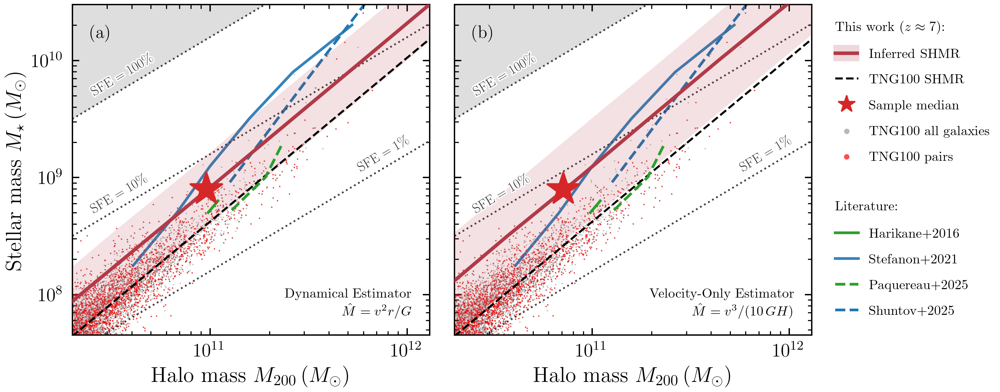
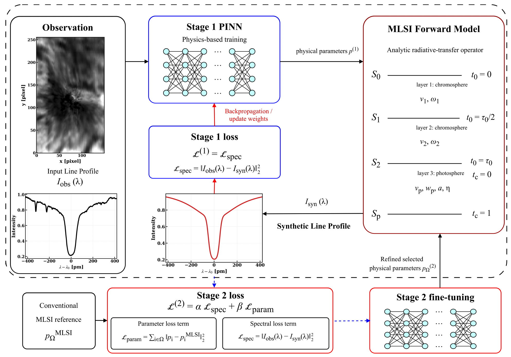

# arXiv Digest — 2026-09-17

**Interest file used:** interests/2026.09.md (current month)
**Categories pulled:** astro-ph.CO, astro-ph.EP, astro-ph.GA, astro-ph.HE, astro-ph.IM, astro-ph.SR, cs.LG, stat.ML, hep-ph
**Papers scanned:** 348 (97 astro-ph new/cross + 251 cs.LG/stat.ML/hep-ph and cross-lists)
**After first filter:** 25 candidates reviewed with full text
**Final selected:** 15 papers across 3 tiers

*Note: No Lyman-α forest / P1D / P3D / DESI-Lyα or IGM-thermal-state paper appeared in today's announcement, so Tier 1 is empty and the selection leans on adjacent LSS, CGM, DM-via-structure and ML-method work; per the 2026.09 profile the ML picks are trimmed to the §6 method threads. On process: the arXiv query API returned HTTP 406 through the egress proxy for every multi-id / paginated request, so first-pass metadata was assembled from the RSS announcement feeds (which carry the full abstract) and full text came from the e-print endpoint directly; all 348 announced new/cross papers were recovered.*

---

## Tier 2 — Adjacent / useful context

### [A dense, metal-rich absorber driven by a heavily dust-obscured galaxy: The direct evidence of CGM enrichment at $z\sim7$](https://arxiv.org/abs/2609.17680v1)

Qinyue Fei, Seiji Fujimoto, Gabriel Brammer et al.
**Primary category:** astro-ph.GA

Along the sightline to a red quasar at $z=7.19$, the authors find a metal-enriched absorber at $z=7.03$ with the largest rest-frame equivalent widths and column densities yet seen at $z>5$, and identify its host — a heavily dust-obscured, vigorously star-forming galaxy (ND1) at an impact parameter of only ~16 kpc, detected only in the longest NIRCam bands. Deep JWST/NIRSpec plus NOEMA [C II] anchor the systemic redshift and reveal a ~50 km/s blueshift of the absorbing gas, implying an outflow with $\dot{M}_{\rm out}\approx64\,M_\odot\,{\rm yr}^{-1}$ and a mass-loading factor $\eta\approx3$. The absorber shows an enhanced [C/O] ratio consistent with Population III nucleosynthetic yields, and the NIR-dark host implies rest-UV surveys systematically miss the dusty galaxies driving CGM/IGM metal enrichment into the Epoch of Reionization. They explicitly compare the absorber's equivalent widths against the DESI Mg II / C IV absorber statistics.

This is background-quasar absorption spectroscopy of high-redshift gas — the same probe and machinery as the forest program — applied to CGM/IGM enrichment during reionization (interests §2 and §7), and it directly touches the DESI absorber-catalog comparison and the QSO-continuum context that matter for forest systematics.

### [Using the Circumgalactic Medium of Dwarf Galaxies as a Calorimetric Dark Matter Detector](https://arxiv.org/abs/2609.15748v1)

Abby Mintz, Digvijay Wadekar, Romain Teyssier
**Primary category:** astro-ph.CO | also: astro-ph.GA, hep-ph

The authors add a model-independent DM-induced heating term, parameterized by an effective local rate $\Gamma_{\rm heat}$, to the RAMSES hydro code and run isolated WLM-like gas-rich dwarf simulations. DM heating barely changes the star-formation rate or the dense ISM but strongly reshapes the CGM: for $\Gamma_{\rm heat}=10^{-27}$–$10^{-25}\,{\rm s}^{-1}$ the neutral-hydrogen column at 10 kpc drops by 0.6–3.9 dex, with C II / Si II falling by 4.1 / 5.5 dex and C IV / Si IV by 2.2 / 3.0 dex. Because these signatures are accessible to quasar absorption-line spectroscopy, nearby field-dwarf CGM observations become a calorimetric probe of dark-photon DM, axion-like particles, sterile neutrinos and primordial black holes that inject heat into gas.

A clean crossover of dark-matter physics (interest §5) with the quasar-absorption / CGM observables (§7) that sit next to the forest program — and a concrete example of turning gas-phase column densities into a fundamental-physics constraint. Teyssier (RAMSES) on the author list.

### [The galaxy--electron cross-spectrum with ACT, SPT-3G and DESILS LRGs](https://arxiv.org/abs/2609.17676v1)

Selim C. Hotinli
**Primary category:** astro-ph.CO

The galaxy–electron cross-power spectrum $P_{ge}(k)$ measures the small-scale gas distribution around galaxies — the quantity most reshaped by feedback. Using the kSZ signal of photometric DESI Legacy Imaging Survey LRGs, cross-correlating a velocity-weighted momentum template with ACT DR6 and, for the first time, SPT-3G, the author detects $P_{ge}$ at $11.7\sigma$ (ACT), $8.4\sigma$ (SPT-3G) and $12.3\sigma$ combined, with the absolute normalization fixed by a surrogate-field Monte Carlo that propagates the mask, lightcone evolution and photo-z weights. The two independent experiments agree channel-by-channel (largest difference $0.7\sigma$) and all 26 null tests are consistent with zero. Adopting halo masses from the sample's number density and a CMB-lensing calibration, the gas within the virial radius is 25–33% of the halo's cosmic baryon budget.

Baryonic feedback on small scales is the leading systematic for precision LSS/weak-lensing cosmology (interest §3), and a direct kSZ measurement of the gas distribution around DESI-selected LRGs — with a carefully validated absolute normalization — is exactly the kind of gas-census input that informs matter-power-spectrum modelling.

### [Void probability function in the Quijote simulations](https://arxiv.org/abs/2609.18221v1)

Snehasish Bhattacharjee
**Primary category:** astro-ph.CO | also: astro-ph.GA

The void probability function (VPF) — the likelihood of finding no tracers in a given volume — is measured for haloes and galaxies across the Quijote N-body suite spanning ΛCDM and several extensions, and compared with the geometric-hierarchical (GH) and negative-binomial (NB) analytic models. The halo VPF is sensitive to cosmology and halo mass and follows the GH model at $z=0$ (ΛCDM smallest deviation, massive-neutrino cosmology largest), while shifting toward the NB model at higher redshift, stronger dilution and in redshift space, where primordial non-Gaussianity produces the largest departures. Ellipticals follow GH and spirals NB, and cosmic variance adds non-negligible scatter. The upshot is that the VPF is a cheap, cosmology-sensitive summary statistic for distinguishing ΛCDM extensions in upcoming large-volume surveys.

Void cosmology and higher-order/complementary summary statistics built on the Quijote suite are both explicitly on the LSS-techniques shelf (interest §3), and the neutrino / primordial-non-Gaussianity sensitivity connects to the fundamental-physics goals of the program.

### [On the cosmic previrialization](https://arxiv.org/abs/2609.17805v1)

Shubhadip Bera, Michał J. Chodorowski
**Primary category:** astro-ph.CO

Working in standard perturbation theory, the authors compute the leading nonlinear (1-loop) correction to the variance of the cosmic density and velocity-divergence fields, using the second- and third-order kernels $F_2/F_3$ and $G_2/G_3$. They symmetrize the third-order kernels, express them in terms of the angle cosine and a symmetric function of the wavevector magnitudes, and show explicitly that the divergent contributions from the $P_{\delta 22}$ and $P_{\delta 13}$ pieces cancel, with the angularly averaged divergence-free part of $F_3$ remaining nearly constant. The net coefficient of the nonlinear correction to the linear density variance falls in a narrow range (1.817–1.843) for essentially any linear power spectrum.

Nonlinear perturbation theory of the density and velocity-divergence power spectra is the analytic backbone of the EFT/hybrid forest-modelling thread (interest §1); a clean, spectrum-independent handle on the leading previrialization correction is useful reference material for that modelling.

*No figures extracted for 2609.17805 (the substance is the analytic cancellation and the narrow coefficient range 1.817–1.843; the paper's single figure is a technical kernel plot).*

### [JADES: Dynamical Measurements of Dark Matter Halo Masses at $z \approx 7$ Using Galaxy Pairs](https://arxiv.org/abs/2609.17756v1)

Zihao Wu, Daniel J. Eisenstein, Benjamin D. Johnson et al.
**Primary category:** astro-ph.GA | also: astro-ph.CO

Because galaxy pairs in the early Universe are usually still in first infall, their relative velocities trace the host halo mass, especially near the virial radius. Calibrating dynamical-mass estimators on TNG100 (intrinsic scatter ~0.2 dex), the authors apply them to 10 pair systems at $z=6$–8 with JWST/JADES [O III] spectroscopy and infer the stellar-to-halo mass relation while marginalizing over projection, measurement error and scatter. They find a mean $\log(M_{200}/M_\odot)=11.06\pm0.21$ at $\log(M_*/M_\odot)=9$ — so these galaxies do not live in unusually massive halos, implying a high integrated star-formation efficiency (~5%, about twice the TNG100 prediction). Statistical significance is still limited and awaits larger samples.

The galaxy–halo connection and stellar-to-halo mass relation at high redshift (interest §9) constrain the ionizing-source population feeding reionization and provide the tracer–halo modelling context for LSS work; a dynamical, simulation-calibrated halo-mass estimator is a nice methods addition.

### [Massive Galaxy Halos Contain Less Inner Dark Matter Than Predicted](https://arxiv.org/abs/2609.19132v1)

Yu-Chen Wang, Yingjie Peng, Xiaohu Yang et al.
**Primary category:** astro-ph.GA

Combining MaNGA stellar kinematics, ALFALFA H I dynamics and independently calibrated SDSS-group halo masses, the authors statistically reconstruct the mass distribution of central galaxies over nearly two decades in radius. They show H I data alone cannot fix total halo mass (hence the group-based scale), and find that massive observed halos have systematically lower dynamical masses at the H I radius, lower inner dark-matter masses and lower central DM fractions (~4σ in population-scatter units) than IllustrisTNG and EAGLE predict at fixed halo mass. Low-mass halos are broadly consistent with the simulations; the recovered DM profiles stay NFW-like but with lower effective concentrations for massive systems. The favored interpretation is stronger-than-modelled long-term baryonic halo heating in massive halos.

A direct observational test of how baryons redistribute dark matter in halos (interests §9 and §5) — relevant both to the galaxy–halo modelling that underpins LSS tracer bias and to the small-scale DM-distribution questions the program cares about.

### [A reanalysis of the megamaser Hubble constant: from spot catalogues to peculiar velocities](https://arxiv.org/abs/2609.17684v1)

Richard Stiskalek, Harry Desmond
**Primary category:** astro-ph.CO | also: astro-ph.GA

The authors build a Bayesian forward model that jointly infers angular-diameter distances and warped Keplerian disc parameters from the VLBI maser-spot quasi-observables (positions, velocities, accelerations) for five of the six Megamaser Cosmology Project galaxies, then constrain $H_0$ including a physical distance prior, sample-selection modelling, and both linear and non-linear (Manticore) peculiar-velocity reconstructions. With the non-linear reconstruction they obtain $H_0 = 71.6 \pm 3.7$ km/s/Mpc (statistical), with peculiar-velocity treatment lowering $H_0$ by up to ~2 km/s/Mpc and the selection variable mattering at the <1 km/s/Mpc level. Modelling NGC 4258 separately with an eccentric quadratic-warp disc yields a distance within $0.13\sigma$ of the published maser value.

An independent, geometric handle on the $H_0$ tension and the broader cosmological context the forest program sits in (interest §3), with careful, degeneracy-aware Bayesian inference and peculiar-velocity reconstruction that is methodologically relevant to any distance-ladder-adjacent analysis.

*No figures extracted for 2609.17684 (the headline is the $H_0 = 71.6 \pm 3.7$ value and the peculiar-velocity shifts; the paper's figures are per-galaxy disc posteriors and corner plots that add little at a glance).*

### [Physics-Informed Neural Networks for Fast Multilayer Spectral Inversion of Hα 6562.8 Å and Ca II 8542.1 Å Spectra](https://arxiv.org/abs/2609.18025v1)

Ziyang Zhang, Qin Li, Vasyl B. Yurchyshyn et al.
**Primary category:** astro-ph.SR | also: astro-ph.IM, cs.LG

Multilayer spectral inversion (MLSI) models chromospheric line profiles with a small number of radiative-transfer layers but is normally done by slow pixel-by-pixel nonlinear least-squares fitting. The authors wrap it in a physics-informed neural network that predicts MLSI parameters directly from an observed profile and passes them through a differentiable MLSI forward model, trained in two stages (spectral-reconstruction loss, then fine-tuning with parameter supervision from conventional MLSI on a single reference image) so no large precomputed training set is needed. On Goode Solar Telescope FISS data the PINN reproduces direct-inversion parameter maps with a mean pixel-wise Pearson $r=0.933$ and cuts per-raster time from 3–5 minutes to 5–15 seconds (12–60× speedup) while keeping physical interpretability.

A data-driven, differentiable-forward-model approach to fast spectral-line inversion (interest §6: emulation, foundation-model-adjacent spectral methods) that is directly transferable to the QSO-continuum / spectral-fitting problems central to the forest and quasar-spectrum projects.

### [Walking the Score Manifold: Continuous-time Generative Dynamics on Learned Data Manifolds](https://arxiv.org/abs/2609.17901v1)

Jan Tauberschmidt, Brian B. Moser, Stanislav Frolov et al.
**Primary category:** cs.LG | also: cs.AI

Rather than generating time-dependent data on a fixed discrete grid, the authors treat generation as continuous-time evolution on a learned data manifold: a pretrained score-based model acts as a geometric prior, and a vector field is trained (simulation-free, via regression) to evolve data along score-induced interpolation paths, enabling generation at arbitrary timestamps and temporal super-resolution. A "path-relative transverse exponential stability" objective — interpretable as denoising score matching transverse to the interpolation path — improves long-horizon rollout robustness, and a probabilistic extension models distributions over future trajectories. They demonstrate on PDE-governed spatiotemporal fields, molecular dynamics and natural video.

Squarely on the interest-file generative-modelling thread (interest §6: diffusion / stochastic interpolants / score-based methods), and the manifold-aware, stability-regularized formulation is a plausibly borrowable ingredient for emulating or super-resolving stiff scientific dynamical fields.

### [Structure is not mechanism: high-gain gated-FFN rows across text and genomic foundation models](https://arxiv.org/abs/2609.17599v1)

Alexandros Tzanakakis, Aris Karatzikos, Ilias Georgakopoulos-Soares
**Primary category:** q-bio.GN | also: cs.AI, cs.LG

Across a frozen 22-model census spanning text and genomic transformer foundation models, the authors test whether the "high-gain" rows of gated feed-forward networks — computed via the exact (non-diagonal) bilinear weight operator — are a transferable mechanistic signal. Activation-derived high-gain candidates are functionally enriched relative to random and top-norm controls, yet neither spectral concentration nor operator magnitude predicts causal effect size, and a within-layer sweep resolves this into a detection-versus-severity distinction: above a threshold the ratio orders rows but does not grade damage, and it carries no information below it. Case studies reveal model-specific causal organizations (a super-additive pair interaction in DNABERT-2; a position-localized beginning-of-sequence dependence in GENERator) and a second catastrophic row invisible to one-candidate-per-model censuses. The conclusion: structural prominence is a recurrent enrichment signal, not a calibrated measure of functional criticality.

Directly on the mechanistic-interpretability thread (interest §6: attention/feature attribution, super-weights, sparse-feature discovery) and a cautionary, cross-architecture result on reading "importance" off transformer structure — relevant to the interpretability goals of the quasar-transformer project.

*No figures extracted for 2609.17599 (the contribution is the structure-vs-causality dissociation and the detection/severity regimes; the figures are dense per-model causal-effect panels that need their captions to parse).*

### [Self-Supervised Learning for Robust Resonance Mass Regression in Cascade Decays](https://arxiv.org/abs/2609.17726v1)

Ho Fung Tsoi, Alex Yang, Luis Felipe Gutierrez Zagazeta et al.
**Primary category:** hep-ex | also: cs.LG

Following the foundation-model paradigm, the authors pre-train a transformer encoder with VICReg to learn an embedding invariant to realistic corruptions, then fine-tune it to regress the mass of a heavy resonance (2.5–6.5 TeV) in a SUSY-like eleven-body cascade decay with missing energy. Compared to a supervised model of the same architecture trained from scratch on the same augmented data, the pre-trained model reconstructs sharper resonance peaks and is markedly more stable under particle drop, momentum/η smearing and PID swaps. t-SNE of the (label-free) embedding shows mass structure emerging from self-supervision alone.

A concrete self-supervised-transformer-for-scientific-sequences result (interest §6: self-supervised / contrastive representation learning, foundation models) that is a close methodological analogue of the owner's self-supervised quasar-spectrum transformer project — including the emphasis on robustness to input corruptions.

*No figures extracted for 2609.17726 (the takeaway is that self-supervised pre-training yields sharper, corruption-robust mass regression; the figures are calibration/resolution curves best read with their axes).*

---

## Tier 3 — Outside my area but notable

### [Asymmetric Inelastic Dark Matter and the LUX-ZEPLIN event](https://arxiv.org/abs/2609.18564v1)

Natsumi Nagata, Tsutomu T. Yanagida
**Primary category:** hep-ph

Motivated by LZ's reported ~248 keV high-energy nuclear-recoil candidate, the authors note that the simplest Higgsino inelastic-DM interpretation is excluded by solar capture and annihilation producing an IceCube-visible neutrino flux, and propose an asymmetric inelastic DM scenario that evades it. The DM is a mostly-singlet Dirac fermion mixing weakly with a near-degenerate electroweak doublet; its primordial asymmetry comes from CP-violating out-of-equilibrium decays of heavy Majorana fermions, and the symmetric component is depleted, so annihilation in the Sun is suppressed. The singlet-doublet structure gives an off-diagonal Z coupling (∝ mixing) with a suppressed diagonal coupling (∝ mixing²), letting an observable inelastic rate coexist with elastic-scattering limits; the LZ event is accommodated for DM masses of a few hundred GeV–1 TeV with ~few-hundred-keV splittings.

Off the forest program, but a second rapid theory interpretation (after the Higgsino reading in the 2026-09-02 digest) of a genuinely anomalous, sub-discovery LZ event — worth tracking as a scientist, with dark matter a secondary interest (§5). Treat as one of several interpretations of an unconfirmed signal, not a detection.

*No figures extracted for 2609.18564 (a short theory letter; the single figure is the allowed mixing-angle contour in the DM-mass–splitting plane, fully described in the text).*

### [Deep learning emergent spacetime from fermionic spectral functions in holography](https://arxiv.org/abs/2609.18566v1)

Koji Hashimoto, Hyun-Sik Jeong, Keun-Young Kim et al.
**Primary category:** hep-th | also: cond-mat.str-el, cs.LG

Using a physics-informed Neural ODE that hard-codes UV asymptotics, horizon regularity and zero-temperature extremality, the authors solve the holographic inverse problem — reconstructing the bulk spacetime and gauge field of a charged AdS black hole directly from boundary fermionic spectral functions — across non-Fermi-liquid, marginal-Fermi-liquid and Fermi-liquid regimes, and even infer the probe charge to sub-percent accuracy. Relaxing the near-AdS boundary constraint uncovers a geometrical degeneracy: bulk profiles differing throughout the radial direction but sharing the same near-horizon $AdS_2\times\mathbb{R}^2$ data reproduce identical near-Fermi-surface spectra. This isospectral non-uniqueness is exactly the degeneracy expected on holographic grounds at zero temperature, and its spontaneous emergence across independent runs shows the network isolates IR CFT universality rather than overfitting a UV completion.

Far from the forest, but a striking example of an interpretable, physics-constrained ML inverse solver (interest §6: neural ODEs, uncertainty/degeneracy in learned inverse problems) whose surprise is that the network *rediscovers* a known physical degeneracy rather than a spurious fit — a useful cautionary/positive datapoint on what constrained ML inversions actually learn.

*No figures extracted for 2609.18566 (the notable content is the isospectral bulk degeneracy; the figures are multi-panel bulk-profile reconstructions that require their captions and equations to interpret).*

---

## Tier 4 — Meta-research about the field

### [Rethinking Domain Specialization for Open-Ended Scientific Reasoning in Astronomy Language Models](https://arxiv.org/abs/2609.17644v1)

Vanessa Lama, Sanjay Das, Emily Herron et al.
**Primary category:** astro-ph.IM | also: cs.AI, cs.LG

The authors ask when domain-specific fine-tuning still helps for open-ended scientific reasoning, using a curated astronomy QA benchmark from 2017–2026 Olympiad-style materials (300 free-response questions, 204 text-only and 96 image-linked). Comparing open-weight and API general-purpose, multimodal, and astronomy-specialized models with judge-based correctness plus reference metrics, they find strong general-purpose models set the highest correctness baseline, while metric-agreement, judge-sensitivity, benchmark-composition and modality analyses reveal structure a single leaderboard hides. They argue domain specialization should be treated as a task- and deployment-dependent property, and stress the role of domain-specific evaluation in choosing models for scientific workflows.

On-point meta-research about how (and whether) LLMs are useful for astronomy (interest §6 / Tier 4): as general models improve, the value of astronomy-specialized fine-tuning is now an empirical, benchmark-dependent question — directly relevant to anyone weighing AI assistants or specialized models in an astronomy workflow.

