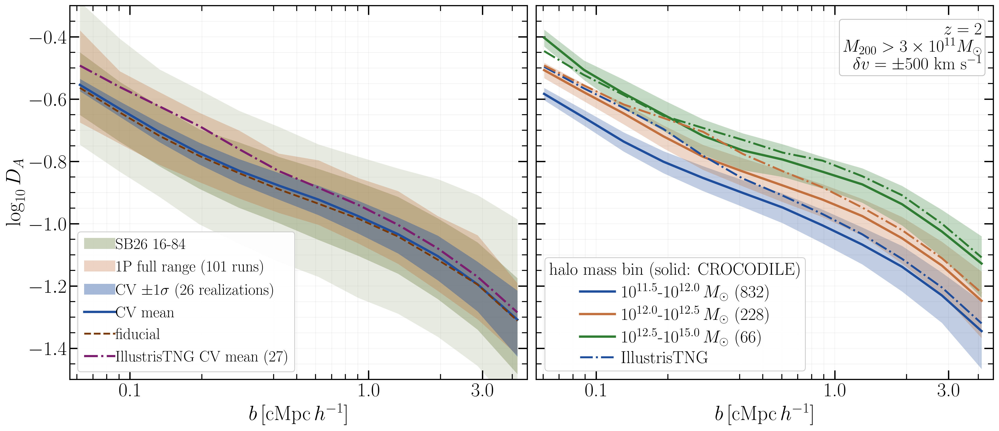

# arXiv Digest — 2026-09-22

- **Interest file used:** interests/2026.09.md (current month)
- **Categories pulled:** astro-ph.CO, astro-ph.EP, astro-ph.GA, astro-ph.HE, astro-ph.IM, astro-ph.SR, cs.LG, stat.ML, hep-ph
- **Papers scanned:** 638 (153 astro-ph new/cross + 485 cs.LG/stat.ML/hep-ph and cross-lists)
- **After first filter:** 18 candidates reviewed with full text
- **Final selected:** 14 papers across 4 tiers

*Note: the arXiv API metadata endpoint (export.arxiv.org/api/query) returned persistent 429/406 through the environment proxy, so first-pass metadata was built from the arXiv RSS announcement feeds (title, authors, full abstract, categories) and second-pass full text was pulled directly from the e-print source endpoint. All abstracts and figures come from those sources.*

---

## Tier 1 — Highly relevant

### [Hunting Thermal Relics in the DESI DR1 Ly$\alpha$ Forest](https://arxiv.org/abs/2609.22581)

Emanuelly Silva, Artur Ladeira, Rafael C. Nunes et al.
**Primary category:** astro-ph.CO | also: hep-ph

The authors constrain extra relativistic species and thermal sterile neutrinos using the DESI DR1 one-dimensional Lyman-α forest power spectrum combined with Planck 2018 CMB and DESI DR2 BAO, considering both ΛCDM+N_eff and a different-temperature sterile (DTS) scenario in which the relic can be colder than the standard neutrino background. They first validate the DESI two-parameter P1D compression for the DTS model, finding residual cosmological dependence below 0.15%. No evidence for extra radiation or a sterile component is found: CMB+DESI-BAO+DESI-P1D gives N_eff < 3.41 (95%) and, in the DTS case, a stringent m_s^eff < 0.061 eV, emphasizing the BAO–Lyα complementarity. The allowed ΔN_eff is reinterpreted as thermal light relics, yielding lower limits on their decoupling temperatures reaching the QCD epoch.

---

## Tier 2 — Adjacent / useful context

### [Merlin: Fast and flexible 3x2pt cosmology with simulation-based inference](https://arxiv.org/abs/2609.24946)

Alexandra Wernersson, Guillermo Franco-Abellán, Guadalupe Cañas-Herrera
**Primary category:** astro-ph.CO | also: astro-ph.IM

Merlin is a simulation-based inference pipeline for 3x2pt statistics (cosmic shear, galaxy clustering, and their cross-spectra) that combines Marginal Neural Ratio Estimation with angular-power-spectrum predictions from the cloelib library. On a realistic Stage-IV photometric setup with a 50-dimensional parameter space covering cosmology and systematics, its posteriors agree with the nested sampler Nautilus while cutting required CPU-hours by two orders of magnitude. Because training-data generation and network training are decoupled, a single simulation bank is reused across analysis choices — scale cuts, survey-area changes, and dropping cosmic shear to 2x2pt — at zero extra model evaluations, where sampling methods would need costly re-runs. The code is public.

### [The CAMELS-CROCODILE Simulation Suite: A New Cosmology–Astrophysics Playground for Machine Learning](https://arxiv.org/abs/2609.23982)

Kentaro Nagamine, Yuri Oku, Atsushi J. Nishizawa et al. (interest-file high-value ML-for-astro co-author Francisco Villaescusa-Navarro)
**Primary category:** astro-ph.GA | also: astro-ph.CO

CAMELS-CROCODILE extends the CAMELS framework with the GADGET SPH code and the Osaka feedback model, providing an independent baryonic-physics implementation over which ML inference can be marginalized and tested, with 25 and 50 Mpc/h boxes varying 26 cosmological and astrophysical parameters. Relative to IllustrisTNG the fiducial model suppresses the matter power spectrum by only a few per cent (versus up to ~27%), and the suite also delivers stellar and black-hole bias and the Lyα flux decrement around galaxies. As a first ML application, a graph neural network trained on IllustrisTNG with frozen weights fails to recover Ω_m and σ8 on CROCODILE and returns overconfident posteriors, chiefly for simulations richer in galaxies than any training example. The result underlines the need to train and test ML inference across physically distinct galaxy-formation models.

### [Tangled $\tau$: Planck CMB Constraints on Flash Reionization](https://arxiv.org/abs/2609.24989)

Param Upadhyay, Elisa G. M. Ferreira, Evan McDonough
**Primary category:** astro-ph.CO

Flash reionization posits a transient high-redshift ionization episode that can raise the Thomson optical depth while staying compatible with CMB polarization, and this work presents the first MCMC fit of the model to Planck (PR4) temperature, polarization, and lensing data. CMB data allow a wide range of flash redshift z_flash but with peak-ionization x_flash tightly correlated with it (e.g. x_flash = 0.24⁺⁰·¹³₋₀·₀₇ for fixed z_flash = 20). Standard ΛCDM parameters barely shift, and the total optical depth is essentially unchanged (τ = 0.061 ± 0.007 versus 0.059 ± 0.006 for the tanh parametrization). Repeating with Planck PR3 replaces the mild preference for a flash with 95% upper bounds.

### [Balmer Absorption Series and Broad Metal Lines in Two Luminous Little Red Dots](https://arxiv.org/abs/2609.22623)

Bingjie Wang, Jenny E. Greene, Hanpu Liu et al.
**Primary category:** astro-ph.GA

Using deep JWST/NIRSpec spectroscopy of two of the reddest, most luminous little red dots (z = 6.68 and 4.46), the authors resolve Balmer absorption in all transitions from Hα through Hδ. They find the absorption centroids move redward toward higher-order transitions while the absorbed equivalent widths decline only weakly — far less than the atomic optical-depth ratios expected for a single attenuating screen — and Ca II K tracks the Hα trough. Standard AGN photoionization cannot reproduce the metal-line ratios, whereas high-gas-density AGN can, as also indicated by the anomalous He I λ7067/λ5877 ratio. They propose a dense, optically thick medium whose re-emission modifies the apparent Balmer absorption strengths, with the velocity progression arising from stratification in the absorbing gas.

### [Model-Independent Measurement of Baryon Gas Fractions through Galaxy-Galaxy Lensing and the Kinematic Sunyaev-Zel'dovich Effect](https://arxiv.org/abs/2609.22466)

R. Henry Liu, Uroš Seljak, Simone Ferraro et al. (interest-file high-value author Uroš Seljak)
**Primary category:** astro-ph.CO | also: astro-ph.GA

Baryon feedback is a leading systematic for weak-lensing cosmology, and this work measures the radial gas-fraction profile f_gas(R) model-independently by applying the same ΔΣ aperture filter to the galaxy-galaxy lensing shear field and to velocity-weighted kSZ temperature maps, whose ratio yields f_gas directly. Using DESI DR2 BGS and LRG samples, ACT DR6 kSZ, and the HSC Year 3 shear catalog, they detect baryon depletion relative to the cosmic mean at SNR 17.1 (BGS) and 15.8 (LRG). No single feedback prescription among Illustris, IllustrisTNG, SIMBA, and FLAMINGO reproduces the observed radial gas distribution across all scales, with the data falling between the strongest and weaker prescriptions. They flag unexplained kSZ SGC/NGC residuals in one redshift bin, and establish ΔΣ-filtered kSZ-versus-lensing as a model-independent baryon probe.

### [Geometrically Thin Sub-Eddington AGN Accretion Disks show a suppressed Lyman Edge](https://arxiv.org/abs/2609.22421)

Ish Kaul, Yan-Fei Jiang, Omer Blaes et al.
**Primary category:** astro-ph.HE | also: astro-ph.GA

The observed UV continua of AGN generally lack the strong intrinsic HI Lyman edge predicted by classical optically thick disk atmospheres, and the authors revisit this using a sub-Eddington (L/L_Edd ~ 0.03) geometrically thin 3D radiation-MHD disk simulation around a 10⁸ M_⊙ black hole. Restarting with multiple frequency groups and computing the emergent continuum directly, they find no sharp 13.6 eV edge, because the magnetic-pressure-supported disk has surface densities more than two orders of magnitude below the α-disk prediction, weakening the Lyman opacity jump. This suggests magnetic pressure support can reconcile optically thick disks with the smooth observed continua. They caution that much of the near-13.6 eV emission should originate at smaller radii outside the simulation domain, so fuller predictions require inner-disk extension and non-LTE transfer.

### [Stress-testing the spatially flat Universe: nonparametric spatial curvature determination from DESI DR2](https://arxiv.org/abs/2609.22470)

Hannah C. Turner, Suhail Dhawan, Sunny Vagnozzi et al.
**Primary category:** astro-ph.CO | also: gr-qc

This paper determines spatial curvature Ω_K nonparametrically from late-time geometry alone, using a Gaussian-process smoothness prior to jointly constrain the dimensionless expansion history and Ω_K from three SNeIa samples combined with either DESI DR2 line-of-sight BAO or cosmic chronometers. The baseline SNeIa+BAO analyses mildly favor an open Universe (Ω_K ≈ 0.22–0.33 depending on the SNeIa sample), improving sensitivity over a previous application by up to ~2.5×, with consistent results from SNeIa+CC. Restricting SNeIa to the BAO redshift range weakens the constraints and can flip the PantheonPlus central value negative. The results depend only on late-time relative distances and expansion rates, independent of absolute calibration, CMB data, and any parametric dark-energy model.

### [Comparing Latent Concept Formation in State Space Models and Transformers via Sparse Autoencoders](https://arxiv.org/abs/2609.24440)

Rithin Nagaraj, Rupa Laalasa Oruganti, Prerna Subhashchandra Kunder et al.
**Primary category:** cs.LG

To test whether the fixed-size recurrent bottleneck of selective state-space models (Mamba) yields fundamentally different representations from transformers, the authors use sparse autoencoders for a feature-level correspondence analysis between Mamba-130m and Pythia-70m over a 10-million-token corpus. Contrary to hypotheses of architectural divergence, they find essentially none — 99.98% of Mamba features cluster toward the upper alignment boundary — offering feature-level support for the Universality Hypothesis. The 0.02% of diverging features correspond to rigid-syntax edge cases that Mamba is forced to compress into polysemantic "junk drawer" neurons to preserve state capacity, whereas Pythia's attention permits monosemantic decomposition. They conclude architectural routing has negligible impact on core semantic representation, with divergence confined to structural margins.

### [Prior-Amortized In-Context Bayesian Inference for Generalized Linear Mixed-Effects Models](https://arxiv.org/abs/2609.24422)

Alex Kipnis, Marcel Binz, Eric Schulz
**Primary category:** cs.LG | also: stat.ML

The authors introduce metabeta, a pretrained network for prior-amortized in-context Bayesian inference over generalized linear mixed-effects models that, unlike fixed-prior neural posterior estimators, accepts prior families and hyperparameters as test-time inputs for zero-shot generalization. Two set transformers with conditional normalizing flows mirror the posterior's global/local structure, trained on millions of simulated datasets across continuous, binary, and count outcomes. By default the flow posterior is refined by Independence Metropolis-Hastings against the unnormalized posterior — so correctness rests on the sampler, not the network — giving tuning-free inference two to three orders of magnitude faster than NUTS, or it can warm-start NUTS. On controlled benchmarks it matches NUTS in recovery, calibration, and prediction, and stays faithful under misspecified likelihoods/priors and data-poor regimes.

---

## Tier 3 — Outside my area but notable

### [Evidence for a Continuous Hadron–Quark Transition in Cold Dense Matter](https://arxiv.org/abs/2609.22450)

Yong-Jia Huang, Bikai Gao
**Primary category:** nucl-th | also: astro-ph.HE, hep-ph

Confronting microscopic descriptions that connect the Parity Doublet Model and the Nambu–Jona-Lasinio model with observationally constrained nonparametric equations of state, the authors perform Bayesian model comparison and find statistical evidence for a continuous hadron–quark transition. A boundary-free crossover is decisively favored over the conventional first-order Maxwell construction (Δln Z ~ +7.2) and a fixed-boundary crossover (~+5.16), and it decouples the intermediate stiffening from each phase's intrinsic stiffness. The preferred solution has a large chiral-invariant nucleon mass M₀ = 834 MeV and a small color-flavor-locked pairing gap ~88 MeV, avoiding the >200 MeV gaps required by the other constructions. The results argue that a realistic unified description of neutron-star matter is genuinely continuous rather than a sharp phase boundary.

### [Post-perihelion Photometric and Spectroscopic Monitoring of the Interstellar Comet 3I/ATLAS](https://arxiv.org/abs/2609.22596)

Goldy Ahuja, Shashikiran Ganesh, K. Aravind et al.
**Primary category:** astro-ph.EP | also: astro-ph.GA

The third known interstellar object, comet 3I/ATLAS, was monitored during its post-perihelion evolution with several Indian telescopes via imaging, spectroscopy, and time-series photometry. Spectra reveal CN, C₂, and C₃ molecular emission typical of solar-system comets, and production-rate ratios show the composition shifting from carbon-depleted before perihelion to carbon-typical afterward — plausibly from exposure of fresh subsurface material near perihelion. Broadband colors are redder than solar-system long-period comets and match "ultrared-material rich" objects, remaining nearly constant over the campaign. The derived nuclear radius lies between 0.45 and 0.65 km.

### [Fast Radio Bursts Associated with Persistent Radio Sources Prefer Hydrogen-poor Superluminous Supernova Host Environments](https://arxiv.org/abs/2609.24240)

Fujia Li, Fei Liu, Di Li et al.
**Primary category:** astro-ph.HE | also: astro-ph.GA

Repeating FRBs with compact persistent radio sources (PRSs) have hosts that differ dramatically from the general FRB population, occupying the extreme low-mass, high-sSFR, low-metallicity corner of host parameter space rather than tracing star formation. Comparing against well-defined samples, the authors find FRB-PRS hosts are statistically most similar to those of hydrogen-poor superluminous supernovae (SLSNe-I) and differ significantly from core-collapse SN hosts. This preference is consistent with young magnetars formed through low-metallicity massive-star channels, for which SLSN-I-like ejecta imply a characteristic free–free transparency time of ~29 yr at 600 MHz.

---

## Tier 4 — Meta-research about the field

### [Surveying the Universe in 4D: Beating Cosmic Variance with Wide-Field Slitless Spectroscopy from HST, JWST, Euclid, Roman, and Beyond](https://arxiv.org/abs/2609.23148)

Andreea Petric, Gaël Noirot, Stacey Alberts et al.
**Primary category:** astro-ph.GA

This is a summary of strategies, lessons, and future directions from a 2026 STScI workshop on wide-field slitless spectroscopy (WFSS), spanning scientific results, data-analysis challenges, extraction tools, and opportunities. It highlights WFSS for transients, spatially resolved galaxy evolution and the cosmic web, and rare populations, together with synergies among Euclid, Roman, Rubin-LSST, and JWST, and identifies forward modeling and physics-informed machine learning as essential for spectral overlap, crowded fields, and very large data volumes. Beyond the science, the participants call for community-wide infrastructure, science-ready data products, and robust pipeline benchmarking. Notably, they stress systemic changes to properly recognize early-career researchers who build the pipelines, code, and calibration that enable WFSS science, and argue that progress depends on collaborative, multidisciplinary practices.
