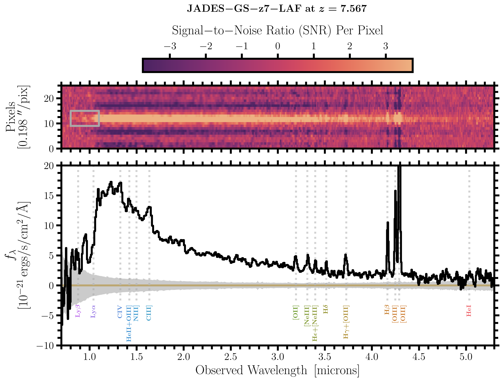

# arXiv Digest — 2026-09-30

- **Interest file used:** interests/2026.09.md (current month)
- **Categories pulled:** astro-ph.CO, astro-ph.EP, astro-ph.GA, astro-ph.HE, astro-ph.IM, astro-ph.SR, cs.LG, stat.ML, hep-ph
- **Papers scanned:** 1241 (126 astro-ph new/cross-listed + 1115 cs.LG/stat.ML/hep-ph & other non-astro)
- **After first filter:** 33 candidates reviewed with full text
- **Final selected:** 18 papers across 3 tiers

---

## Tier 1 — Highly relevant

### [Weak Lensing Measurements from the Lyman-$α$ Forest](http://arxiv.org/abs/2609.36949v1)

Anže Slosar
**Primary category:** astro-ph.CO

This is a first attempt at measuring **weak lensing of the Lyα forest on DESI DR1**. A quadratic estimator measures how local forest pair correlations depart from the sky mean, and the result is projected onto **deflection templates built from eleven low-z DESI DR1 + BOSS tracer samples**. The templates are validated against ACT DR6 and Planck PR4 lensing (0.99 ± 0.04 and 0.93 ± 0.03 of the predicted cross), and the estimator is validated with displacements injected into the real data. A new ingredient is the **quasar–forest cross-correlation**, which carries 44% of the weight. The result is **$A_L = 0.42\pm0.43$ (forest auto), $0.87\pm0.48$ (quasar–forest), and $A_L = 0.62\pm0.33$ combined**, consistent with both ΛCDM and no lensing. The paper forecasts a **10–20% lensing-amplitude measurement from full DESI**. The code was written almost entirely by AI agents under the author's guidance, and the repository is public.

### [Discovery of the Lyman-$α$ Forest in a Star-Forming Galaxy at $z \approx 7.57$: Implications for the Timing and Topology of Cosmic Reionization](http://arxiv.org/abs/2609.38080v1)

Jakob M. Helton, Joris Witstok, Marta Laska et al.
**Primary category:** astro-ph.GA

JADES NIRSpec/PRISM spectroscopy of a bright ($M_{\rm UV}\approx-21.5$) galaxy at $z=7.567$ shows **≈7σ transmitted flux blueward of Lyα**, i.e. a Lyα forest spanning roughly $z\approx6.6$–7.6. NIRCam F090W confirms it at ≈10σ, and the flux sits ≈0.4 pkpc from the UV centroid. No foreground interloper is found, though one cannot be formally excluded. Taken at face value, the flux implies an **extraordinarily transparent sightline with $x_{\rm HI}\ll0.1\%$**. That sightline passes through several known $z>5$ galaxy overdensities, including the most massive $z>6$ protocluster candidate in GOODS-S. The authors argue that luminous galaxies may contribute more to the ionizing budget than usually assumed. The smooth turnover at the break fits either an $N_{\rm HI}\approx10^{23.3}$ damping wing or strong nebular continuum.

*The 2D and 1D PRISM spectra show clear flux in the grey-boxed $\lambda_{\rm rest}\approx950$–1250 Å window, where a $z=7.57$ source should be fully absorbed. The emission lines marked across the spectrum pin the redshift.*

### [An Ionized Superstructure at Cosmic Dawn Revealed by a Foundation Model for Astrophysical Research](http://arxiv.org/abs/2609.36656v1)

Minghao Yue, Yongda Zhu, Jiani Ding et al.
**Primary category:** astro-ph.GA | also: astro-ph.CO

This is an independent companion analysis of the same galaxy (JADES-GS-217704, $z=7.567$). Here it was found by **outlier search in the embedding space of a self-supervised transformer foundation model (FM-JADES-v1)** among spectroscopically confirmed $z>7$ galaxies. Fitting the transmission places the ionized region at **$z_c = 6.80\pm0.07$, extending ~210 cMpc with $x_{\rm HI}\approx2\times10^{-6}$**. The effective optical depth is **$\tau_{\rm eff}=1.28\pm0.18$, typical of $z\approx5$**. None of the Keating et al. reionization simulations produces a 50 cMpc/h window with $\tau_{\rm eff}<4$, and the authors quote a ~$10^{-5}$ chance for a random sightline. They report **no photometric galaxy overdensity** around the transmission redshift, which they read as tension with inside-out reionization. The Helton et al. companion paper instead ties the sightline to known overdensities, so the environment question is contested.

*Compared with quasar and galaxy $\tau_{\rm eff}$ measurements, which exceed 4 by $z\gtrsim6.5$, this sightline's optical depth at $z\approx6.8$ matches the cosmic mean at $z\approx5$. That makes it an extreme early-reionization outlier.*

---

## Tier 2 — Adjacent / useful context

### [LIMFAST. V. Probing Reionization with the Synergy Between 21 cm and Photometric Galaxy Surveys](http://arxiv.org/abs/2609.35957v1)

Guochao Sun, Adam Lidz, Tzu-Ching Chang et al.
**Primary category:** astro-ph.CO | also: astro-ph.GA

21 cm foreground filtering removes the low-$k_\parallel$ modes, and photo-z smearing ($\sigma_z\gtrsim0.1$) kills the high-$k_\parallel$ modes. Together they normally erase the galaxy–21 cm cross-power for photometric Lyman-break samples. The fix is to **cross-correlate LBGs with the squared foreground-filtered 21 cm field**. Mode coupling moves surviving small-scale 21 cm power into modes the LBGs can see, which makes the statistic a projection of the galaxy–21cm–21cm bispectrum. LIMFAST Fisher forecasts over $6\lesssim z\lesssim10$ show a **high-significance detection for SKA-Low (1000 h) × Roman HLWAS ($m_{\rm AB}<27$) over 10 deg²**. The sign evolution of the large-scale cross-power constrains the ionization and thermal history of the IGM.

### [Current and Future Constraints on the Primordial Power Spectrum](http://arxiv.org/abs/2609.35964v1)

Zachary Cheslog, Emily Finson, Amanda MacInnis et al.
**Primary category:** astro-ph.CO | also: hep-ph

Planck+ACT+SPT with DESI DR2 excludes Starobinsky and Higgs inflation, and the Bi-thermal Big Bang, at ~2σ in ΛCDM(+α_s). **Freeing $N_{\rm eff}$ and $\sum m_\nu$ widens the $n_s$ contours enough to readmit them**, giving **$n_s = 0.9758\pm0.0064$ and $\alpha_s = 0.0080\pm0.0064$** in the nine-parameter model. The binned primordial spectrum is constrained to **0.5% at $k=0.2$ Mpc⁻¹ today**, forecast to reach 0.1% with SO/CMB-HD. CMB-HD would reach $k\sim30$ Mpc⁻¹ (to within a factor of ten). The paper matters as the CMB-side reference for the $n_s$/running/neutrino degeneracies that forest P1D analyses help break. The forecast code is public, and the CMB-HD likelihood now supports CLASS.

### [JWST lensed quasar dark matter survey V: Hints of self-interacting dark matter from 29 quadruply imaged quasars](http://arxiv.org/abs/2609.35974v1)

D. Gilman, A. M. Nierenberg, J. Gurian et al.
**Primary category:** astro-ph.CO | also: astro-ph.GA

The paper runs a population-level forward model of flux ratios, image positions and arcs for 29 quads. It infers two SIDM **core-collapse timescales for halos and subhalos in $10^6$–$10^{10.7}\,M_\odot$**. The data prefer core-collapsed perturbers, with **Bayes factors disfavouring CDM at 6:1 to 24:1**, or about 20:1 under the authors' preferred SIDM subhalo and globular-cluster assumptions. Explaining the data in CDM needs **~10× more globular-cluster surface density than expected plus more subhalos than N-body predicts**. The inferred timescales favour faster collapse in lower-mass halos, as velocity-dependent cross sections predict. This is small-scale-structure evidence that forest WDM/fuzzy-DM constraints will eventually have to be reconciled with.

### [Fooled by mass? Recovering the $Γ-λ_{Edd}$ relation of quasars from their X-ray variability](http://arxiv.org/abs/2609.37607v1)

Matilde Signorini, Andrea Sacchi, Bartolomeo Trefoloni et al.
**Primary category:** astro-ph.GA | also: astro-ph.HE

The sample is SDSS DR16Q × 4XMM-DR14: 7835 type-1 quasars. Across the population, the X-ray photon index shows almost no slope against Eddington ratio. The authors show this is **regression dilution: ~0.4 dex single-epoch virial-mass noise dominates the narrow intrinsic $\lambda_{\rm Edd}$ spread**, and mocks recover any true slope up to 0.4 as $|a|\lesssim0.03$. Using 893 multi-epoch quasars removes mass from the problem, and a hierarchical stack of per-object Γ–$L_{2\,\rm keV}$ slopes gives **$\langle a_X\rangle=0.35\pm0.03$ (≈0.43 for precise Γ), i.e. $a_\lambda\approx0.20$–0.25**. The coupling is real but shallow: Eddington ratio explains only ~1/5 of the Γ scatter and cannot produce the very steep spectra of little red dots.

### [MEGATRON: The Physical Origins of Steep UV Slopes at High Redshift](http://arxiv.org/abs/2609.36124v1)

Harley Katz, Nicholas Choustikov, Aayush Saxena et al.
**Primary category:** astro-ph.GA

Parsec-resolution radiation-hydrodynamics zooms with non-equilibrium chemistry are used to ask why some $z>6$ galaxies have spectroscopic slopes of $\beta<-2.8$. Some of these extremely blue galaxies are genuine high-$f_{\rm esc}$ leakers. These need very bursty star formation and are biased to low mass. A **second population has $f_{\rm esc}<1\%$**. Their ISM is so diffuse that **ionization fronts take longer to reach the Strömgren radius than massive stars live**, so the nebular continuum lags and the spectrum looks bluer than equilibrium photoionization predicts. The conclusion is that **a steep UV slope is not a clean escape-fraction indicator**. This matters for inferring reionization photon budgets from β.

### [Constraining Reionization with Persistent Homology: a Novel Summary Statistic for Wide-Field Lyman-$α$ Emitter Observations](http://arxiv.org/abs/2609.36092v1)

Michael M. Wyatt, Nikolaos Triantafyllou, Steven R. Furlanetto et al.
**Primary category:** astro-ph.CO | also: astro-ph.GA

LAE surveys like SILVERRUSH are forward-modelled at $z=5.7$ and 6.6 with 21cmFASTv4 plus an empirical Lyα luminosity model. The paper compares the **Betti-0 curve from persistent homology** with the angular correlation function (ACF) and the void probability function (VPF) as summary statistics for $x_{\rm HI}$. Betti-0 alone does **as well as or better than either** (σ ≈ 0.05 vs 0.08 for the ACF at $x_{\rm HI}=0.05$, $z=5.7$). Because the three statistics are sensitive to different scales, **combining all three halves the ACF-only error** (σ ≈ 0.03 and 0.07 at the two redshifts). The ranking holds with interlopers and under the approximate astrophysical-robustness test. Only cosmic variance enters the Fisher errors.

### [JEPA Learns What the Mask Leaves Unrecoverable](http://arxiv.org/abs/2609.32481v1)

Peng Xie, Amr Alanwar
**Primary category:** cs.CV | also: cs.LG

The paper explains why JEPA needs block masks. **A mask is a linear measurement, and wavelet atoms inside the hidden region fall in its null space.** A target that a low-level prior can recover gives the EMA target encoder a self-consistent shortcut. What forces semantic learning is the **coarse-scale content the mask leaves unrecoverable, plus enough reachable context**, and this can be scored before training. In 151 pre-training runs, **strip masks match blocks in area and contiguity but are recoverable, and score 40.3% vs 64.3% linear top-1** on ImageNet-100. With a frozen target the random-vs-block gap collapses from 19 to 1.5 points. The authors report that the account fails on spectrograms. This directly informs masking design for self-supervised pretraining on 1D spectra.

### [When Is an SAE Feature Interpretable? A Validation Ladder for EEG Foundation Models](http://arxiv.org/abs/2609.34091v1)

Yucong Cao, Chenqi Li, Tingting Zhu
**Primary category:** cs.LG

The setup is SAEs on three EEG foundation-model backbones (27 settings). There, removing alpha-band power changes **latent firing 7.3× more than an equal-width sham notch**, which looks like clean "alpha detectors". **Normalizing by removed spectral energy drops the ratio to 0.28×**, and it exceeds 1 in none of the 27 settings. The selected latents are also slightly *anti*-correlated with alpha power on clean data, and a linear readout does not depend on them. The proposed **validation ladder** asks four questions in turn: does the latent respond, does the response survive a distortion control, is it specific, and is the property visible on unperturbed data. A task-relevance test comes separately. It transfers directly to interpreting SAE features in a spectral foundation model.

### [Rethinking Circuit Evaluation: Do Circuits Explain Model Errors?](http://arxiv.org/abs/2609.35686v1)

Li Zhang, Chuqin Geng, Mark Zhang et al.
**Primary category:** cs.LG | also: cs.AI

The benchmarks are IOI, Docstring, and six MIB model–task settings. Circuits validated by ablation **agree with the model on 97.3–99.5% of its correct IOI answers but only 11.4–41.7% of its errors** (GPT-2 small, mean ablation). This holds even for circuits trained against the full output distribution. Restoring a few omitted attention heads raises **error reproduction from 14.2% to 75.1%** on held-out prompts, at a 0.41-point cost in correct agreement. That beats matched random extensions, and intervention traces show how the missing computations produce specific wrong answers. The proposal is **exact error reproduction as a necessary test of circuit explanations**.

### [First Learn, Then Memorize: The Spectral Bias of Diffusion Models](http://arxiv.org/abs/2609.35377v1)

Raphaël Urfin, Tony Bonnaire, Giulio Biroli et al.
**Primary category:** cs.LG | also: cond-mat.dis-nn

The paper explains why diffusion models generalize long before they memorize. Score training dynamics are governed exactly by the **NTK Gram matrix on noisy training data**. **Using $m$ noise realizations per sample splits its spectrum into two bulks.** The large-eigenvalue bulk carries global features and sets generalization. The small-eigenvalue bulk lies along sample-specific noise directions and sets a **memorization timescale that grows with $n$**. The spectrum is solved analytically in the lazy high-dimensional limit (linear and polynomial sample complexity), with a bias–variance decomposition. The same structure appears in convolutional NTKs on CelebA and in feature-learning U-Nets. Causal tests confirm it: rank truncation tunes the transition, and an $L_2$ penalty on the second bulk suppresses memorization.

### [It Just Takes Two: Scaling Amortized Inference to Large Sets](http://arxiv.org/abs/2605.07972v1)

Antoine Wehenkel, Michael Kagan, Lukas Heinrich et al.
**Primary category:** cs.LG | also: hep-ex, stat.ML

In neural posterior estimation, observations often come as sets that share nuisance parameters, as with many sightlines or events. End-to-end training at the deployment size $N$ is prohibitive. **PAIRS trains a mean-pool Deep Set encoder on sets of at most two elements**, then fine-tunes the posterior head on pre-aggregated embeddings. That makes training cost essentially independent of $N$. The main theorem shows that **the $N\le2$ encoder recovers the same representation as one trained at any cardinality, up to an affine map**, which implicitly assumes an exponential-family marginal likelihood. PAIRS matches the analytic posterior up to $N=10^5$ and tracks MCMC on a nuisance-coupled bump hunt. On four realistic tasks it matches or beats end-to-end training at a fraction of the compute.

### [High-Dimensional Simulation-Based Inference in Latent Spaces](http://arxiv.org/abs/2609.37381v1)

Lars Kühmichel, Stefan T. Radev, Bhanu Prasanna Koppolu et al.
**Primary category:** cs.LG | also: stat.ML

SBI usually compresses the observations. This paper instead **compresses the parameters when they are high-dimensional** (fields, images). An autoencoder is fit to the prior over θ, posterior inference runs in its latent space, and samples are decoded back. The authors state when **latent inference recovers the true posterior**, with an error bound split into posterior, code and decoder terms. Across four case studies and three generative families, at matched compute, **latent SBI matches direct inference in accuracy and marginal calibration while sampling more than an order of magnitude faster**. Caveats: the code is trained on θ alone, so it can discard directions the data constrain, and decoded samples lose high-frequency detail. The approach is relevant to field-level or initial-condition inference.

---

## Tier 4 — Meta-research about the field

### [Reconstructing Implicit Scientific Knowledge: Evaluating LLM Agents through End-to-End Reproduction of Astronomy](http://arxiv.org/abs/2609.35900v1)

Yuehui Wang, Xinyu Qi, Guirong Xue et al.
**Primary category:** astro-ph.IM

A multi-agent workflow that separates execution from verification attempted end-to-end reproductions of 14 astronomy papers: one ApJ case study and 13 Nature papers. **Eleven of the 13 Nature papers contained an ambiguity that prevents a uniquely specified reproduction path**. The findings are listed as audit observations, not errors. In the controlled case study, **12 pre-registered analysis paths gave 2.16–3.53 kpc for the same quantity**, and only one recovered the published ~2.70 kpc. The decisive +0.02 mas parallax zero-point correction was in the paper, but the agents did not connect it to the fit until its effect became visible. The argument is that **matching a published number does not validate reconstructed reasoning**, and that the bottleneck is often connecting information rather than retrieving it.

### [Machine learning for the LHC physics program: a 2025-2026 stocktake](http://arxiv.org/abs/2609.32874v1)

Jesse Thaler
**Primary category:** hep-ph | also: cs.LG, hep-ex

This is the write-up of an LHCP 2026 plenary whose **slides were produced by an agentic AI pipeline** under the author's direction. The pipeline read the 103 top-ranked HEPML papers in full, from 569 posted May 2025–April 2026, and ran independent verifier passes on every number. HEP-ML output rose **~45% (33 → 47 papers/month)**. "AI agents / LLMs" is the steepest-rising theme (**share lift 7.08**, 6 → 47 papers). Uncertainty, calibration and interpretability is the largest (114 papers). The six claims are that ML became infrastructure, that SBI and foundation models are converging, that agents are the new front (but none yet produce adoptable measurements), and that trust is the fastest-growing agenda. The paper states its conflict of interest candidly: an Anthropic model is reviewing work partly done with Anthropic models.

### [The Preprint Evolution: The Rise of Unreviewed Drafts on arXiv and its Implications for Astronomy](http://arxiv.org/abs/2609.35787v1)

Luigi Rolly Bedin
**Primary category:** astro-ph.IM | also: cs.DL

The paper parses the self-reported comment field of all astro-ph submissions from 2016 to Aug 2026. It finds that **the share of papers never marked accepted rose from 36.4% (2016) to ~47% (2025)**. In the 2026 v1 feed, **only 40.9% are explicitly accepted**, against 16.8% labelled drafts and 42.3% with no status. The author proposes **splitting arXiv into a peer-reviewed "Level 1" stream and a pre-review "Level 2" stream**, to cut reading load and stop drafts from establishing priority. The analysis is thin: "no status comment" is counted as unvetted, although many accepted papers never update the field. It is an opinion piece, relevant to how this digest itself filters papers.
