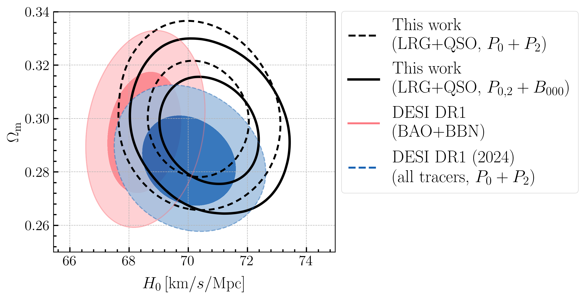

# arXiv Digest — 2026-10-02

- **Interest file used:** interests/2026.09.md (fallback — no 2026.10.md exists yet)
- **Categories pulled:** astro-ph.CO, astro-ph.EP, astro-ph.GA, astro-ph.HE, astro-ph.IM, astro-ph.SR, cs.LG, stat.ML, hep-ph
- **Papers scanned:** 568 (85 astro-ph new/cross-listed + 483 cs.LG/stat.ML/hep-ph & other non-astro)
- **After first filter:** 28 candidates reviewed with full text
- **Final selected:** 16 papers across 4 tiers

---

## Tier 1 — Highly relevant

### [Cosmological inference from a joint DESI DR1 full-shape power spectrum and bispectrum analysis](http://arxiv.org/abs/2610.01836v1)

Caroline Guandalin, Prakhar Bansal, Pedro Carrilho et al.
**Primary category:** astro-ph.CO

The authors run a joint full-shape fit of the three DESI DR1 LRG bins and the **QSO sample ($0.8<z<2.1$)**. They use a **one-loop EFT power spectrum plus a tree-level bispectrum in the Tripolar Spherical Harmonics basis**, where the window convolution becomes a cheap linear transform of the theory multipoles. Their $P_0+P_2$ results reproduce the official DESI DR1 full-modelling constraints. In single-tracer fits, adding the bispectrum monopole $B_{000}$ **tightens $\omega_{\rm cdm}$ by 9–18% and $\ln(10^{10}A_s)$ by 8–20%**, mainly by pinning down the second-order biases $b_2, b_s$. **Once all tracers are combined the gain drops to 6% and 4%**, because the different tracers' power spectra already break much of the bias–cosmology degeneracy. The quadrupole $B_{202}$ adds almost nothing, and in $w_0w_a$CDM the bispectrum barely changes the dark-energy posterior, which stays prior-sensitive.

*The joint LRG+QSO $\Omega_{\rm m}$–$H_0$ constraints, with and without $B_{000}$, agree with both the DESI DR1 BAO+BBN result and the official DESI full-modelling analysis (which also used BGS and ELGs).*

### [The hidden advantage of mask resampling: a theory of masked autoencoders](http://arxiv.org/abs/2610.01578v1)

Jorge Medina Moreira, Lorenzo Bardone, Lenka Zdeborová
**Primary category:** stat.ML | also: cond-mat.dis-nn, cs.LG

This is a solvable high-dimensional model of masked-autoencoder pretraining on data with one shared latent direction and heterogeneous (heteroskedastic) noise. The authors prove that **masked linear reconstruction recovers the latent feature at linear sample complexity where unmasked reconstruction (equivalent to PCA) fails**, because PCA latches onto high-variance nuisance directions. Using replica calculations, they then isolate a second, separate benefit: **mask resampling, i.e. drawing $K$ fresh masks per sample, lowers the sample complexity needed to recover the feature**, with diminishing returns as $K$ grows. A practical implication is that **random crops and flips in standard pipelines can hide the advantage of dynamic masking**. With them removed, dynamic masking beats static masking in CNN autoencoders and ViTs, and a BERT pilot shows the same trend. This bears directly on spectral pretraining with heteroskedastic per-pixel noise, where geometric augmentations are often unavailable.

*Across the solvable model, a CNN on CIFAR-10 and a ViT on ImageNet-100, re-drawing masks every epoch (blue) beats a fixed mask per sample (yellow) and unmasked reconstruction (red). At a suitable masking ratio, mask resampling alone matches the accuracy of training with crops and flips.*

---

## Tier 2 — Adjacent / useful context

### [Constraining the density distribution of the cold Circumgalactic Medium of quasars at z>2 through Lya, HeII and Ha emission](http://arxiv.org/abs/2610.01454v1)

Andrea Travascio, Sebastiano Cantalupo, Titouan Lazeyras et al.
**Primary category:** astro-ph.GA

The authors combine Keck/KCWI Lyα+HeII maps with MOSFIRE Hα follow-up of 13 quasars at $z\sim2.2$. This is **the first statistical quasar-CGM sample with all three lines** measured in matched apertures out to ~35 pkpc. The stacked ratios are **Lyα/Hα = 9.1, HeII/Hα = 0.54 and HeII/Lyα = 0.06**, consistent with recombination-dominated emission. CLOUDY photoionization grids show that single-density clouds would need $n>10$ cm$^{-3}$ or implausibly soft AGN spectra to give such low HeII/Hα. A **lognormal density PDF works only with a heavy high-density tail, formally a clumping factor $C\sim10^3$–$10^4$**. In 14 of 26 MUSE quasars at $3.1<z<4.5$, HeII/Lyα shows no strong evolution with redshift. These density constraints feed directly into how one models small-scale cold gas around the quasars used as forest backlights.

### [Resolving the physics of Quasar Lyα Nebulae (RePhyNe): II. The dense and clumpy CGM of Quasars at z ~ 3.5](http://arxiv.org/abs/2610.01400v1)

Titouan Lazeyras, Sebastiano Cantalupo, Andrea Travascio et al.
**Primary category:** astro-ph.GA

In this companion paper, MUSE quasar Lyα nebulae at $z\sim3.5$ are compared with mocks from the new DaLya zooms and from COLIBRE (m6, m5) and HELLO, under maximal fluorescence. **Every simulation except high-resolution COLIBRE m5 predicts too many faint pixels**, so the simulated Lyα covering fraction never reaches the observed ~100%. Circularly averaged SB profiles still look acceptable, so they are a weak test of CGM physics. The simulated cold-gas density PDFs are **skewed lognormals with clumping factors 16–102**. The HeII/Lyα constraint does not depend on the fluorescence assumption, and it **requires a PDF at least 8× clumpier at fixed median density**. The conclusion is that cold CGM gas is too diffuse in current simulations at $z\sim3.5$, and self-shielding and cooling details are suspects.

*The DaLya cold-gas density PDF in the 50–160 ckpc annulus is much narrower than the lognormal that the observed HeII/Lyα ratio requires for $\log n_0=-2$ ($\sigma\ge2.6$, grey line, which is a lower limit). Simulations underproduce the dense tail.*

### [Non-Gaussian Parameter Bias: Formalism and Validation](http://arxiv.org/abs/2610.02104v1)

Nikolina Šarčević, Matthijs van der Wild, Elena Sellentin
**Primary category:** astro-ph.CO

This paper replaces the standard Fisher-bias formula for systematics-induced parameter shifts with **expressions built on the DALI higher-order likelihood expansion**. It gives separate analytic predictions for the posterior MAP and the posterior mean, which differ once the posterior is non-Gaussian, plus a response expansion in the systematic amplitude. In a nonlinear two-parameter benchmark checked against MCMC at a covariance-weighted mismatch $d_{\rm data}=5$, **Fisher gets the direction of one parameter's shift wrong and is off by a Fisher distance of 23.1, while DALI is off by only 0.091**. Two more results matter for systematics budgets: equal-significance mismatches pointing in different directions produce very different biases, and **several additive systematics can combine non-additively**. This is a useful tool for budgeting continuum, BAL or thermal-model mismatches in non-Gaussian P1D/P3D posteriors.

### [Constraining Primordial Magnetic Fields with Weak Lensing](http://arxiv.org/abs/2610.00485v1)

Anna D'Ambrosio, Matteo Viel (Viel: high-value forest/DM author)
**Primary category:** astro-ph.CO

The authors evolve PMF-enhanced small-scale linear power, $P_B\propto B_{\rm 1Mpc}^2k^{n_B}$, through 18 dark-matter-only N-body runs. From these they build an **emulator for the tomographic convergence power spectrum that includes intrinsic alignments and a baryon-correction model**. PMFs show up as excess power at very high multipoles. MCMC on ΛCDM mocks gives **$B_{\rm 1Mpc}<1.6$, 1.0 and 0.8 nG (95%) for $\ell_{\max}=5000$, $10^4$ and $2\times10^4$**. Recovering non-zero fields depends strongly on $n_B$, because $n_B=-2.1$ is much easier to detect than $-2.7$. **PMF parameters show no clear degeneracy with IA or baryon feedback**, though $B_{\rm 1Mpc}$ and $n_B$ are degenerate with each other. The same small-scale power excess is what forest P1D constrains (they cite earlier Lyα PMF bounds), so this is a natural cross-check of that probe.

### [Recycling serendipitous observations of XRISM for dark matter searches](http://arxiv.org/abs/2610.01877v1)

Lidiia Zadorozhna, Denys Malyshev, Oleg Ruchayskiy
**Primary category:** astro-ph.HE

The authors take the **60 lowest-background public XRISM/Resolve pointings** more than 10° from the Galactic Centre (2.9 Ms screened) and search 3.48–3.56 keV for a decay line from the Milky Way halo. They use a joint fit and a Doppler-corrected stack, which works only because Resolve's eV resolution can follow the halo's line-of-sight velocity. The **sterile-neutrino mixing limits are on average 70% stronger than XRISM's galaxy-cluster bounds**, despite the smaller exposure. They also report a **residual at 3.5311 keV with ~3σ local significance**, coincident with the old unidentified 3.5 keV feature and with no plausible atomic or instrumental counterpart. Per-field and sky-distribution checks test where its photons come from. The bounds tighten automatically as more pointings become public.

### [Which Milky Way Streams Make the Best Dark Matter Detectors?](http://arxiv.org/abs/2610.00456v1)

Vedant Chandra, Charlie Conroy, Risa Wechsler et al.
**Primary category:** astro-ph.GA

The authors combine **galacticus semi-analytic subhalo populations (with disk tidal stripping and LMC subhalos)** with particle-spray fits to 24 observed globular-cluster streams. From these they forecast stream–subhalo encounters. The ten most perturbed streams each see **≈2–12 encounters with $v_{\rm kick}>0.1$ km/s**, and the encountering subhalos are stripped to 1–20% of their peak mass and **twice as compact as usually assumed**. The authors also compare the encounter mass spectrum with a 6 keV WDM model (half-mode mass $4\times10^7\,M_\odot$), and argue that **sub-km/s radial-velocity surveys of these streams could reveal subhalos below the galaxy-formation threshold**. The dominant uncertainty is the abundance of subhalos in the inner Galaxy, where semi-analytic models and N-body simulations still disagree by about a factor of two. This complements forest WDM limits with a probe at far smaller mass scales.

*Jet, AAU, GD-1 and Palomar 5 lead in expected significant CDM-subhalo encounters, and Jet has about twice as many as any other stream. These are the streams to target with high-precision radial velocities.*

### [Close Pulsar Pairs See Dark Matter Substructure through the Gravitational-Wave Background](http://arxiv.org/abs/2609.38305v1)

Abhiram Cherukupalli, Vincent S. H. Lee, Kim V. Berghaus et al.
**Primary category:** astro-ph.CO | also: hep-ph

The nanohertz gravitational-wave background (GWB) now limits pulsar-timing searches for DM subhalo flybys. This paper notes that **for pulsars separated by much less than the GWB coherence length, the GWB perturbation is nearly identical**, while a nearby subhalo perturbs the two pulsars differently. **Timing the difference of residuals** therefore suppresses the GWB and keeps the DM signal. An array of pairs separated by ~0.1 pc **improves sensitivity to ~$10^{-6}\,M_\odot$ subhalos by more than an order of magnitude** over an otherwise identical array of widely separated pulsars. Dense globular clusters such as Terzan 5 naturally host such pairs, but the baryonic environment of the cluster must be modelled separately. This is a clean way to probe the smallest-scale DM structure, far below forest scales.

*SNR of the loudest flyby rises as pair separation drops below the GWB coherence scale $d_{\rm coh}$. The gain is bounded by mass-dependent DM suppression at $r_{\rm DM}$ and by white noise below $d_{\rm white}$.*

### [Galaxy Protoclusters as Drivers of Cosmic Reionization: II. Te-Based Metallicities of Lyman-α Emitters](http://arxiv.org/abs/2610.01811v1)

C. Moya-Sierralta, C. L. Martin, L. F. Barrientos et al.
**Primary category:** astro-ph.GA

JWST/NIRSpec G395H detects [O III]λ4363 in five of six LAEs inside the **LAGER-z7OD1 protocluster at $z\approx6.93$**. These are the first direct-method ($T_e$) metallicities in a reionization-era protocluster. Individual values span $12+\log({\rm O/H})\approx7.2$–8.0, and the weighted stack gives **$7.76^{+0.06}_{-0.05}$, about 0.26 dex above field-LAE stacks**. Dust uncertainty from the Balmer decrement is propagated by Monte Carlo. The members nevertheless **fall below the established mass–metallicity relation**. The authors read this as accelerated assembly in the overdensity combined with dilution by pristine IGM inflow. This is a direct look at the ionizing-source population in an overdense region during late reionization.

### [When Do Biological Reasoning Models Use Their Biological Inputs?](http://arxiv.org/abs/2610.00898v1)

Ada Fang, Nikitha Thoduguli, Lukas Fesser et al.
**Primary category:** cs.LG

The authors test six "biological reasoning" models that feed foundation-model embeddings (Evo2, ESM3, etc.) plus text into an LLM. Their tools are **input shuffles, evidence conflicts that pair one genome's or protein's embedding with another's annotations, linear probes, and trace analysis**. For BioReason and BioReason-Pro, **shuffling the DNA barely changes accuracy, and in evidence conflicts the models follow the text 97.9% and 99.7% of the time**. Linear probes show that the Evo2/ESM3 embeddings do encode the targets, so the LLM is simply not using them. **Across 42 SFT/RL checkpoints, higher accuracy did not come with more reliance on the foundation-model input**, and reasoning traces misstate nucleotide changes. Some models (ChatNT, Prot2Text-V2, CellWhisperer) do use their inputs. The lesson for any spectrum+text or spectrum+metadata model is to check with input interventions that the spectral embedding actually drives the answer.

### [Group-Invariant Statistics Determine Embedding Geometry: Harmonic Analysis of Representations from Bach to the Night Sky](http://arxiv.org/abs/2610.00647v1)

Liam Storan, Andreas Tolias, Nina Miolane
**Primary category:** cs.LG

Earlier work explained why months sit on circles in LLMs via cyclic translation symmetry in co-occurrence statistics. This paper generalizes that to any finite or compact group: **if the co-occurrence statistics of a word family are invariant under a group $G$, the learned embeddings are matrix elements of $G$'s irreducible representations**. Three tests confirm it: months ($\mathbb{Z}_{12}$, Fourier circles), Bach chords under transposition and inversion (dihedral irreps, which **imply the circle of fifths in learned chord embeddings**), and celestial objects. In the last case, **the sphere of 188 sky objects found in Mistral Large 2's residual stream is explained as a spherical-harmonic embedding** inherited from $SO(3)$-invariant text statistics. The result gives a principled prediction of representation geometry from data symmetry, which is useful when interpreting what a spectral foundation model should encode, for example redshift or rest-frame shift structure.

*The symmetry of the co-occurrence statistics sets the geometry: cyclic shifts ($\mathbb{Z}_{12}$) give a circle for months, transposition/inversion ($D_{12}$) gives a dodecagonal prism for chords, and 3D rotations ($SO(3)$) give a sphere for celestial objects.*

### [Every Ablation Is a Dose: Counterweights and the Semblance of Self-Repair](http://arxiv.org/abs/2610.02173v1)

Areeb Ahmad, Pratinav Seth, Vinay Kumar Sankarapu
**Primary category:** cs.LG | also: cs.CL

Self-repair is the observation that downstream components compensate when one is ablated, and it undermines ablation-based attribution. This paper proposes a single mechanism for it. Every intervention on a core component is treated as a point **$\lambda$ on a signed "dose" axis of class contrast**, with zero, mean and resample ablation as uncalibrated points on that axis. On a factual true/false task in Gemma, Qwen, LLaMA and Mistral, downstream units follow an **affine law $E_r(\lambda)=\mathrm{own}_r+\gamma_r\lambda$ for 68 of 81 directions**, and the sign of $\gamma_r$ marks counterweights versus reinforcers. **The coupling slope can be predicted from weight alignment alone** ($\rho\approx0.73$), and the same backups already exist in base models. On GPT-2 IOI, 7 of 10 reachable heads follow the law and all 7 are counterweights. **Self-repair is a pre-existing coupling released by ablation, not a reactive process.**

### [Are We Recovering Mechanisms? Objective-Level Recovery Gaps in Mechanistic Interpretability](http://arxiv.org/abs/2610.02098v1)

Chuqin Geng, Li Zhang, Haolin Ye et al.
**Primary category:** cs.LG

Circuit discovery picks and validates circuits by intervention-defined faithfulness. This paper shows that **faithfulness can prefer an equally sized circuit that reproduces the intact model's behaviour worse**. The problem appears both under controlled reference edits, with no discovery algorithm involved, and among real outputs of EAP, EAP-IG, ACDC and Edge-SP. Under ordinary resampling, **KL misranks 9.4–41.2% of candidate pairs** on the human-reference tasks, so simply avoiding zero ablation does not fix it. The proposed cause is **context distortion**: replacing excluded signals changes the inputs that retained components operate on. Restoring those signals from the intact run **repairs 96 of 100 persistent misrankings** without changing the circuits. The practical advice is to report a fixed behavioural criterion alongside faithfulness, or better search will keep finding the wrong mechanism.

---

## Tier 3 — Outside my area but notable

### [Near-Noiseless Single-Photon Detection in the Infrared with a Megapixel Semiconductor Array for Low-Background Astronomy](http://arxiv.org/abs/2610.00799v1)

Guillaume Huber, Pavaman Bilgi, Charles-Antoine Claveau et al.
**Primary category:** astro-ph.IM

This paper demonstrates **single-photon-resolving operation in a megapixel HgCdTe linear-mode avalanche photodiode array at conventional cryogenic temperature**, a regime previously reserved for superconducting detectors and their sub-kelvin cryogenics. Avalanche gain lifts each photon's step in non-destructive up-the-ramp reads above the read-noise floor while leaving dark signal largely unamplified. The result is **~2 false counts per thousand reads per pixel**, and detected jump counts scale linearly with illumination. Remaining issues are defects, uniformity and persistence. **3-side-buttable 2k×2k arrays with faster readout are in design.** If it scales, this changes the noise budget for HWO exoplanet spectroscopy and for any photon-starved NIR spectroscopy of faint high-z sources.

*At high avalanche gain, individual photons appear as discrete steps in a pixel's up-the-ramp signal (red), absent in dark data. The frame-to-frame differences show these jumps clearly exceeding the read noise.*

---

## Tier 4 — Meta-research about the field

### [Best practices in software citation](http://arxiv.org/abs/2610.00528v1)

Phil R. Van-Lane, Floor S. Broekgaarden, Daniel S. Katz et al.
**Primary category:** cs.DL | also: astro-ph.IM

This white paper comes out of a NASA-funded April 2026 workshop on why software citation in (largely astronomy) research remains inconsistent and rarely machine-actionable. It covers four themes: **cultural barriers, missing norms, gaps in infrastructure and workflow, and new problems from AI-assisted research**, where model-mediated contributions have no citation mechanism at all. Each theme gets targeted interventions with assigned responsibilities. The main conclusions are that **journal editors and publishers are the single highest-leverage point** for change, and that **correct citation has to become the path of least resistance inside researchers' existing workflows**. It is relevant to how credit for pipeline and emulator code is handled in collaborations like DESI.
