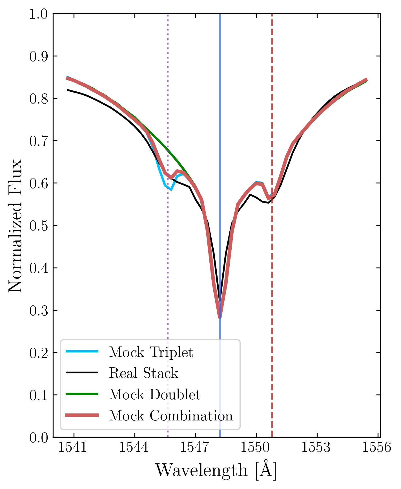

# arXiv Digest — 2026-10-07

- **Interest file used:** interests/2026.09.md (fallback — no 2026.10.md exists yet)
- **Categories pulled:** astro-ph.CO, astro-ph.EP, astro-ph.GA, astro-ph.HE, astro-ph.IM, astro-ph.SR, cs.LG, stat.ML, hep-ph
- **Papers scanned:** 514 (115 astro-ph new/cross + 399 cs.LG/stat.ML/hep-ph and cross-lists)
- **After first filter:** 30 candidates reviewed with full text
- **Final selected:** 12 papers across 3 tiers

---

## Tier 1 — Highly relevant

### [Radiation pressure powers quasar broad absorption line winds but fails to drive galaxy feedback](http://arxiv.org/abs/2610.07624v1)

Braden Seefeldt-Gail, Lluís Mas-Ribas, Norman Murray
**Primary category:** astro-ph.GA

Using **81,388 C IV broad absorption troughs from SDSS-IV DR16 quasars** (identified with `baltools`, the same BAL tooling behind DESI BAL masking), the authors stack troughs on their flux minimum and detect a third absorption component 497 km/s blueward of the doublet: the signature of **C IV line locking**. A KDE-based mock framework of trough spectra without locking reproduces the doublet but not this feature, and red-component misalignment contamination is held below 1%; a three-component fit gives **a line-locking fraction of 60–70%**, so radiative line driving dominates BAL wind acceleration across 2,100 to 13,200 km/s. Measuring absorbed flux over 900–1600 Å for 116,428 troughs gives a median mass outflow rate of 0.08 M☉/yr and **a median kinetic luminosity of ~0.01% of L_bol**, 50–500× below what simulations' quasar-mode feedback assumes. DBSCAN also separates out a narrow, high-velocity, unlocked population that looks more like intervening absorbers than wind, which matters for anyone masking BALs in forest analyses.

*Real DR16 stack (black) against no-locking mocks (green) and a 2/3-locked mixture (red): the extra dip at 1545.6 Å only appears when line-locked troughs are included, so it is physical, not a stacking artifact.*

### [Armillary: A Label-Free Coordinate System for Stellar Spectra](http://arxiv.org/abs/2610.07112v1)

Yuan-Sen Ting, Serat Saad (Ting is on the high-value author list)
**Primary category:** astro-ph.IM | also: astro-ph.GA

Armillary builds coordinates for a spectral sample from the spectra alone: **a Wasserstein distance between signed, normalised absorption profiles**, a nearest-neighbour graph, and geodesic (shortest-path) distances that generalise the Baron & Ménard Sequencer from a 1D ordering to multidimensional coordinates. The same graph then transfers labels from a handful of stars to all others without deep learning. Its four coordinates map linearly onto the Kiel diagram better than PCA, t-SNE, UMAP or a tuned autoencoder, recovering 91% of the T_eff variance and 96% of the log g variance. **With 32 training stars it recovers APOGEE T_eff/log g/[M/H] to 100 K, 0.18, 0.083 dex**, and on 104,799 DESI stars it transfers APOGEE labels even at S/N ≈ 20. The central argument, that a physics-respecting distance makes the spectral manifold legible to classical tools, applies directly to judging or regularising latent spaces of spectral foundation models.

*A linear map from each representation to (T_eff, log g): Armillary's label-free coordinates reproduce the ASPCAP Kiel diagram with higher R² than PCA, t-SNE, UMAP, the Sequencer, or an autoencoder.*

---

## Tier 2 — Adjacent / useful context

### [Mitigating prior-volume effects in galaxy clustering by adopting Mpc over Mpc/h units](http://arxiv.org/abs/2610.08751v1)

Andrea Pezzotta, Alejandro Pérez-Fernández, Giosuè Gambardella et al.
**Primary category:** astro-ph.CO

The authors show that much of the **prior-volume (projection) effect** in EFT and VDG∞ full-shape analyses comes from putting nuisance priors in Mpc/h units, which ties the nuisance hypervolume to h. The Laplace term of the marginalised χ² is much flatter in Mpc units, and fixing h removes the residual difference. On synthetic Euclid-like and DESI-like data, **simply working in Mpc reduces several-σ shifts in w0waCDM to within 1σ**, which is as good as Jeffreys priors or the TCM reparametrisation. Using σ12 instead of σ8 in the reparametrisation also fixes the Mpc/h case. The low-w0, high-h direction of the bias matches what was seen in BOSS and DESI full-shape fits, so this is a practical check on DESI DR2 full-shape constraints.

*In the (w0, wa) plane the Mpc/h analysis (red) is pulled away from the fiducial ΛCDM point while the Mpc analysis (light blue) is centred on it; rescaling the Mpc/h priors to match the Mpc ones reproduces the Mpc result.*

### [And Then There WEre Baryons (ATWEB): The Baryon Budget of the Universe in Halos and the IGM over 13 Billion Years of Cosmic Time](http://arxiv.org/abs/2610.07140v1)

Mohammadreza Ayromlou, G. Mark Voit, Thomas H. Reiprich et al.
**Primary category:** astro-ph.CO | also: astro-ph.GA

Across TNG, EAGLE and SIMBA, baryons are systematically less concentrated in halos than dark matter at every epoch. By z = 0, 43–46% of the dark matter but only 17–28% of baryons sit in halos above 10^10 M☉, leaving **72–83% of baryons in the IGM**, consistent with FRB censuses. The paper adds compensation radii and closure/compensation envelopes to the closure radius. **Galaxy groups (~10^12–13.5 M☉) dominate the redistribution of baryons into the IGM**, with closure radii of 2–7 cMpc at z ≲ 2 but **no redistribution beyond ~1 cMpc at z > 3**. The compensation envelope coincides with the scale where the matter power spectrum recovers its gravity-only form, which is a useful prior on how far feedback can perturb the IGM at forest redshifts.

*Baryons (solid) fall further behind dark matter (dotted) in halo occupancy as the Universe ages in all three simulations, and the inferred IGM share sits within the FRB-based estimates (grey points, right axis).*

### [Fast and accurate differentiable code of the galaxy power spectrum based on Eulerian and Lagrangian one-loop perturbation theories](http://arxiv.org/abs/2610.08023v1)

Yosuke Kobayashi, Kazuyuki Akitsu
**Primary category:** astro-ph.CO

`elf` is a JAX implementation of the **one-loop EFT redshift-space galaxy power spectrum in both Eulerian and Lagrangian PT**, and the first auto-differentiable LPT version, with the exponentiated-displacement integrals handled carefully. After JIT compilation it evaluates both spectra in milliseconds on a GPU, with **~0.01% relative error for k ≲ 1 h/Mpc** against brute-force integration. HMC inference on N-body halo spectra runs two orders of magnitude faster than standard Cobaya MCMC. The authors list the Lyα forest EFT as an intended extension, and the gradient access helps Fisher forecasts and score compression.

### [When, Why, and How CMB Compression Fails](http://arxiv.org/abs/2610.08728v1)

Davide Pedrotti, William Giarè, Hanyu Cheng et al.
**Primary category:** astro-ph.CO

Comparing the full Planck likelihood with a ΛCDM-calibrated compressed CMB likelihood, both combined with DESI BAO and PantheonPlus, across six extended models gives a clear rule. **Compression holds for late-time dark-energy extensions (wCDM, CPL, sign-switching Λ) that leave dark-matter evolution standard**. It **fails for any model that modifies the dark-matter background** (interacting DE, decaying DM, ΛwDM), even when the modification acts only at late times, because the map from Ω_m h² today to the matter density at recombination breaks. In those cases, the authors' PostModes posterior-geometry tool shows shifted, rotated and mode-reordered posteriors, with marginalised errors off by up to an order of magnitude. This is a useful check before combining forest or BAO data with compressed CMB priors in non-standard dark-sector fits.

### [Inference and learning in sparse autoencoders as natural gradient flow](http://arxiv.org/abs/2610.07389v1)

Hadi Vafaii, Tejas Rao, David Chanin et al.
**Primary category:** cs.LG | also: cs.AI

The paper writes SAE inference and dictionary learning as **natural-gradient flows on one variational free energy**, and implements this as BeFOND, an encoder-free sparse-coding model with closed-form dynamics. The theory shows why single-projection (amortised) encoders cannot separate overlapping features. Recurrent explaining-away reduces interference under superposition, and Fisher preconditioning makes up for the slow learning of rare features. On SynthSAEBench, BeFOND beats amortised baselines on dictionary recovery and **rare-feature detection**. On Gemma-2-2B activations, **feature quality keeps improving with dictionary width where standard SAEs plateau**, with less training data. This is relevant to the QGPT interpretability thread, where rare spectral features such as BALs and DLAs are exactly what an amortised SAE tends to miss.

### [Mechanistic Interpretability of Atmospheric Rivers in GraphCast](http://arxiv.org/abs/2610.07583v1)

Madelyn Mathai, Timothy B. Higgins, Kevin M. Grise et al.
**Primary category:** cs.LG | also: cs.AI

Standard and **Matryoshka top-k SAEs** are trained on GraphCast's 512-d mesh activations at layers 0, 8 and 15, with atmospheric rivers as the test case. GraphCast is never trained on integrated vapour transport (IVT), yet **it computes atmospheric-river intensity as a stable internal variable**: one Matryoshka concept tracks regional IVT across four AR-prone regions and stays at a fixed address in the dictionary at every depth, while the standard SAE scatters it across arbitrary indices. Ablating the concept weakens real atmospheric rivers and writing it in strengthens their precipitation, so the variable is causal. This is a compact template for finding physical quantities that a scientific foundation model computes without supervision, such as a continuum level or IGM temperature in a spectral transformer.

### [Spectra: Exact Component Transport for Test-Time Prior Adaptation in Simulation-Based Inference](http://arxiv.org/abs/2610.08021v1)

Xin Zhao, Nico Scherf, Robert Trampel et al.
**Primary category:** cs.LG | also: stat.ML

Amortised diffusion-based SBI is normally tied to its training prior. Spectra uses **an exact score-transport identity to obtain the posterior score under a changed prior from the frozen diffusion model in closed form**, with no new simulations, retraining or importance weights, for structured (Gaussian-component) prior changes. Richer prior changes are handled by composing several such components. Across six SBI benchmarks it **adapts accurately under strong prior shifts at the cost of one frozen-score evaluation per step**, with its accuracy advantage over PriorGuide growing as the target prior narrows. For P1D or thermal-history emulator pipelines, this lets one trained posterior network be reused for prior-sensitivity tests, for example under different thermal-history or neutrino-mass priors.

*When a narrow target prior replaces the broad training prior on the four-mode SLCP task, Spectra's adapted samples stay on the two allowed modes, while PriorGuide leaves visible mass outside the target contours.*

### [SpecBraM: What Should an EEG Foundation Model Predict? Masked Band-Power Prediction versus Waveform Reconstruction](http://arxiv.org/abs/2610.07484v1)

Peng Xie, Yequan Bie, Jianda Mao et al.
**Primary category:** cs.LG

The paper argues for **predicting the physical quantity that downstream labels depend on rather than reconstructing the raw signal**. Masked-patch transformers are pretrained to regress **log band power of masked EEG patches** rather than the waveform. Under a stationary-Gaussian (Whittle) model, the paper shows that phase is ancillary and band power is the sufficient statistic, so waveform losses spend gradient on irreducible noise. With backbone, data (2,388 h) and steps held fixed over three seeds, band-power targets beat waveform reconstruction on sleep staging by **1.6–2.8 balanced-accuracy points with full labels and 4.7–7.3 points with 1% of labels**, but not on motor imagery, depression screening or vigilance tasks. This directly informs pretext-target choice for a quasar-spectrum transformer, and the negative cases are reported honestly.

---

## Tier 3 — Outside my area but notable

### [Discovery of a second-generation planet candidate accreting onto a white dwarf](http://arxiv.org/abs/2610.07161v1)

Jamie T. Williams, Boris T. Gänsicke, Nicholas C. Stone et al.
**Primary category:** astro-ph.EP | also: astro-ph.SR

The young (~5 Myr cooling age) white dwarf HS 0209+0832 is accreting material **strongly enriched in trans-iron and s-process elements (Zn, Cu, and especially Nb, log Nb/Ca = −0.94 versus at most −3.3 in Hypatia stars) but depleted in Si and Fe**, unlike any Solar System body. Accreted helium and the lack of rock-forming elements point to the escaping atmosphere of a giant planet. AGB nucleosynthesis models show such s-process enrichment is expected only for material formed from the progenitor's AGB ejecta, so the authors interpret the source as **the first second-generation planet candidate around a white dwarf**. A 4.4-day, 0.12% photometric modulation is consistent with a hot planet's day–night cycle or an evaporating cometary tail. Not every abundance fits: Sr is undetected despite the high Nb, which current s-process models do not explain.

### [Discovery of 2 km ultra-fast rotating asteroid in Rubin DP2 catalog via varying Fourier order method](http://arxiv.org/abs/2610.07584v1)

Dmitrii E. Vavilov, Siegfried Eggl, Sarah Greenstreet
**Primary category:** astro-ph.EP | also: astro-ph.IM

An improved varying-order Fourier period finder selects the model order per object using BIC with outlier penalties and F/Vuong tests, and reports alternative periods with probabilities. Applied to 9,417 asteroids in Rubin Data Preview 2, it finds 66 reliable super-fast rotators below the 2.2 h spin barrier. The headline object, **(491384), is ~2.5 km across and spins in 4.18 minutes**; 566130 (~2 km) spins in 5.3 minutes, and both are C-type. Bodies this large and this fast **require substantial internal cohesion**; a strengthless rubble pile would fly apart at these spin rates. This is an early example of what Rubin's sparse multi-epoch photometry will find at scale.
