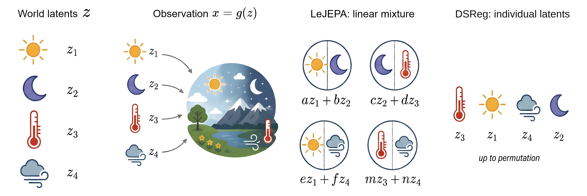

# arXiv Digest — 2026-10-08

- **Interest file used:** interests/2026.09.md (fallback — no 2026.10.md exists yet)
- **Categories pulled:** astro-ph.CO, astro-ph.EP, astro-ph.GA, astro-ph.HE, astro-ph.IM, astro-ph.SR, cs.LG, stat.ML, hep-ph
- **Papers scanned:** 467 (82 astro-ph new/cross + 385 cs.LG/stat.ML/hep-ph and cross-lists)
- **After first filter:** 29 candidates reviewed with full text
- **Final selected:** 11 papers across 2 tiers

---

## Tier 2 — Adjacent / useful context

### [Constraints on Primordial Oscillatory Features from the Power Spectrum and Bispectrum of Redshift-Space Galaxy Clustering in DESI DR1](http://arxiv.org/abs/2610.10530v1)

Shi-Fan Chen, Anton Chudaykin, Mikhail M. Ivanov et al. (Ivanov is on the high-value author list)
**Primary category:** astro-ph.CO

The authors search for linear and logarithmic oscillations in the primordial power spectrum using a **Lagrangian-EFT model of the redshift-space power spectrum and bispectrum** of all six DESI DR1 tracers, the first such search to include the bispectrum. Marginalising over ΛCDM, they find **$A_{\rm lin}<0.033$ and $A_{\rm log}<0.035$ (95% CL)**, tightening to 0.024 and 0.031 when cosmology is fixed to Planck 2018. With Planck fixed, a logarithmic feature at $\omega_{\rm log}\simeq15$ is preferred at about 3σ global, roughly two-thirds of it from LRG2. The preference **disappears once cosmological parameters are varied**, so the authors read it as the DESI–Planck distance-scale tension showing up near the BAO frequency, not as a primordial signal. This is a cautionary example for any feature search, forest-based ones included, done at fixed background cosmology.

*Combined DR1 real-space matter power spectrum against Planck 2018 with and without the best-fit log feature: Planck fits poorly around the second BAO peak (k ≈ 0.12 h/Mpc), and that excess is driven by LRG2 (open points exclude it).*

### [Angular Baryon Acoustic Oscillations with DESI DR1](http://arxiv.org/abs/2610.10215v1)

Anya Paopiamsap, Juan Mena-Fernández, Héctor Gil-Marín et al.
**Primary category:** astro-ph.CO

The authors fit the **angular correlation function w(θ) in thin redshift shells** (Δz = 0.02 for LRGs, 0.05 for ELG2/QSO), using a 1000-EZmock covariance. Because the method needs no fiducial distance–redshift conversion, it measures the transverse dilation α⊥ directly. BAO is detected above 3σ in every tracer, and **D_M/r_d reaches 2.5–4.2% precision per bin**, 1.4–2.0× looser than the 3D DR1 analysis. Crucially, there is **no shift between the 2D and 3D transverse BAO scales**, which addresses earlier claims of a 2D/3D discrepancy. Flat ΛCDM gives Ω_m = 0.198^{+0.045}_{-0.068}, 1.6σ below DESI 3D. That pull comes entirely from the z = 1.49 QSO bin (α⊥ = 1.058 ± 0.028), so it is worth watching in later releases.

*2D (angular) and 3D DESI DR1 transverse BAO distances agree bin by bin. The lone outlier is the QSO point at z = 1.49, sitting about 2σ above Planck and dragging the full-sample Ω_m fit low; the red curve shows the fit without it.*

### [A Decade-Scale Ionization Echo of Black-Hole Accretion in Galactic Nuclei](http://arxiv.org/abs/2610.10373v1)

Wei-Jian Guo, Shuo Zhai, Chen Hu et al.
**Primary category:** astro-ph.GA

The authors use **repeat SDSS→DESI spectroscopy of 473 mid-IR-variable nuclei**, with rest-frame baselines of 12–20 yr. In 19 of them, narrow [O III] λ5007 more than doubled; they call these "narrow-line ionization echoes". In stacks, **[O III] rises by 229 ± 22%** while [O II] drops 20 ± 5% and [S II] stays flat. O3 and O32 rise by 0.46 ± 0.18 and 0.58 ± 0.13 dex, which photoionization models reproduce with a higher ionization parameter and a harder AGN spectrum. The integrated WISE excess energy tracks the [O III] luminosity change (r = 0.87), which places the responding gas at **1.5–5.2 pc**: an intermediate, decade-scale layer between the dust torus and the extended narrow-line region. This is a survey-scale demonstration that DESI repeat spectra can catch AGN narrow-line variability.

*Stacked SDSS (blue) vs DESI (orange) spectra: in the 19 echo hosts only [O III] brightens strongly while lower-ionization lines stay flat or fade, whereas the 473-object parent stack barely changes. This rules out a simple flux-calibration rescaling.*

### [Changing-look Active Galactic Nuclei from the Dark Energy Spectroscopic Instrument. VII. Testing Disk-Corona Diagnostics with eROSITA](http://arxiv.org/abs/2610.10331v1)

Wei-Jian Guo, Shuo Zhai, Zhu-Heng Yao et al.
**Primary category:** astro-ph.GA | also: astro-ph.HE

The authors cross-match DESI changing-look AGN and matched control samples with eRASS1 to test the proposed **X-ray-binary-like "V-shaped" α_OX–Eddington-ratio relation**. The positive α_OX–λ_Edd,opt trend seen in changing-look AGN (ρ = 0.37) appears just as strongly in ordinary broad-Hα AGN (ρ = 0.34, N = 2032). In those AGN it is largely explained by **the known α_OX–L_2500 dependence and the covariance among L_2500, M_BH and λ_Edd,opt**. With an X-ray-based Eddington ratio, the correlation flips sign, because L_X enters the two axes with opposite signs. The conclusion is that **an apparent V-shape can be manufactured by mixing Eddington-ratio estimators**, a useful caution for survey-scale AGN demographics.

### [MUSE-ALMA Haloes XVI: a census of the condensed baryons in z~0.5 HI absorption-selected galaxies](http://arxiv.org/abs/2610.10117v1)

T. O'Beirne, C. Péroux, M. Zwaan et al.
**Primary category:** astro-ph.GA

The sample is **79 galaxies at 0.2 < z < 1.2 lying near strong H I absorbers in quasar sightlines**, combining HST spectroscopy and imaging with MUSE and ALMA, and the paper assembles a census of their stars, H I and H₂. H I masses inferred from absorber column density and impact parameter **agree with optical-scaling-relation masses for b ≲ 100 kpc**, though group environments bias estimates for non-dominant members. The **molecular gas fraction falls more steeply with stellar mass than the H I fraction** (slopes −0.88 ± 0.08 vs −0.50 ± 0.05), and baryon fraction rises with stellar surface density. The trends are modest, but the absorber-based H I mass check is directly relevant to interpreting quasar-absorber/CGM samples.

### [Shared Geometry As A Rosetta Stone: Cross-Modal Alignment Without Paired Data](http://arxiv.org/abs/2610.09411v1)

Dominik Schnaus, Thomas Dagès, Daniel Cremers et al.
**Primary category:** cs.LG | also: cs.AI, cs.CV

This paper tests the Platonic Representation Hypothesis operationally. It aligns two independently trained embedding sets with **a single orthogonal map and no paired examples, via Wasserstein Procrustes** initialised from a CKA-maximising matching of k-means cluster centres. On COCO it reaches mean FOSCTTM 0.154 versus 0.223 for the previous unpaired method, enough for 47.4% zero-shot CIFAR-10 accuracy. With ≤ 20 pairs it beats pair-based baselines by large factors. Across scientific domains, **representation-similarity (CKA) predicts whether unpaired alignment will work**. Notably, **DESI galaxy-image ↔ spectrum embeddings from AstroCLIP fail at chance level** (FOSCTTM 0.57, CKA 0.18), which is a concrete data point for anyone hoping to align a quasar-spectrum foundation model with other modalities without pairs.

*One point per modality pair across seven scientific domains: pairs whose embedding geometries are more similar (higher CKA) are consistently easier to align without any paired data.*

### [DSReg: Provably Recovering Individual World Latents without Reconstruction](http://arxiv.org/abs/2610.09457v1)

Yujia Zheng, David Klindt, Randall Balestriero et al.
**Primary category:** cs.LG | also: stat.ML

JEPA-style self-supervised encoders such as LeJEPA identify the latent state only up to a linear transformation, so individual learned features remain mixtures of the true factors. The authors prove that under a **"Structural Diversity" condition** (each latent leaves a distinct dependency footprint on the observations), choosing the rotation that **sparsifies the encoder's Jacobian recovers individual latents up to signed permutation**, with no decoder and no reconstruction. The condition is strictly weaker than earlier sparsity-based identifiability assumptions. DSReg runs post hoc on a frozen checkpoint and scales to d = 8192. On 3DShapes it lifts latent MCC from 0.640 ± 0.041 (LeJEPA) to **0.921 ± 0.005** with unchanged dense-prediction R². This is a cheap add-on for disentangling the latents of an existing spectral SSL model.

*Concept: LeJEPA recovers world latents only up to a linear mixing; DSReg's Jacobian-sparsity rotation turns the mixed state back into individual latents (up to signed permutation).*

### [Shared Gaussianization: What Gaussian Regularizers Certify About Contrastive Learning, and What They Miss](http://arxiv.org/abs/2610.10299v1)

Ruoyu Zhao, Yuting Chen, Jinheng Zhang et al.
**Primary category:** cs.LG | also: stat.ML

The paper analyses **SIGReg-style Gaussianity regularizers** (as in LeJEPA) through "shared Gaussianization", a characteristic-function test on the average of two views. That single test detects both misalignment and non-uniformity, it vanishes exactly at InfoNCE's aligned, uniform minimizers, and it **bounds the InfoNCE excess at a sharp square-root rate**. Away from the optimum, pure SG prefers to keep per-view nuisance ("style"). An alignment weight above the nuisance channel's gain removes it, which for LeJEPA gives a **critical SIGReg weight that falls as batch size grows**. Across 34 trained LeJEPA encoders, this gain-versus-price rule predicts exactly which ones retain style. That gives a concrete knob for keeping instrument and noise nuisance out of spectral embeddings, although the experiments are toy-scale (d = 8).

### [Scalable Logistic Gaussian Process Density Regression with Kinetic Langevin Sampling](http://arxiv.org/abs/2610.09591v1)

Daniel Paulin, Ádám Jung, András A. Benczúr
**Primary category:** stat.ML | also: cs.LG

The paper builds a **logistic-GP conditional density estimator** from a Fourier-basis Matérn kernel along the response and Nyström features (including non-stationary deep Gibbs kernels) along the covariates. Given the hyperparameters, the authors prove the latent posterior is strongly log-concave with bounded Hessian, so it can be **sampled with minibatch kinetic Langevin dynamics** instead of a Laplace or variational approximation, with Fisher-identity gradients for the hyperparameters. On **DESI DR1 BGS photometric redshifts (3.9M training objects)** it beats TabPFN-3.5 on every metric: NLL −2.379 vs −2.356, and PIT-KS 0.0013 vs 0.0078. The training run takes about 2.5 h on one GPU, though the margin is only 0.003 nats when both models see the same data. The authors state the limitations plainly, including failure under covariate shift. It is a working example of GP latent-variable modelling with scalable Langevin sampling on DESI-scale data.

### [Noise, Denoise, Correct: MCMC Posterior Sampling with Diffusion Priors in Three Steps](http://arxiv.org/abs/2610.09407v1)

So Takao, Gregory David Bellchambers, Luke Ye et al.
**Primary category:** cs.LG

"Diffusion waltz" uses an **SDEdit-style noise-then-denoise step with a pretrained diffusion prior as an MCMC proposal**. Because the proposal is reversible with respect to the prior, the Metropolis–Hastings ratio needs only the likelihood, giving **asymptotically exact posterior sampling under non-differentiable forward models** without ever evaluating the prior density. A variant injects the data into the proposal through a gradient-free ensemble-Kalman step while preserving exactness. On Navier–Stokes initial-condition recovery through a non-differentiable solver, it reaches relative L2 error 0.247 versus 0.42 for the baselines in the hard low-noise regime, and ranks first or second on every metric. It is workshop-scale and tested on a single problem, but the construction carries over directly to inference with simulator-based forward models.

---

## Tier 4 — Meta-research about the field

### [SciExam for ENSO: Can AI Agents Build Climate Models?](http://arxiv.org/abs/2610.10513v1)

Yinling Zhang, Langchen Liu, Dongbin Xiu et al.
**Primary category:** cs.AI

This is a benchmark for **open-ended AI-agent research where no answer key exists**. Within six hours, agents process real ENSO observations, write diagnostics that are then frozen, and build low-order stochastic climate models scored by hidden graders on statistics, reconstruction of unobserved variables and held-out forecasts (2015–2024). **Six of twelve agent systems beat the published reference model** (0.378), mostly through better reconstruction and forecasting; the reference still has the best statistics score. Strikingly, the stronger agent-built models simplify into **the two competing explanations of ENSO's warm–cold asymmetry**, a live debate the task never mentions. The controlled runs use one seed each, but the design is a template for testing whether AI agents can do real modelling in astrophysics too.

*Task setup (agents fit a stochastic model with drift f and noise Σ to five ENSO indices) and final composite scores: six of twelve agent-built models exceed the published reference (dashed line).*
