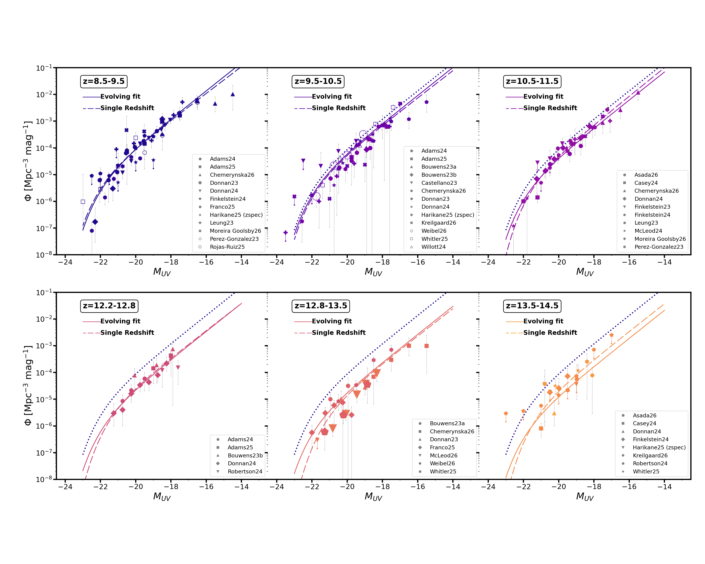
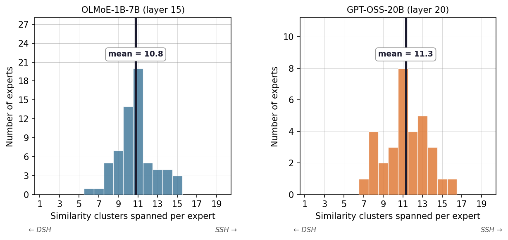
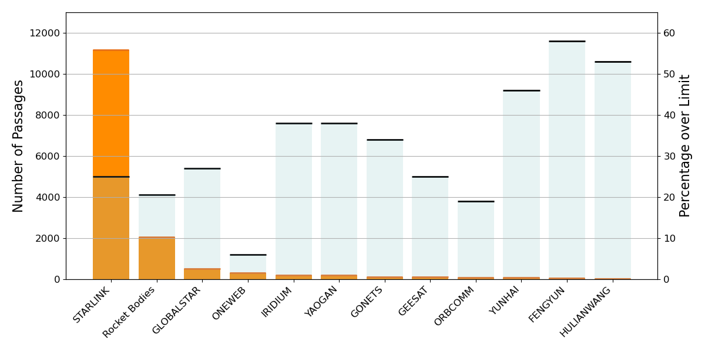

# arXiv Digest — 2026-10-09

- **Interest file used:** interests/2026.09.md (fallback — no 2026.10.md exists yet)
- **Categories pulled:** astro-ph.CO, astro-ph.EP, astro-ph.GA, astro-ph.HE, astro-ph.IM, astro-ph.SR, cs.LG, stat.ML, hep-ph
- **Papers scanned:** 491 (107 astro-ph new/cross + 384 cs.LG/stat.ML/hep-ph and cross-lists)
- **After first filter:** 31 candidates reviewed with full text
- **Final selected:** 12 papers across 2 tiers

---

## Tier 2 — Adjacent / useful context

### [Pinpointing the cosmic web between massive galaxy clusters I. The incidence of HI and OVI as WHIM tracers](http://arxiv.org/abs/2610.11203v1)

Karen Martínez-Acosta, Nicolas Tejos, Ismael Pessa et al. (J. Xavier Prochaska is a co-author)
**Primary category:** astro-ph.CO

The authors use HST/COS FUV spectra of **ten z < 1 quasar sightlines that pass close to pairs of massive galaxy clusters** to look for warm-hot gas in the filaments between them. They Voigt-fit **broad Lyα absorbers (b > 40 km/s) and O VI as WHIM tracers**, with narrow Lyα absorbers as a cold-gas control. Within ±1000 km/s and 3 Mpc of the inter-cluster axes, **the excess incidence of BLAs and O VI over the field is about twice that of NLAs**; O VI shows an excess of ~2.6. BLA and O VI covering fractions sit above random expectation, while NLAs do not. Samples are small and the rates are conservative lower limits, but this is a clean absorption-line test of the Doppler-width split that IGM thermal-state work also relies on.

*Covering fractions near cluster pairs (filled) compared with random sightlines (open): H I is nearly always present (f_c ≈ 0.89), BLAs and O VI exceed their random expectation, and NLAs do not, which points to warm-hot rather than cold gas in the filaments.*

### [Feedback-Conditional 3D Reconstruction of Cosmic Baryons with Flow Matching](http://arxiv.org/abs/2610.10741v1)

Maryam Hussaini, Aizhan Akhmetzhanova, Carolina Cuesta-Lazaro et al.
**Primary category:** astro-ph.CO

The authors train a **conditional flow-matching model on CAMELS (IllustrisTNG) boxes** that samples the 3D ionized-gas field from a galaxy density field, conditioned on cosmology, the stellar-mass cut of the galaxy sample, and **the baryonic suppression spectrum sP(k) as a feedback knob**. Integrating the posterior gas field gives per-sightline FRB dispersion measures with uncertainties. On test boxes the true and reconstructed DM have **rank correlation ρ = 0.857**, and the model generalizes to TNG300 volumes 4³ times larger than its training boxes. A small normalization offset in mean DM is fixed by anchoring to Ω_b. The intended use is to infer feedback strength from FRB samples, and the same conditional-generative setup carries over to reconstructing the IGM along quasar sightlines.

*Same galaxy input, cosmology and noise, with only the conditioned sP(k) changed: high feedback produces a smoother, more diffuse DM map and low feedback produces sharper filaments and denser nodes, so the reconstruction responds to feedback in a physically sensible way.*

### [HI intensity mapping with MeerKAT: A measurement of the 21-cm auto-spectrum on cosmological scales](http://arxiv.org/abs/2610.12158v1)

MeerKLASS Collaboration, Matilde Barberi-Squarotti, José L. Bernal et al.
**Primary category:** astro-ph.CO

The paper reports **a direct, galaxy-free detection of the H I intensity-mapping power spectrum at z = 0.42** from 236 deg² of MeerKLASS 2021 L-band data. Each subset's auto-spectrum still carries unexplained excess power. To get around this, the data are split into observationally independent subsets, each is foreground-cleaned blindly, and only **cross-spectra between subsets** are used, with a multi-subset model that marginalizes over signal loss from the cleaning. The result is **10³ Ω_HI b_HI = 1.27 (+1.08/−0.60) at SNR 6.2**, and the cross-spectra pass a battery of null tests. This is an important step for SKA-era 21-cm cosmology. The internal-cross-correlation approach to systematics is also a pattern that transfers to other noisy LSS tracers.

*The two "super-cross" spectra between independent data subsets, with the best-fit H I model overlaid: the cross-spectra follow the model across 0.1 < k < 0.25 h/Mpc, which is the basis of the 6.2σ amplitude detection.*

### [Too many or too bright? Status and perspectives in the study of the UV Luminosity Function at z>10](http://arxiv.org/abs/2610.12121v1)

A. Fontana, H. Atek, V. Bromm et al.
**Primary category:** astro-ph.GA | also: astro-ph.CO

This review compiles every JWST UVLF measurement at z = 9–14.5 and fits them jointly with **a single redshift-evolving Schechter function using four free parameters**. The faint-end slope stays at **α ≈ −2.3**, and the galaxy density falls **by ~0.85 dex (a factor ~7) from z = 9 to 14** with no sign of accelerated decline. Survey-to-survey residuals of 0.1–0.2 dex, including z ~ 13 points that fall below z ~ 14, show that systematics and cosmic variance have not averaged out yet. Post-JWST galaxy-formation models now generally match or exceed the observed abundances, but **the UVLF alone cannot discriminate between the proposed mechanisms**. These include feedback-free starbursts, a varying IMF and reduced dust. For reionization work, this is a useful, honest summary of how well the ionizing-source population is actually constrained.

*All JWST UVLF data from z ≈ 8.5 to 14.5 with the 4-parameter "Fiducial" evolving Schechter fit (solid) and independent per-bin fits (dashed): a single smooth evolution describes the data, with the dotted z = 9 curve showing the drop in number density.*

### [Disk Structure May Determine AGN Variability and Explain the Accretion Disk Size Problem: No Broad Line Region Required](http://arxiv.org/abs/2610.12462v1)

Amy Secunda, Yan-Fei Jiang, Jenny E. Greene
**Primary category:** astro-ph.HE | also: astro-ph.GA

The authors run **3D multi-frequency radiation-MHD simulations of the UV–optical-emitting region of an AGN disk** irradiated by a variable X-ray corona. By chance, the turbulent disk grew thicker below the midplane than above it. Light curves from the thin side follow standard X-ray reprocessing. Light curves from the thick side correlate only weakly with the X-rays and show **continuum reverberation lags 3–5× longer than the light-travel time**. Both behaviours match recent observations that are usually blamed on diffuse emission from the broad-line region. The authors argue that **disk thickness, not BLR contamination, explains the "disk size problem"**, and that intrinsic MRI/convection-driven fluctuations propagating on the inflow time leave long inter-band lags. This matters for anyone modelling quasar continuum variability with Rubin-scale light curves.

### [An analytical model for non-local stochastic field-level galaxy bias on the sphere](http://arxiv.org/abs/2610.12259v1)

Maximilian von Wietersheim-Kramsta, Nicolas Tessore, Benjamin Joachimi et al.
**Primary category:** astro-ph.CO

BOLTS models linear galaxy bias on the sphere as **an isotropic random field rather than a deterministic transfer function**. This splits it in harmonic space into a non-local deterministic part β_ℓ and a zero-mean stochastic part with variance σ²_ℓ, and both have **closed-form estimators from cross- and auto-spectra**. The model is calibrated only on FLAMINGO projected power spectra. It then recovers the equilateral bispectrum down to ~10 Mpc scales for halo masses above 10^11.5 M_⊙ out to z = 3, and it matches wavelet-phase-harmonic statistics in the low-mass, low-z regime where local bias models are off by 5–9σ. It is intended as a cheap, physically consistent tracer model for field-level forward modelling and simulation-based inference with Euclid, LSST and Roman.

### [The Ball and the Box: Two Geometries of Computation in Superposition](http://arxiv.org/abs/2610.11744v1)

Xiaoyu Li, Lequan Lin, Dai Shi et al.
**Primary category:** cs.LG

The question is how many dimensions a superposed representation of k-sparse features (out of m) needs for **threshold units to compute Boolean gates** such as all pairwise ANDs. The authors derive **sharp thresholds under two error criteria**. Making the expected number of wrong outputs vanish depends only on per-gate marginals, which gives a "ball" geometry. Making every output correct with high probability depends on the shared reads, which gives a "box" geometry. Because the box lies inside the ball, **reliability can need fewer dimensions than a vanishing expected error count**. For pairwise conjunction the thresholds are 16, 8, 4 and 2 × k log m depending on the criterion and bias choice. This is clean theory for the superposition picture behind sparse-autoencoder interpretability.

### [RouterInterp: Understanding Superposed Specialisation in Mixture of Experts Routing](http://arxiv.org/abs/2610.11775v1)

Ilya Lasy, Nora Yinuo Cai, Kola Ayonrinde
**Primary category:** cs.AI | also: cs.LG

The authors test the common assumption that each MoE expert handles one coherent domain and find it fails. **The SAE latents that best predict routing to an expert spread over ~11 distinct semantic clusters** in both OLMoE-1B-7B and gpt-oss-20b. They propose the **Superposed Specialisation Hypothesis**: each expert handles a disjoint union of fine-grained features. RouterInterp builds on it by picking the SAE features most predictive of routing, with gradient attribution as the best selector, and summarizing them in a natural-language explanation. These explanations reach **~65% higher detection accuracy** than token-statistics baselines. It is a concrete example of SAE features making an otherwise opaque transformer component interpretable.

*Number of distinct semantic clusters among each expert's top-20 routing-predictive SAE latents: the one-domain hypothesis predicts 1, but the means are ~11 in both models, so experts are polysemantic unions of micro-domains.*

### [SplitJEPA: Learning Invariant and Variant Latent Worlds without Reconstruction](http://arxiv.org/abs/2610.12349v1)

Ruijin Hua, Zichuan Liu, Zhuokai Zhao et al.
**Primary category:** cs.LG

SplitJEPA is a **joint-embedding predictive architecture that splits its latent state into an invariant block and a variant block** without ever reconstructing observations. Training combines latent-space prediction, consistency of the invariant block across matched observations, and a variance-preserving term. The authors prove that, under stationary Gaussian predictive dynamics and a full-rank variation condition, **the invariant and variant subspaces are identifiable up to block-wise isometries** with no decoder. Experiments on synthetic nonlinear systems and robotic manipulation show better block recovery, less cross-block leakage and better downstream action prediction, though at small scale. This is relevant to separating physical content from nuisance variation in self-supervised models of spectra.

### [Early Signatures of Memorization in Diffusion Models via Basin Geometry and Cyclic Denoising](http://arxiv.org/abs/2610.11670v1)

Nikhil Verma, Siddharthan Dileep, Anoop Singh et al.
**Primary category:** cs.LG

The paper shows that **memorization appears in the geometry of a diffusion model's learned score field before it shows up in samples**. Localized basins of strongly negative score divergence form around training points. Their onset follows the same O(n) training-time scaling as the eventual copying. **Cyclic denoising**, repeated partial noising and denoising, gets trapped in these basins. It recovers CelebA and CIFAR-10 training images from checkpoints whose one-shot samples contain no copies, and pushes the memorized fraction above 30% at a checkpoint with 0.1% one-shot copies. On Stable Diffusion v1.4 a cycled divergence gap separates memorized prompts with **AUC 0.944**. This is useful when auditing generative emulators trained on small simulation sets.

*Score-divergence landscape for a Gaussian-mixture toy: smooth while the model generalizes (A), sharp negative basins around training points once memorization begins (B); cyclic denoising (C) stays in a basin at low noise and hops between basins at high noise.*

### [Transformed Samplers with Variance Reduction](http://arxiv.org/abs/2610.10870v1)

Siran Liu, Michalis Tisias, Petros Dellaportas
**Primary category:** stat.ML | also: cs.LG, stat.ME

Building a good MCMC control variate normally means solving the sampler's Poisson equation, which rarely has a closed form. The key observation is that **a bijection carries a Markov kernel and its Poisson solutions together**. So if a normalizing flow maps the target close to a Gaussian, samplers run in the latent space inherit **exact Hermite-polynomial Poisson solutions as explicit control variates**. One dictionary then serves flow importance sampling, a latent random walk and elliptical slice sampling, with no target gradients needed. Each estimator is shown to be consistent and asymptotically normal, and the flow's largest importance weight indicates which one to use. Gains are large when the flow is good and small across mode seams. This is a cheap add-on for flow-preconditioned posterior sampling.

---

## Tier 3 — Outside my area but notable

### [Systematic non-compliance of satellite megaconstellations with IAU brightness limits](http://arxiv.org/abs/2610.10834v1)

Jack Rayworth, Denis Vida, Pauline Barmby et al.
**Primary category:** astro-ph.EP | also: astro-ph.IM

An uncued wide-field photometric survey from Ontario recorded **~25,000 tracks of 5,118 satellites** down to V = +9 in late 2024. **The LEO population is systematically brighter than the altitude-adjusted IAU CPS limit**, so this is a baseline problem rather than occasional glints. Starlink exceeds the limit on about a quarter of geometrically possible passes, rocket bodies on a fifth, and the new **Guowang/Hulianwang constellation on more than half**. OneWeb exceeds it on only ~1 in 20, showing that mitigation is technically achievable. Scaling the measured flux implies that **about one in three 30 s twilight Rubin exposures will contain a satellite trail**.

*Number of over-limit tracks (orange) and fraction of all possible passes that are over the limit (blue) by object class: Starlink dominates in absolute numbers through sheer size, while the per-pass rate, which predicts the impact of future expansion, is highest for Guowang/Hulianwang and spent rocket bodies.*
